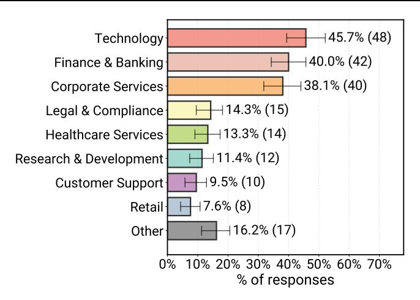
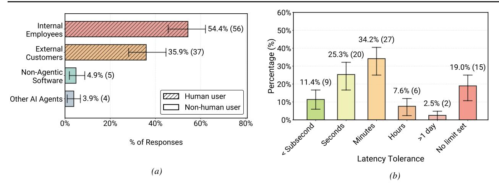
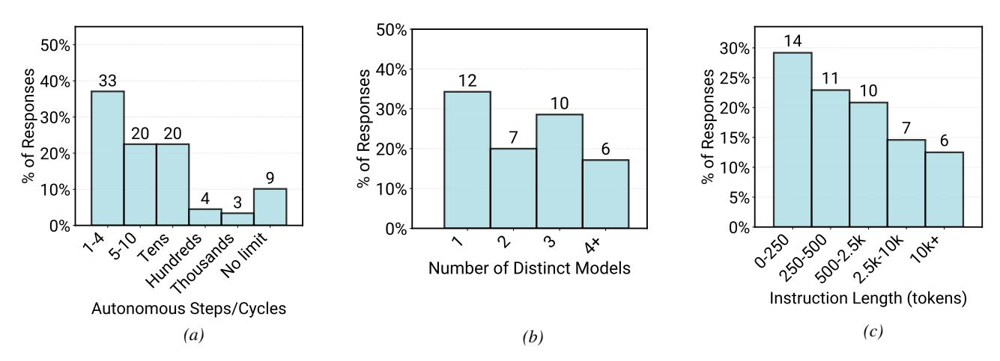
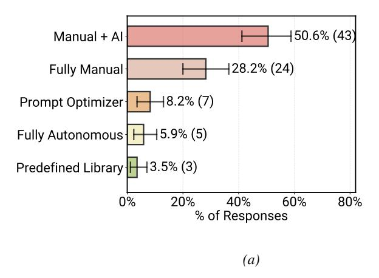
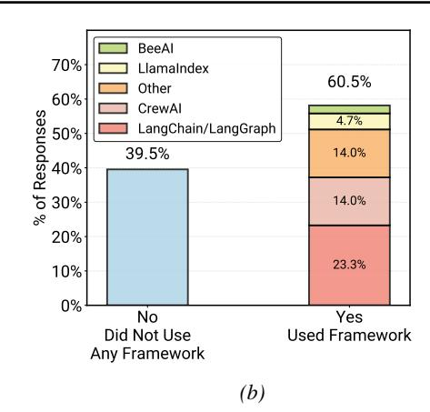
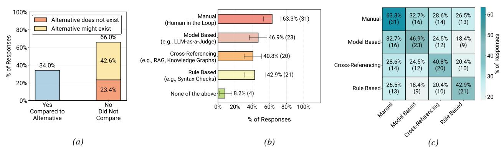
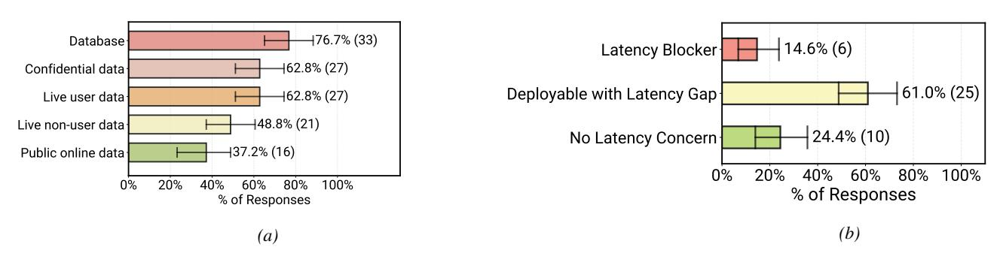
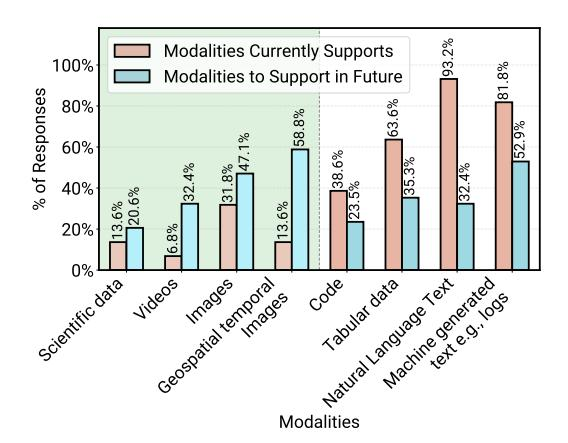
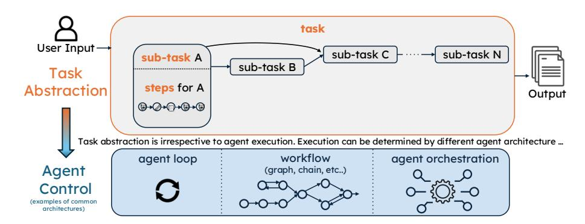

# D. Results on All Survey Data

In the main body of the paper, we focused on results filtered exclusively to *deployed agents* in production or pilot phases, to highlight successful real-world practices under realistic operational constraints. In this appendix, we present the corresponding results computed over [All Data]: all 306 valid survey responses, regardless of deployment stage. This expanded view includes prototype, research, and legacy systems (sunset and retired), providing a broader perspective across the full agent development lifecycle. For ease of comparison, each [All Data] figure mirrors a figure in the main text and uses the same layout and question wording. In the discussion below, we briefly describe the key patterns in the full dataset and highlight how they compare to the deployed-only subset.

> **[图片提取文字 (无描述)]:**
> Technology **∤45.7% (48)** 40.0% (42) Finance & Banking 38.1% (40) Corporate Services 14.3% (15) Legal & Compliance 13.3% (14) Healthcare Services 11.4% (12) Research & Development 9.5% (10) Customer Support 7.6% (8) Retail 16.2% (17) Other 10% 20% 30% 40% 50% 60% 70% % of responses

*Figure 19.* [All Data] Application domains where practitioners build Agents across all development stages (N = 105). This is a multi-class question where each system may be assigned to multiple domain categories; proportions therefore do not sum to 1.

## D.1. *RQ1* Agents Applications

Why Agents? Figure [18](#page-24-1) reproduces our analysis of motivations for using agents over non-agentic alternatives using all survey responses. We observe that the overall ranking of benefits is highly stable compared to deployed only agents as shown in Figure [1:](#page-0-0) increasing productivity remains the most frequently selected reason for adopting agents, followed by reducing human hours .

Application Domains. For application domains of agents, (Figure [19\)](#page-25-0) become even more diverse in the full dataset compared to deployed only agents (Figure [2\)](#page-1-0). The same high-level industries i.e., finance and banking, technology, and corporate services remain prominent. However, the long tail of "other" domains grows, reflecting additional experimental and research systems in areas such as education, creative tools, and scientific workflows that have not yet reached deployment.

End users Consistent with the deployed-only subset, the vast majority of systems in the full dataset still target human users as shown in Figure [20a,](#page-26-1) with internal employees and external customers together comprising most end-user bases. The relative proportions shift only slightly when we include prototypes, suggesting that human-centric interaction remains the default even in early experimentation.

latency requirements. Latency requirements also similarly remain relaxed in the full dataset (Figure [20b](#page-26-1) compared to Figure [4\)](#page-4-0). Most teams still report tolerating response times on the order of minutes, with a non-trivial fraction indicating that no explicit latency limit has been set. Compared to deployed agents only, the fraction of agents with undefined latency budgets is slightly higher in [All Data], which is consistent with prototypes and research artifacts that have not yet been hardened with production SLOs. Overall, these figures confirm that the preference for latency-relaxed, quality-focused applications is not an artifact of our deployment filter.

## D.2. Models, Architectures, and Prompting

Autonomy and Architechture Figure [21](#page-26-0) explores *RQ2*, focusing on core component configurations and agent architectures across [All Data]. Compared to deployed agents (Figure [21b\)](#page-26-0), the distribution of the number of distinct models used exhibits a heavier tail: non-deployed and research systems are more likely to combine many distinct models, leading to a higher incidence of configurations with four or more models. This pattern aligns with our qualitative observation that teams explore richer multi-model setups during early experimentation and then consolidate to a smaller, more manageable set of models as they move toward deployment.

A comparison between Figure [7a](#page-6-0) and Figure [21a](#page-26-0) reveals a clearer separation in autonomy. When we include all agents, systems allow a greater number of autonomous steps or cycles before human intervention compared to deployed agents only. Experimental and research systems are more likely to fall into the "tens of steps" and "no explicit limit" regimes, whereas production deployments concentrate in the low-step regime to control cost, latency, and failure amplification. Taken together,

> **[图片提取文字 (无描述)]:**
> 60% Internal 54.4% (56) 50% Employees Percentage (%) 34.2% (27) External 35.9% (37) 25.3% (20) Customers 19.0% (15) Non-Agentic 4.9% (5) Software 11.4% (9) 7.6% (6) Human user -13.9% (4) Other Al Agents 10% 2.5% (2) Non-human user 0% 20% 40% 60% 80% % of Responses Latency Tolerance (a) (b)

Figure 20. [All Data] Overview of Agentic AI system characteristics across all development stages in terms of primary end users and latency requirements. (a) Distribution of primary end users (N=103), where hatched bars (///) denote human end-users (corresponds to Figure 3); and (b) Reported tolerable end-to-end response latency for all systems (N=84) which corresponds to Figure 4 on deployed agents. The high percentage of human end-users and tolerance for minute-level latency are consistent across the full dataset.

> **[图片提取文字 (无描述)]:**
> 50% 14 50% 30% ses 40% 30% 30% 20% \* 10% of Responses 30% 20% Responses 25% 15% 33 10 10 20 20 15%1 6 6 % of I 10% 10% 10% 5% 0% 0% 0% 050 20 20 5 5 4 104 104x ദ XX **Number of Distinct Models** Instruction Length (tokens) Autonomous Steps/Cycles (c) (a) (b)

Figure 21. [All Data] Overview of core component configurations and architectures across all agents. (a) Number of autonomous execution steps before user intervention (N=89). Results on all survey data allow for a greater number of steps before human interference compared to deployed agents only (Figure 7a), reflecting stricter control and monitoring needs in production environments. (b) Number of distinct models combined to solve a single logical task (N=35). Deployed agents (Figure 7b) tend to use fewer models than the full dataset, which includes more experimental systems using a higher number of distinct models; and (c) Distribution of prompt lengths in tokens (N=48). Prompt length remains similar across deployed-only (Figure 9b) and all-data subsets.

these results reinforce our interpretation that bounded autonomy is a deliberate design choice for production reliability, while higher autonomy is more common in exploratory settings.

**Frameworks.** Figure 22b compares framework usage across all agents and corresponds to Figure 9a in the main text. The overall split between using a framework versus no framework remains nearly identical between the full dataset and the deployed-only subset, indicating that teams decide early whether to invest in a framework-based stack or implement their own orchestration. Within the "framework" group, the Other category expands slightly in [All Data], reflecting experimentation with a broader variety of less common or homegrown frameworks during research and prototyping stages, beyond the dominant framework families.

**Prompting.** Figure 22a reproduces our analysis of prompt construction strategies using all survey responses. The results show that human-crafted prompts remain central across the full dataset: fully manual and manual+LLM strategies continue to be the dominant modes. However, when we include non-deployed agents, we observe a modest shift toward more automated prompting. Fully manual prompting is slightly more common among deployed agents (Figure 6), while the [All

> **[图片提取文字 (无描述)]:**
> **|50.6% (43)** Manual + Al-128.2% (24) Fully Manual 18.2% (7) Prompt Optimizer 15.9% (5) Fully Autonomous |3.5%(3)|Predefined Library 0% 20% 60% 40% 80% % of Responses (a)

> **[图片提取文字 (无描述)]:**
> BeeAl 70% LlamaIndex 60.5% Other 60% CrewAl of Responses 20% 30% 30% 4.7% LangChain/LangGraph 39.5% 14.0% 14.0% % 20% 23.3% 10% 0% No Yes Did Not Use Used Framework Any Framework (b)

Figure 22. [All Data] Overview of core technical implementations: Prompt Construction and Framework Usage. The left and right figures correspond to Figure 6 and Figure 9a in the main text respectively but they include all survey data. (a) Distribution of prompt construction strategies across all agents (N=85). Human input remains central to prompt crafting, however, fully manual is slightly more common in deployed agents (Figure 6) compared to all data in the left plot. Similarly 'fully autonomous' prompting is more common in the All Data, suggesting that manual prompting is more favored for production systems. (b) Frameworks reported to support critical functionality (N=43). The percentage of practitioners using a framework versus not using one remains almost exactly the same between the full dataset (right plot) and the deployed-agents-only (Figure 9a). The "other frameworks" category increases slightly in the full dataset compared to deployed agents only, likely reflecting more diverse experimentation in non-production systems.

Data] distribution shows somewhat higher use of "fully autonomous" prompting and prompt optimizers. This suggests that automated prompt construction is currently used more as an experimental technique and is less frequently adopted in production systems, where controllability is critical.

Prompt lengths remain broadly similar between the deployed-only dataset (Figure 9b) and the full dataset (Figure 21c).

#### **D.3. Evaluation Practices for All Agents**

This section provides more details on evaluation practices, focusing on RQ3 across [All Data]. Figure 23 presents evaluation practices across all agents and mirrors Figure 8 and Figure 10 in the main text. Figure 23a shows distribution of comparison against non-agentic baselines. When we include prototypes and research systems, the fraction of teams that explicitly compare their agents to alternative solutions is slightly *lower* than in the deployed-only subset (34% in all data vs. 38.7% in deployed agents in Figure 10a). This suggests that some experimental agents are perhaps still in early stages where rigorous baseline comparison has not yet been prioritized, or where teams are primarily exploring feasibility rather than relative gains.

Figure 23b reports the distribution of different evaluation methods. The ordering of methods remains unchanged: human-in-the-loop (manual) evaluation is still the most common strategy, followed by model-based evaluation (LLM-as-a-judge). However, manual evaluation is somewhat more prevalent among deployed agents (Figure 8), whereas the [All Data] distribution shows a relatively higher share of automated methods. This is consistent with the idea that experimental and research systems may rely more on automated or lightweight checks, while production systems invest more heavily in human verification before and during deployment.

Figure 23c visualizes co-occurrence patterns between evaluation strategies. Human-in-the-loop evaluation remains the central hub in the evaluation graph, with high overlap with all other methods in the full dataset. At the same time, its co-occurrence with other strategies is slightly lower in [All Data] than in the deployed-only subset (Figure 10b), reflecting that some experimental systems use model-based or rule-based checks without consistently pairing them with human review. In contrast, deployed agents are more likely to combine automated evaluation with human verification perobably for higher assurance.

#### D.4. Challenges Across All Agent Deployment Stages

In this section, we focus on challenges encountered when building agent systems across different deployment stages, comparing deployed agents with non-deployed (i.e., prototype or research) agents in [All Data]. Specifically, we examine challenges related to data handling, latency, and modality support across all agents.

> **[图片提取文字 (无描述)]:**
> 100%1 -60 63.3% 32.7% 28.6% 26.5% Manual 63.3% (31) Manual -Alternative does not exist (31)(16)(14)(13)(Human in the Loop) Alternative might exist 80% 50 sesbouses .30 Model Based 66.0% 46.9% (23) % of Responses 32.7% 46.9% 24.5% 18.4% Model Based (e.g., LLM-as-a-Judge) (16)(23)(12)(9)60% Cross-Referencing 40.8% (20) 42.6% (e.g., RAG, Knowledge Graphs) 28.6% 24.5% 40.8% 20.4% 40% Cross-Referencing 34.0% (14)(12)(20)(10)Rule Based 42.9% (21) (e.g., Syntax Checks) 20% 26.5% 18.4% 20.4% 42.9% Rule Based 23.4% (9) (13)(10)(21)8.2% (4) None of the above -20 0% No Yes 80% 0% 20% 40% 60% 100% Compared to Did Not Alternative Compare % of Responses (a)(b) (c)

Figure 23. [All Data] Evaluation Practices in Agents. This figure corresponds to Figure 8 and 10 but includes all survey data (N=47). (a) Comparison to Alternatives: Shows whether participants explicitly compared their agent against a non-agentic baseline. Deployed agents (Figure 10a show a higher comparison rate (38.7% in deployed vs. 34% in all data) of comparison to alternative solutions, suggesting that experimental prototypes may not have invest as much on evaluation stages yet. (b) Evaluation Methods Distribution: Distribution of different evaluation strategies reported by survey participants. Manual evaluation (human-in-the-loop) is used more for deployed agents (Figure 8) compared to the full dataset, which includes more experimental and research systems. Autonomous evaluation methods are relatively less common in deployed agents compared to the data for all agents in oru survey. (c) Evaluation Strategies Co-occurrence: Visualizes the pairwise overlap between evaluation strategies. Manual human-in-the-loop evaluation is still the central strategy, but its co-occurrence with other methods is slightly lower in the all-data subset compared to deployed agents (Figure 10b), indicating that autonomous evaluation methods have more complementary roles in in deployed agents.

> **[图片提取文字 (无描述)]:**
> 176.7% (33) Database ! 14.6% (6) Latency Blocker 162.8% (27) Confidential data 61.0% (25) Deployable with Latency Gap **|62.8% (27)** Live user data 448.8% (21) Live non-user data 24.4% (10) No Latency Concern 137.2% (16) Public online data 20% 60% 80% 100% 0% 0% 20% 40% 60% 80% 100% % of Responses % of Responses (b) (a)

Figure 24. [All Data] The figures correspond to Figure 12a (a) and Figure 12b (b) in the main text but include all survey data. (a) Types and modes of data ingestion and handling in all agent (N=43). The distribution of data sources and handling methods did not change substantially when moving from deployed agents only to all survey data. (b) Degree to which latency causes problems for all agent systems (N=46). The distribution of problematic latency did not change substantially when moving from deployed agents only to all survey data, suggesting latency is not a primary deployment blocker across the development lifecycle.

Figure 24 corresponds to Figure 12a and Figure 12b in the main text but reports statistics across all survey responses. Figure 24 shows distribution of data sources for agents which is remarkably stable when moving from deployed agents only ( Figure 12a) to [All Data] in Figure 24. This possibly indicates that the underlying data plumbing for agents is largely shared across lifecycle stages: teams tend to set up similar ingestion and handling pipelines during prototyping that then carry through to production with incremental hardening.

In addition, Figure 24b reports how often latency is described as a problem across all systems. The distribution changes only modestly when compared to the deployed-only subset (Figure 12b), and we again see that latency is not the dominant blocker for most agent deployments. This supports our broader conclusion that agents are currently concentrated in latency-relaxed settings where quality and correctness dominate over strict real-time responsiveness.

Finally, Figure 25 mirrors Figure 13 in the main text but includes all survey data. The overarching trend remains the same: growth is heavily concentrated in non-textual modalities, pointing towards increasingly multimodal agentic systems. Interestingly, the emphasis on future support for non-text modalities is even stronger than in the deployed-only subset, indicating that experimental and research agents are pushing more aggressively into multimodal directions (e.g., image, audio, and structured data) that may not yet have reached stable production deployment.

> **[图片提取文字 (无描述)]:**
> Modalities Currently Supports 100% 81.8% Modalities to Support in Future % of Responses 80% 58.8% 52.9% 131.8% 60% 38.6% 35.3% 32.4% 32.4% 2% 40% 13.6% 20% 8.9% Hatural Andrine et e. d. los Coostalial ter Hrouges 0% scientific data Modalities

Figure 25. [All Data] Data modalities already supported (red) versus modalities planned for future support (blue) across all agents (corresponding to Figure 13 but for [All Data]. The trend of growth being heavily concentrated in non-textual modalities remains consistent, pointing toward increasingly multimodal agent systems. However, comparing this figure with the deployed-only subset shows that the full survey data in Figure 13 places an even stronger focus on non-textual modalities for future support. (N=44)

> **[图片提取文字 (无描述)]:**
> task User Input sub-task C sub-task N sub-task A sub-task B Task Abstraction steps for A Output @+@+@+@ Task abstraction is irrespective to agent execution. Execution can be determined by different agent architecture ... workflow agent orchestration agent loop Agent (graph, chain, etc..) Control (examples of common architectures)

Figure 26. Conceptual visualization of our terminologies used in Section 5 and how it maps to the survey definition.

#### E. Terminology

To ensure clarity and consistency, we established a hierarchical taxonomy for agent execution. Figure 26 provides a conceptual visualization of the key terminologies e.g., Task, Subtask, and Steps, as they are defined in our survey and applied throughout the paper. This mapping illustrates the relationship between high-level user goals and the granular autonomous actions taken by the agent.

## F. Literature Review Scope and Categorization

Table 4 summarizes representative prior work referenced in our literature review, organized according to the type of evidence each body of work provides about AI agents. We group works into three broad categories based on their methodological focus and the nature of empirical grounding they offer.

**Commercial/Industry**. These studies consist of practitioner and industry reports that describe agentic systems deployed in organizational settings. These accounts often provide high-level insights into trends, adoption patterns, or organizational impact, but typically lack methodological transparency, reproducible evaluation protocols, or detailed technical characterization of deployed systems.

**Research Surveys**. This group of work includes academic survey papers that synthesize existing literature on AI agents, multi-agent systems, or related paradigms. While these surveys offer valuable conceptual frameworks and comprehensive overviews of prior research, they generally do not incorporate primary data from production deployments, nor do they empirically characterize how agents are built, evaluated, and operated in real-world settings.

**Application/Demonstration**. This category comprises works that introduce specific agentic systems, frameworks, or

*Table 4.* Representative works from our literature review, organized into three categories based on evidence type: (1) high-level industry accounts with limited methodological detail, (2) academic surveys synthesizing existing research without primary production data, and (3) application-specific demonstrations lacking field-level characterization.

| Category                  | References                                                                                                                                                                                                                                                                                                                                                                                                                                                                                                                                        |  |
|---------------------------|---------------------------------------------------------------------------------------------------------------------------------------------------------------------------------------------------------------------------------------------------------------------------------------------------------------------------------------------------------------------------------------------------------------------------------------------------------------------------------------------------------------------------------------------------|--|
| Commercial/Industry       | Capgemini Research Institute (2025), Mic (2025), PagerDuty (2025)                                                                                                                                                                                                                                                                                                                                                                                                                                                                                 |  |
| Research Surveys          | Chandra et al. (2025), Chen et al. (2024), Cheng et al. (2024), Dam et al. (2024), Du et al. (2025), Guo et al. (2024) He et al. (2024), Krishnan (2025), Liu et al. (2025), Luo et al. (2025), Ma et al. (2025), Masterman et al. (2024), Mohammadi et al. (2025), Piccialli et al. (2025), Plaat et al. (2025), Shang et al. (2025), Sun et al. (2025), Tran et al. (2025), Wang et al. (2024b), Xi et al. (2025), Yehudai et al. (2025)                                                                                            |  |
| Application/Demonstration | Abramovich et al. (2025), Anthropic Engineering Team (2025), Block, Inc. (2025), Chennabasappa et al. (2025), Cline Bot Inc. (2025), Gemini CLI Maintainers (2025), Gottweis et al. (2025), Jha et al. (2025), Kon et al. (2025), Wang et al. (2024c), Vahe dian Movahed & Martin (2025), Schmucker et al. (2024), Shen et al. (2023), Park et al. (2023), Park et al. (2024), Parmar et al. (2025), Prabhakar et al. (2025), Singh et al. (2025), Teo et al. (2025), Wang et al. (2024a), Yang et al. (2024), Zhang et al. (2025) |  |

application-level demonstrations. These studies often showcase compelling capabilities or task-specific successes, but are typically limited to single systems or controlled scenarios and do not aim to provide field-level insights across organizations, deployment contexts, or operational constraints.

Together, these categories highlight a gap between existing conceptual, demonstrative, and industry-facing accounts and empirically grounded analyses of AI agents in production. Our study complements prior work by providing systematic, cross-organizational evidence on the technical methods, architectural patterns, and operational practices underlying deployed agentic systems.

