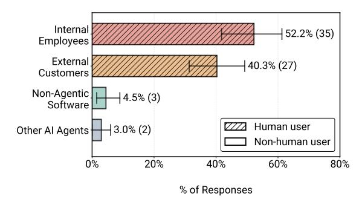

# 4. RQ1 Results: What Are the Applications of Agents?

We present findings from our study on why organizations build agents, which applications reach deployment, who uses them, and what requirements shape their design.

#### 4.1. Motivation for Building Agents

Deployed agents primarily target measurable productivity gains. Among surveyed practitioners with deployed agents, 80% cite increased productivity, and 72% cite reduced human task-hours (Figure 1). Benefits that are harder to quantify emerge less frequently in current deployments, such as risk mitigation (12%) and reducing the need for interdisciplinary expertise (18%). Productivity-focused applications offer straightforward success metrics: interviewed teams commonly measure productivity gains by comparing total time to completion between agents and alternative systems. In contrast, operational improvements like risk mitigation require extended validation periods before benefits become measurable. Among practitioners who evaluated alternative systems for the same objectives, 83% prefer agents over non-agentic solutions (software or human execution).

> **[图片提取文字 (无描述)]:**
> Internal 52.2% (35) Employees External 40.3% (27) Customers Non-Agentic 4.5% (3) Software Human user 3.0% (2) Other Al Agents Non-human user 0% 20% 40% 60% 80% % of Responses

Figure 3. Distribution of primary end users for deployed agentic systems (N=67). Hatched bars (///) denote systems primarily serving human end users, while solid bars denote systems serving non-human end users (e.g., internal services or automated agents).

**Finding 1:** Practitioners primarily build agents for productivity gains through automation, while harder-to-quantify uses like risk mitigation are less common.

#### 4.2. Application Domains

Among 69 surveyed deployed agents, we observe 26 distinct application domains, extending well beyond software engineering. Figure 2 shows Finance & Banking (44%), Technology (48%), and Corporate Services (42%) lead, signaling early adoption. A substantial long tail follows across retail, healthcare and other service industries. This growing diversity suggests that many real-world tasks beyond traditional benchmarks (e.g., coding, mathematical reasoning) are viable candidates for agent applications. We believe the breadth of production agents signals opportunities and demand for research to advance agents for diverse contexts.

**Finding 2:** Finance, technology, and corporate services lead agent adoption, but emerging deployments across 26 domains suggest expanding opportunities for agent applications in diverse real-world contexts.

#### 4.3. Users of Agents

The deployed agents surveyed primarily serve human users: 92.5% target humans rather than other software systems (Figure 3). Internal employees comprise 52% of users, external customers 40%, and non-human systems only 8%. Case study interviews reveal this human-centric design may be deliberate. Interviewed practitioners report deploying internally first to mitigate reliability and security risks, where agent errors have lower consequences and human oversight is more available. Even external-facing systems typically augment domain experts rather than replacing human workers, with humans serving as final verifiers of agent outputs. Among surveyed systems, deployment scale varies: 43% serve hundreds of users while 26% serve tens of thousands to over 1 million daily users (Figure 14c).

**Finding 3:** 93% of surveyed deployed agents serve human users, enabling direct human oversight.

#### 4.4. Latency Requirements

Survey data shows production agents tolerate surprisingly relaxed latency: 66% allow response times of minutes or longer, and 17% set no explicit limit (Figure 4). This pattern challenges mainstream optimization goals in machine learning systems research focused on latency reduction.

Interview data reveals the tolerance stems from a dominant use case: background automation of human workflows. Interviewed practitioners report that their minutes-scale agents still outperform human baselines by 10x, which is critical when staffing shortages exist and the automated tasks are secondary to human users' core job responsibilities. For example, C01 deploys agents to automate clinicians' preparation and obtaining of insurance approval, C02 assists sales personnel with customer care, and C16 helps software engineers triage incidents. Fifteen of 20 case studies can operate asynchronously; some even batch process requests hourly or overnight. For these applications, minute-scale latency beats the alternative human completion time.

Only 5 of 20 cases require real-time responsiveness. These include voice agents operating at human conversation speeds (C04-05), where latency becomes the primary deployment challenge (Section B.4.2). For the majority, relaxed latency requirements allow practitioners to prioritize output quality and reliability over latency optimization. This pattern suggests opportunities for agents and techniques that trade speed for correctness and downstream performance.

**Finding 4:** Deployed agents tolerate minute-scale latency, with asynchronous systems emerging as popular agent applications.

