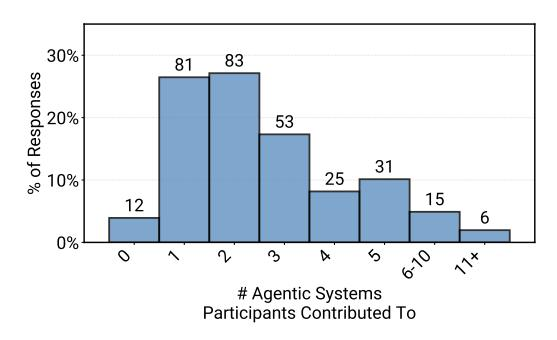

# G.1. Survey Acknowledgments

All participants who stated they worked with more than 1 AI agent or agentic AI system were required to acknowledge the following statement before proceeding further.

#### Acknowledgment 1

To ensure consistency in your responses, please choose one agentic system to focus on throughout this survey. All your answers should relate to this same system. You may choose:

- A system you are most familiar with, or
- The system that is most developed among those you know meaning closest to production with the most users.

Please feel very, very welcome to submit additional survey responses for each system you are familiar with.

> **[图片提取文字 (无描述)]:**
> 30% % of Responses %02 %00 0% A # Agentic Systems Participants Contributed To

Figure 27. Distribution of the number of Agentic AI systems that participants reported contributing to (N=306).

#### **G.2. Survey Questions**

We designed the questions to avoid response priming and facilitate downstream quantitative analysis, resulting in the question-type distribution shown in Table 5.

#### G.3. Participant Contribution Distribution

As shown in Figure 27, this plot presents the distribution of how many Agentic AI systems participants reported contributing to. Across the N=306 systems represented in the survey, most respondents contributed to only a single system, with fewer individuals reporting involvement in multiple systems. This distribution highlights the breadth of participation across distinct agent deployments rather than concentrated contributions from a small subset of practitioners.

The exact survey questions and response choices are shown in the following sections.

| <b>Question Type</b>   | Frequency |
|------------------------|-----------|
| MCSA                   | 24        |
| Free-Text              | 8         |
| MCMA                   | 7         |
| Rank-order             | 5         |
| Numerical Input        | 3         |
| <b>Total Questions</b> | 47        |

Table 5. Distribution of Question Types in Survey. Abbreviations: MCSA (Multiple-Choice Single-Answer), MCMA (Multiple-Choice Multiple-Answer).

