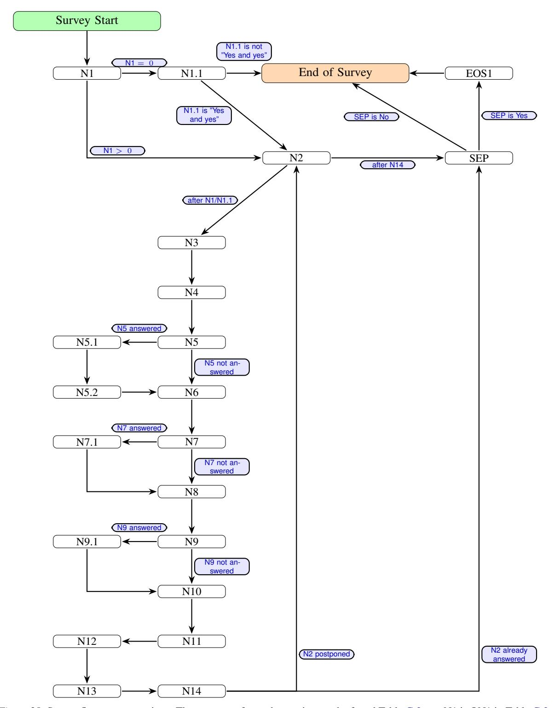
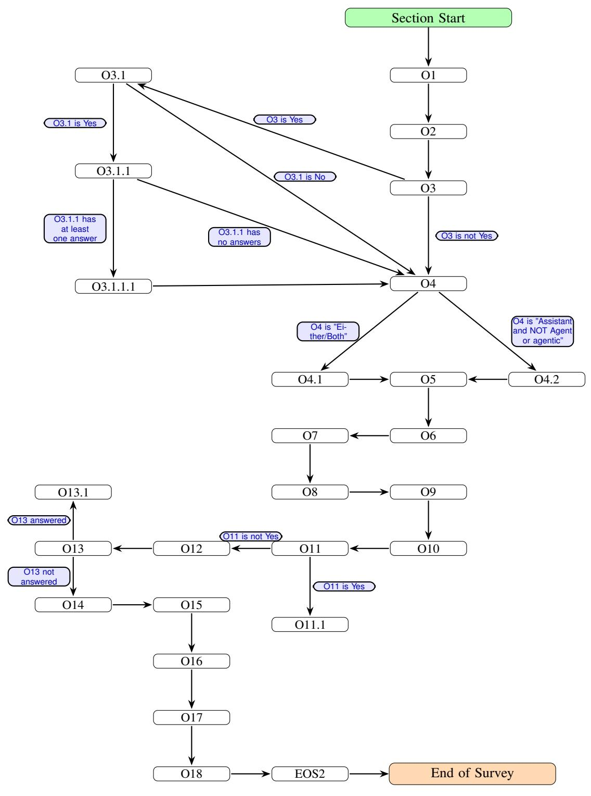

# Additional Questions

| Select any/all of the following methods | MCMA                               |                                                                             |
|--------------------------------------------|------------------------------------|-----------------------------------------------------------------------------|
|                                            |                                    | Hover/click on the "i" for examples, definitions and descriptions.          |
|                                            | Manual (Human-in-the-loop):        | Definitions:                                                                |
| currently integrated                       | Expert Review                      | Expert Review: Involve human specialists to validate content in high-stakes |
| into your system that                      | Manual Citation Verification       | or sensitive domains                                                        |
| give you confidence                        | Crowdsourced Evaluation            | Manual Citation Verification: User ensures cited sources are accurate and   |
| your agentic/assistant                     | Red Teaming                        | actually support the generated claims                                       |
| system is consistently                     | Automated Not-Model-Based          | Crowdsourced Evaluation: Collect feedback from diverse human reviewers      |
| producing high                             | Cross-Referencing:                 | to assess quality and usefulness                                            |
| quality outputs,                           | External Fact-Checking             | Red Teaming: Humans manually test robustness by probing with adversarial    |
| whatever "high                             | Knowledge Graph Validation         | or misleading prompts or actions to expose weakness                         |
| quality" means in                          | Automated Citation Verification    | External Fact-Checking: Retrieve supporting evidence from trusted sources   |
| your context.                              | Automated Model- and               | and validate claims e.g. using retrieval-augmented generation (RAG)         |
|                                            | Estimation-Based Methods:          | Knowledge Graph Validation: Cross-check facts against structured data like  |
|                                            | Self-Consistency Checks            | Wikidata or domain-specific ontologies                                      |
|                                            | Internal Confidence Estimation     | Automated Citation Verification: Ensure cited sources are accurate and      |
|                                            | Critique Models                    | actually support the generated claims                                       |
|                                            | Red Teaming using models           | Self-Consistency Checks: Generate multiple answers and compare for          |
|                                            | Cross-Model Validation             | consistency, use majority voting to select the most common answer, and/or   |
|                                            | LLM-as-a-Judge                     | apply chain-of-thought reasoning to ensure logical consistency              |
|                                            | Automated Rule-Based Methods:      | Internal Confidence Estimation: Score answers using log probabilities       |
|                                            | Grammar and Syntax Checks          | and/or estimate uncertainty with dropout or ensemble methods                |
|                                            | Domain-Specific Rules              | Critique Models: Use separate models to evaluate factuality, coherence, and |
|                                            | Other:                             | overall quality of the output                                               |
|                                            | None of the above/below            | Red Teaming using models: Test robustness by probing with adversarial or    |
|                                            | I am not confident the system      | misleading prompts to expose weakness                                       |
|                                            | consistently produces high quality | Cross-Model Validation: Compare outputs from different AI models to         |
|                                            | output yet                         | identify consensus or discrepancies; Use Zero-Shot Critics, unrelated       |
|                                            |                                    | models to critique outputs without prior task-specific training             |
|                                            |                                    | Grammar and Syntax Checks: verify grammatical correctness and linguistic    |
|                                            |                                    | clarity with or without NLP models                                          |
|                                            |                                    | Domain-Specific Rules: Apply expert-defined rules for accuracy, tailored to |
|                                            |                                    | specific fields like business, medicine, law or finance                     |
|                                            |                                    |                                                                             |

| ID    | Question                                                                                                                                                             | Response Choices                                                                                                                                                                                                                                                                                                                                                                                                                                                                                                                                                                                                                                                       | Additional Context                                                                                                                                                                                                                                                                                                                                                                                                                                                                                                                                                                                                                                                                                                                                                                                                                                                                                                                                                                                                                                                                                                                                                                                                                                                                                                                                                                                                                                                                                                                                                     |
|-------|----------------------------------------------------------------------------------------------------------------------------------------------------------------------|------------------------------------------------------------------------------------------------------------------------------------------------------------------------------------------------------------------------------------------------------------------------------------------------------------------------------------------------------------------------------------------------------------------------------------------------------------------------------------------------------------------------------------------------------------------------------------------------------------------------------------------------------------------------|------------------------------------------------------------------------------------------------------------------------------------------------------------------------------------------------------------------------------------------------------------------------------------------------------------------------------------------------------------------------------------------------------------------------------------------------------------------------------------------------------------------------------------------------------------------------------------------------------------------------------------------------------------------------------------------------------------------------------------------------------------------------------------------------------------------------------------------------------------------------------------------------------------------------------------------------------------------------------------------------------------------------------------------------------------------------------------------------------------------------------------------------------------------------------------------------------------------------------------------------------------------------------------------------------------------------------------------------------------------------------------------------------------------------------------------------------------------------------------------------------------------------------------------------------------------------|
| QO2   | Sort the following categories from most to least important for ongoing development and production deployment. Press and drag an option to sort. | Rank-order Data and Model Integrity: Data Quality and Availability Model Drift and Concept Drift Versioning and Reproducibility Core Technical Performance: Robustness and Reliability Scalability Real-Time Responsiveness Resource Constraints System Integration and Validation: Integration with Legacy Systems Testing and Validation Security and Adversarial Robustness Transparency and Governance: Explanability and Interpretability Bias and fairness Accountability and Responsibility Compliance and User Trust: Privacy and Data Protection User Trust and Adoption Regulatory Compliance | Hover/click on the "i" for examples and definitions. Definitions: Data Quality and Availability: Accessing clean, timely, and relevant data for decision-making Model Drift and Concept Drift: Adapting to changes in data distributions and task definitions Versioning and Reproducibility: Tracking models, data, and configurations for auditability Robustness and Reliability: Ensuring consistent, correct behavior in diverse and unpredictable environments Scalability: Supporting growth in users, data, and tasks without performance degradation Real-Time Responsiveness: Meeting latency and timing requirements in dynamic contexts Resource Constraints: Managing compute, memory, and energy efficiently Integration with Legacy Systems: Seamlessly connecting with existing infrastructure and APIs Testing and Validation: Simulating and verifying agent behavior before deployment Security and Adversarial Robustness: Defending against manipulation and exploitation Explanability and Interpretability: Making decisions understandable to humans Bias and fairness: Preventing discriminatory or unjust outcomes Accountability and Responsibility: Clarifying who is liable for agentic decisions Privacy and Data Protection: Ensuring compliance with data regulations (e.g. GDPR) User Trust and Adoption: Building confidence through transparency and reliability Regulatory Compliance: Meeting legal standards for autonomy, safety, and |
| QO3   | Have you compared your agentic/assistant solution to a non-agentic solution, which of the following statements is most accurate?                   | MCSA Yes; No, alternatives might exist but I have NOT formally compared them; No, alternates DO NOT exist, my system provides truly novel functionality                                                                                                                                                                                                                                                                                                                                                                                                                                                                                                 | transparency —                                                                                                                                                                                                                                                                                                                                                                                                                                                                                                                                                                                                                                                                                                                                                                                                                                                                                                                                                                                                                                                                                                                                                                                                                                                                                                                                                                                                                                                                                                                                                      |
| QO3.1 | If it were entirely up to you, would you choose the agentic solution over the alternatives? Only shown if answer for QO3 is Yes                    | MCSA Yes No                                                                                                                                                                                                                                                                                                                                                                                                                                                                                                                                                                                                                                                      | —                                                                                                                                                                                                                                                                                                                                                                                                                                                                                                                                                                                                                                                                                                                                                                                                                                                                                                                                                                                                                                                                                                                                                                                                                                                                                                                                                                                                                                                                                                                                                                      |

| ID      | Question                                                                                                                                                                                                                                                                                                                                         | Response Choices                                                                                                                                                                                                                                                                                                                                                                                                                                                                                                             | Additional Context |
|---------|--------------------------------------------------------------------------------------------------------------------------------------------------------------------------------------------------------------------------------------------------------------------------------------------------------------------------------------------------|------------------------------------------------------------------------------------------------------------------------------------------------------------------------------------------------------------------------------------------------------------------------------------------------------------------------------------------------------------------------------------------------------------------------------------------------------------------------------------------------------------------------------|--------------------|
| QO3.1.1 | You answered "Yes" to "If it were entirely up to you, would you choose the agentic solution over the alternatives?" Why, which of the following functional improvements does the new system offer compared to the previous solution? (Select all that apply.). Only shown if answer to QO3.1 is Yes | MCMA Increased automation or reduced manual effort Enhanced user interface or usability Scalability or support for more users ONLY Ease of software design, maintenance, model use or integration Improved performance or speed For non-technical reasons ONLY, e.g. marketing/advertising, strategic planning, Better integration with other systems Improved data accuracy or consistency Enhanced security or compliance Expanded features or capabilities None of the above | —                  |
|         | QO3.1.1.1Order all selected options according to their respective priority level Improved performance or speed (Options from QO3.1.1). Only shown if answer to QO3.1.1 has answers                                                                                                                                    | Rank-order Answers from QO3.1.1                                                                                                                                                                                                                                                                                                                                                                                                                                                                                           | —                  |
| QO4     | Thinking about the state of the system you chose to focus on, in your personal opinion, would you call it an "assistant" but not an AI Agent or agentic?                                                                                                                                                                    | MCSA Either/Both; Assistant and NOT Agent or agentic                                                                                                                                                                                                                                                                                                                                                                                                                                                                   | —                  |
| QO4.1   | Why do you refer to your system as AI agents or agentic? What makes it agentic in your opinion? Only shown if answer to QO4 is Either/Both                                                                                                                                                                                  | Free-Text —                                                                                                                                                                                                                                                                                                                                                                                                                                                                                                               | —                  |

| ID    | Question                                                                                                                                                                                                                                                                                                                                                                                     | Response Choices                                                                                                                                                                                                                                                                                                                                                                                                                                                                                                                                                                                                                                                                                                                                                                                 | Additional Context |
|-------|----------------------------------------------------------------------------------------------------------------------------------------------------------------------------------------------------------------------------------------------------------------------------------------------------------------------------------------------------------------------------------------------|--------------------------------------------------------------------------------------------------------------------------------------------------------------------------------------------------------------------------------------------------------------------------------------------------------------------------------------------------------------------------------------------------------------------------------------------------------------------------------------------------------------------------------------------------------------------------------------------------------------------------------------------------------------------------------------------------------------------------------------------------------------------------------------------------|--------------------|
| QO4.2 | Why do you refer to your systems or an "assistant rather than an "agent" or "agentic"? What makes it an assistant rather than an agentic system in your opinion? You may go back and change your previous answer if you use any of these terms to describe your system. Only shown if answer to QO4 is Assistant and NOT Agent or agentic | Free-Text —                                                                                                                                                                                                                                                                                                                                                                                                                                                                                                                                                                                                                                                                                                                                                                                   | —                  |
| QO5   | What is the minimum level of expertise or training (knowledge and skills) expected from typical end-users? (Select the best option.)                                                                                                                                                                                                                                       | MCSA Highly skilled professionals — Advanced education and specialized knowledge (e.g., engineers, scientists, doctors); capable of complex tasks like coding, diagnostics, or system design Extensive domain experience — Deep practical knowledge from years of experience; having organizational or domain knowledge, skilled in nuanced tasks like troubleshooting or decision-making General education — High school level education with basic digital skills (e.g., using email, spreadsheets, or web apps) and standard subject matter knowledge Minimal expertise required — Little to no formal education; able to follow simple instructions or perform basic tasks (e.g., tapping buttons, entering data) Not sure | —                  |

| ID  | Question                                                                                                                                                                                                                                                                                                                                                                                                                      | Response Choices                                                                                                                                                                                                                                                                                                                                                                                   | Additional Context |
|-----|-------------------------------------------------------------------------------------------------------------------------------------------------------------------------------------------------------------------------------------------------------------------------------------------------------------------------------------------------------------------------------------------------------------------------------|----------------------------------------------------------------------------------------------------------------------------------------------------------------------------------------------------------------------------------------------------------------------------------------------------------------------------------------------------------------------------------------------------|--------------------|
| QO6 | How would you rate the return on investment (ROI) of this agentic system relative to its total cost of development, operation, infrastructure and all other costs? (Please select the option that best reflects your assessment.) Only shown if answer to QN5 is "In active production – Fully deployed and used by target end-users in a live operational environment" | MCSA Exceptionally high ROI (ROI greater than 150%) High ROI (ROI between 125%–150%) Acceptable ROI (ROI between 90%–124%) Low ROI (ROI between 60%–89%) Poor ROI (ROI less than 60%)                                                                                                                                                                                         | —                  |
| QO7 | How much do each agent's system prompt (instruction) lengths vary? (Skip if you do not know.)                                                                                                                                                                                                                                                                                                                     | MCSA Tens of tokens Hundreds of tokens Thousands of tokens Ten of Thousands of tokens More                                                                                                                                                                                                                                                                                          | —                  |
| QO8 | Compared to the target latency for the system's result turn-around, how problematic is the actual latency? (Select one.)                                                                                                                                                                                                                                                                                    | MCSA I don't know I don't understand the question Not problematic at all, the actual latency is better than expected and not a problem for deployment Marginally problematic, but good enough for deployment Very problematic, the system can't be deployed without addressing the gap, or the highest priority post-deployment will be bringing down the latency | —                  |
| QO9 | What is the maximum target latency for determining a single action, step, or response? (Select one.)                                                                                                                                                                                                                                                                                                        | MCSA Microseconds; Subsecond; 1 to 10 seconds; 10 to 60 seconds; A few minutes; More; Less; I don't know; I don't understand the question                                                                                                                                                                                                                                              | —                  |

| ID     | Question                                                                                                                                                                        | Response Choices                                                                                                                                                                                                                                                                               | Additional Context                                                                                                                                                                                                                                                                                                                                                                                  |
|--------|---------------------------------------------------------------------------------------------------------------------------------------------------------------------------------|------------------------------------------------------------------------------------------------------------------------------------------------------------------------------------------------------------------------------------------------------------------------------------------------|-----------------------------------------------------------------------------------------------------------------------------------------------------------------------------------------------------------------------------------------------------------------------------------------------------------------------------------------------------------------------------------------------------|
| QO10   | What is the maximum number of distinct models used together to solve a single logical task? Skip if you do not know; estimates are fine.                   | Numerical Input —                                                                                                                                                                                                                                                                           | —                                                                                                                                                                                                                                                                                                                                                                                                   |
| QO11   | Are inference time scaling techniques used in your system?                                                                                                                | MCSA Yes; 0, No inference time scaling is used; I don't know                                                                                                                                                                                                                             | Help: For the purposes of this question, "inference time scaling" a.k.a. "test time compute" refers to a family of techniques that call models multiple times or use a collection of models together, in place of a single model call and without modifying the weights or retraining any models, to answer a single question, choose a single next step, action, tool, etc |
| QO11.1 | If inference time scaling techniques are used, approximately how many model calls are made per user query or task? Only shown if answer for QO11 is Yes | MCSA Tens Hundreds Thousands Tens of thousands Hundreds of thousands Millions More                                                                                                                                                                                        | —                                                                                                                                                                                                                                                                                                                                                                                                   |
| QO12   | What data modalities does the system process now (today)?                                                                                                                 | MCMA Natural Language Text Tabular data Software or machine generated text including system logs, events, etc. Code Images Videos Image sequences or batches with additional channels or metadata e.g. geospatial, NMR scans Scientific data not listed above | —                                                                                                                                                                                                                                                                                                                                                                                                   |
| QO13   | What data modalities will or should the system process in future (that it does NOT process now)?                                                                    | MCMA Same as QO12                                                                                                                                                                                                                                                                           | —                                                                                                                                                                                                                                                                                                                                                                                                   |

| ID     | Question                                                                                                                                                                                                                                                                                                                                                                                                                                                                   | Response Choices                                                                                                                                                                                                                                                                                                                                                                    | Additional Context |
|--------|----------------------------------------------------------------------------------------------------------------------------------------------------------------------------------------------------------------------------------------------------------------------------------------------------------------------------------------------------------------------------------------------------------------------------------------------------------------------------|-------------------------------------------------------------------------------------------------------------------------------------------------------------------------------------------------------------------------------------------------------------------------------------------------------------------------------------------------------------------------------------|--------------------|
| QO13.1 | You have selected the following option(s) for the question "What data modalities will or should the system process in future (that it does NOT process now)?": What are the barriers to processing them now? Sort the options from most to least important; press and drag an option to sort. Only shown if QO13 is answered. If you don't know, skip the question No barriers, just a matter of development time | Rank-order Answers selected from QO13                                                                                                                                                                                                                                                                                                                                            | —                  |
| QO14   | Which describes the data handling functions the system(s) perform? Select all that apply and use the "QOther" box to detail.                                                                                                                                                                                                                                                                                                                             | MCMA Ingests direct user input in real-time Ingests other real-time information as well as direct user input Ingests information from other systems, e.g. databases, at most indirectly from end-users Retrieves persistent data from public external sources (e.g. the web) Retrieves non-public, confidential, or otherwise federated data Other | —                  |
| QO15   | Are you using an openly (commercially or non-commerically) available agent-focused programming framework (e.g. LangChain, CrewAI, Autogen,) to implement your system?                                                                                                                                                                                                                                                                     | MCSA Yes No, only an in-house not openly available solution, or only standard programming languages and tools e.g. Python, Java (not-agent-focused) I don't know                                                                                                                                                                                                  | —                  |

| ID   | Question                                                                                                                                                                                                 | Response Choices                                                                                                                         | Additional Context |
|------|----------------------------------------------------------------------------------------------------------------------------------------------------------------------------------------------------------|------------------------------------------------------------------------------------------------------------------------------------------|--------------------|
| QO16 | From experimental observations, which of the following supports most of your assistant/agentic system functionality or design? Only shown if answer to QO15 is Yes               | MCSA OpenAI Swarm CrewAI LangChain or LangGraph BeeAI Autogen or AG2 LlammaIndex Other:                             | —                  |
| QO17 | How long has it been since active prototyping or initial development started on this agentic/assistant system?                                                                         | MCSA Less than 3 months; 3–6 months; 6–12 months; 1–2 years; 2–5 years; More than 5 years; I don't know or prefer not to say | —                  |
| QO18 | How long have you been working on this agentic/assistant system?                                                                                                                                | MCSA Same as QO17                                                                                                                     | —                  |
| EOS2 | Thank you, this completes our questionnaire. Go back to change any of your answers, or click END to finalize them and exit. Any last comments or feedback can be shared here. | Free-Text —                                                                                                                           | —                  |

Analysis Aspects Overview Given the diversity of agent applications and architectures, we pinpointed 17common aspects for analysis, summarized below. Regarding respective data collection, see the interview guide (Appendix [C.3\)](#page-23-0) and example survey question references (e.g., *QN13, QO7* with full text in Appendix [G\)](#page-30-0).

- 1. Prompt instruction length (averages, variance, distributional properties) e.g., *QN13, QO7*
- 2. Prompt instruction construction methods (automated, semi-automated, manual, hybrid) e.g., *QN12*
- 3. Model selection (open- versus closed, post-training)
- 4. Number of models used (single-model vs. multi-model architectures) e.g., *QO10*
- 5. Use of inference-time techniques (e.g., RAG, caching, routing, speculative decoding, batching) e.g., *QO11, QO11.1*
- 6. Agent architecture: control flow, etc. (branching, looping, tool invocation, degree of autonomy) e.g., *QN9, QN10, QN11*
- 7. Agent dependencies (other agents, external software, human oversight, human expertise, data sources) e.g., *QN9, QN10, QN11, QO5*
- 8. Data sources e.g., *QO12*
- 9. Data modalities e.g., *QO13*

- 10. Programming frameworks e.g., *QO15, QO16*
- 11. Metrics e.g., *QN7*
- 12. Evaluation and verification methods (trustworthiness, accuracy, safety) e.g., *QO1, QO3*
- 13. Baseline evaluations / (human, agents, or non-agent systems) e.g., *QO3.1.1*
- 14. System throughput and latency e.g., *QN5.2, QN14, QO8, QO9*
- 15. Technical challenges (current limitations and ongoing development priorities) e.g., *QO2*
- 16. Application domain (domain(s), tasks, and deployment context) e.g., *QN4, QN3, QN7, QN8*
- 17. System stage (prototype, pilot, partial deployment, production) e.g., *QN3, QO17, QN5, QN5.1, QN5.2*

> **[图片提取文字 (无描述)]:**
> Survey Start N1.1 is not "Yes and yes" N1 = 0End of Survey EOS1 N1 N1.1 N1.1 is "Yes SEP is Yes SEP is No and yes" N1 > 0N2 SEP after N14 after N1/N1.1 N3 N4 (N5 answered) N5.1 N5 N5 not answered N5.2 N6 N7 answered N7.1 N7 N7 not answered N8 N9 answered N9.1 N9 N9 not answered N10 N12 N11 N2 already (N2 postponed) answered N13 N14

*Figure 28.* Survey flow: core questions. The exact text for each question can be found Table [G.3](#page-32-0) e.g. N1 is QN1 in Table [G.3.](#page-32-0)

> **[图片提取文字 (无描述)]:**
> Section Start O3.1 01 O3 is Yes O3.1 is Yes O2 O3.1.1 O3.1 is No O3 O3.1.1 has at least O3.1.1 has O3 is not Yes one answer no answers O4 O3.1.1.1 O4 is "Assistant and NOT Agent or agentic" O4 is "Either/Both" O4.1 O5 O4.2 **O**7 06 O13.1 08 09 O13 answered O11 is not Yes O13 O12 O10 O11 O13 not answered O11 is Yes O14 O15 O11.1 O16 O17 End of Survey EOS2 O18

*Figure 29.* Survey flow: additional questions. . The exact text for each question can be found Table [G.3](#page-36-0) e.g. O1 is QO1 in Table [G.3.](#page-36-0)