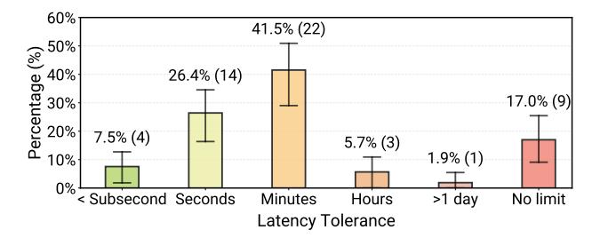
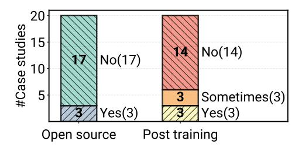
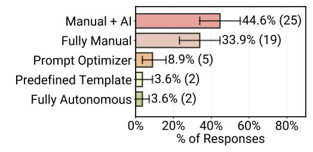

# 5. RQ2 Results: What Models, Architectures, And Techniques Are Used?

We now examine five critical design decisions: model selection, model weights tuning methods, prompt construction, agent architectures, and development frameworks.

## 5.1. Model Selection

Case study data shows deployed agents rely heavily on proprietary frontier models. Seventeen of 20 case studies use closed-source models (Figure 5), with 10 teams explicitly reporting Anthropic Claude (Sonnet 4, Opus 4.1) or OpenAI GPT (o3), the state-of-the-art at interview time. Open-source adoption (3/20 cases) addresses specific constraints, such as high-volume workloads where inference costs are prohibitive (C09 fine-tuned a model for infrastruc-

> **[图片提取文字 (无描述)]:**
> 60% 41.5% (22) Dercentage (%) 40% 20% 20% 20% 20% 20% 20% 20% 20% 20% 2 26.4% (14) 17.0% (9) 7.5% (4) 5.7% (3) 1.9% (1) 10% 0% < Subsecond Seconds >1 day No limit Minutes Hours Latency Tolerance

Figure 4. Reported tolerable end-to-end response latency for deployed agentic systems (N=53).

ture maintenance using existing company GPUs) or regulatory requirements preventing sensitive data sharing.

Model selection is based on empirical testing. Engineers evaluate the most powerful accessible models and selecting based on downstream performance. These teams report that runtime costs remain negligible compared to alternative expert labor costs (e.g., medical professionals, senior engineers), justifying the use of expensive frontier models.

**Finding 5:** Case study data shows deployed agents rely on proprietary frontier models (17/20); open-source addresses cost or regulatory constraints.

**Number of Distinct Models.** Survey data shows that while 41% of deployed agents use a single model, 59% coordinate multiple models. Case study interviews reveal that half of the teams (10/20) combine models driven by both *functional needs* and surprisingly *operational constraints*.

Functional needs include (1) cost optimization, routing simple subtasks to smaller models and complex reasoning to powerful models (C16), and (2) modality requirements, combining text-to-speech with LLMs (C04-C05) or pairing domain-specific models (chemistry) with general reasoning models (C06-C08, Figure 13).

Operational constraints. Interview data reveals some teams maintain multiple models to manage fragility from model upgrades. Agent scaffolds, prompts, and evaluations lock onto specific model behaviors. Deploying newer models can break agent workflows, forcing teams to run legacy models alongside updates (C10). This pattern reveals a reliability challenge: in production settings, newer or more capable models do not guarantee improved agent performance.

**Finding 6:** Use of multiple models in production agents (59%) reflects both functional needs (cost, modality) with operational constraints (model migration).

## **5.2.** Model Weight Tuning

Case study data shows deployed agents overwhelmingly favor prompting over weight tuning. Fourteen of 20 cases (70%) use off-the-shelf models without supervised fine-

> **[图片提取文字 (无描述)]:**
> #Case studies No(14) No(17) Sometimes(3) Yes(3) Yes(3) Post training Open source

Figure 5. Distribution of model characteristics across case studies (N=20) for model source openness and post-training usage. "Sometimes" indicates selective use (e.g., when cost-justified).

tuning (SFT) or reinforcement learning (RL) (Figure 5). Two teams explicitly report foundation models already meet their task requirements, making post-training unnecessary.

Five of 20 cases use SFT (Figure 5): two teams apply SFT consistently, targeting business-specific contexts where domain knowledge improves performance (e.g., C17), while three apply it selectively for enterprise clients where training data is available and cost trade-offs make sense (e.g., C14). Even among these five cases, four combine fine-tuned models with off-the-shelf LLMs rather than relying on fine-tuning alone. Only one case uses RL-trained models (C06 for scientific discovery). Three teams report plans for future RL adoption in complex multi-system environments.

Interview data reveals practical considerations that favor prompting over post-training. Teams report that SFT and RL require substantial implementation effort and are brittle to model upgrades, requiring costly retraining when versions change. Interviewed teams prefer methods that reduce development and maintenance overhead.

Latency requirements can also potentially push teams toward model adaptation. Among the 4 cases with explicit bounded-latency requirements, 3 use weight tuning (C02, C04, C14) and 1 pairs a proprietary model with system-level techniques such as caching (C05). The sample is small, so we report this as an observation rather than a prevalence claim: latency-sensitive teams adapt the model or system design rather than relying solely on frontier proprietary APIs.

**Finding 7:** Post-training is less common in deployments (6/20 cases). Interviewed teams rely primarily on prompt engineering with frontier models.

#### 5.3. Prompt Tuning Strategies

Survey data shows humans remain central to prompt construction despite emerging automated methods. Among surveyed deployed agents, 34% use manual hard-coded prompts, and 45% use manual drafting augmented by LLMs (Figure 6). Only 9% use prompt optimizers (e.g., DSPy (Khattab et al., 2024)). Case study interviews con-

> **[图片提取文字 (无描述)]:**
> 144.6% (25) Manual + Al +33.9% (19) **Fully Manual** ⊣8.9% (5) Prompt Optimizer +3.6% (2) Predefined Template H3.6% (2) Fully Autonomous 40% 60% 0% 20% 80% % of Responses

Figure 6. Distribution of system-prompt construction strategies across deployed Agentic AI systems (N=53).

firm this pattern: only 1 of 20 teams explored automated optimization, while the rest rely on human construction, sometimes with LLM refinement. Interviewed practitioners report prioritizing controllable and interpretable methods enabling fast iteration, whereas we speculate black-box optimizations may incur additional engineering overhead.

Survey data shows prompt complexity varies widely with system maturity. While most deployed agents (52%) use short prompts under 500 tokens, some use very long prompts exceeding 10,000 tokens (Figure 9b). Case study interviews reveal that long prompts typically occur in external client-facing agents requiring extensive guardrails.

**Finding 8:** Survey data shows humans dominate prompt construction (79% manual or manual+LLM); automated optimization remains rare (9%).

#### 5.4. Agent Architecture

Case study data shows predefined structured workflows dominate production deployments. Eighty percent (16/20) of case studies use structured workflows rather than openended autonomous planning. These agents operate within scoped action spaces where practitioners define task sequences upfront. Nine cases implement sophisticated agentic RAG pipelines, single agents retrieving via tool calls, or pipelines with 20+ subtasks explicitly configuring retrieval at each step. For example, C01 follows a fixed sequence of coverage lookup, medical necessity review, and risk identification, where the agent autonomously completes each subtask but high-level objectives remain fixed. This pattern reflects practitioners adapting existing business processes into agent workflow rather than building fully autonomous AI workers. Interview data reveal that workflows dominate production to prioritize controllability and human-expert-inthe-loop oversight for reliability. Teams deliberately constrain autonomy for production stability. Only 1 case uses unconstrained exploration, exclusively in sandboxed environments with rigorous CI/CD verification (C09).

Number of Steps Before Human Intervention. Survey data quantifies this constrained autonomy: 68% of deployed agents execute fewer than 10 steps before requiring human intervention, and 47% execute fewer than 5 steps (Fig-

ure 7a). For comparison, research prototypes show substantially higher step counts (Figure 21a), reflecting aggressive autonomy exploration that consolidates during deployment. Interview data shows problem complexity, planning non-determinism, and latency drive intentional step limits.

**Finding 9:** Both study data show structured workflows dominate; agents execute <10 steps (68%) before human intervention, prioritizing reliability over autonomy.

## 5.5. Agent Frameworks

As agent systems mature and scale, teams prefer custom agent implementations over third-party frameworks. Among case studies with production deployments, 85% (17/20) build custom in-house implementations with direct API calls; only 3 use external frameworks (LangChain/LangGraph, DSPy). Survey data shows 61% currently use frameworks (led by LangChain/LangGraph at 25%), but 2 teams explicitly migrated from frameworks (e.g., CrewAI) to custom solutions for production deployment.

Why custom over frameworks? Three drivers emerge. First, *flexibility*: production agents require vertical integration with proprietary infrastructure and data pipelines that rigid frameworks cannot support (C14: bespoke orchestration for varied client environments). Second, *simplicity*: core agent loops are straightforward to implement directly, avoiding dependency bloat (C12: custom ReAct implementation). Third, *security*: enterprise policies prohibit certain external libraries, forcing compliant internal solutions.

**Finding 10:** Production agents favor custom implementations (85%) over frameworks for flexibility, simplicity, and control at scale.

