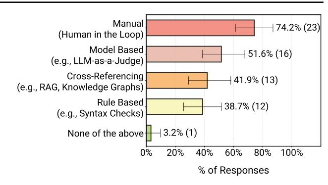

# 7. RQ4 Results: What Are The Top Challenges In Deployment?

Survey data shows reliability remains the primary development bottleneck. Following the IEEE (1990) standard definition and prior works (Yao et al., 2025), we treat reliability as the probability of failure-free operation for a specified period in a specified environment. Thirty-eight percent of practitioners rank "Core Technical Performance"—encompassing reliability, robustness, and scalability—as their top priority in agent development, far exceeding governance (3%) or compliance (17%) (§B.4). We examine three key challenges: how teams achieve reliability, why evaluation remains difficult, and how teams manage security.

Finding 13: Reliability remains the primary bottleneck.

#### 7.1. Reliability Challenge

A paradox emerges: if reliability is the primary development bottleneck, how do agent systems reach production? We observe that teams mitigate reliability risks through strict environmental and autonomy constraints. A closer pass over our interviews surfaces three recurring reliability failure patterns. First, incomplete evaluation coverage forces teams to rely on expert review while they build task-specific test sets from scratch (C01, C03, C05, C09, C14, C15, C17). Second, correctness failures grow with task complexity, especially when systems combine heterogeneous or multimodal data, which often triggers human verification (C03, C06, C07, C10, C14). Third, legacy-system integration with existing security and compliance requirements limits functionality or narrows deployment scope (C03, C04, C10, C15, C16).

Interview data shows agents deploy in controlled environments minimizing failure impact: read-only mode where

> **[图片提取文字 (无描述)]:**
> Manual 74.2% (23) (Human in the Loop) Model Based 51.6% (16) (e.g., LLM-as-a-Judge) Cross-Referencing 41.9% (13) (e.g., RAG, Knowledge Graphs) Rule Based 38.7% (12) (e.g., Syntax Checks) 3.2% (1) None of the above 0% 20% 40% 60% 80% 100% % of Responses

Figure 8. Evaluation methods reported by practitioners for deployed agentic systems (N=31, multi-select).

SRE agents generate bug reports for engineer review without modifying production (C16); sandbox verification where systems with write access undergo rule-based checks before production integration (C09, C11-C12); internal deployment serving employees where errors have lower consequences and expert oversight is immediate (§4.3); wrapper APIs restricting agents to abstraction layers that hide production system details (C16); and role-based access controls mirroring user permissions (C15).

Survey data reveals teams deliberately constrain autonomy. Sixty-eight percent execute fewer than 10 steps before human intervention (§5.4). Interviewed teams bound behavior through prompting and limited tooling. External-facing systems use particularly restricted workflows where trust and economic consequences demand control—pre-configured retrieval to specific document stores, mandatory human approval at critical steps, and fixed action sequences.

## 7.2. Evaluation Challenges

The patterns observed in §6.2, limited formal benchmarks and dominance of human evaluation (74%), stem from underlying technical challenges revealed in our interviews.

**Benchmark scarcity.** Interview data reveals three challenges with benchmark creation: (1) Regulated domains lack public data, forcing expensive expert-crafted datasets (C01, C16: months of data collection and labeling). (2) Client-specific customizations make standardized benchmarks infeasible (C04: proprietary toolsets and localized dialogue per deployment), leading teams to default to A/B testing and iterative client feedback.

Real-world tasks are hard to verify. Interview data reveals robust verification mechanisms don't always exist. Coding agents represent a rare case where verification occurs through compilation and test suites (C09, C12), enabling faster iteration. Most agents operate without fast automated signals. For example, insurance agents receive feedback only through delayed real consequences such as financial

losses or patient approval delays ([C01](#page-21-1)). This verification gap may explain both the reliance on human evaluation and the concentration in productivity-focused applications ([§4.1\)](#page-3-3), where end-to-end time quantifies straightforwardly while harder-to-measure benefits remain underexplored.

## 7.3. Security and Privacy Challenges

Interview data reveals practitioners currently prioritize quality and correctness over security. Interviewed teams share that security is implicitly achieved through systems-level design (e.g., read-only agents) similar to [§7.1](#page-7-2) approaches. Current deployments also reflect this pattern, for example, 52% serve internal employees ([§4.3\)](#page-3-1). Systematic security mechanisms remain an open challenge as deployments expand to higher-stakes external settings.

Survey data shows agents frequently handle sensitive data, for example 69% retrieve confidential data ([§B.4.1\)](#page-18-0). Interview data reveals teams address privacy through contractual agreements with model providers preventing training on user data ([C01](#page-21-1): medical records).

