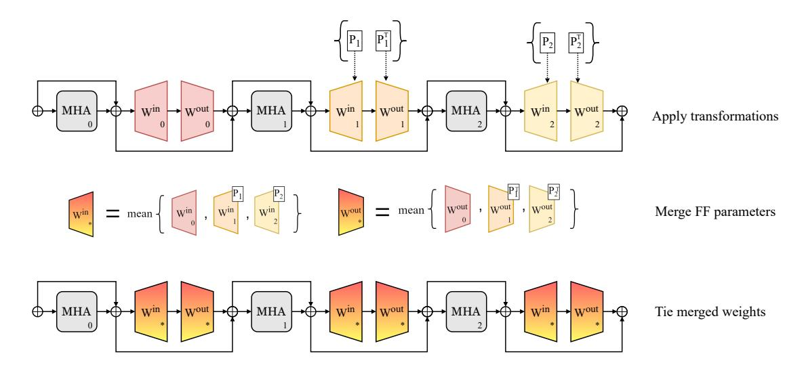

# 1 Introduction

Recent advances in deep learning have been marked by large, pre-trained models in order to achieve state-of-the-art performance. As these models deploy across a wider range of settings, compression techniques that balance efficiency and performance are increasingly important. These techniques help facilitate model use across a variety of inference settings and hardware availability.

Much of the prior work in model compression has built upon on pruning, quantization, and distillation techniques [\(LeCun et al.,](#page-9-0) [1989;](#page-9-0) [Fiesler et al.,](#page-8-0) [1990;](#page-8-0) [Hinton et al.,](#page-8-1) [2015\)](#page-8-1). Prior work on pruning has introduced many techniques identifying regions of model parameters that can be removed without drastically changing performance. These

techniques target individual weights, neurons, or general regions of a model—like attention heads, parameter chunks, or even entire layers. [\(Voita](#page-10-0) [et al.,](#page-10-0) [2019;](#page-10-0) [Lagunas et al.,](#page-9-1) [2021;](#page-9-1) [Sajjad et al.,](#page-10-1) [2023\)](#page-10-1). However, while "unimportant" features are targeted for pruning techniques, we can also target "redundant" features for compression. There has been far less focus on compression methods that target redundancy within a model.

In targeting redundant features for compression, we can *merge* sets of similar parameters rather than prune them. Relatedly, the field of model merging has explored merging parameters from multiple models to combine their functionalities into one model [\(Goddard et al.,](#page-8-2) [2024;](#page-8-2) [Yang et al.,](#page-10-2) [2024a\)](#page-10-2). We instead extend parameter merging to *sublayers* within one model, rather than just separate models.

To this end, we propose a novel compression method that aligns, merges, and ties separate feedforward (FF) sublayers within Transformers to achieve a reduced parameter model with reduced memory use [\(Vaswani et al.,](#page-10-3) [2017\)](#page-10-3). We target FF sublayers in particular due to their large parameter count and easy mergeability. Through our testing, we find that these groups of FF sublayers are notably compressible via merging, giving rise to a simple and surprisingly effective framework applicable to a variety of existing pre-trained models.

We highlight the contributions of our work:

- We propose a novel model compression method inspired by recent work in model merging. This approach is orthogonal to compression methods like quantization.
- Across three different Transformer-based models, namely GPT-2, ViT, and a machine translation model, we show that merging over one-third of FF sublayers and fine-tuning the resulting model can achieve performance comparable to the original models. We also combine our method with QLoRA to help

> **[图片提取文字 (无描述)]:**
> Win → Wout → Win → Wout Win → Wout MHA | → MHA MHA Apply transformations Merge FF parameters Win → MHA Win → MHA Wout MHA Tie merged weights

Figure 1: Overview of the feed-forward alignment and merging algorithm used to compress models in an example three layers of a Transformer. Multi-headed attention is abbreviated to MHA, feed-forward sublayers are depicted with  $W^{\rm in}$  and  $W^{\rm out}$  weights, and Add&Norm operations are depicted with  $\bigoplus$ , connected by arrows indicating residual connections. Permutation transformation matrices are shown as  $P_i$ . Our method includes a permutation finding step, applying the transformations, merging transformed parameters, and finally tying the merged parameters. By merging and tying k feed-forwards, we can reduce the model size by k-1 feed-forward sublayers.

facilitate even smaller fine-tuning settings (Dettmers et al., 2023).

- To explore the surprising effectiveness of merging, we compare different FF outputs from the same model, and find regions with highly similar activations. These same patterns do not occur in attention outputs.
- We release an easily extensible toolkit for our method: ? nverma1/merging-ffs-compression

#### 2 Related Work

In this section, we review prior work related to weight tying and redundancies in Transformers.

Weight tying for smaller models Prior work on weight tying has focused on training models from scratch with specific tying schemes. Tying input and output embedding layers helps cap total parameter count, but more importantly introduces important gradient sharing for better generalization in language generation tasks (Press and Wolf, 2017; Inan et al., 2017). For non-embedding layers in Transformers, prior work has explored numerous weight tying patterns for pre-training new, efficient models (Dehghani et al., 2019; Lan et al., 2020; Reid et al., 2021; Takase and Kiyono, 2023). Liu et al. (2024) use heavy weight tying between Transformer lay-

ers at initialization to achieve state-of-the-art subbillion parameter language models. Pires et al. (2023) tie widened FF sublayers at initialization and train machine translation (MT) models that outperform standard Transformer MT models. In our work, we instead start from a pre-trained model, and then use weight sharing as a *post-training* tool to reduce overall parameter count.

**Redundancies in Transformers** Prior work has demonstrated signs of redundancy in Transformer computations, and suggested techniques to reduce this phenomenon. Dalvi et al. (2020) use centered kernel alignment (CKA) to show high layer similarity in BERT and XLNet, and use correlation clustering to find and remove redundant neurons. Men et al. (2024); Gromov et al. (2024) propose removing Transformer layers in deep, decoderonly language models to achieve faster inference at a small performance drop. Li et al. (2024) propose a compression method for sparsely-activated mixture-of-expert (SMoE) models that draws from model merging to compress experts in SMoE models. Our method extends a similar approach to a much wider set of models.

## 3 Merging Feed-Forward Sublayers

In this section, we discuss FF sublayers as a merging target, explain permutation-based neuron align-

&lt;sup>1This diagram shows a Post-LN Transformer, but our method easily applies to Pre-LN Transformers as well.

ment, and describe our compression method.

## 3.1 Targeting feed-forward sublayers

We focus our interest on Transformer FF sublayers for several reasons. Firstly, these sublayers constitute around two-thirds of non-embedding parameters in Transformer encoder or decoder models. Compressing these parameters results in substantial overall savings in a model. Secondly, the parameterization of FF sublayers, including variations, is straightforward, making it a good candidate for merging-based compression approaches.

Beyond these practical considerations, prior work establishes several properties of Transformer FF sublayers that make them good candidates for compression via merging. [Li et al.](#page-9-9) [\(2023\)](#page-9-9) show that they can be very sparsely activated, where non-zero FF activations can be as low as 3-5%. Other work has demonstrated evidence that adjacent LayerNorm and FF blocks, in both Postand Pre-LN architectures, results in weakening of the contextualization effects of FF sublayers [\(Kobayashi et al.,](#page-9-10) [2024\)](#page-9-10). The authors allude to redundancy in Transformer FF processing due to this interaction. Finally, [Pires et al.](#page-9-6) [\(2023\)](#page-9-6) train performant Transformer-based translation models with only one widened and tied encoder FF block, demonstrating useful sharing, but from scratch.

