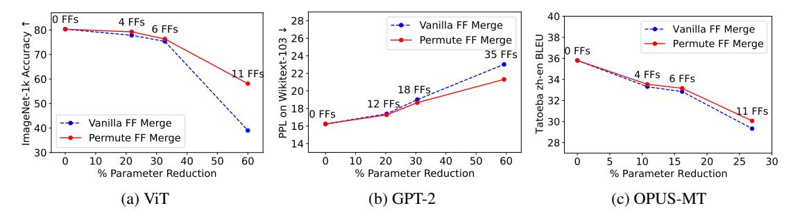
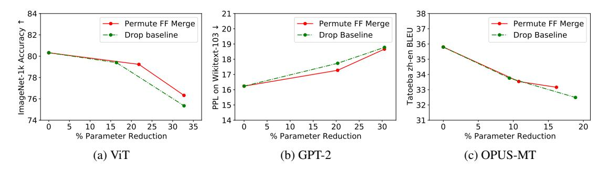
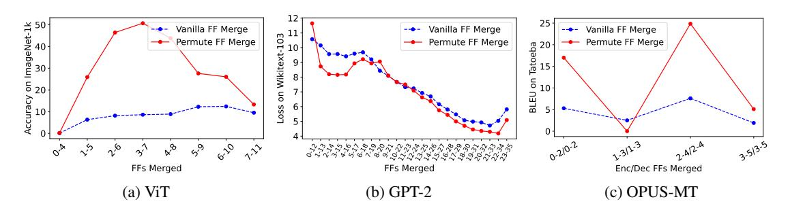
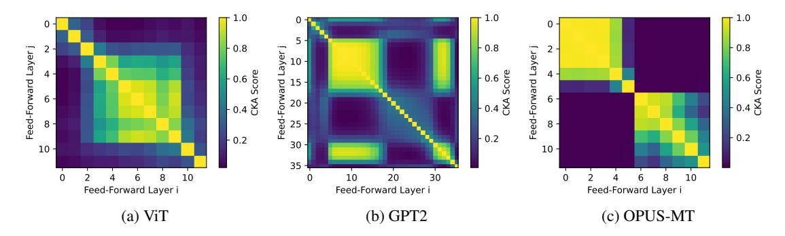

# 5.1 Merging feed-forward sublayers across compression ratios

We evaluate our compression method on image classification using ViT, language modeling using GPT-2, and machine translation using an OPUS-MT zh-en model, and report our results in Figure [2.](#page-5-0) We report results at 1/3, 1/2 and (n − 1)/n feedforward sublayers removed, in order to test our method at different overall compression ratios.[7](#page-4-2) We also report results from our compression method without the permutation step, labeled as "Vanilla."

From our results, we see that even up to 1/2 of FF sublayer parameters removed, which is over 30% in parameter reduction for ViT and GPT-2,[8](#page-4-3) our method can retain high performance. At 1/3 of FF sublayers removed, performance is almost

5Tokens are counted on the source side.

6We use the wmt-22-da model.

7Compression ratios for OPUS-MT differ due to the encdec architecture.

8We include embedding parameters in all % parameter reduction and compression ratio calculations.

> **[图片提取文字 (无描述)]:**
> 0 FFs 4 FFs 6 FFs Accuracy ↑ Vanilla FF Merge Vanilla FF Merge 38 36 26 Permute FF Merge 03 Permute FF Merge 0 FFs 35 FFs 24 Wikitext zh-en 4 FFs 6 FFs ImageNet-1k A 34 -18 FFs Tatoeba 00 30 12 FFs 18-11 FFs 1 0 FFs Vanilla FF Merge PP 161 Permute FF Merge 28 14 30 60 60 30 50 30 50 30 % Parameter Reduction % Parameter Reduction % Parameter Reduction (b) GPT-2 (c) OPUS-MT

Figure 2: Results across all three tasks depicting compression versus performance results. We include results from our main method, labeled as Permute FF Merge, as well as our method without permutation alignment, depicted as Vanilla FF Merge. We note that our method retains almost complete performance at one-third of feed-forward sublayers removed, across all tasks, and continues to retain high performance at one-half of FF sublayers removed.

identical to the original model, resulting in only a 1% accuracy drop in ViT, 1 PPL increase in GPT-2, and 2 BLEU drop in the translation model. Full numerical results can be found in Appendix E.

Our findings also hold across all three of our tasks tested, suggesting that our method generalizes to different types of models. Additionally, we can notice that permutation-based compression is consistently better compared to no-permute vanilla baselines, demonstrating the effectiveness of aligning features before merging. This effectiveness is more pronounced at larger numbers of FF sublayers removed. In summary, our results show that 1) post-training weight tying is a simple and effective compression method and 2) permutation-based alignment of these shared weights can improve final compression performance.

In Figure 3, we compare our method at 1/3 and 1/2 FFs removed to our layer-pruning baseline. 9 We drop layers to attempt to match the reduction ratios of our own methods, constituting 1/6 and 1/3 of layers dropped for all three models. However, since we cannot match exact ratios due to the granularity of the methods, we plot the exact parameter reduction ratios and performance, and compare. As seen in the figure, our method consistently matches or outperforms the layer-dropping method. This comparison confirms that merging is a competitive alternative to strong pruning-based methods for model compression.

#### 5.2 Choice of merged sublayers

In our merging algorithm, we choose which layers to merge by computing performance over sliding windows of k indices. For each of our model/task

pairs, we plot the pre-tuning performance of the merging algorithm on 1/3 of FF sublayers dropped across all windows, to observe their differences. Results are shown in Figure 4. Before tuning, it appears that the choice of layers seems to be important, resulting in different performance. However, these differences reduce once recovery fine-tuning is performed. To see this, we randomly select 3 sets of k consecutive layers for each of our tasks, and apply recovery fine-tuning to these compressed models. In Table 1, we observe that all models achieve similar performance after fine-tuning.

This suggests that the aligning, tying, and tuning portions of our method drive much of the performance improvement. Nevertheless, the choice of layers might be more important in other models; this is potential future work.

|               | ViT           | GPT-2 | OPUS-MT |
|---------------|---------------|-------|---------|
|               | Accuracy(%) ↑ | PPL↓  | BLEU↑   |
| Best pre-tune | 79.2          | 17.3  | 33.5    |
| Random 1      | 79.5          | 18.3  | 33.9    |
| Random 2      | 78.5          | 17.1  | 33.8    |
| Random 3      | 78.9          | 17.3  | 33.1    |

Table 1: Results comparing our compression method at 1/3 of feed-forward sublayers removed with different sublayer groups. We include three random consecutive selections of sublayers, excluding the original selection.

#### 5.3 Choice of anchor layer

We also examine the sensitivity of our method to the choice of anchor layer in our alignment step. In section 3.3, we choose the first FF sublayer in the sequence to serve as the anchor, and compute permutations aligning the remaining sublayers to the anchor. Here, we also consider using either the

&lt;sup>9These reduction ratios reflect common ratios found in layer-pruning literature.

> **[图片提取文字 (无描述)]:**
> 84 38 -Permute FF Merge Permute FF Merge Permute FF Merge → 20 BLEU ImageNet-1k Accuracy 37 Drop baseline Drop Baseline − ■ Drop Baseline 103 36 ₽ 35 Wikitext 18 22 Tatoeba 32 33 78+ 5 16 립 15 31 30 35 25 30 20 25 % Parameter Reduction % Parameter Reduction % Parameter Reduction (b) GPT-2 (c) OPUS-MT

Figure 3: Results across all three tasks depicting compression versus performance for our method and a strong layer-dropping baseline method. We perform layer dropping for 1/6 and 1/3 of layers dropped, and fine-tune the best pre-tuned set of dropped layers for all sliding windows. Across the parameter reduction range shown, our merging-based compression method outperforms or matches layer-dropping across the three tasks.

> **[图片提取文字 (无描述)]:**
> 25 -Accuracy on ImageNet-1k Vanilla FF Merge Vanilla FF Merge Vanilla FF Merge 8 11 10 Permute FF Merge Permute FF Merge Permute FF Merge Tatoeba 15 10 Wikitext-8 5 10 -6 BLEU Loss FFs Merged FFs Merged Enc/Dec FFs Merged (a) ViT (b) GPT-2 (c) OPUS-MT

Figure 4: Performance curves over different ranges of merged feed-forward sublayers representing 1/3 FFs removed. Across all three tasks, there are clear ranges of merged sublayers that retain more performance when merged.10

*last* FF or the *middle* FF of the sequence, and report results in our 1/3 FF merge setting in Table 2.

|                | ViT Accuracy(%) ↑ | GPT-2 PPL↓ | OPUS-MT BLEU↑ |
|----------------|----------------------|---------------|------------------|
| Anchor: First  | 79.2                 | 17.3          | 33.5             |
| Anchor: Middle | 79.5                 | 17.4          | 33.4             |
| Anchor: Last   | 79.0                 | 17.4          | 33.5             |

Table 2: Results comparing our compression method with 1/3 of feed-forward sublayers removed, but with different anchor locations.

Given the similar results across settings, our merging approach is robust to the choice of reference or anchor layer, enhancing the reliability of our permutation-based alignment method to find corresponding features for a useful merge.

## 5.4 Additional compression via quantization

While our compression method reduces model size via weight tying, quantization also reduces the overall storage needed for a model via reducing parameter precision. If our method performs orthogonally to state-of-the-art quantization, both methods may

be used together for additional memory savings. We experiment with the LLM.int8() quantization method due to its effectiveness and widespread adoption (Dettmers et al., 2022).

We quantize our models after removing 1/3 of FF sublayers, and report results in Table 3. Combining our method with quantization provides even smaller compression ratios, while retaining high performance. This coupling helps to realize compression ratios like 20% when considering total model storage complexity.

#### 5.5 QLoRA Extension on OLMo-7B

In combining our method with QLoRA, we are able to reduce the size of the base model further before quantizing and fine-tuning on SamSum. We report results on the base model, layer pruning, and our method at 1/3 FFs merged in Table 4.

While our method slightly underperforms the base setting, we slightly improve over the Drop baseline setting and maintain high downstream performance. We note that for both the layer pruning baseline as well as our method, the base model is unchanged after compressing, which demonstrates that our method holds up to this aspect of LoRA

&lt;sup>10We display loss on Wikitext-103 for visibility.

|         |                 | Our M       | lethod      | +LLM.       | int8()      |
|---------|-----------------|-------------|-------------|-------------|-------------|
| Model   | Metric          | Compression | Performance | Compression | Performance |
| ViT     | Accuracy(%) ↑   | 78%         | 79.2        | 20%         | 79.2        |
| GPT-2   | $PPL\downarrow$ | 80%         | 17.3        | 22%         | 17.3        |
| OPUS-MT | BLEU↑           | 89%         | 33.5        | 51%         | 33.5        |

Table 3: Compression results across three tasks, before and after additional compression via quantization. In this case, compression is measured in terms of total model storage complexity (disk space) instead of parameter count.

> **[图片提取文字 (无描述)]:**
> 1.0 r 1.0 0 -Layer j - 0.8 - 0.8 - 0.8 Feed-Forward Layer j Feed-Forward Layer j Score Score - 0.6 g Feed-Forward I - 0.4 🖔 - 0.4 🖔 8 -0.2 - 0.2 30 -10 -10 -35 30 10 10 20 10 Feed-Forward Layer i Feed-Forward Layer i Feed-Forward Layer i (a) ViT (b) GPT2 (c) OPUS-MT

Figure 5: CKA plots of feed-forward sublayer hidden states across three different models. In all three settings, we see clear regions of high similarity between different FF layers.

|        | Layers | ROUGE-1 | ROUGE-2 | ROUGE-Lsum |
|--------|--------|---------|---------|------------|
| QLoRA  | -      | 53.68   | 29.34   | 49.83      |
| +Drop  | 10-16  | 50.95   | 26.82   | 47.28      |
| +Merge | 9-20   | 51.61   | 26.95   | 47.41      |

Table 4: Summarization results reported in ROUGE scores for the SamSum dataset. Our merging method can help reduce the base model further while still allowing for high downstream summarization performance.

(Hu et al., 2022), and can aid in settings where base models need to be reduced further before tuning.

