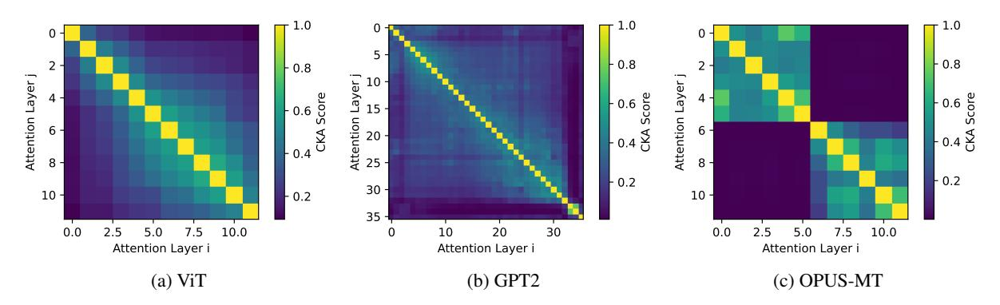

# G Attention Layer Similarity

We compute CKA similarity between all attention sublayer pairs, using the same 10k tokens or patches from our CKA results on FF sublayers. The features are from the output of the linear layer just

after the dot-product attention computation. Results appear in Figure [6.](#page-13-2)

| Model   | Metric         | Merged Indices | FFs Removed | Vanilla | Permute |
|---------|----------------|----------------|-------------|---------|---------|
|         |                | _              | 0/12        | 80.3    | 80.3    |
| V:T     | A (07) A       | 3-7            | 4/12        | 77.8    | 79.2    |
| ViT     | Accuracy (%) ↑ | 4-10           | 6/12        | 75.3    | 76.3    |
|         |                | 0-11           | 11/12       | 39.0    | 58.1    |
|         | PPL↓           | _              | 0/36        | 16.16   | 16.16   |
| CDT 2   |                | 22-34          | 12/36       | 17.39   | 17.27   |
| GPT-2   |                | 16-34          | 18/36       | 19.01   | 18.66   |
|         |                | 0-35           | 35/36       | 23.02   | 21.31   |
| OPUS-MT | BLEU↑          | _              | 0/12        | 35.8    | 35.8    |
|         |                | 2-4/2-4        | 4/12        | 33.3    | 33.5    |
|         |                | 0-3/0-3        | 6/12        | 32.8    | 33.2    |
|         |                | 0-5/0-5        | 11/12       | 29.3    | 30.1    |

Table 10: Full numerical results on compression results at 1/3 FF sublayers removed, 1/2 FF sublayers removed, and (n-1)/n FF sublayers removed. Original, uncompressed models are included in the first row of results for each model, indicated by 0 FFs removed and no merged indices.

| Experiment    | Merged Indices | Anchor  | FFs Removed | Vanilla | Permute |
|---------------|----------------|---------|-------------|---------|---------|
|               | _              | First   | 0/12        | 86.8    | 86.8    |
| Main          | First          | 2-4/2-4 | 4/12        | 85.7    | 85.7    |
| Main          | First          | 0-3/0-3 | 6/12        | 85.2    | 85.4    |
|               | First          | 0-5/0-5 | 11/12       | 83.1    | 83.5    |
|               | First          | 0/2-0/2 | 4/12        | _       | 85.8    |
| Layer choice  | First          | 1-3/1-3 | 4/12        | -       | 85.8    |
|               | First          | 3-5/3-5 | 4/12        | -       | 85.6    |
| Anchor choice | Middle         | 2-4/2-4 | 4/12        | -       | 85.8    |
|               | Last           | 2-4/2-4 | 4/12        | -       | 85.7    |
| +Quantization | First          | 2-4/2-4 | 4/12        | -       | 85.8    |

Table 11: Comet scores corresponding to BLEU scores in each table. The first section corresponds to Table E, the second Table 1, the third Table 2, and the last Table 3.

> **[图片提取文字 (无描述)]:**
> r 1.0 T 1.0 8.0 - 0.8 Attention Layer j 10 -10 -15 -Score -- 0.6 e Attention 52 8 -- 0.2 0.2 30 -10 -- 0.2 10 -35 0.0 10.0 30 10.0 2.5 5.0 7.5 20 0.0 2.5 5.0 7.5 Attention Layer i Attention Layer i Attention Layer i (a) ViT (b) GPT2 (c) OPUS-MT

Figure 6: CKA plots of multi-headed self-attention sublayer activations across three different trained models. Attention activations are largely dissimilar from each other across model types. We do not compare between encoder and decoder attention sublayers in the translation model due the differences in token inputs.