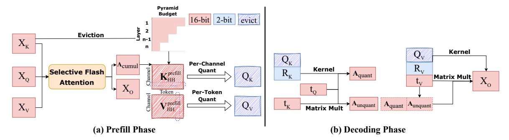
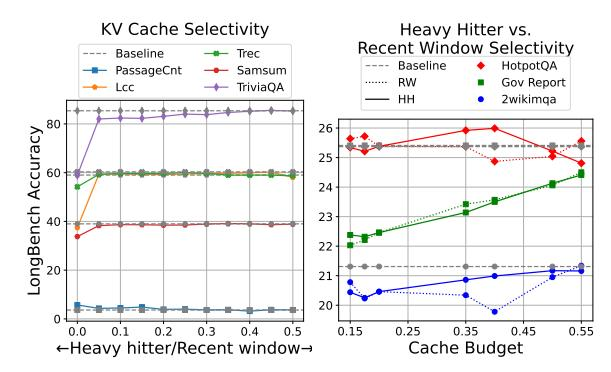
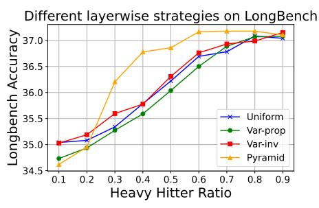
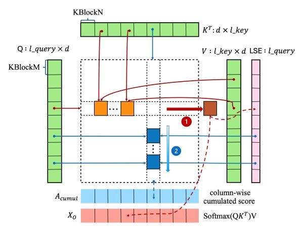
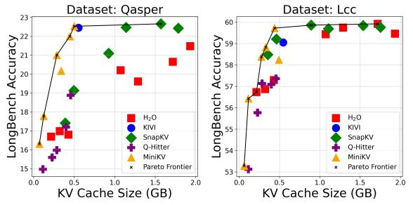
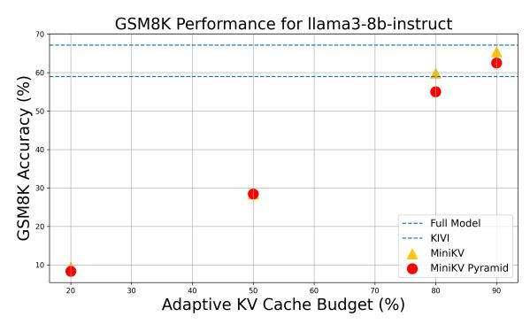
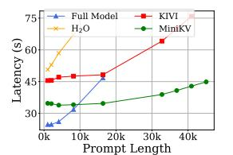
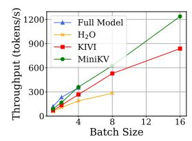
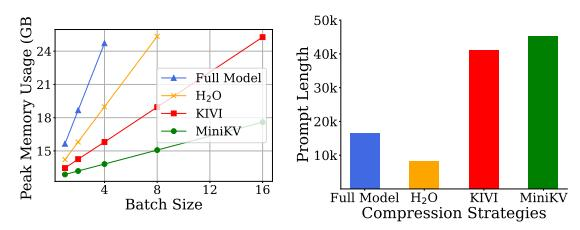
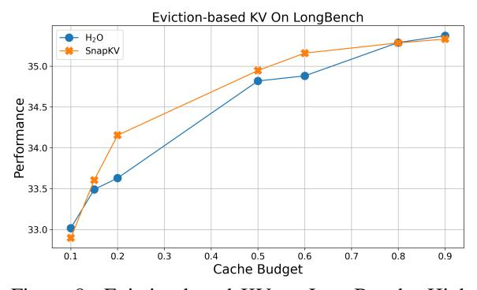

## <span id="page-0-0"></span>MiniKV: Pushing the Limits of 2-Bit KV Cache via Compression and System Co-Design for Efficient Long Context Inference

## Akshat Sharma, Hangliang Ding[\\*](#page-0-0), Jianping Li, Neel Dani, Minjia Zhang

SSAIL Lab, University of Illinois at Urbana-Champaign

{akshat7, jli199, neeld2, minjiaz}@illinois.edu pianoqwz@gmail.com

## Abstract

State-of-the-art 2-bit KV cache quantization techniques achieve excellent results in accelerating LLM inference while retaining accuracy on long context tasks. However, further pushing the compression ratio fails to deliver performance gains. In this work, we revisit these approaches by considering, additionally, adaptive KV methods that retain LLM accuracy with only a subset of KV states. This leads us to propose a method based on 2-bit KV cache quantization with adaptive KV policies. In addition, we take an algorithm and system co-design approach by developing hardwarefriendly kernels to accelerate LLM inference while making MiniKV compatible with existing memory-efficient attention techniques such as FlashAttention, effectively translating algorithmic improvements into system performance gains. Experiments on a wide range of long context tasks show that MiniKV effectively achieves >80% KV cache compression while retaining accuracy, outperforming state-of-theart methods while achieving excellent latency, throughput, and memory consumption improvements in long context inference.

### 1 Introduction

Large language models (LLMs) have exhibited unique capabilities, such as instruction following, reasoning, and inference time scaling [\(OpenAI,](#page-10-0) [2024;](#page-10-0) [DeepSeek-AI et al.,](#page-9-0) [2025\)](#page-9-0). However, efficiently serving LLMs is still a pressing concern. One of the main LLM inference bottlenecks is the consumption of KV cache memory, which consumes memory in addition to widely studied bottlenecks such as model sizes [\(Frantar et al.,](#page-9-1) [2022;](#page-9-1) [Lin et al.,](#page-10-1) [2024\)](#page-10-1).

To address this challenge, one of the prevailing practices is to quantize the KV cache [\(vLLM,](#page-10-2)

Project Homepage: [https://supercomputing-system-ai](https://supercomputing-system-ai-lab.github.io/projects/minikv/)[lab.github.io/projects/minikv/](https://supercomputing-system-ai-lab.github.io/projects/minikv/)

[2025;](#page-10-2) [NVidia,](#page-10-3) [2025\)](#page-10-3). Studies show that FP8/INT8 or even 4-bit quantization can be achieved for KV cache compression while preserving accuracy [\(Sheng et al.,](#page-10-4) [2023;](#page-10-4) [Liu et al.,](#page-10-5) [2023a;](#page-10-5) [Yang](#page-11-0) [et al.,](#page-11-0) [2024b\)](#page-11-0). State-of-the-art approaches, such as KIVI and KVQuant [\(Liu et al.,](#page-10-6) [2024b;](#page-10-6) [Hooper](#page-9-2) [et al.,](#page-9-2) [2024\)](#page-9-2), show that the KV cache can be effectively quantized to sub 4-bit, e.g., 2 bits, while preserving most accuracy. However, further pushing down the compression ratio (e.g.,<2 bits) leads to a significant accuracy loss.

In a separate line of research in the community, numerous work have explored *adaptive KV*, where the LLM selects a small subset of KV states based on their importance [\(Zhang et al.,](#page-11-1) [2023;](#page-11-1) [Xiao et al.,](#page-11-2) [2023b;](#page-11-2) [Ge et al.,](#page-9-3) [2023;](#page-9-3) [Liu et al.,](#page-10-7) [2023b\)](#page-10-7). Recent advances also introduce head-specific adaptive KV [\(Ge et al.,](#page-9-3) [2023;](#page-9-3) [Xiao et al.,](#page-11-3) [2024;](#page-11-3) [Wu et al.,](#page-11-4) [2024\)](#page-11-4) and layer-specific adaptive KV [\(Cai et al.,](#page-9-4) [2024;](#page-9-4) [Nawrot et al.,](#page-10-8) [2024;](#page-10-8) [Wan et al.,](#page-11-5) [2024\)](#page-11-5) with the goal of evicting or merging KV pairs without compromising overall performance. However, following the work of [\(Zhang et al.,](#page-11-1) [2023\)](#page-11-1), few studies have included studies on how adaptive KV policies work on quantized KV cache, despite quantized KV is widely used in practice [\(Turganbay,](#page-10-9) [2024\)](#page-10-9). Moreover, for long context inference, where KV cache memory becomes the major bottleneck, few adaptive KV work manage to achieve a compression ratio that exceeds 50% while maintaining accuracy in long context tasks [\(Li et al.,](#page-10-10) [2024;](#page-10-10) [Tang](#page-10-11) [et al.,](#page-10-11) [2024\)](#page-10-11).

These two points of view (quantized KV and adaptive KV) consider the extreme sides of the spectrum of optimization points for KV cache memory. However, there has been very little work exploring how to consolidate these two lines of work to maximize the KV cache memory savings. The conventional wisdom is that these techniques can be *combined*. However, existing work aiming to combine 4-bit quantization and adaptive KV

<sup>\*</sup>Work done while intern at UIUC. Correspondence to: Minjia Zhang (minjiaz@illinois.edu)

> **[图片提取文字 (无描述)]:**
> Pyramid Budget evict 16-bit 2-bit ē **Eviction** n-1  $X_{\scriptscriptstyle K}$ n Kernel  $Q_{K}$ Per-Channel → A<sub>cumul</sub>  $R_v$ Kernel Selective Flash Quant  $R_{\kappa}$ KHH prefill  $X_Q$  $Q_{K}$ Aquant Matrix Mult  $X_{o}$ Attention W  $X_{o}$ Token .--Per-Token Quant  $V_{\rm HH}^{\rm prefill}$  $Q_{v}$ Aunquant Aquant Aunquant  $X_v$ K **Matrix Mult** (a) Prefill Phase (b) Decoding Phase


Figure 1: An overview of MiniKV. Tensors colored red/blue indicate 16-bit/2-bit representation, and shaded tokens are evicted during inference. During the prefill phase, we employ pyramid KV with rectified token selection policy across layers to identify a sparse set of important tokens. For all the important tokens, we employ sub-channel Key quantization and per-token Value quantization to minimize the quantization errors while maintaining a compact KV cache data layout without introducing any irregular operations. To address the incompatibility issue between score-based KV pair selection policies and memory-efficient system optimizations such as FlashAttention, we develop a two-pass Triton-based selective flash-attention kernel to output both the representation  $X_O$  and the cumulative attention map  $A_{\rm cumul}$ , while still keeping the memory consumption of the attention calculation linear with respect to the sequence length. During decoding, we use a fused unpacking and multiplication kernel to compute both the attention map between the new Query token  $t_Q$  and the quantized Keys, as well as the product between the attention map and the quantized Values.

shows that combining these techniques leads to non-trivial interactions (Zhang et al., 2024b), which need to be reasoned through carefully for good performance. In this paper, we address the following question: How should 2-bit KV cache quantization techniques be combined with adaptive KV policies to maximize the inference speed of LLMs given a memory budget while retaining high model accuracy in long context inference?

To answer the question, we revisit existing approaches on ultra low-bit quantized KV (e.g., 2-bit) and adaptive KV, together with a compression system co-design perspective, which is unexplored so far. Our findings led us to develop MiniKV, which effectively compresses the KV cache through a synergistic combination of 2-bit quantization and adaptive KV to achieve minimal accuracy loss in long-context tasks while maximizing the compression ratio. Specifically, on the algorithm side, we employ subchannel-wise key and token-wise value quantization, as well as pyramid KV with rectified token selection policy across layers to significantly push the KV compression ratio while keeping the algorithm still hardware-friendly without introducing any irregular computation. On the system side, we develop a two-pass Triton (Tillet et al., 2019) kernel together with native fused kernels to accelerate the inference latency while resolving the incompatibility limitation from the attention score-based eviction policy and memory-efficient attention system optimizations such as FlashAttention (Dao et al., 2022). Consequently, the resulting

system maximizes the compression ratio on the KV cache while obtaining high accuracy and hardware efficiency in long context inference.

To validate the approach, we compare MiniKV with existing KV cache compression techniques such as H2O, SnapKV, and Q-Hitter, across three major models in LongBench datasets. The results show that MiniKV effectively achieves 86% KV cache compression while retaining comparable accuracy on LongBench, outperforming state-of-theart methods. Furthermore, MiniKV enables prompt lengths up to 44K tokens and a maximum throughput that is 48% higher than its strongest baseline on a single NVIDIA A100 GPU. To our knowledge, our work is the first to show that it is possible to achieve significantly >50% KV cache reduction through compression and system co-design while achieving high batch size  $\geq 1$  throughput on long context tasks.

### 2 Related Work

Numerous efforts have been made to improve the KV cache efficiency of LLMs. Among them, quantization has been a prevailing technique employed in deployment to overcome KV memory overhead without retraining (vLLM, 2025; NVidia, 2025). Many research has shown that FP8/INT8/INT4 quantization can be achieved for KV cache while preserving accuracy (Hooper et al., 2024; Sheng et al., 2023; Liu et al., 2023a; Yang et al., 2024b; Zhang et al., 2024b). However, further pushing the quantization limit to under 4-bit, e.g., 2-bit,

leads to major performance loss. More recently, researchers have proposed advanced quantization techniques, such as KIVI [\(Liu et al.,](#page-10-6) [2024b\)](#page-10-6), to quantize KV cache into 2-bit without major loss in accuracy. While being effective, it still has one major limitation: its effectiveness against adaptive KV policies and its implication on system performance has not yet been studied. Our results indicate that it is nontrivial to use 2-bit quantized KV together with adaptive KV policies in conjunction while achieving high compression ratio, accuracy, and system efficiency in long context inference, simultaneously.

Adaptive KV policies have also gained interest within the community, leading to various algorithms [\(Zhang et al.,](#page-11-1) [2023;](#page-11-1) [Xiao et al.,](#page-11-2) [2023b;](#page-11-2) [Liu](#page-10-7) [et al.,](#page-10-7) [2023b;](#page-10-7) [Ge et al.,](#page-9-3) [2023;](#page-9-3) [Wan et al.,](#page-11-5) [2024;](#page-11-5) [Wu et al.,](#page-11-4) [2024;](#page-11-4) [Cai et al.,](#page-9-4) [2024;](#page-9-4) [Yang et al.,](#page-11-7) [2024a;](#page-11-7) [Li et al.,](#page-10-10) [2024;](#page-10-10) [Liu et al.,](#page-10-13) [2024a;](#page-10-13) [Bran](#page-9-6)[don et al.,](#page-9-6) [2024;](#page-9-6) [Tang et al.,](#page-10-11) [2024\)](#page-10-11). However, many of those works either do not focus on long context inference [\(Zhang et al.,](#page-11-1) [2023;](#page-11-1) [Xiao et al.,](#page-11-2) [2023b;](#page-11-2) [Liu et al.,](#page-10-7) [2023b;](#page-10-7) [Ge et al.,](#page-9-3) [2023\)](#page-9-3), where the KV cache pressure is the most prominent, or introduce irregular operations or auxiliary scores that are not hardware-friendly (e.g., batch size >1 with FlashAttention enabled) [\(Ge et al.,](#page-9-3) [2023;](#page-9-3) [Wu](#page-11-4) [et al.,](#page-11-4) [2024;](#page-11-4) [Wan et al.,](#page-11-5) [2024;](#page-11-5) [Tang et al.,](#page-10-11) [2024\)](#page-10-11). Finally, most adaptive KV methods struggle to exceed a 50% compression rate in long context inference [\(Zhang et al.,](#page-11-1) [2023;](#page-11-1) [Li et al.,](#page-10-10) [2024;](#page-10-10) [Tang](#page-10-11) [et al.,](#page-10-11) [2024\)](#page-10-11), suggesting that solely identifying important tokens may have limited improvements for adaptive KV. Complementary to this line of work, our goal is to improve the compression ratio of KV cache via revising ultra-low quantized KV (e.g., 2 bit) with adaptive KV policies, with an eye toward system co-design to maximize the performance of LLM inference. We empirically show that this path can be more memory-efficient, especially on long context tasks. We provide a detailed summary of the comparison between MiniKV and previous approaches in Appendix [B.](#page-12-0)

## 3 Method

In this section, we first focus on the compressibility of ultra low-bit quantized KV cache by considering adaptive KV policies, with an eye toward being able to still keep the final solution hardware friendly, which leads to the proposed algorithm in MiniKV. In addition, we introduce kernel optimization that addresses the composibility issue between score-based adaptive KV and memory-efficient attention implementation such as FlashAtttention.

## 3.1 Revisiting 2-Bit Quantized KV with Adaptive KV Policies

## 3.1.1 Sub-channel Key Quantization with Persistent Context Selection

Existing KV cache quantization methods often perform per-token quantization (i.e., the scaling factor and zero point are shared by elements in the same token) [\(Sheng et al.,](#page-10-4) [2023;](#page-10-4) [Xiao et al.,](#page-11-8) [2023a\)](#page-11-8). However, it has been observed that outliers emerge within the channel dimension of key cache [\(Liu et al.,](#page-10-6) [2024b;](#page-10-6) [Hooper et al.,](#page-9-2) [2024\)](#page-9-2), requiring channel-wise quantization.

Recent works [\(Hooper et al.,](#page-9-2) [2024;](#page-9-2) [Liu et al.,](#page-10-6) [2024b\)](#page-10-6) observe that the data distribution within each channel shifts over generation steps, leading to inaccurate quantization. We measure and confirm the accuracy impact of inaccurate quantization on LongBench in Appendix [F.](#page-12-1) To mitigate quantization error, prior work suggests fine-grained perchannel key quantization, which quantizes keys at the granularity of a small sub-channel group (e.g. 16/32 numbers). Combining these techniques with a full KV cache is straightforward because the elements within each sub-channel group remain the same during the entire LLM generation process.

However, with adaptive KV, the elements within a sub-channel group may change after each decoding step if some tokens in the group are evicted to make space for newly generated tokens. MiniKV solves this problem by enabling sub-channel key quantization via *persistent context selection*. Our design for this optimization is based on the following key observation: *Given a sufficiently large cache budget, the important tokens can be identified before generation and maintained persistently throughout the process.*

We found some recent inference optimization works that argue against persistent context selection [\(Tang et al.,](#page-10-11) [2024\)](#page-10-11). However, all of these texts show that heavy hitters do not persist when using a tiny cache budget (<5%). We empirically verify persistent context selection by measuring the fraction of heavy hitters that persist during the entire generation phase of H2O when using a large cache budget. We observe that nearly 60-80% of the heavy hitters selected during the prefill stage persist throughout generation. Please see Appendix

#### E for details.

Based on this observation, we choose a set of *persistent heavy hitters* at the end of the prefill to quantize and not update throughout the generation phase. This allows MiniKV to avoid re-encoding a group while keeping a low quantization error with 2-bit sub-channel quantization.

## 3.1.2 Selectivity in Long Contexts: Heavy Hitters vs. Recent Window

Prior studies observe that the accumulated attention scores of all tokens within an attention block follow a power-law distribution and claim that maintaining a tiny subset of important tokens (e.g., as low as 5%) with the highest accumulated attention score is sufficient to maintain precision (Zhang et al., 2023). However, this observation has not been carefully examined in long contexts.

We observe that using a highly limited memory budget (e.g., 20%), existing solutions such as H<sub>2</sub>O (Zhang et al., 2023) and SnapKV (Li et al., 2024) have a significant performance drop in long context tasks, which motivates us to revisit the selectivity of adaptive KV methods. First, we assess if the model retains performance using only the recent window (RW) or heavy hitters (HH), we examine the KV cache's selectivity towards RW/HH. The cache budget is described as the percent of the prompt tokens retained, i.e. an RW/HH budget of  $(\alpha_{RW}, \alpha_{HH})$  and an input prompt of length  $l_{\text{prompt}}$  tokens indicate that  $(\alpha_{RW})$  $l_{\text{prompt}}, \alpha_{HH} \cdot l_{\text{prompt}})$  tokens are maintained as the RW and HH respectively. We fix the total cache budget to 50% and distribute it among the RW and HH, i.e., RW/HH budget of  $(\alpha_{RW}, \alpha_{HH}) =$ (0%, 50%), (10%, 40%), (20%, 30%), and so on. Fig. 2 (left) reveals an interesting aspect of the KV cache selectivity: The model performs better on some datasets with more HH (on Passage Count) and on some with a longer RW (on TriviaQA). More importantly, using solely RW or HH leads to a catastrophic accuracy drop in certain tasks (in Lcc and TriviaQA). This indicates that to have a robustly optimized KV cache selection policy, the model needs to maintain at least a critical percentage of HH/RW (e.g., 5-10%) to avoid a significant accuracy drop.

Next, we investigate the selectivity between RW and HH by varying the KV cache budget. In particular, we fix the RW size (e.g., 10% of the prompt length) while varying the HH set size, and vice versa. Interestingly, as seen in Fig. 2 (right), we

<span id="page-3-0"></span>> **[图片提取文字 (无描述)]:**
> KV Cache Selectivity Heavy Hitter vs. Recent Window Selectivity Baseline Trec Baseline HotpotQA PassageCnt Samsum Gov Report RW TriviaQA Lcc HH 2wikimga LongBench Accuracy 26 25 24 23 22 21 20 0 0.3 0.15 0.45 0.55 0.2 0.25 0.35 ←Heavy hitter/Recent window→ Cache Budget


Figure 2: (Left)  $\rm H_2O$  with different recent window/heavy hitter budget: We fix the total cache budget to 50% and vary the heavy hitter and recent window budget. (Right)  $\rm H_2O$  with different recent window/heavy hitter budget: The heavy hitter/recent window cache budget is fixed at 10% and the recent window/heavy hitter budget is increased from 5% to 45%. The dotted/solid lines indicate variable recent window/heavy hitter budget.

observe that there appears to be *no common trend* across datasets as to whether increasing the size of the RW vs. the HH set significantly improves the selectivity of KV states on long context tasks. In fact, either HH or RW allow adaptive KV to achieve accuracy comparable to the full KV cache baseline. Furthermore, unlike previous findings, which suggest that high levels of eviction (80-95%) do not decrease model accuracy (Zhang et al., 2023), we find that as the sequence length increases, maintaining accuracy under the same KV cache size budget becomes challenging (please see Appendix C for more details). However, low and medium levels of eviction (e.g., 50%) are still possible.

**Insight.** Our experiments suggest that high levels of KV cache eviction significantly degrade LLM's performance on long context tasks. However, medium levels of eviction can still retain comparable model accuracy. Even at medium levels, the model needs to maintain a critical percentage of both heavy hitters and recent window tokens.

## <span id="page-3-1"></span>3.1.3 Layer-Specific Selectivity: Uniform, Variance, or Pyramid?

Inspired by recent works on layer-wise KV cache compression (Cai et al., 2024; Liu et al., 2024a; Wan et al., 2024), we investigate several layer-specific KV cache selection strategies that allocate variable KV cache budgets across model layers.

• Uniform allocation: This policy has been used in multiple previous studies (Zhang et al., 2023; Xiao et al., 2023b; Liu et al., 2023b), where all layers have the same KV cache budget.

- Variance-based allocation: Similar to (Wan et al., 2024), we use the variance of the cumulative attention map to determine the layerwise KV cache budget. Lower layers exhibit smaller variances, making token eviction difficult. We examine two policy variations: *Varprop*, allocating KV cache per layer proportionally to variance, and *Var-inv*, allocating it inversely proportional to variance.
- **Pyramid-like allocation**: Introduced in (Cai et al., 2024), this strategy adjusts the heavy hitter cache budget across layers by allocating more cache in lower layers and less in higher ones. The cache budget for the intermediate layers is determined through linear interpolation.

In our experiments, we observe that the *Pyramid* policy achieves much better accuracy than the other policies, especially with medium levels of eviction, shown in Fig. 3.

<span id="page-4-0"></span>> **[图片提取文字 (无描述)]:**
> Different layerwise strategies on LongBench Tongbench Accuracy 36.5 36.0 36.0 35.5 35.0 Uniform Var-prop Var-inv Pyramid 0.5 0.8 0.9 Heavy Hitter Ratio


Figure 3: Performance of layer-wise KV cache allocation policies. The *Pyramid* policy works best, particularly at medium levels of eviction.

## <span id="page-4-1"></span>3.2 Memory-Efficient Fused Selective Attention Kernels

Despite ongoing advancements, many adaptive KV studies predominantly use attention scores as a criterion to determine which tokens should be evicted (Zhang et al., 2023; Liu et al., 2023b; Leskovec and Sosic, 2016; Cai et al., 2024).

While showing promising results in reducing the KV cache size, these *attention-score-driven* methods are not aligned with memory-efficient transformer system optimizations. In particular, these methods rely on accessing the attention matrix A, whose size grows quadratically with the sequence length. FlashAttention (Dao et al., 2022) performs the attention process without materializing the attention matrix. Therefore, to the best of our knowledge, no prior adaptive KV works with FlashAttention enabled, hindering their memory savings on long sequences.

To address the challenge, this part introduces our memory-efficient Triton kernel implementation for MiniKV's prefill phase, which simultaneously returns the following two outputs with linear memory complexity: (1) a weighted sum of the value tensors  $X_O$ , same as FlashAttention, and (2) cumulative attention score  $A_{cumul}$  along each column <sup>1</sup>. Despite being a simple task when memory is not a constraint, implementing such a kernel with linear memory complexity is challenging. The difficulty arises because  $A_{cumul}$  requires summing the attention values for each token position, i.e., along the columns of the attention matrix. FlashAttention reduces memory usage by employing row-wise tiling, which avoids storing large intermediate attention matrices. However, this row-wise tiling means that different rows are processed in parallel, leading to a race condition when summing the attention scores column-wise. To prevent this race condition, atomic add instructions are needed, which significantly slow down the kernel execution speed.

We solve this by introducing a two-pass kernel implementation. In the first-pass of the kernel, we follow FlashAttention to compute the weighted sum of the value tensors and save the intermediate LSE (Log Sum Exponential) value. To efficiently operate on data in shared memory, we tile the input query tensor into row blocks of size KBlockM. Within each row block, the key tensor is subdivided into tile blocks of size KBlockN. Each row and column block calculates the tiled attention map  $P^{KBlockM \times KBlockN}$ . With this product of the query and key tensors and the corresponding tile from the value tensor, we follow FlashAttention's online softmax reduction to compute the weighted V block write it back. We aggregate the LSE value per row into an additional buffer of size [batchSize, headDim, seqLen].

For the second-pass, we run different columns in parallel to compute a sequential sum of attention weights per token. As shown in Fig. 4, we iteratively recompute the  $QK^T$  value and use the LSE values to normalize it. From top to bottom, we accumulate the sum column-wise and save it to the corresponding position in  $A_{\text{cumul}}$ .

In summary, any memory buffers that we allocate over FlashAttention scale linearly with sequence length, i.e., LSE requires  $O(l_{\rm query})$  and  $A_{\rm cumul}$  requires  $O(l_{\rm key})$  memory.

<sup>&</sup>lt;sup>1</sup>Variables marked in Red/Blue indicate tensors in FP16/INT2 precision.

<span id="page-5-0"></span>> **[图片提取文字 (无描述)]:**
> KBlockN  $K^T \colon d \times l\_key$  $Q: l\_query \times d$  $V: l\_key \times d \ \mathsf{LSE}: l\_query$ KBlockM column-wise  $A_{cumul}$ cumulated score  $X_{O}$ Softmax( $QK^T$ )V


Figure 4: Two-pass kernel parallelism: In the first pass, we choose different row blocks running in parallel to compute the weighted sum of value tensors. At the same time, each row updates its max and sum and saves it to LSE. Then it switches to processing column blocks in parallel during the second pass. For each column, it recomputes  $QK^T$  and normalizes it with the corresponding LSE value. From top to bottom, each column accumulates the sum and writes the result to  $A_{\rm cumul}$ .

#### 3.3 MiniKV Algorithm

Based on the aforementioned observations and optimizations, we employ compression and system co-design for MiniKV, as shown in Algorithm 1. In the prefill stage, MiniKV uses the fused selective flash-attention kernel (§ 3.2) to obtain aggregated attention scores  $A_{\text{cumul}}$ . Based on the attention score, MiniKV selects the subset of KV states that has the highest attention score at the end of the prefill stage (denoted as  $K_{HH}^{\text{prefill}}, V_{HH}^{\text{prefill}}$ ). The tokens retained are compressed to INT2 representations. We use a separate high-performance compression kernel provided by (Liu et al., 2024b) to apply bit shift to pack 16 INT2 scalar values from selected KV states into an INT32 tensor. The key/value tokens are quantized along the channel/token dimension. The results at the end of the prefill phase are the quantized key/value representation  $(Q_K, Q_V,$ stored in packed INT32 tensors) and the quantization zero-point and scale (stored in FP16 tensors).

During each decoding step, MiniKV dequantizes the quantized KV cache ( $\mathbf{q}^{-1}(Q_K,Q_V)$ ) and uses the dequantized key states along with the new key and query token ( $t_K,t_Q$ ) for attention calculation. Once the attention map (A) is obtained, the dequantized values states ( $\mathbf{q}^{-1}(Q_V)$ ) and the new value token ( $t_V$ ) are multiplied by (A) to compute the output of the attention layer ( $t_O$ ). MiniKV fuses the dequantization operations with subsequent matrix multiplications to reduce kernel launch overhead and global memory accesses, leading to latency

#### <span id="page-5-1"></span>Algorithm 1 The MiniKV Algorithm, FP16/INT2

```
Require: Input X_P \in \mathbb{R}^{l_{\text{prompt}} \times d}
  1: X_Q, X_K, X_V \leftarrow X_P W_Q, X_P W_K, X_P W_V
  2: X_O, A_{\text{cumul}} = \text{Selective\_flash\_attn}(X_O, X_K, X_V)
 3: K_{HH}^{\text{prefill}}, V_{HH}^{\text{prefill}}, \#_{HH} \leftarrow \text{Heavy\_hitters}(A_{\text{cumul}})
 4: Q_K, Q_V \leftarrow \text{Quant}(K_{HH}^{\text{prefill}}), \text{Quant}(V_{HH}^{\text{prefill}})
  5: KV Cache \leftarrow Q_K, Q_V
  6: procedure DECODING(KV cache, token t \in \mathbb{R}^{1 \times d})
              t_Q, t_K, t_V \leftarrow tW_Q, tW_K, tW_V
  8:
              Q_K, Q_V, R_K, R_V \leftarrow KV cache
              R_K, R_V \leftarrow \operatorname{Concat}([R_K, t_K]), \operatorname{Concat}([R_V, t_V])
  9.
10:
              if len(R_K) = n_r then
11:
                     Q'_K, Q'_V \leftarrow \text{Quant}(R_K), \text{Quant}(R_V)
                     \begin{aligned} &Q_K \leftarrow \text{Concat}([Q_K, Q_K'], \text{dim} = \text{channel}) \\ &Q_V \leftarrow \text{Concat}([Q_V, Q_V'], \text{dim} = \text{token}) \end{aligned}
12:
13.
14:
                     R_K, R_V \leftarrow \text{None}
15:
              end if
16:
              A \leftarrow \text{Softmax}(\text{Concat}([\mathbf{q^{-1}}(Q_K)t_O^T, R_K t_O^T]))
              \begin{array}{l} A_{\text{quant}}, A_{\text{unquant}} \leftarrow A[: -\text{len}(R_K)], A[-\text{len}(R_K):] \\ t_O \leftarrow A_{\text{quant}} \mathbf{q}^{-1}(Q_V) + A_{\text{unquant}} R_V \end{array}
17.
18:
19:
              KV Cache \leftarrow Q_K, Q_V, R_K, R_V
20:
              return t_{O}
21: end procedure
```

reduction.

Inspired by KIVI (Liu et al., 2024b), we use a streaming buffer for both key and value states during the decoding stage, so that newly generated key/value caches are first stored in FP16 (indicated by  $(R_K, R_V)$ ). These tokens are compressed every  $n_r$  step. This saves repeated kernel launch overhead for quantization while maintaining at most  $n_r$  KV tokens in FP16 during generation.

#### 4 Experiments

We conduct experiments to evaluate the effectiveness of MiniKV in improving accuracy preserving and inference performance.

#### 4.1 Evaluation Methodology

**Models.** We compare MiniKV against state-of-the-art public LLMs, including LLaMA2-7B-chat, LLaMA2-13B-chat (Touvron et al., 2023) and Mistral-7B-Instruct-v0.2 (Jiang et al., 2023).

**Datasets.** We choose LongBench for evaluation (Bai et al., 2023), which has been widely adopted in state-of-the-art works (Liu et al., 2024b; Hooper et al., 2024; Li et al., 2024). Additional details on the datasets used can be found in the Appendix G.

**Baselines.** We compare MiniKV with the following baselines: adaptive KV ( $H_2O$ , SnapKV (Zhang et al., 2023; Li et al., 2024)), INT2 quantized KV (KIVI (Liu et al., 2024b)), adaptive + quantized KV (Q-hitter (Zhang et al., 2024b)), and FullKV. Q-Hitter combines  $H_2O$  with INT4 quantization, providing a strong baseline for MiniKV.

<span id="page-6-0"></span>

| Table 1: Performance evaluation of MiniKV on various models in a range of benchmarks in LongBench. Rows |
|---------------------------------------------------------------------------------------------------------|
| marked in brown have a similar KV cache size, while KIVI and the full model use a larger KV cache.      |

|                    |                        |        | le-Doc QA    |              | hetic       |       | Code        |          | Ooc QA   |            | rization   |       | -Shot Le | arning   |         |
|--------------------|------------------------|--------|--------------|--------------|-------------|-------|-------------|----------|----------|------------|------------|-------|----------|----------|---------|
| Models             | Methods                | Qasper | MultifieldQA | Passage Ret. | Passage Ct. | rcc   | RepoBench-P | 2WikiMQA | HotpotQA | Gov Report | Multi News | TREC  | SanSun   | TriviaQA | Average |
|                    | Full Model             | 22.78  | 33.59        | 8.44         | 4.75        | 59.56 | 48.07       | 22.35    | 24.88    | 24.99      | 23.60      | 59.67 | 39.38    | 85.38    | 35.19   |
|                    | KIVI                   | 22.45  | 33.32        | 11.33        | 4.25        | 59.05 | 47.96       | 21.88    | 23.88    | 24.46      | 22.86      | 59.67 | 38.74    | 84.80    | 34.97   |
| LLaMA2-7B-chat     | H <sub>2</sub> O (15%) | 16.98  | 29.72        | 11.00        | 4.55        | 56.87 | 48.25       | 19.92    | 24.58    | 22.19      | 22.16      | 57.33 | 37.80    | 84.02    | 33.49   |
| LLawiA2-7D-chat    | SnapKV (15%)           | 17.41  | 34.53        | 8.67         | 3.59        | 58.48 | 47.52       | 21.00    | 24.91    | 19.04      | 19.74      | 59.33 | 37.92    | 84.72    | 33.60   |
|                    | Q-Hitter (59%)         | 17.43  | 30.08        | 9.00         | 4.13        | 56.84 | 45.18       | 17.66    | 22.57    | 22.83      | 22.48      | 59.67 | 38.46    | 82.76    | 33.01   |
|                    | MiniKV                 | 21.01  | 29.23        | 10.00        | 3.82        | 58.38 | 47.99       | 20.91    | 22.97    | 23.45      | 22.54      | 59.00 | 37.94    | 80.95    | 33.71   |
|                    | MiniKV Pyramid         | 19.92  | 33.96        | 10.00        | 4.12        | 59.72 | 49.29       | 20.69    | 24.62    | 24.16      | 22.90      | 59.00 | 39.15    | 82.89    | 34.65   |
|                    | Full Model             | 13.72  | 28.11        | 20.67        | 5.58        | 49.97 | 47.18       | 12.13    | 15.14    | 26.29      | 23.52      | 64.00 | 40.39    | 86.52    | 33.32   |
|                    | KIVI                   | 13.56  | 28.16        | 17.33        | 5.05        | 49.21 | 47.18       | 12.80    | 15.27    | 25.24      | 23.07      | 64.33 | 40.24    | 87.07    | 32.96   |
| LLaMA2-13B-chat    | H <sub>2</sub> O (15%) | 11.94  | 25.13        | 15.67        | 4.61        | 48.18 | 44.29       | 13.04    | 14.52    | 23.15      | 22.12      | 59.67 | 39.66    | 83.70    | 31.2    |
| LLaMA2-15B-Chat    | SnapKV (15%)           | 12.11  | 27.09        | 22.00        | 5.18        | 49.52 | 45.44       | 14.10    | 14.40    | 20.06      | 20.75      | 62.33 | 39.25    | 85.86    | 32.16   |
|                    | MiniKV                 | 11.24  | 25.13        | 15.00        | 3.62        | 48.43 | 46.10       | 12.74    | 16.16    | 24.26      | 22.84      | 63.33 | 40.79    | 84.33    | 31.84   |
|                    | MiniKV Pyramid         | 12.79  | 27.32        | 17.00        | 2.79        | 48.94 | 46.25       | 12.66    | 15.47    | 25.06      | 23.14      | 63.67 | 40.35    | 85.33    | 32.37   |
|                    | Full Model             | 25.79  | 47.97        | 50.83        | 2.98        | 50.69 | 47.22       | 27.44    | 36.44    | 31.84      | 25.82      | 62.67 | 40.49    | 86.29    | 41.2    |
|                    | KIVI                   | 25.13  | 46.30        | 50.75        | 3.02        | 51.16 | 46.81       | 26.39    | 35.11    | 31.23      | 25.36      | 62.33 | 40.12    | 86.31    | 40.77   |
| Mistual7D instanct | H <sub>2</sub> O (15%) | 20.20  | 42.55        | 42.84        | 3.00        | 49.66 | 45.95       | 24.27    | 33.04    | 27.43      | 24.33      | 60.33 | 40.45    | 86.20    | 38.4    |
| Mistral7B-instruct | SnapKV (15%)           | 24.14  | 48.32        | 50.23        | 3.04        | 50.39 | 45.76       | 25.76    | 34.55    | 25.10      | 22.77      | 61.67 | 40.12    | 86.90    | 39.90   |
|                    | MiniKV                 | 22.94  | 45.80        | 49.47        | 3.36        | 49.78 | 45.56       | 24.27    | 33.84    | 29.73      | 25.22      | 61.67 | 39.96    | 86.36    | 39.84   |
|                    | MiniKV Pyramid         | 23.10  | 45.91        | 48.88        | 3.24        | 50.34 | 45.41       | 25.18    | 34.04    | 29.69      | 25.32      | 61.67 | 40.17    | 86.63    | 39.97   |

**Hyperparameters.** We use a 50% cache budget with MiniKV, with 25% heavy hitter budget and 25% the recent window budget. The group size during token/channel-wise quantization is set to 16, i.e. 16 values along the token/channel axis share quantization zero point and scale. A residual length of  $n_r = 128$  is used for both MiniKV and KIVI. The maximum prompt length is 4096 for all models with the first and last 2048 tokens taken for a longer prompt. The maximum generation length is dataset-specific. No task has a generation length of more than 512 tokens. Please see Appendix H for other evaluation details.

**Hardware.** We conducted experiments on NVIDIA  $4\times A100\text{-}40\text{GB}$ ,  $4\times A40\text{-}46\text{GB}$  and  $4\times GH200\text{-}120\text{GB}$  GPUs.

## **4.2** Enhancing KV Cache Compression Accuracy in Long Context Inference

To make a fair comparison, we compare all methods with adaptive KV policies ( $H_2O$ , SnapKV, Q-Hitter, and MiniKV) under a similar KV cache size (Appendix I). Given a prompt length of 4096 and generation length of 512, the KV cache size for MiniKV is 0.33 GB. A cache budget of  $\alpha=15\%$  results in a similar KV cache size for  $H_2O$ . A cache budget of  $\alpha=59\%$  results in a similar KV cache size for Q-Hitter. We test two strategies of MiniKV, namely MiniKV and MiniKV-Pyramid, to demonstrate the effectiveness of MiniKV. MiniKV follows a uniform cache allocation with (25%, 25%) HH, RW budget per layer. MiniKV-Pyramid uses 25% RW budget per layer but the HH budget is distributed across layers as described in § 3.1.3.

The results are shown in Table 1. MiniKV outperforms other state-of-the-art adaptive KV

methods (H<sub>2</sub>O, SnapKV, Q-Hitter) for the same KV cache size. For LLaMA2-7B-chat, MiniKV-Pyramid achieves an average accuracy of 34.65, obtaining 98.5% of the full model accuracy 35.19. MiniKV is also able to maintain accuracy on LLaMA2-13B-chat and Mistral-7B, indicating that our approach generalizes well across datasets and model classes. While the full model and KIVI perform marginally better than MiniKV, they have much larger KV cache memory consumption. The synergistic composition of 2-bit quantized KV and layer-wise adaptive KV delivers these improvements, and it also shows the promising aspect of using both quantization and adaptive KV in conjunction to reduce the high memory footprint of the KV cache.

#### 4.3 Setting A New Pareto Frontier

With  $H_2O$ , SnapKV, Q-Hitter, and MiniKV the user can tune the cache budget, potentially improving performance at the cost of a larger KV cache. An ideal technique would maintain performance when lowering the cache budget. We plot the performance of MiniKV against the KV cache size. The size of the KV cache is computed using the KV memory consumption analysis in Appendix I. To highlight interesting configurations, we mark the Pareto optimal front, which is the configuration that offers the smallest KV cache size for the highest performance.

Fig. 5 shows the performance vs KV cache size curve for two datasets (Qasper and Lcc), the remaining plots can be found in the Appendix J. MiniKV achieves the pareto optimal compression strategy across all 6 major task categories on LongBench (single/multi-doc QA, LC understand-

ing, code completion, summarization and few-shot learning). These results validate the effectiveness of MiniKV with varying KV cache sizes.

<span id="page-7-0"></span>> **[图片提取文字 (无描述)]:**
> Dataset: Qasper Dataset: Lcc 23 60 LongBench Accuracy <del>ک</del> 59 58 -57 -ongBench 56 H<sub>2</sub>O H<sub>2</sub>O KIVI 55 KIVI SnapKV SnapKV O-Hitter O-Hitter 54 MiniKV MiniKV Pareto Frontier Pareto Frontier 15 53 2.0 2.0 0.0 0.5 1.0 1.5 0.0 0.5 1.0 1.5 KV Cache Size (GB) KV Cache Size (GB)


Figure 5: Algorithm Performance vs KV Cache Size: The Pareto frontier (the black curve) indicates the optimal compression strategy across a range of KV cache sizes. MiniKV lies on the Pareto frontier across all 6 task categories.

## 4.4 Results on InfiniteBench

We test the Llama3 herd of models [\(AI,](#page-9-9) [2024\)](#page-9-9) on selected datasets from the InfiniteBench benchmark [\(Zhang et al.,](#page-11-9) [2024a\)](#page-11-9) on GH200 GPUs. We compare MiniKV with the uncompressed model baseline and the quantization-only baseline (KIVI). The results are shown in Table [2.](#page-8-0)

For the Llama3-8B-instruct model, MiniKV achieves an average score of 13.44, closely matching the full model and KIVI's scores of 13.52 and 13.59, respectively, while utilizing a significantly smaller KV cache.

## 4.5 Results on GSM8K

We evaluate the Llama3 model family [\(AI,](#page-9-9) [2024\)](#page-9-9) on the Platinum GSM8K dataset [\(Vendrow et al.,](#page-10-16) [2025\)](#page-10-16), a reasoning-focused benchmark with short contexts (∼ 256 tokens). Unlike long-context generation, where KV cache growth creates scalability issues, GSM8K poses a different challenge. Despite its compact inputs, the task requires strong KV state retention (90% adaptive budget) for accurate reasoning, as shown in Fig. [6.](#page-7-1)

#### 4.6 System Performance Results

We evaluate the system performance of the LLaMA2-7B-chat model on a single NVIDIA A100 GPU with 40GB of memory. We utilize FlashAttention kernels for KIVI and the Full Model while employing our customized kernel introduced in § [3.2](#page-4-1) for MiniKV. H2O and Q-Hitter do not support FlashAttention.

Speeding up end-to-end latency. LLM inference is predominantly constrained by the memory bandwidth required to retrieve the model states. MiniKV

<span id="page-7-1"></span>> **[图片提取文字 (无描述)]:**
> GSM8K Performance for Ilama3-8b-instruct 70 GSM8K Accuracy (%) Full Model KIVI MiniKV 10 -MiniKV Pyramid 30 50 20 60 80 90 Adaptive KV Cache Budget (%)


Figure 6: Performance on GSM8K: Since GSM8K is a reasoning-intensive task, MiniKV requires a significant adaptive KV cache budget (90%) to match the performance of the full model.

reduces latency through a compression and system co-design approach, which reduces the number of KV pairs loaded for each next-token prediction by revising 2-bit KV quantization combined with adaptive KV policies, while at the same time maintaining hardware friendly execution using highperformance memory-efficient kernels compatible with system optimizations such as FlashAttention. As a result, as shown in Fig. [7](#page-7-2) (left), MiniKV has a lower latency than its baselines, especially in long sequences (e.g., >10k). We include a detailed latency breakdown analysis in Appendix [K.](#page-15-1)

Achieving high throughput. As shown in Fig. [7](#page-7-2) (right), MiniKV outperforms all its baselines in throughput, measured as the number of tokens processed per second, due to its lower latency and ability to support larger batch sizes and longer sequence lengths.

<span id="page-7-2"></span>> **[图片提取文字 (无描述)]:**
> Full Model KIVI 75 H<sub>2</sub>O MiniKV Latency (s) 30 0k 10k 20k 30k 40k Prompt Length


> **[图片提取文字 (无描述)]:**
> Throughput (tokens/s)
> 0 00 00 00 0 Full Model H<sub>2</sub>O KIVI MiniKV 16 12 Batch Size


Figure 7: Left: Latency (s) for batch size = 1 and generation length = 1024. Right: Throughput (tokens/s) for prompt length = 2048 and generation length = 1024.

Effectively reducing peak memory usage. We benchmark peak memory usage, i.e., the maximum memory occupied by all model tensors during the generation. The memory savings achieved by KV cache compression can be rendered ineffective if peak memory usage exceeds the total GPU memory. We evaluate the impact of batch size and prompt length on peak memory usage in Fig. [8](#page-8-1) (left). MiniKV demonstrates the lowest peak memory consumption compared to its baselines. H2O goes out-of-memory at batch size 16 as it material-

| marked in brown have a similar KV cache size, while KIVI and the full model use a larger KV cache. |            |       |       |       |        |       |           |      |       |         |
|----------------------------------------------------------------------------------------------------|------------|-------|-------|-------|--------|-------|-----------|------|-------|---------|
| Models                                                                                             | Methods    |       |       |       | Benchn | narks |           |      |       | Average |
|                                                                                                    | 30° 0°     |       |       |       |        |       | Math Find | U    |       |         |
|                                                                                                    | Full Model | 39.74 | 12.00 | 31.22 | 3.39   | 3.39  | 1.00      | 5.94 | 12.00 | 13.59   |
|                                                                                                    | KIVI       | 39 74 | 11.50 | 31.22 | 3 39   | 3 39  | 0.80      | 6.11 | 12.00 | 13.52   |

<span id="page-8-0"></span>Table 2: Performance evaluation of MiniKV on various models in a range of benchmarks in InfiniteBench. Rows

| Models                | Memous         |                  |                 |            |         |               |              |             |           | - Average |
|-----------------------|----------------|------------------|-----------------|------------|---------|---------------|--------------|-------------|-----------|-----------|
|                       | 1,10,11,0      | Long Book Choice | LongDialogue QA | Code Debug | Passkey | Number String | KV Retrieval | LongBook QA | Math Find | rreruge   |
|                       | Full Model     | 39.74            | 12.00           | 31.22      | 3.39    | 3.39          | 1.00         | 5.94        | 12.00     | 13.59     |
| Llama3-8b-instruct    | KIVI           | 39.74            | 11.50           | 31.22      | 3.39    | 3.39          | 0.80         | 6.11        | 12.00     | 13.52     |
| Liamas-on-msu uct     | MiniKV         | 40.17            | 12.00           | 31.47      | 3.39    | 2.20          | 0.00         | 6.12        | 12.00     | 13.42     |
|                       | MiniKV Pyramid | 39.74            | 12.50           | 31.22      | 3.39    | 2.37          | 0.20         | 6.10        | 12.00     | 13.44     |
|                       | Full Model     | 31.88            | 12.00           | 26.40      | 3.39    | 3.05          | 0.60         | 9.66        | 12.57     | 12.44     |
| Llama3-3b-instruct    | KIVI           | 33.62            | 15.50           | 26.40      | 3.39    | 3.22          | 0.20         | 9.20        | 7.71      | 12.41     |
| Liamas-su-msu uct     | MiniKV         | 33.62            | 11.00           | 26.65      | 3.05    | 2.03          | 0.00         | 8.63        | 8.00      | 11.62     |
|                       | MiniKV Pyramid | 34.50            | 11.50           | 26.65      | 3.39    | 1.86          | 0.00         | 8.92        | 9.14      | 11.99     |
|                       | Full Model     | 37.55            | 9.50            | 24.87      | 3.39    | 3.22          | 0.00         | 10.71       | 14.57     | 12.98     |
| I lama 2 1h instruset | KIVI           | 37.12            | 8.50            | 24.87      | 3.39    | 2.71          | 0.00         | 10.37       | 12.86     | 12.48     |
| Llama3-1b-instruct    | MiniKV         | 37.12            | 9.00            | 24.87      | 2.88    | 1.69          | 0.00         | 10.01       | 14.86     | 12.55     |
|                       | MiniKV Pyramid | 37.12            | 9.50            | 24.37      | 3.05    | 1.69          | 0.00         | 10.15       | 14.29     | 12.52     |
|                       |                |                  |                 |            |         |               |              |             |           |           |

izes the intermediate attention score matrix while KIVI maintains the full KV cache and therefore has a higher memory consumption.

<span id="page-8-1"></span>> **[图片提取文字 (无描述)]:**
> Usage (GB 50k1 40k Full Model 30k H<sub>2</sub>O Peak Memory KIVI 18 20k MiniKV 15 10k 16 12 Full Model H2O MiniKV KIVI Batch Size Compression Strategies


Figure 8: Left: Peak memory usage (GB) vs batch size for prompt = 2048 and generation length = 1024. Right: Maximum prompt length supported by MiniKV and its baselines for batch size = 1.

Enhancing maximum processable prompt. MiniKV's lower memory consumption becomes more apparent with longer prompt lengths. Fig. 8 (right) shows that MiniKV can process prompts 10% longer than its strongest baseline KIVI. Additionally, MiniKV's selective flash-attention kernel allows significantly longer sequence lengths when compared to  $H_2O$ .

Micro-benching on MiniKV's kernel. Table 3 and 4 shows MiniKV's attention kernel outperforms the standard attention implementation used in H<sub>2</sub>O. Unlike the standard attention mechanism, MiniKV's memory footprint scales linearly with sequence length, allowing for much longer prompts. Furthermore, MiniKV's kernel offers significantly reduced latency, enabling faster processing.

<span id="page-8-2"></span>

|          | 1024 | 2048 | 4096  | 8192 |
|----------|------|------|-------|------|
| MiniKV   | 0.25 | 0.50 | 1.00  | 2.01 |
| Standard | 1.25 | 4.51 | 17.01 | OOM  |

Table 3: Memory usage (GB) comparison between MiniKV's kernel and the standard attention operator on different input sequence lengths.

<span id="page-8-3"></span>

|          | 1024  | 2048  | 4096   | 8192   |
|----------|-------|-------|--------|--------|
| MiniKV   | 5.21  | 14.85 | 48.04  | 187.83 |
| Standard | 10.46 | 40.18 | 130.51 | OOM    |

Table 4: Latency (ms) comparison between MiniKV's kernel and the standard attention operator on different input sequence lengths.

MiniKV's kernel is used only during the prefill phase to avoid being bottlenecked by the quadratic dependence on sequence length. While the kernel slows down the execution time of the prefill phase from 0.118 ms (using FlashAttention) to 0.622 ms (using MiniKV's kernel) in LLama2-7B, it significantly reduces the memory consumption from 1.25 GB (using standard attention computation) to 0.25 GB (using MiniKV's kernel) for sequence length 1024, effectively enabling longer sequence inference without running out-of-memory.

#### Conclusion

In this work, we revisit KV cache optimization via compression and system co-design to accelerate the inference of LLM. Our empirical analysis indicates that it is challenging to directly compose state-of-the-art 2-bit quantized KV with existing adaptive KV policies while preserving both accuracy and system efficiency on long context tasks under a high compression ratio. To address this issue, we develop MiniKV to bridge the gap between ultra low-bit KV quantization and adaptive policies, as well as the gap between the compression algorithm and hardware. Evaluation on a wide range of datasets and models shows that MiniKV preserves long context accuracy while significantly improving the efficiency of LLM inference.

## 6 Limitations

MiniKV is promising in optimizing the KV cache. However, we identify several limitations and opportunities that can become future avenues of research to achieve an even higher compression ratio and generalizable compression.

- 1. Combination with model optimizations. While we mainly focus on KV cache optimization (which provides significant benefits on its own), MiniKV can also be combined with other optimization techniques, such as model compression [\(Frantar et al.,](#page-9-1) [2022;](#page-9-1) [Xiao](#page-11-8) [et al.,](#page-11-8) [2023a\)](#page-11-8). This would further improve the computational and memory efficiency of LLMs.
- 2. Extensible design. While we use H2O and KIVI as an example, our approach is compatible with other KV optimization techniques, such as StreamingLLM [\(Xiao et al.,](#page-11-2) [2023b\)](#page-11-2) and KVQuant [\(Hooper et al.,](#page-9-2) [2024\)](#page-9-2). Given that MiniKV combines H2O and KIVI, we also explored the possibility of combining SnapKV and KIVI. This combination should be viable in theory, as it involves only changing the eviction strategy during the prefill phase. However, we find that doing so leads to a severe drop in performance, with Long-Bench scores dropping from 35 to 32 points. Further experiments show that the tokens retained by SnapKV tend to be more sensitive to 2-bit quantization than those selected by H2O. This highlights the need for a more robust and generalizable approach to combining eviction and quantization, and a framework to determine when such combinations are effective.

### Acknowledgments

We sincerely appreciate the insightful feedback from the anonymous reviewers. This research was supported by the National Science Foundation (NSF) under Grant No. 2441601. The work utilized the DeltaAI system at the National Center for Supercomputing Applications (NCSA) through allocation CIS240055 from the Advanced Cyberinfrastructure Coordination Ecosystem: Services & Support (ACCESS) program, which is supported by National Science Foundation grants #2138259, #2138286, #2138307, #2137603, and #2138296. The Delta advanced computing resource is a collaborative effort between the University of Illinois Urbana-Champaign and NCSA, supported by the

NSF (award OAC 2005572) and the State of Illinois. This work also utilized the Illinois Campus Cluster and NCSA NFI Hydro cluster, both supported by the University of Illinois Urbana-Champaign and the University of Illinois System.

## References

- <span id="page-9-9"></span>Meta AI. 2024. Introducing Meta LLaMA-3. [https:](https://ai.meta.com/blog/meta-llama-3/) [//ai.meta.com/blog/meta-llama-3/](https://ai.meta.com/blog/meta-llama-3/).
- <span id="page-9-8"></span>Yushi Bai, Xin Lv, Jiajie Zhang, Hongchang Lyu, Jiankai Tang, Zhidian Huang, Zhengxiao Du, Xiao Liu, Aohan Zeng, Lei Hou, Yuxiao Dong, Jie Tang, and Juanzi Li. 2023. Longbench: A bilingual, multitask benchmark for long context understanding. *CoRR*, abs/2308.14508.
- <span id="page-9-6"></span>William Brandon, Mayank Mishra, Aniruddha Nrusimha, Rameswar Panda, and Jonathan Ragan-Kelly. 2024. Reducing transformer key-value cache size with cross-layer attention. *CoRR*, abs/2405.12981.
- <span id="page-9-4"></span>Zefan Cai, Yichi Zhang, Bofei Gao, Yuliang Liu, Tianyu Liu, Keming Lu, Wayne Xiong, Yue Dong, Baobao Chang, Junjie Hu, and Wen Xiao. 2024. Pyramidkv: Dynamic KV cache compression based on pyramidal information funneling. *CoRR*, abs/2406.02069.
- <span id="page-9-5"></span>Tri Dao, Daniel Y. Fu, Stefano Ermon, Atri Rudra, and Christopher Ré. 2022. Flashattention: Fast and memory-efficient exact attention with io-awareness. In *Advances in Neural Information Processing Systems 35: Annual Conference on Neural Information Processing Systems 2022, NeurIPS 2022, New Orleans, LA, USA, November 28 - December 9, 2022*.
- <span id="page-9-0"></span>Daya Guo DeepSeek-AI, Dejian Yang, Haowei Zhang, Junxiao Song, Ruoyu Zhang, Runxin Xu, Qihao Zhu, Shirong Ma, Peiyi Wang, Xiao Bi, et al. 2025. Deepseek-r1: Incentivizing reasoning capability in llms via reinforcement learning. *arXiv preprint arXiv:2501.12948*.
- <span id="page-9-1"></span>Elias Frantar, Saleh Ashkboos, Torsten Hoefler, and Dan Alistarh. 2022. GPTQ: accurate post-training quantization for generative pre-trained transformers. *CoRR*, abs/2210.17323.
- <span id="page-9-3"></span>Suyu Ge, Yunan Zhang, Liyuan Liu, Minjia Zhang, Jiawei Han, and Jianfeng Gao. 2023. Model tells you what to discard: Adaptive KV cache compression for llms. *CoRR*, abs/2310.01801.
- <span id="page-9-2"></span>Coleman Hooper, Sehoon Kim, Hiva Mohammadzadeh, Michael W. Mahoney, Yakun Sophia Shao, Kurt Keutzer, and Amir Gholami. 2024. Kvquant: Towards 10 million context length LLM inference with KV cache quantization. *CoRR*, abs/2401.18079.
- <span id="page-9-7"></span>Albert Q. Jiang, Alexandre Sablayrolles, Arthur Mensch, Chris Bamford, Devendra Singh Chaplot, Diego

- de las Casas, Florian Bressand, Gianna Lengyel, Guillaume Lample, Lucile Saulnier, Lélio Renard Lavaud, Marie-Anne Lachaux, Pierre Stock, Teven Le Scao, Thibaut Lavril, Thomas Wang, Timothée Lacroix, and William El Sayed. 2023. Mistral 7B. *arXiv preprint arXiv:2310.06825*.
- <span id="page-10-14"></span>Jure Leskovec and Rok Sosic. 2016. SNAP: A General-Purpose Network Analysis and Graph-Mining Library. *ACM TIST*, 8(1):1:1–1:20.
- <span id="page-10-10"></span>Yuhong Li, Yingbing Huang, Bowen Yang, Bharat Venkitesh, Acyr Locatelli, Hanchen Ye, Tianle Cai, Patrick Lewis, and Deming Chen. 2024. Snapkv: Llm knows what you are looking for before generation. *arXiv preprint arXiv:2404.14469*.
- <span id="page-10-1"></span>Ji Lin, Jiaming Tang, Haotian Tang, Shang Yang, Wei-Ming Chen, Wei-Chen Wang, Guangxuan Xiao, Xingyu Dang, Chuang Gan, and Song Han. 2024. Awq: Activation-aware weight quantization for ondevice llm compression and acceleration. *Proceedings of Machine Learning and Systems*, 6:87–100.
- <span id="page-10-13"></span>Akide Liu, Jing Liu, Zizheng Pan, Yefei He, Gholamreza Haffari, and Bohan Zhuang. 2024a. Minicache: Kv cache compression in depth dimension for large language models. *CoRR*, abs/2405.14366.
- <span id="page-10-17"></span>Liyuan Liu, Jialu Liu, and Jiawei Han. 2021. Multihead or single-head? an empirical comparison for transformer training. *CoRR*, abs/2106.09650.
- <span id="page-10-5"></span>Zechun Liu, Barlas Oguz, Changsheng Zhao, Ernie Chang, Pierre Stock, Yashar Mehdad, Yangyang Shi, Raghuraman Krishnamoorthi, and Vikas Chandra. 2023a. LLM-QAT: data-free quantization aware training for large language models. *CoRR*, abs/2305.17888.
- <span id="page-10-7"></span>Zichang Liu, Aditya Desai, Fangshuo Liao, Weitao Wang, Victor Xie, Zhaozhuo Xu, Anastasios Kyrillidis, and Anshumali Shrivastava. 2023b. Scissorhands: Exploiting the persistence of importance hypothesis for LLM KV cache compression at test time. In *Advances in Neural Information Processing Systems 36: Annual Conference on Neural Information Processing Systems 2023, NeurIPS 2023, New Orleans, LA, USA, December 10 - 16, 2023*.
- <span id="page-10-6"></span>Zirui Liu, Jiayi Yuan, Hongye Jin, Shaochen Zhong, Zhaozhuo Xu, Vladimir Braverman, Beidi Chen, and Xia Hu. 2024b. KIVI: A tuning-free asymmetric 2bit quantization for KV cache. *CoRR*, abs/2402.02750.
- <span id="page-10-8"></span>Piotr Nawrot, Adrian Łancucki, Marcin Chochowski, ´ David Tarjan, and Edoardo M. Ponti. 2024. Dynamic memory compression: Retrofitting llms for accelerated inference. *CoRR*, 2403.09636.
- <span id="page-10-3"></span>NVidia. 2025. Introducing New KV Cache Reuse Optimizations in NVIDIA TensorRT-LLM. [https:](https://tinyurl.com/4zbvwpcz) [//tinyurl.com/4zbvwpcz](https://tinyurl.com/4zbvwpcz). Accessed: 14- Feburary-2025.
- <span id="page-10-0"></span>OpenAI. 2024. Introducing OpenAI o1 . [https://](https://openai.com/o1/) [openai.com/o1/](https://openai.com/o1/).

- <span id="page-10-4"></span>Ying Sheng, Lianmin Zheng, Binhang Yuan, Zhuohan Li, Max Ryabinin, Beidi Chen, Percy Liang, Christopher Ré, Ion Stoica, and Ce Zhang. 2023. Flexgen: High-throughput generative inference of large language models with a single GPU. In *International Conference on Machine Learning, ICML 2023, 23-29 July 2023, Honolulu, Hawaii, USA*, volume 202 of *Proceedings of Machine Learning Research*, pages 31094–31116. PMLR.
- <span id="page-10-11"></span>Jiaming Tang, Yilong Zhao, Kan Zhu, Guangxuan Xiao, Baris Kasikci, and Song Han. 2024. Quest: Queryaware sparsity for efficient long-context llm inference. *arXiv preprint arXiv:2406.10774*.
- <span id="page-10-12"></span>Philippe Tillet, Hsiang-Tsung Kung, and David D. Cox. 2019. Triton: an intermediate language and compiler for tiled neural network computations. In *Proceedings of the 3rd ACM SIGPLAN International Workshop on Machine Learning and Programming Languages, MAPL@PLDI 2019, Phoenix, AZ, USA, June 22, 2019*, pages 10–19. ACM.
- <span id="page-10-15"></span>Hugo Touvron, Louis Martin, Kevin Stone, Peter Albert, Amjad Almahairi, Yasmine Babaei, Nikolay Bashlykov, Soumya Batra, Prajjwal Bhargava, Shruti Bhosale, Dan Bikel, Lukas Blecher, Cristian Canton-Ferrer, Moya Chen, Guillem Cucurull, David Esiobu, Jude Fernandes, Jeremy Fu, Wenyin Fu, Brian Fuller, Cynthia Gao, Vedanuj Goswami, Naman Goyal, Anthony Hartshorn, Saghar Hosseini, Rui Hou, Hakan Inan, Marcin Kardas, Viktor Kerkez, Madian Khabsa, Isabel Kloumann, Artem Korenev, Punit Singh Koura, Marie-Anne Lachaux, Thibaut Lavril, Jenya Lee, Diana Liskovich, Yinghai Lu, Yuning Mao, Xavier Martinet, Todor Mihaylov, Pushkar Mishra, Igor Molybog, Yixin Nie, Andrew Poulton, Jeremy Reizenstein, Rashi Rungta, Kalyan Saladi, Alan Schelten, Ruan Silva, Eric Michael Smith, Ranjan Subramanian, Xiaoqing Ellen Tan, Binh Tang, Ross Taylor, Adina Williams, Jian Xiang Kuan, Puxin Xu, Zheng Yan, Iliyan Zarov, Yuchen Zhang, Angela Fan, Melanie Kambadur, Sharan Narang, Aurélien Rodriguez, Robert Stojnic, Sergey Edunov, and Thomas Scialom. 2023. Llama 2: Open foundation and finetuned chat models. *CoRR*, abs/2307.09288.
- <span id="page-10-9"></span>Raushan Turganbay. 2024. Unlocking Longer Generation with Key-Value Cache Quantization. [https://huggingface.co/blog/](https://huggingface.co/blog/kv-cache-quantization) [kv-cache-quantization](https://huggingface.co/blog/kv-cache-quantization). Accessed: 14- Feburary-2025.
- <span id="page-10-16"></span>Joshua Vendrow, Edward Vendrow, Sara Beery, and Aleksander Madry. 2025. Do large language model benchmarks test reliability? *arXiv preprint arXiv:2502.03461*.
- <span id="page-10-2"></span>vLLM. 2025. Quantized KV Cache. [https:](https://docs.vllm.ai/en/stable/features/quantization/quantized_kvcache.html) [//docs.vllm.ai/en/stable/features/](https://docs.vllm.ai/en/stable/features/quantization/quantized_kvcache.html) [quantization/quantized\\_kvcache.](https://docs.vllm.ai/en/stable/features/quantization/quantized_kvcache.html) [html](https://docs.vllm.ai/en/stable/features/quantization/quantized_kvcache.html). Accessed: 14-Feburary-2025.
- <span id="page-10-18"></span>Elena Voita, David Talbot, Fedor Moiseev, Rico Sennrich, and Ivan Titov. 2019. Analyzing multi-head

- self-attention: Specialized heads do the heavy lifting, the rest can be pruned. In *Proceedings of the 57th Conference of the Association for Computational Linguistics, ACL 2019, Florence, Italy, July 28- August 2, 2019, Volume 1: Long Papers*, pages 5797–5808. Association for Computational Linguistics.
- <span id="page-11-5"></span>Zhongwei Wan, Xinjian Wu, Yu Zhang, Yi Xin, Chaofan Tao, Zhihong Zhu, Xin Wang, Siqi Luo, Jing Xiong, and Mi Zhang. 2024. D2o: Dynamic discriminative operations for efficient generative inference of large language models. *CoRR*, abs/2406.13035.
- <span id="page-11-4"></span>Wenhao Wu, Yizhong Wang, Guangxuan Xiao, Hao Peng, and Yao Fu. 2024. Retrieval head mechanistically explains long-context factuality. *CoRR*, abs/2404.15574.
- <span id="page-11-8"></span>Guangxuan Xiao, Ji Lin, Mickaël Seznec, Hao Wu, Julien Demouth, and Song Han. 2023a. Smoothquant: Accurate and efficient post-training quantization for large language models. In *International Conference on Machine Learning, ICML 2023, 23-29 July 2023, Honolulu, Hawaii, USA*, volume 202 of *Proceedings of Machine Learning Research*, pages 38087–38099. PMLR.
- <span id="page-11-3"></span>Guangxuan Xiao, Jiaming Tang, Jingwei Zuo, Junxian Guo, Shang Yang, Haotian Tang, Yao Fu, and Song Han. 2024. Duoattention: Efficient long-context LLM inference with retrieval and streaming heads. *CoRR*, abs/2410.10819.
- <span id="page-11-2"></span>Guangxuan Xiao, Yuandong Tian, Beidi Chen, Song Han, and Mike Lewis. 2023b. Efficient streaming language models with attention sinks. *CoRR*, abs/2309.17453.
- <span id="page-11-7"></span>Dongjie Yang, XiaoDong Han, Yan Gao, Yao Hu, Shilin Zhang, and Hai Zhao. 2024a. Pyramidinfer: Pyramid kv cache compression for high-throughput llm inference. *CoRR*, abs/2405.12532.
- <span id="page-11-0"></span>June Yong Yang, Byeongwook Kim, Jeongin Bae, Beomseok Kwon, Gunho Park, Eunho Yang, Se Jung Kwon, and Dongsoo Lee. 2024b. No token left behind: Reliable KV cache compression via importance-aware mixed precision quantization. *CoRR*, abs/2402.18096.
- <span id="page-11-9"></span>Xinrong Zhang, Yingfa Chen, Shengding Hu, Zihang Xu, Junhao Chen, Moo Khai Hao, Xu Han, Zhen Leng Thai, Shuo Wang, Zhiyuan Liu, et al. 2024a. ∞ bench: Extending long context evaluation beyond 100k tokens. *arXiv preprint arXiv:2402.13718*.
- <span id="page-11-6"></span>Zhenyu Zhang, Shiwei Liu, Runjin Chen, Bhavya Kailkhura, Beidi Chen, and Atlas Wang. 2024b. Qhitter: A better token oracle for efficient llm inference via sparse-quantized kv cache. *Proceedings of Machine Learning and Systems*, 6:381–394.
- <span id="page-11-1"></span>Zhenyu Zhang, Ying Sheng, Tianyi Zhou, Tianlong Chen, Lianmin Zheng, Ruisi Cai, Zhao Song, Yuandong Tian, Christopher Ré, Clark W. Barrett,

Zhangyang Wang, and Beidi Chen. 2023. H2O: heavy-hitter oracle for efficient generative inference of large language models. In *Advances in Neural Information Processing Systems 36: Annual Conference on Neural Information Processing Systems 2023, NeurIPS 2023, New Orleans, LA, USA, December 10 - 16, 2023*.

#### **A Formal Problem Formulation**

We introduce a general formulation of the cocompression of the KV cache via quantization and selection. For a given LLM  $\Phi$  with H layers, we denote its key states and value states at a layer has  $\mathcal{K}_h \in \mathbb{R}^{n \times d}$  and  $\mathcal{V}_h \in \mathbb{R}^{n \times d}$ , respectively. Let  $Q_h \in \mathbb{R}^{1 \times d}$  denote the query state. Then, the output  $\mathcal{O}_h$  for each attention head of  $\Phi$  is:

$$\mathcal{O}_h = \mathcal{A}_h \mathcal{V}_h, \ \mathcal{A}_h = softmax\left(\frac{Q_h \mathcal{K}_h^T}{\sqrt{d}}\right)$$
 (1)

Then the co-compression problem can be formulated as:

**Definition 2.1** (KV Cache Co-Compression Problem, informal).

 $\forall \ \mathcal{K}_h \ and \ \mathcal{V}_h, \ where \ h \in \{0,1,..,H-1\}, \ find$  the quantizer  $\mathcal{Q}_b[\cdot]$  with b quantization bits, the selection policy  $\mathcal{S}_h[\cdot]$  with C selective KV cache size, such that  $|\mathcal{O}_h - \mathcal{O}_h^*| \leq \epsilon$ , where  $\mathcal{O}_h^*$  represents the output for each attention head of  $\Phi$  with  $\mathcal{S}_h[\cdot]$  and  $\mathcal{Q}_b[\cdot]$ , and  $\epsilon$  is an acceptable small positive value.

## <span id="page-12-0"></span>B Comparison of MiniKV with Alternative Methods

We provide a detailed summary of the comparison between MiniKV and previous approaches in Table 5.

## <span id="page-12-3"></span>C KV Cache Eviction on Long-Context Tasks

Fig. 9 shows that with 50% KV cache size, the LLM can still obtain comparable accuracy (e.g., <1 point) as the full KV cache. However, high levels of KV eviction (e.g., 80-95%) hurts LLM's performance on long context tasks significantly.

<span id="page-12-5"></span>> **[图片提取文字 (无描述)]:**
> Eviction-based KV On LongBench H<sub>2</sub>O SnapKV 35.0 Performance 34.5 34.0 33.5 33.0 0.9 0.1 0.2 0.3 0.5 0.6 0.7 0.4 8.0 Cache Budget


Figure 9: Eviction-based KV on LongBench: High levels of KV eviction (e.g., 80-95%) hurts LLM's performance on long context tasks significantly.

## D Additional Results on Attention Distribution on Long-Context Understanding Tasks

Researchers have always been interested in exploiting the underlying structure of the attention mechanism to improve inference efficiency (Liu et al., 2021; Voita et al., 2019; Wu et al., 2024).

While prior studies show that attention scores are largely sparse (Zhang et al., 2023; Xiao et al., 2023b; Liu et al., 2023b), we observe that the attention distribution has more diverse patterns on long sequences. Fig. 10 shows that attention distribution of LLaMA2-7B-chat on a sample from the HotpotQA dataset.

We observe distinctive patterns: (i) the attention distribution at the lower layers has a wide coverage over sequence lengths and is more dispersed, and (ii) attention becomes more narrowly focused on a small subset of tokens and starts to exhibit blockwise sparse attention as the tokens move to the higher layers. We consistently observe this pattern across datasets in LongBench.

### <span id="page-12-2"></span>**E** Persistent Context Selection Analysis

We analyzed a sample prompt from the Lcc dataset to show that the heavy hitters selected in the prefill phase persist across generations Fig. 11. The green positions indicate that the 150 heavy hitters currently retained by the H<sub>2</sub>O algorithm, while the white ones represent evicted tokens. It is evident that while different heads have different importance distributions, the important tokens largely do not vary across different generation steps.

