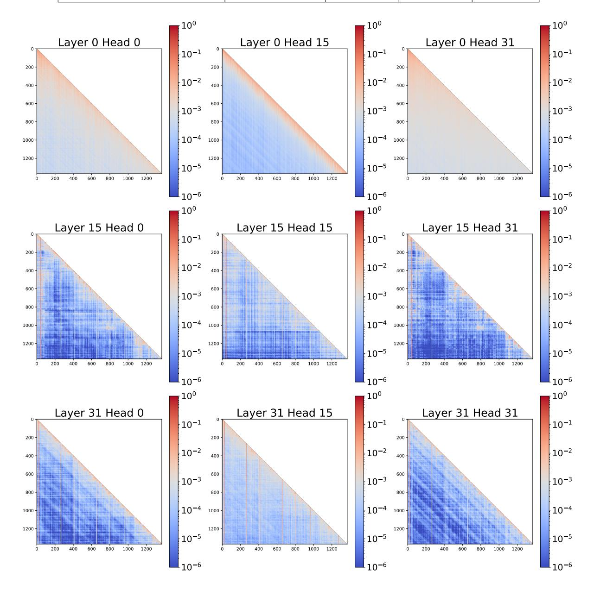
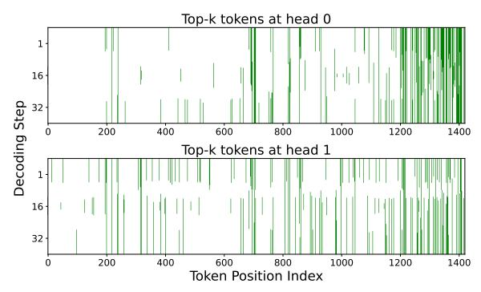
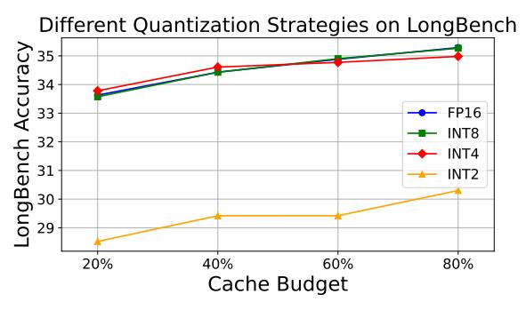
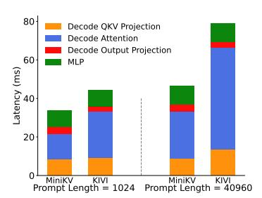
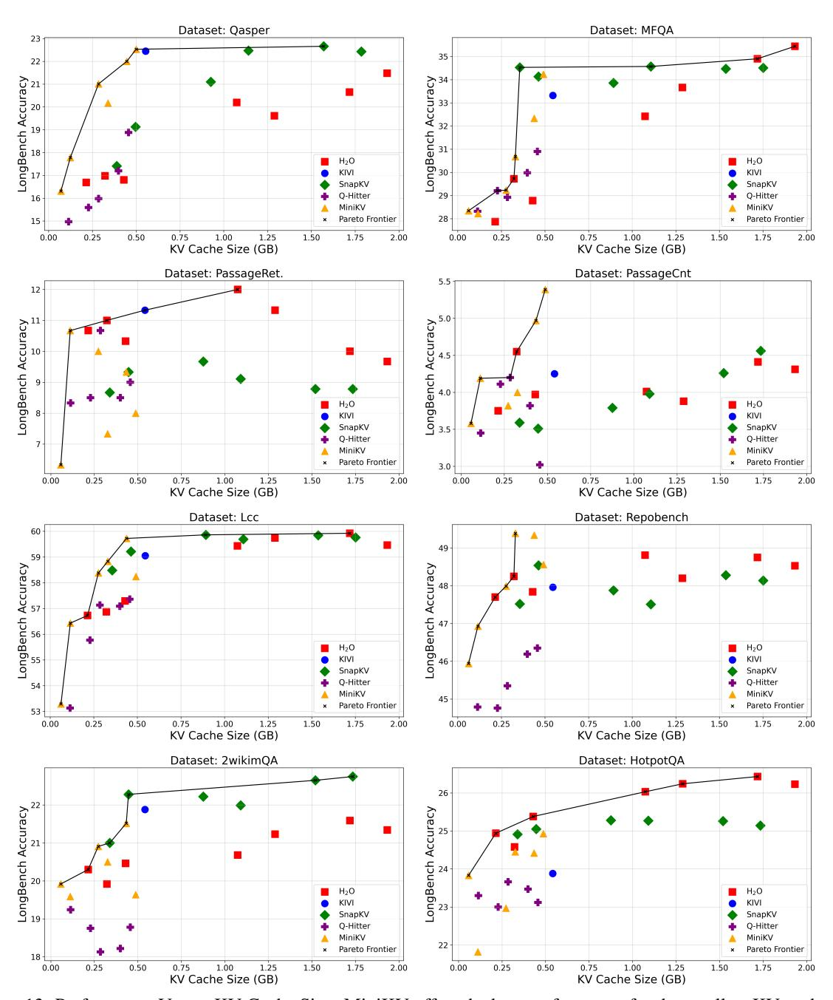
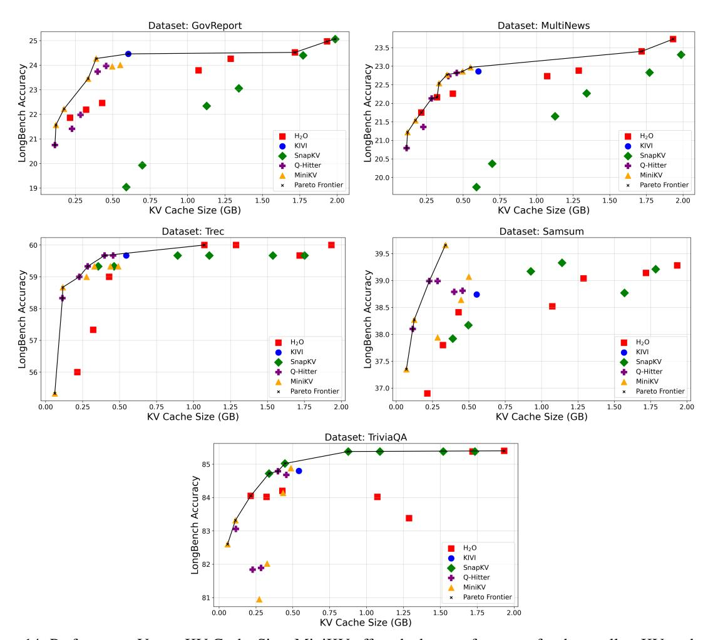

# F Token-Wise Quantization Of The KV Cache

A prevalent approach to compress the KV cache is by quantization. However, directly applying quantization to selective KV imposes challenges. Prior studies find that KV states contain outliers (Liu et al., 2023a; Xiao et al., 2023a), and per-token quantization is needed to avoid accuracy degradation. Fig. 12 shows that while applying INT8 and INT4 per-token quantization to both key and value caches helps maintain the accuracy of selective KV on LongBench, further reducing it to INT2 results in a significant accuracy drop, because 2-bits can not fully capture the dynamic range of KV token distributions. This motivates using channel-wise quantization as in KIVI (Liu et al., 2024b) and KVQuant (Hooper et al., 2024).

Table 5: Comparison with previous KV cache optimization methods for LLM inference.

| Approach                           | Eviction-based KV | Quantization | Training-free | LongBench |
|------------------------------------|-------------------|--------------|---------------|-----------|
| AttentionSink (Xiao et al., 2023b) | ✓                 |              | <b>✓</b>      |           |
| FastGen (Ge et al., 2023)          | ✓                 |              | ✓             |           |
| ScissorHands (Liu et al., 2023b)   | ✓                 | 4-bit        | ✓             |           |
| H2O (Zhang et al., 2023)           | ✓                 | 4-bit        | ✓             |           |
| FlexGen (Sheng et al., 2023)       |                   | 4-bit        | <b>√</b>      |           |
| LLM-QAT (Liu et al., 2023a)        |                   | 4-bit        |               |           |
| Q-Hitter (Zhang et al., 2024b)     | <b>✓</b>          | 4-bit        | <b>✓</b>      |           |
| KVQuant (Hooper et al., 2024)      |                   | 4-bit        | ✓             | <b>✓</b>  |
| KIVI (Liu et al., 2024b)           |                   | 2-bit        | <b>√</b>      | <b>✓</b>  |
| MiniKV                             | ✓                 | 2-bit        | <b>√</b>      | <b>✓</b>  |

> **[图片提取文字 (无描述)]:**
> ·100 100 100 Layer 0 Head 0 Layer 0 Head 15 Layer 0 Head 31 10-1 10-1 10-1 200 200 200 10-2 10-2  $10^{-2}$ 400 600 600 600 10-3 10-3  $10^{-3}$ 10-4 1000 10-4 1000 10-4 1000 1200 1200 1200 10-5 10-5 10-5 1000 1200 1000 400 800 1000 1200 200 400 600 800 200 400 600 800 1200 600 10-6 10-6 10-6 ·100 100 10° Layer 15 Head 0 Layer 15 Head 15 Layer 15 Head 31 10-1  $10^{-1}$  $10^{-1}$ 200 200 200 -10-2 10-2  $10^{-2}$ 400 400 10-3 10-3 10-3 800 10-4 1000 10-4 1000  $10^{-4}$ 1000 1200 1200 10-5 10-5  $10^{-5}$ 1000 1000 800 1000 10-6 10-6 10-6 100 100  $10^{0}$ Layer 31 Head 0 Layer 31 Head 15 Layer 31 Head 31 10-1 10-1  $10^{-1}$ 200 200 200 10-2 10-2 10-2 400 400 600 10-3 10-3  $10^{-3}$ 800 10-4 1000 10-4 1000 10-4 1000 1200 10-5 10-5 10-5 -10-6 10-6  $10^{-6}$

Figure 10: The attention distribution of LLaMA2-7B over the HotpotQA dataset in LongBench.

#### **G** Dataset Details

We seek a dataset that covers a broad range of long-context understanding tasks. For this reason, we choose LongBench, which covers six major

task categories and in total 13 datasets (Bai et al., 2023): Qasper(F1) and MultiFieldQA(F1) are single doc QA tasks; Passage Retrieval(accuracy) and passage count(accuracy) are synthetic datasets to

> **[图片提取文字 (无描述)]:**
> Top-k tokens at head 0 Decoding Step Top-k tokens at head 1 Token Position Index

Figure 11: Top-k tokens with the highest cumulative attention score on the Lcc dataset from LongBench. Green tokens mark the heavy hitters retained by the  $\rm H_2O$  algorithm. Here, we choose k=150.

> **[图片提取文字 (无描述)]:**
> Different Quantization Strategies on LongBench LongBench Accuracy FP16 INT8 INT4 INT2 20% 40% 60% 80% Cache Budget

Figure 12: Performance of per-token quantized  $\rm H_2O$  on the LongBench dataset. INT8/4 quantization can maintain performance across cache budgets. However, INT2 quantization suffers from a catastrophic drop in performance.

test the model's tendency to forgot information over a long context understanding; LCC(similarity) and RepoBench-P(similarity) are code completion tasks; 2WikiMultihopQA(F1) and HotpotQA(F1) are multi doc QA tasks; GovReport(Rouge) and MultiNews(Rouge) are summarization tasks; TREC(accuracy), SAMSum(Rouge) and TriviaQA(F1) are few-shot learning tasks.

#### **H** Evaluation Details

**Decoding Strategy** All models generate responses using deterministic greedy decoding across all tasks to ensure a fair comparison and reproducibility.

**LongBench Truncation Strategy:** we ensure that the model consistently selects the first 2000 and last 2000 tokens, regardless of changes to truncation settings or special tokens. This ensures stable score calculations across tests.

**Pyramid-like Allocation Details** Inspired by PyramidKV(Cai et al., 2024), we adjust the heavy hitter cache budget across layers by allocating more

cache in lower layers and less in higher ones. The token allocation across layers follows a linear function. Specifically, considering the average heavy budget size is x, we choose a hyper-parameter pyramid depth d to adjust the ratio. The bottom-most layer has a heavy budget size of x/d, and the topmost layer has a heavy budget size of 2x-x/d with intermediate layers linearly interpolated between these values. We choose pyramid depth d=7 for our experiments.

#### I KV Cache Compression Ratio Analysis

Given a model with (H) layers, hidden dimension (d), number of attention heads  $(n_{heads})$ , and a prompt and generated sequence of length  $(l_{\text{prompt}}, l_{\text{gen}})$  the KV cache size for different techniques is shown below:

- 1. **Full model**: All tokens are stored in FP16 format. Therefore the KV cache has size =  $2 \times (H \times d) \times (l_{\text{prompt}} + l_{\text{gen}}) \times 2$  bytes.
- 2. **H**2**O**: Given a cache budget of  $(\alpha_{HH}, \alpha_{RW})$  for the heavy hitters and recent window the KV cache has size  $= 2 \times (H \times d) \times (l_{\text{prompt}}) \times (\alpha_{HH} + \alpha_{RW}) \times 2$  bytes
- 3. **SnapKV**: Given a cache budget of p, SnapKV performs eviction in the prefill phase and retains all generated tokens. Hence, the KV cache has size  $= 2 \times (H \times d) \times (p*l_p+l_g) \times 2$  bytes
- 4. KIVI: With a group size of 16, i.e., 16 scalars quantized from FP16 to INT2 format, the memory required by a group is 16 scalars ×2 bits = 4 bytes. The quantization zeropoint and scale are saved in FP16 format and require 2 × 2 bytes. In total, the group requires 8 bytes. Hence, the KV cache has (H × d) × (lprompt + lgen) bytes.
- 5. **Q-Hitter**: The Q-hitter paper performs INT4 token quantization per attention head. Therefore, the  $(d/n_{heads})$  scalars which would be stored in FP16 are now stored in 4-bit precision. The quantization metadata is the zero-point and scale, both in FP16 precision. Therefore, the compression factor for Q-Hitter is  $(d/n_{heads}*16)/(d/n_{heads}*4+2*16)$ . For the Llama-7B-chat model this number is  $(4096/32*16)/(4096/32*4+32) = 3.76\times$ . Hence, the KV cache size is  $2\times(H\times d)\times(l_{prompt})\times(\alpha_{HH}+\alpha_{RW})\times2/3.76$  bytes
- 6. **MiniKV**: The prompt tokens are evicted with a cache budget of  $\alpha_{HH}$ ,  $\alpha_{RW}$  and all generations.

ated tokens are retained. All tokens are stored in 2-bit precision. Similar to KIVI, each group of 16 scalars and their quantization metadata requires 8 bytes in total. Hence, the size of the KV cache is =  $(H \times d) \times (\alpha_{HH} + \alpha_{RW}) \times (l_{prompt}) + (H \times d) \times (l_{gen})$  bytes.

Given a certain prompt and output length, the uncompressed baseline and KIVI have a fixed KV cache size. However,  $H_2O$ , Q-Hitter, and MiniKV can tune the cache budget  $(\alpha_{HH}, \alpha_{RW})$  to modify the KV cache size.

For prompt length 4096 and generation length 512 the full model's and MiniKV's KV cache consume 2.4GB and 0.33GB respectively. Therefore, MiniKV leads to an (1-0.33/2.4)=86% reduction in KV cache size.

#### J Performance against KV cache size

As discussed in § I, the KV cache size depends on the prompt and generation length. Each dataset in LongBench has a different maximum generation length, therefore we make separate plots for each dataset with prompt length 4096 and the generation length as the dataset-specific maximum generation length. Figure 13 and 14 show the performance vs KV cache size curve. MiniKV achieves the optimal compression strategy across all six major task categories on LongBench (single/multi-doc QA, LC understanding, code completion, summarization, and few-shot learning). These results validate the effectiveness of MiniKV with varying KV cache sizes.

#### K End-To-End Latency Breakdown

> **[图片提取文字 (无描述)]:**
> 80 Decode QKV Projection Decode Attention Decode Output Projection 60 MLP Latency (ms) 20 MiniKV KIVI Prompt Length = 1024 MiniKV KIVI Prompt Length = 40960 MiniKV

Figure 15: Per token latency breakdown for the decoding phase. Generation length = 1024 and batch size = 1.

We analyze the breakdown of latency associated with each computation in the standard decoder layer of the transformer architecture for MiniKV and KIVI during the decoding phase. We particularly look at latencies for projections of the input vector into query, key, and value vectors, attention computation, and output projection. We also mea-

sure the time spent in the MLP layer. We present the latency breakdown as the total latency for each computation component divided by the generation length.

As shown in Fig. 15, MiniKV achieves a lower end-to-end latency than KIVI. This improvement primarily arises during attention computation as well as projection of Query, Key and Value. Specifically, the inference time is dominated by KV cache loading time when processing long contexts. Therefore, MiniKV's smaller KV cache results in reduced KV load times from the GPU's HBM.

> **[图片提取文字 (无描述)]:**
> Dataset: Qasper Dataset: MFQA 23 35 22 LongBench Accuracy LongBench Accuracy H₂O KIVI H₂O KIVI SnapKV SnapKV Q-Hitter 29 Q-Hitter 16 MiniKV MiniKV Pareto Frontier 28 Pareto Frontier 15 0.75 1.00 1.25 KV Cache Size (GB) 0.75 1.00 1.25 KV Cache Size (GB) 0.00 0.25 0.50 1.50 1.75 2.00 0.00 0.25 0.50 1.50 1.75 2.00 Dataset: PassageRet. Dataset: PassageCnt 5.5 12 LongBench Accuracy LongBench Accuracy H₂O KIVI H₂O KIVI SnapKV SnapKV Q-Hitter Q-Hitter MiniKV MiniKV Pareto Frontier Pareto Frontier 3.0 0.75 1.00 1.25 KV Cache Size (GB) 0.75 1.00 1.25 KV Cache Size (GB) 0.00 0.25 0.50 1.50 1.75 2.00 0.00 0.25 0.50 1.50 1.75 2.00 Dataset: Repobench Dataset: Lcc 60 49 59 LongBench Accuracy LongBench Accuracy 48 H₂O KIVI H₂O KIVI SnapKV SnapKV Q-Hitter Q-Hitter 54 MiniKV MiniKV 45 Pareto Frontier Pareto Frontier 53 0.75 1.00 1.25 KV Cache Size (GB) 0.75 1.00 1.25 KV Cache Size (GB) 0.00 0.25 0.50 1.50 1.75 2.00 0.00 0.25 0.50 1.50 1.75 2.00 Dataset: 2wikimQA Dataset: HotpotQA 26 LongBench Accuracy LongBench Accuracy H₂O KIVI  $H_2O$ KIVI SnapKV SnapKV Q-Hitter Q-Hitter MiniKV MiniKV 22 Pareto Frontier Pareto Frontier 18 0.75 1.00 1.25 KV Cache Size (GB) 0.75 1.00 1.25 KV Cache Size (GB) 0.50 1.50 1.75 1.75 0.00 0.25 2.00 0.00 0.25 0.50 1.50 2.00

Figure 13: Performance Versus KV Cache Size: MiniKV offers the best performance for the smallest KV cache size across all 6 task categories.

> **[图片提取文字 (无描述)]:**
> Dataset: GovReport Dataset: MultiNews 25 23.5 LongBench Accuracy Control Property Accuracy Property Property Property Property Property Property Property Property Property Property Property Property Property Property Property Property Property Property Property Property Property Property Property Property Property Property Property Property Property Property Property Property Property Property Property Property Property Property Property Property Property Property Property Property Property Property Property Property Property Property Property Property Property Property Property Property Property Property Property Property Property Property Property Property Property Property Property Property Property Property Property Property Property Property Property Property Property Property Property Property Property Property Property Property Property Property Property Property Property Property Property Property Property Property Property Property Property Property Property Property Property Property Property Property Property Property Property Property Property Property Property Property Property Property Property Property Property Property Property Property Property Property Property Property Property Property Property Property Property Property Property Property Property Property Property Property Property Property Property Property Property Property Property Property Property Property Property Property Property Property Property Property Property Property Property Property Property Property Property Property Property Property Property Property Property Property Property Property Property Property Property Property Property Property Property Property Property Property Property Property Property Property Property Property Property Property Property Property Property Property Property Property Property Property Property Property Property Property Property Property Property Property Property Property Property Property Property Property Property Property Property Property Property Property Property Property Property Property Property Property Property Property Property Property Prop  $H_2O$  $H_2O$ KIVI KIVI SnapKV SnapKV Q-Hitter Q-Hitter MiniKV MiniKV 20.0 Pareto Frontier Pareto Frontier 19 .75 1.00 1.25 KV Cache Size (GB) .75 1.00 1.25 KV Cache Size (GB) 0.75 2.00 0.25 0.50 1.50 1.75 0.25 0.50 0.75 1.50 1.75 2.00 Dataset: Trec Dataset: Samsum 60 39.5 LongBench Accuracy LongBench Accuracy 8.88 9.88 9.88 9.88 H2O KIVI  $H_2O$ KIVI SnapKV SnapKV Q-Hitter 56 Q-Hitter MiniKV MiniKV 37.0 Pareto Frontier Pareto Frontier 1.00 0.25 0.75 1.00 1.75 0.50 0.75 1.25 1.75 2.00 0.00 0.50 1.25 0.00 0.25 1.50 1.50 2.00 KV Cache Size (GB) KV Cache Size (GB) Dataset: TriviaQA 85 LongBench Accuracy  $H_2O$ KIVI SnapKV Q-Hitter MiniKV Pareto Frontier 81 1.00 0.25 0.50 0.75 0.00 1.25 1.50 1.75 2.00 KV Cache Size (GB)

Figure 14: Performance Versus KV Cache Size: MiniKV offers the best performance for the smallest KV cache size across all 6 task categories.