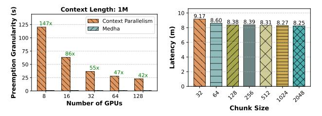
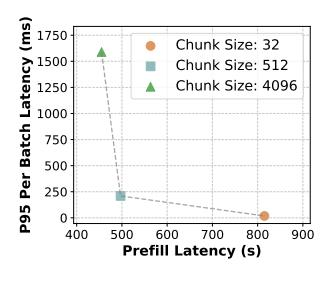
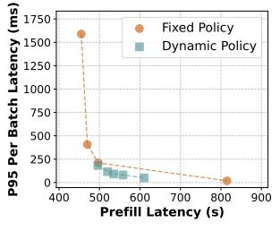

# 2.5 The Convoy Effect from Extreme Workload Heterogeneity

The key challenge in serving long-context models stems from the extreme workload heterogeneity created by the quadratic complexity of self-attention. Because the required FLOPs for the attention mechanism scale with the square of the sequence length  $(N^2)$ , the difference in processing time between requests grows superlinearly. For instance, a 100K-token request is not  $100\times$  but roughly  $10,000\times$  more computationally expensive than a 1K-token request. This extreme heterogeneity, lead to a classic systems challenge known as the *convoy effect* [10, 37]. When the system processes a long prefill, all subsequent short requests behind it in the queue are stalled. As shown in Figure 1a, this leads to a complete collapse in system performance, increasing median TTFT by  $30\times$  and tail latency by  $174\times$  with just 5% long requests in the workload.

**Takeaway:** The quadratic cost of attention creates extreme workload heterogeneity, leading to the **convoy effect**, where long requests block short ones.

### 2.6 The Path to Preemption: Fine-Grained Chunking

The convoy effect is a widely studied problem in operating systems — resolving this issue requires a shift from non-preemptive to preemptive scheduling [10, 37]. To apply this principle to LLM serving, the long, atomic prefill operation must be broken down into smaller, interruptible units of work. Chunking the input prompt [6] achieves exactly this, creating scheduling opportunities to interleave short requests with long ones.

However, naive chunking is widely considered impractical for long contexts due to three prohibitive systems challenges, which this paper systematically resolves:

**KV-Cache Read Amplification.** In a standard, non-chunked prefill, the KV cache is read once. With chunking, however, the processing of each subsequent chunk requires re-reading

> **[图片提取文字 (无描述)]:**
> Context Length: 1M 10 9.17 Context Parallelism 8.60 8.38 8.39 8.31 Medha 100 atency 75 86x Preemption 50 55x 16 64 128 Number of GPUs Chunk Size

(a) Preemption granularity enabled (b) Self-Attention computation time on 1M token sequences prefill with with chunked prefill for 1M tokens Llama-3 8B. with Llama-3 70B using 8 H100s.

**Figure 3.** Efficacy of chunked prefill for long-context inference.

the entire KV cache generated by all previous chunks from GPU memory. This transforms the memory access pattern from being linear with the sequence length to being quadratic. Because memory bandwidth is a critical and often limited resource, this quadratic increase in data movement has led to the widespread belief that chunking is fundamentally inefficient and unscalable for long-context serving [7, 49].

Latency Interference. Piggybacking prefill chunks [6] onto decode batches is a standard technique to improve GPU utilization and reduce tail latency by co-executing compute-bound prefill operations with memory-bound decode operations. However, with long contexts, the compute cost of successive prefill chunks grows quadratically as the context lengthens. Late-stage chunks become so computationally intensive that they stall latency-sensitive decodes, making it infeasible to batch prefill chunks with latency-sensitive decodes — for instance, computing the a prefill chunk for a 1M context request with Llama-3 8B on 8 H100s using chunk size of 512 results in decode latency of ~ 250ms, almost an order of magnitude higher the typical production SLOs.

Lack of a Preemption-Friendly Scaling Strategy. Adopting chunking means abandoning the only proven technique for scaling prefill latency – context parallelism. While CP operates by splitting the sequence in a special dimension across different devices, chunked prefill unrolls the prefill computation in a temporal dimension by processing each prefill chunk sequentially. There is no trivial solution to combine the two approaches. The conventional alternatives are insufficient for serving long contexts. This creates the need for entirely new parallelism strategies designed to be both scalable and preemptive.

### 3 Enabling Efficient Preemptable Prefills

To enable preemptive execution using chunked prefills we need to overcome three perceived barriers: the belief that chunking causes prohibitive KV-cache read amplification, concerns about latency interference between chunked operations, and the lack of preemption-friendly parallelism strategies. In this section, we present the insights that allow Medha to systematically address these challenges.

Table 1. Definitions of notations in equations.

| Notation          | Definition                                              |
|-------------------|---------------------------------------------------------|
| n                 | number of tokens                                        |
| $h_q$ or $h_{kv}$ | number of query or key-value heads                      |
| d                 | attention head dimension                                |
| $p_{j}$           | parallelism degree for strategy j. e.g. $p_{tp}$ for TP |
| Ĭ                 | arithmetic intensity                                    |
| c                 | chunk size                                              |

## 3.1 Debunking KV-Cache Read Amplification Inefficiency Myth

Conventional wisdom maintains that chunked attention is inherently inefficient due to KV-cache read amplification—the repeated reading of cached keys and values across chunks. We analyze the attention computation from first principles and demonstrate this assumption is incorrect for modern model architectures.

**Arithmetic Intensity Analysis.** Modern GPU architectures feature independent compute and memory subsystems that operate concurrently in a pipelined fashion. Performance is determined by whichever subsystem becomes saturated first. When the compute subsystem is fully utilized, additional memory operations execute in parallel "for free" without impacting the device throughput.

The key metric determining this behavior is arithmetic intensity—the ratio of compute operations to memory accesses. High arithmetic intensity indicates sufficient computation per byte of data to keep compute units busy while memory transfers complete in parallel. For chunked attention, this relationship is governed by:

$$I_{cp}^{i}(n,c) \simeq \frac{4ic^{2}dh_{q}}{4icdh_{kv}} = c\frac{h_{q}}{h_{kv}}$$
 (1)

The critical insight is that arithmetic intensity for chunked attention depends solely on chunk size, not total context length. Each chunk processes c tokens, requiring reads of the full KV cache but performing a fixed number of operations per token. Furthermore, contemporary LLMs employ Grouped-Query Attention architectures where multiple query heads share KV heads (e.g.,  $8 \times$  in Llama-3 70B), resulting in high arithmetic intensity such that even small chunks can saturate GPU compute.

Empirical Validation. On H100 GPUs running Llama-3 70B, chunks of just 40 tokens can saturate GPU compute. We find that for 1M-token contexts, 32-token chunks incur merely 11% overhead relative to 2048-token chunks as shown in Figure 3b. Note that, unlike older attention implementations used prior analysis [7] — where the chunked prefill was shown to be inefficient for long contexts — modern attention kernels like FlashInfer and FlashAttention-2 [13, 46] parallelize over both query and KV dimensions, which helps in materializing the theoretical performance potential of the chunked prefill.

> **[图片提取文字 (无描述)]:**
> Chunk Size: 32 1250 1000 Chunk Size: 512 Chunk Size: 4096 Per Batch P95 Prefill Latency (s)

> **[图片提取文字 (无描述)]:**
> **E** 1750 Fixed Policy 1250 1000 Dynamic Policy Per Batch Prefill Latency (s)

- (a) Static chunk sizes.
- (b) Adaptive chunk size.

**Figure 4.** Pareto frontiers of prefill/decode latencies in mixed batching with chunked prefills: (a) Static sizes have a trade-off between prefill and decode latencies. (b) Adaptive chunking starts with larger chunks, gradually reducing size to keep batch latencies consistent, achieving better prefill efficiency and low decode latency.

### 3.2 Managing Interference with Adaptive Chunking

Having established that chunking is computationally efficient, we now address the prefill-decode latency interference in mixed batches.

The Throughput-Latency Tradeoff of Chunking. Chunked prefills face a fundamental throughput-latency tradeoff. To maximize system throughput, a scheduler must use large chunks to process prefills efficiently; however, to guarantee low decode latency for co-batched requests, it must use small chunks. This tradeoff would be trivially resolved if we could execute small chunks with minimal overhead. As shown in section 3.1, even chunks as small as 40 tokens are enough to saturate attention computation — however, the challenge arises because different operations show varying performance characteristics. The MLP component has a significantly lower arithmetic intensity than attention -c as opposed to  $c \frac{h_q}{h_{kv}}$  for attention, and is thus more sensitive to chunk size. Moreover, there are fixed per-chunk overheads like kernel launches that are not amortized by chunking. As shown in Figure 4a, this conflict forces an undesirable choice between high throughput and low decode latency.

