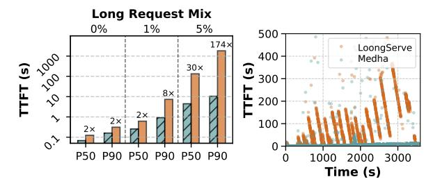

# No Request Left Behind: Tackling Heterogeneity in Long-Context LLM Inference with Medha

Amey Agrawal $^2$  Haoran Qiu $^1$  Junda Chen $^3$ Íñigo Goiri $^1$  Chaojie Zhang $^1$  Rayyan Shahid $^2$  Ramchandran Ramjee $^1$  Alexey Tumanov $^2$  Esha Choukse $^1$ 

1Microsoft 2Georgia Institute of Technology 3UC San Diego

### **Abstract**

Deploying million-token Large Language Models (LLMs) is challenging because production workloads are highly heterogeneous, mixing short queries and long documents. This heterogeneity, combined with the quadratic complexity of attention, creates severe convoy effects where long-running requests stall short, interactive ones, degrading system responsiveness. We present Medha, a serving system that eliminates these convoys by introducing fine-grained, preemptive scheduling to LLM inference.

Medha makes preemption practical with a co-designed set of mechanisms – including *Adaptive Chunking* and *Stream Pipeline Parallel*— that overcome the perceived inefficiencies and scaling challenges of chunking. Additionally, we present a new parallelism strategy *KV-Cache Parallelism* to reduce the decode latency and afford interactivity despite very long context. These mechanisms are orchestrated by a *Length-Aware Relative Slack (LARS)* scheduler, a deadlineand heterogeneity-aware scheduling policy that prevents both the convoy effect and the starvation that plagues simpler policies. Under a heterogeneous workload, Medha improves throughput by 5.7× while reducing median and 99th-percentile latency by 30× and 174×, respectively, compared to state-of-the-art non-preemptive systems.

### 1 Introduction

Large language models with million-token context windows are transforming how we interact with information – enabling large-scale document analysis, multi-hour video understanding [16, 24, 44], and autonomous coding agents [9, 17]. However, deploying these models in production poses a significant challenge: real-world workloads combine both long and short requests. A single service must handle everything from 100-token chat messages to 10M-token document processing, often from the same users within the same session.

**Motivation.** This mix of request lengths to the same model instance creates extreme computational heterogeneity due to the quadratic complexity of self-attention [40]. A 100K-token request is not  $100\times$  but approximately  $10,000\times$  more computationally expensive than a 1K-token request. When these requests share the same serving infrastructure, we run into severe performance degradation due to: the *convoy effect* [10, 37], where long-running requests block shorter

> **[图片提取文字 (无描述)]:**
> Long Request Mix 0% 1% 5% 500 174× LoongServe TFT (s) 400 Medha · 🖲 300-30× 8× 200 2x 2x 100 -P50 P90 P50 P90 P50 P90 2000 3000 Time (s)

(a) TTFT distribution where state-(b) TTFT over time showing severe of-the-art baseline shows 30-174× convoy effect for LoongServe where higher latency due to lack of preemp-short requests get stuck behind long tive scheduling.

**Figure 1.** Impact of long-context requests on TTFT for Llama-3 8B inference using 16 A100 GPUs with LoongServe [42] and Medha at 0.75 OPS.

ones, resulting in poor system responsiveness. As shown in Figure 1, even with just 5% long requests in the workload, state-of-the-art systems like LoongServe [42] experience  $30\times$  median latency increases and  $174\times$  tail latency degradation for short requests.

Context Parallelism (CP) [11, 22] has made it possible to distribute long-context processing across hundreds of GPUs, enabling effective training for long-context models. LoongServe [42] and Yang et al. [45] adapted these techniques for inference by introducing elasticity to context parallelism, dynamically adjusting the degree of parallelism based on request length to improve resource efficiency. However, these approaches fundamentally lack preemptability - once a long request begins processing, it cannot be interrupted until completion. This non-preemptive execution model inevitably results in convoy effects in heterogeneous workloads. Figure 1b demonstrates this problem empirically: LoongServe exhibits severe latency spikes lasting for 100s of seconds whenever long requests block the system. These spikes occur because arriving short requests must wait for the entire prefill computation of the long request to complete which can take several minutes.

The convoy effect is a well-studied problem in operating systems with a known solution: preemptive scheduling. Chunked prefills [6] provide a natural mechanism for preemptable prefill computation. However, applying preemption to LLM inference faces three barriers that have discouraged its adoption. First, chunking long prefills are considered

1

> **[图片提取文字 (无描述)]:**
> Timeline B arrives C arrives Prefills for B, C stalled Non-Preemptive Schedules ... Long Request A В C LoongServe, vLLM, Sarathi, etc. TTFT with convoy effect A is preempted to unblock smaller requests No stalls Preemptive Schedule В C ... Α, Medha TTFT with peremption

**Figure 2.** Impact of preemption on convoy effect. Non-preemptive scheduling (top) blocks short requests B and C behind long request A, causing deadline violations. Preemptive scheduling (bottom) interleaves execution through chunking, eliminating convoy effect while maintaining throughput.

inefficient due to *repeated KV-cache reads*. Second, batching decodes requests with chunked prefills for long requests results in *high decode latency* that degrades user experience. Finally, existing context parallelism techniques for long-context inference are *fundamentally incompatible* with chunked execution.

Our work. Medha makes preemptive long-context inference practical by systematically addressing each barrier. We demonstrate that KV-cache read amplification is a non-issue for modern architectures – chunks as small as 40 tokens achieve near-optimal efficiency due to high arithmetic intensity in grouped-query attention. We introduce *adaptive chunking*, which dynamically adjusts chunk sizes as the computational bottleneck shifts from MLP to attention operations, maintaining both high throughput and predictable latency. We develop two parallelism strategies compatible with preemption: *Stream Pipeline Parallelism (SPP)* accelerates prefills by pipelining chunks across stages, while *KV-Cache Parallelism (KVP)* bounds decode latency by distributing attention computation.

To effectively leverage the preemptable prefills, we introduce Length-Aware Relative Slack (LARS), a deadline-aware scheduling policy designed to explicitly tackle the heterogeneous nature of long-context inference. Unlike traditional policies that either cause convoy effects (First Come First Serve - FCFS) or starvation (Earliest Deadline First - EDF, Least Remaining Slack - LRS), LARS ensures both short and long requests meet their deadlines by pushing completions toward their SLO boundaries – maximizing schedule robustness against unpredictable arrivals. Furthermore, we introduce a dynamic batch packing algorithm that creates batches that maximally utilize GPU compute by co-locating complementary prefill chunks and decode requests while respecting strict time budgets.

Medha unifies these techniques in a unified serving system that scales to multi-million token requests while maintaining high throughput and low latency. In summary, we make the following contributions in this paper:

- We identify and quantify the convoy effect in long-context inference arising due to request-length heterogeneity in current non-preemptive systems.
- We make chunked prefills viable for preemptive longcontext inference by systematically addressing their perceived inefficiencies: introducing adaptive chunking to balance throughput and latency, and developing Stream Pipeline Parallelism (SPP) and KV-Cache Parallelism (KVP) as preemption-compatible parallelism strategies.
- We propose Length-Aware Relative Slack (LARS), a scheduling policy that prevents convoy effects and starvation by accounting for workload heterogeneity and user SLOs.
- We implement Medha with optimized kernels and scheduler design, demonstrating 5.7× higher throughput and up to 174× lower tail latency than state-of-the-art non-preemptive systems on real long-context workloads.

### 2 Motivation: The Case for Preemptive Long Context LLM Inference

In this section, we analyze how million-token LLM inferences create extreme computational heterogeneity due to quadratic attention complexity, causing convoy effects where long requests block shorter ones, motivating our preemptive inference approach.

### 2.1 Background: LLM Inference Characteristics

Auto-regressive LLM inference comprises two fundamentally different phases with distinct performance characteristics [7, 29, 49]. The **prefill phase** processes the entire prompt through a single forward pass to construct Key-Value (KV) cache and generate the first token. This phase is compute-bound, with performance measured by Time-to-First-Token (TTFT). The subsequent **decode phase** generates tokens autoregressively, one at a time, and is memory-bandwidth-bound. Its performance is measured by Time-Per-Output-Token (TPOT) or Time-Between-Tokens (TBT) [4].

Contemporary serving systems employ two primary parallelism strategies. **Tensor Parallelism (TP)** [36] partitions each model layer across multiple devices. This reduces perdevice memory requirements and can improve latency. However, TP requires high communication bandwidth, limiting it to single servers with fast interconnects like NVLink. **Pipeline Parallelism (PP)** [7, 18, 47] distributes complete layers sequentially across devices. While this reduces memory pressure per device and can improve throughput, it provides no latency benefit for individual requests due to its sequential execution model.

### 2.2 Context Length Scaling Limits of Conventional Parallelism Techniques

**Memory Constraint.** In the prefill phase, since all the input tokens are processed concurrently, the activation memory required for prefill computation increases linearly with the context length. While tensor parallelism can distribute this

load across devices, it cannot be scaled beyond a single node due to communication overhead.

Latency Constraints. The quadratic complexity of attention operation becomes a major challenge for interactive workloads as sequence length grows. For instance, to process 1M tokens with Llama-3 70B we require a total of 2.8 ExaFLOPs. On an H100 GPU, even at full utilization, this computation would require at least 48 minutes to execute. To perform this computation in a reasonable time, the attention computation needs to be parallelized across a large number of GPUs. However, neither tensor nor pipeline parallelism provides a viable solution. As discussed previously, TP does not scale beyond a single node (8 GPUs) due to communication overhead [7, 28], while PP can scale to a large number of GPUs, it does not provide any latency advantage.

*Takeaway:* Standard parallelization techniques like TP or PP fail at million-token contexts due to memory limits and quadratic attention costs that lead to high latency.

### 2.3 Long-Context System Scaling with Context Parallelism

To overcome the memory and latency limitations of conventional parallelism, Liu et al. introduced **Context Parallelism (CP)** [11, 22] for long-context *training*. In CP, the input sequence is partitioned across multiple GPUs to alleviate activation memory pressure. By overlapping KV block communication between GPUs with computation, CP enables efficient scaling to hundreds of devices. This approach has been widely adopted in long-context training systems.

However, context parallelism's design is fundamentally misaligned with the demands of inference serving. To achieve efficient overlap of communication and computation in CP, each GPU must process a sufficiently large sequence partition (e.g., 24.5K tokens on A100 with InfiniBand [22]). This creates a critical latency-throughput tradeoff — a system configured with high parallelism degrees for low-latency serving of long context requests suffers from severe underutilization when serving short requests. Conversely, a system configured for short requests cannot achieve acceptable latency for long ones.

### 2.4 Adapting Context Parallelism for Inference

To address the rigid resource allocation in CP, the state-ofthe-art system LoongServe [42] adapts it for inference by introducing two key mechanisms. First, it proposes an elastic version of context parallelism, where the degree of parallelism is dynamically adjusted to match the workload — allocating more resources to accelerate long, compute-intensive prefills while using fewer for short requests, thereby improving efficiency. Second, because CP is ineffective for decode phases, the system must adopt the prefill-decode disaggregation paradigm [29, 49]. In this model, the prefill and decode phases are handled by separate, isolated groups of GPUs. After a request's prefill is complete, its KV cache is migrated from the prefill pool to a different group of GPUs dedicated to the less resource-intensive decode phase. Furthermore, since the relative prefill to decode load ratio in the system dynamically changes based on the input requests pattern [27], LoongServe adopts an elastic approach where the number of GPUs in the prefill/decode pool is dynamically adjusted to match the workload. This elastic, disaggregated architecture represents the current state-of-the-art approach for long-context inference — achieving 3-5× [42] lower latency than prior systems like vLLM [19], DistServe [49], and Sarathi-Serve [6].

