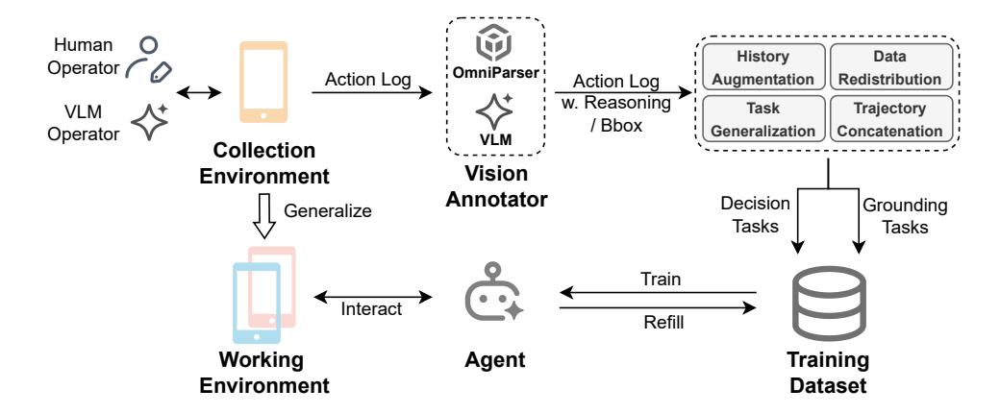

# 2.2 Agent Reasoning Reconstruction

The recorded trajectories only contain low-level information (e.g., raw coordinates or bounding boxes), lacking high-level semantics (e.g., task planning and environment observation) which is

> **[图片提取文字 (无描述)]:**
> Human History Data Operator / OmniParser Action Log Augmentation Redistribution Action Log w. Reasoning Task Trajectory VLM / Bbox Generalization Concatenation Operator VLM Collection Vision Environment Annotator Decision Grounding Generalize Tasks Tasks Train Interact Refill Working Agent Training Environment Dataset

Figure 1: Data Collection Pipeline with Agent Self-evolving

crucial for training intelligent and robust agent models. To address this issue, we propose a VLMbased reasoning reconstruction approach which leverages Gemini-2.5 to reconstruct the agent's reasoning process based on original trajectories.

Specifically, we prompt the VLM to examine each action in the trajectory and provide a detailed reasoning, simulating an agent who executes the task following the ReAct [\[29\]](#page-15-10) paradigm. Furthermore, for each concrete operation (e.g., click bbox), we also utilize the VLM to provide an action primitive (e.g., click search button) that abstractly describes this operation.

