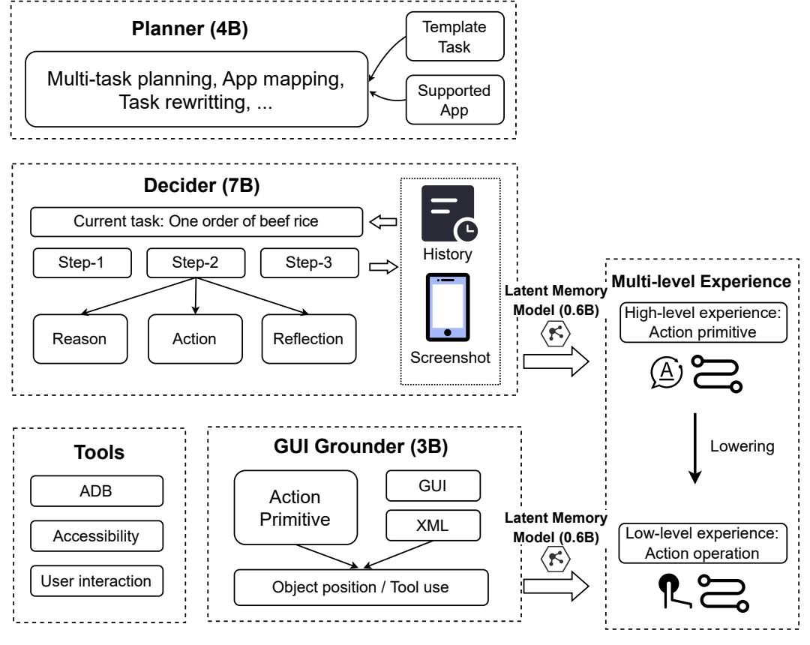

# 4 AgentRR: Record-Replay-based Agent Acceleration with Multi-level Experiences

In this section, we introduce a general-purpose agent acceleration framework: AgentRR, as well as our specific implementation in mobile scenario. AgentRR seamlessly supports any mobile agent models and applications without the need for additional development for specific tasks. Empirical evaluations show that ActTree enables GUI agents to achieve execution efficiency comparable to that of API agents, while preserving the generalization capability of GUI agents.

## 4.1 Multi-level Experiences

As shown in Figure [2,](#page-5-0) MobiAgent adopts a multi-agent architectural design, including a Planner (4B), a Decider (7B), and an Grounder (3B). The execution of a complete task requires the collaborative operation of these multiple models/agents. We record the output of each model as an experience, such that the outputs from different models form a multi-level experience hierarchy. The Grounder outputs concrete operation actions, such as the bounding box of the clicked object, representing the lowest-level experiences. The Decider outputs action primitives described in natural language. The Planner outputs the task plan, corresponding to high-level experiences. Lower-level experiences can be executed with higher efficiency, but typically offer weaker generalization, while higher-level experiences exhibit stronger generalization capabilities but are less efficient to execute (as they still require model inference).

To address this challenge, we propose a record-and-replay system specifically designed for agent frameworks. The core idea behind it is to efficiently determine which actions can be directly reused, without compromising the agent's generalization capabilities. This mechanism is analogous to human

> **[图片提取文字 (无描述)]:**
> Template Planner (4B) Task Multi-task planning, App mapping, Supported Task rewritting, ... App Decider (7B) Current task: One order of beef rice History Step-3 Step-1 Step-2 **Multi-level Experience** Latent Memory Model (0.6B) High-level experience: Action primitive Reason Action Reflection Screenshot GUI Grounder (3B) Lowering **Tools** GUI ADB Action Primitive Latent Memory **XML** Low-level experience: Accessibility Model (0.6B) Action operation User interaction Object position / Tool use

Figure 2: Multi-Agent Architecture using the AgentRR Framework

latent memory, enabling swift execution of familiar actions while preserving the flexibility required for new situations.

