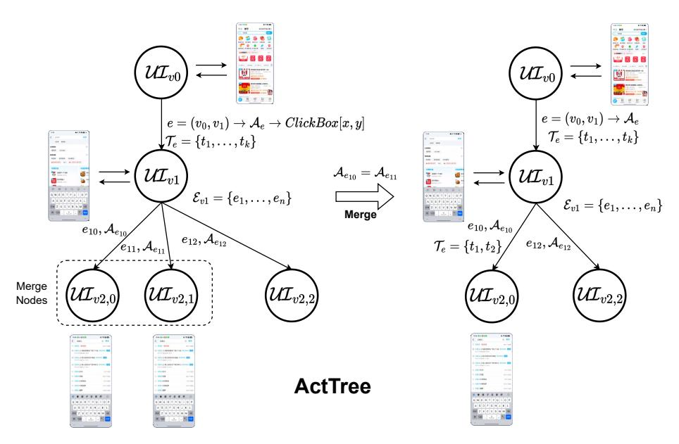

# 4.2 Prefix Reusablity of GUI tasks

We observe the prefix reusablity of GUI tasks, which relies on the following insights:

- I1: The execution trajectories of similar tasks share identical prefixes.
- I2: Since the agent's planning can be directly derived from task description, the length of shared trajectories (i.e., prefix actions) between two tasks can be predicted based on the similarity of their task descriptions.

According to I1, task trajectories can be cached using a tree structure, where similar tasks share the same path from the root node to their common ancestor node. According to I2, the agent can determine whether to reuse actions from historical tasks at the current step through simple and efficient semantic matching, thereby avoiding redundant model inference. By exploiting prefix reusability, we can efficiently records execution trajectories and attempts to replay cached actions for every execution step, thereby reducing the end-to-end task execution latency.

## 4.3 ActTree Structure

ActTree is a concrete implementation mechanism that accelerates mobile tasks by leveraging the principles of AgentRR. As shown in Figure [3](#page-6-0) ActTree maintains a tree-structured representation analogous to UI Transition Graphs. Each node v ∈ V in the tree corresponds to a unique UI state, denoted as UIu, and maintains a set of outgoing edges Eu = {e1, ..., en}. Each edge e = (u, v) ∈ E represents a state transition, which is characterized by: (1) an action Ae that triggers this transition;

> **[图片提取文字 (无描述)]:**
> $e=(v_0,v_1)\to \mathcal{A}_e$  $e = (v_0, v_1) \rightarrow \mathcal{A}_e \rightarrow ClickBox[x,y]$  $\mathcal{T}_e = \{t_1, \dots, t_k\}$  $\mathcal{T}_e = \{t_1, \dots, t_k\}$  $\mathcal{UI}_{v1}$  $\mathcal{A}_{e_{10}}=\mathcal{A}_{e_{11}}$  $\mathcal{UI}_{v1}$  $\mathcal{E}_{v1} = \{e_1, \dots, e_n\}$  $\mathcal{E}_{v1} = \{e_1, \ldots, e_n\}$ Merge  $e_{10}, \mathcal{A}_{e_{10}}$  $e_{10}, \mathcal{A}_{e_{10}}$  $e_{12},\mathcal{A}_{e_{12}}$  $e_{12},\mathcal{A}_{e_{12}}$  $\mathcal{T}_e = \{t_1, t_2\}$ Merge  $\mathcal{UI}_{v2,0}$  $\mathcal{UI}_{v2,0}$  $\mathcal{UI}_{v2,1}$  $\mathcal{UI}_{v2,2}$  $\mathcal{UI}_{v2,2}$ Nodes **ActTree**

Figure 3: Construction of the ActTree Structure During Mobile Task Execution

and (2) a task list  $\mathcal{T}_e = \{t_1, ..., t_k\}$ , which records all historical tasks that executed action  $\mathcal{A}_e$  to transition from  $\mathcal{U}\mathcal{I}_u$  to  $\mathcal{U}\mathcal{I}_v$ .

The construction of the ActTree proceeds incrementally during the task executions. When a new action is performed, we first create a new node v to represent the resulting UI state:  $\mathcal{UI}_v$ , along with a corresponding edge  $e_{\text{new}} = (u,v)$  annotated with the executed action  $\mathcal{A}_{e_{\text{new}}}$  and the current task description  $t_{\text{new}}$ . To maintain the compactness of the ActTree, the system compacts the set of outgoing edges  $\mathcal{E}_u = \{e_1, \dots, e_n\}$  from node u. For example, if there exists an edge  $e_{\text{old}} \in \mathcal{E}_u$  whose action  $\mathcal{A}_{e_{\text{old}}}$  matches the new action  $\mathcal{A}_{e_{\text{new}}}$ , the system merges these two edges. The merge operation combines the task lists of the two edges by updating  $\mathcal{T}_{e_{\text{merge}}} \leftarrow \mathcal{T}_{e_{\text{old}}} \cup \{t_{\text{new}}\}$ , while leaving the remaining edge structure unchanged.

To support more complex agent scenarios, such as recursive task invocation and collaboration among multiple applications, we further extend the ActTree structure to allow certain backtracking edges. For example, edges from child nodes back to parent nodes enable the agent to return to the parent's UI state when an erroneous action is executed or when recursive tasks are invoked. Additionally, we also introduce cross-subtree edges with the additional transferred message to facilitate coordination across multiple tasks.

In addition to ActTree itself, we incorporate a **Tracer** component that is bound to ActTree to monitor task execution. During the execution of a new task, Tracer advances to a new node along with each UI transition. At each step, if Tracer identifies an existing outgoing edge e whose action  $A_e$  can be reused for the current task (i.e., a cache hit), it replays  $A_e$  without invoking the agent model. Otherwise, the Tracer invokes the agent model to generate the next action.

## 4.4 Latent Memory Models

When using AgentRR framework to accelerate agent execution, a key challenge is determining how many prefix actions can be reused. To address this, we propose the "Latent Memory" model, which efficiently computes the similarity between two tasks and thereby determines the extent to which prefix actions can be reused. Specifically, the "Latent Memory" model is implemented in the form of the task embedding and task reranking models. These models typically have significantly fewer parameters than the planner or decider, resulting in lower response latency.

#### 4.4.1 Task Embedding

The task embedding model is responsible for computing the similarity between two tasks, which is measured as the cosine similarity between their respective embedding vectors. Below, we provide the formal representation of the embedding at a specific layer of the ActTree for a given task.

$$v_i^{(l)} = f(T_i, l) \in \mathbb{R}^d$$
.

#### Where:

- $T_i$  represents the *i*-th task.
- f is an **instruction-aware task embedding model**, and  $f(T_i, l)$  maps  $T_i$  to a vector for the l-th layer of the ActTree. l is in the instruction part of f's input.
- $v_i^{(l)}$  is the **embedding vector** corresponding to the task  $T_i$  and the layer l.
- d is the **dimension** of the embedding vector, and  $\mathbb{R}^d$  represents the d-dimensional real-valued vector space where the embedding vector resides.

To determine whether the action prefix of task  $T_i$  can be reused by task  $T_j$ , we compare the cosine similarity of task embedding  $S(v_i^{(l)}, v_j^{(l)})$  with a predefined similarity threshold  $\tau_1$ . The stage-1 decision of whether  $T_i$  can reuse the actions of  $T_j$  at the l-th layer in ActTree is formally expressed as:

$$\text{Embed-Reuse}^{(l)}(T_i, T_j) = \begin{cases} \text{True}, & \text{if } S(v_i^{(l)}, v_j^{(l)}) \geq \tau_1 \\ \text{False}, & \text{otherwise} \end{cases}.$$

### 4.4.2 Task Reranking

Another approach to implementing the latent model is to leverage task reranking. Given two candidate tasks, the latent model determines whether the action at a specific layer of ActTree can be reused, and directly return a score (the logit of "yes" token) between 0 and 1. The task reranking mechanism serves as a complementary method to task embedding. In our implementation, we first utilize the task embedding model to compute similarity scores between the current task and all historical tasks for the current layer, then select a set of candidate tasks  $\mathcal C$  with the highest similarity scores:

$$C = \{T \in \mathcal{T}_{hist} \mid \text{Embed-Reuse}^{(l)}(T, T_c)\},$$

where  $T_c$  is the current task,  $\mathcal{T}_{hist}$  represents all historical tasks recorded in outgoing edges of the current ActTree node.

Subsequently, we perform task reranking by comparing each candidate task with the current task. If there exists at least one candidate whose reranking score with the current task is greater than another predefined confidence threshold  $\tau_2$ , the action at the corresponding node in ActTree is considered reusable for the current task. This process enables the latent model to make more accurate reuse decisions compared to relying solely on the embedding model. The stage-2 (final) reuse decision is expressed as:

$$\text{Rerank-Reuse}^{(l)} = \begin{cases} \text{True}, & \text{if } \exists \, T_i \in \mathcal{C} \text{ such that } g(T_i, T_c, l) \geq \tau_2 \\ \text{False}, & \text{otherwise} \end{cases}.$$

#### Where:

• g is an **instruction-aware task reranking model**, and  $g(T_i, T_j, l)$  returns a confidence score of the action reuseability between  $T_i$  and  $T_j$  at l-th layer.

