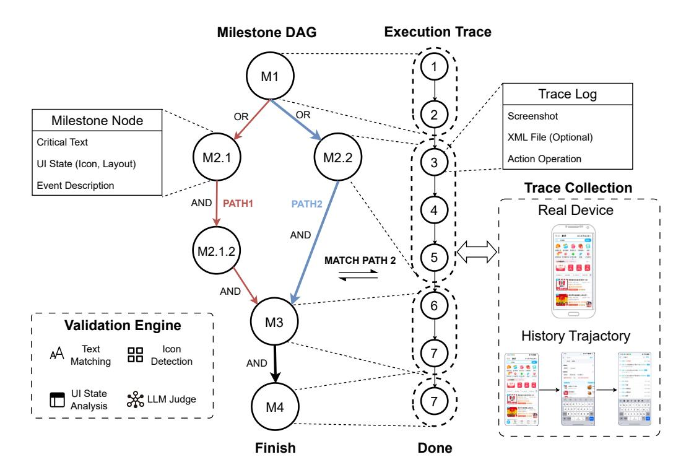

# 5.1 Framework Architecture

Figure 4 illustrates our benchmark framework. Given the complexity and variability of real-world mobile applications, we define multiple validation methods, diverse task trajectory specifications, and both online and offline trajectory collections. These design choices aim to accurately capture the agent's capabilities in real-world scenarios. The overall architecture of the benchmarking framework is as follows:

- 1. Trace Collection: We categorize agent execution traces into two types: online and offline. Online traces are collected through real interactions between the agent and mobile devices, logging all agent actions as well as UI screenshots from various pages. In contrast, offline traces are obtained by predefining the agent's task execution process and recording information such as action primitives and XML data generated. Additionally, we merge shared steps across different trajectories for the same task. By leveraging offline traces, we can conduct stable evaluations of the agent's performance, effectively eliminating the impact of dynamic environmental variables.
- DAG-based Task Definition: Each task is defined by a configuration file that specifies the structure of a DAG. In this graph, nodes represent key milestones in task execution, such as UI states or critical operations, while edges capture the dependencies and action transitions between these milestones.
- 3. **Validation Engine**: The engine parses both the task's DAG configuration and the agent's execution trace. It traverses the DAG alongside the trace, searching within the actual execution trace for milestone events and their dependencies as defined in the DAG.
- 4. **Result Generation**:Based on this traversal, the engine determines whether a fully validated path or a partially validated path exists. Tasks that successfully complete all milestone events defined

> **[图片提取文字 (无描述)]:**
> Milestone DAG **Execution Trace** M1 Trace Log OR OR Screenshot Milestone Node XML File (Optional) Critical Text M2.1 M2.2 Action Operation UI State (Icon, Layout) **Event Description Trace Collection** AND PATH1 PATH2 Real Device AND M2.1.2 MATCH PATH 2 AND 6 М3 **Validation Engine History Trajactory** Text Icon 88 Matching Detection AND **UI State** X LLM Judge Analysis M4 Finish Done

Figure 4: The overall architecture of MobiFlow

in the DAG are awarded the full score, while tasks that accomplish only a subset of milestone events may receive partial credit, as specified by user-defined criteria.

In real-world scenarios, application responses are highly dependent on factors such as application version, environment, and interaction patterns. Moreover, there is often a lack of systematic interfaces for quickly verifying whether milestone events have been completed. To address these challenges, we design a multi-level verification mechanism to ensure the accuracy of evaluating agent tasks on the mobile side.

## 5.2 Core Validation Capabilities

The framework supports a hierarchical approach to condition checking for robust and resilient validation.

Multi-level Condition Checkers: Each node in the DAG can be associated with one or more conditions that must be met. The supported checker types include:

- Text Matching: Verifies the presence of specific strings or patterns in the UI.
- Regular Expression Matching: Allows for more complex text-based validation using regular expressions.
- UI State Analysis: Examines the underlying view hierarchy (e.g., via XML dumps) to confirm the state of UI elements.
- Icon Detection: Utilizes computer vision techniques to identify the presence of specific icons.
- OCR Process: If neither XML files nor the page text is available, we employ OCR techniques to extract and verify text directly from screenshots.
- MLLM-as-a-Judge: Employs a multi-modal LLM to make a holistic judgment about the UI state based on the current key frame and contextual information.

Progressive Escalation Strategy: The checker starts with the lightest, fastest verification path. When text matching is required, it first parses the XML file and instantly confirms the current page state. Only if the XML source is absent or a plain-text checker is disabled does the system escalate to heavier techniques, like OCR or LLM-based reasoning, to decide whether the milestone has been reached.

Multi-path DAG Validation: The DAG structure inherently supports tasks with multiple valid completion trajectories. For tasks that can be accomplished through different approaches, we specify whether the milestone nodes are dependent on others or can proceed independently in parallel. This allows the DAG representation of a task to include multiple branches and paths. To better express the relationships between different paths, we define the AND and OR conjunctions. The AND indicates that all prerequisite milestone events from the preceding nodes must be satisfied before proceeding. In contrast, the OR stipulates that satisfying any single milestone event within the set is sufficient to trigger validation of the subsequent node. For a given task, if multiple paths can lead to its completion, the task is considered accomplished as long as any one of these paths is successfully validated.

To ensure the correct matching between milestone event nodes defined in the DAG and nodes in the trace, we introduce a synchronized backtracking mechanism for DAG and trace nodes. Specifically, when the checker detects that a certain path in the DAG cannot be validated, it backtracks to the previous branching milestone event and selects an alternative path for verification. Simultaneously, the checker also backtracks within the actual trace until it reaches the milestone node corresponding to the branching point.

Dynamic Condition Matching: MobiFlow supports task definition via templates and dynamically extracts conditions from the task description during execution. For example, if the task is "add milk to the shopping cart" the validator can automatically identify "milk" as the key object and subsequently generate corresponding milestone event nodes in sequence.

Icon Recognition: MobiFlow leverages OpenCV [\[3\]](#page-13-5) for icon recognition and supports multi-scale matching. By controlling the similarity threshold, it can robustly identify UI elements, even in the presence of minor variations in size or appearance.

## 5.3 Construct the MobiFlow Benchmark for Real-world Mobile Agent

To construct a benchmark that evaluates agent capabilities in realistic mobile environments, we select a range of representative mobile applications and scenarios, encompassing domains such as social networking, music and video, shopping, travel, food delivery, etc. Each test case defines milestone events using a template-based approach, ensuring sufficient generalizability of test cases. Additionally, for each application, we design task cases with varying levels of difficulty, ranging from simple to complex, to accurately assess the capabilities of agent models.

In our actual testing process, we meticulously select tasks that can be correctly executed in the current environment, thereby minimizing test failures caused by task misconfigurations rather than agent performance. For test cases that result in abnormal or failed executions, we further employ manual verification to ensure the accuracy and reliability of the evaluation.

Due to the iteration of applications and the variability of operating environments, the absolute scores obtained from MobiFlow are primarily for reference. However, the relative scores among different agent models provide a more accurate reflection of their capabilities in mobile agent scenarios. Additionally, we can record the correct action sequences from a given benchmark run as offline traces, including multiple valid trajectories for the same task, and enable different models to replay these offline traces for evaluation. This approach eliminates the influence of dynamic environmental factors, thereby making the evaluation results more deterministic.

Nevertheless, evaluating with offline traces may lead to false negatives. For example, an agent model could discover a new successful trajectory; however, such a correct outcome would be erroneously classified as a failure under offline-trace-based evaluation.

