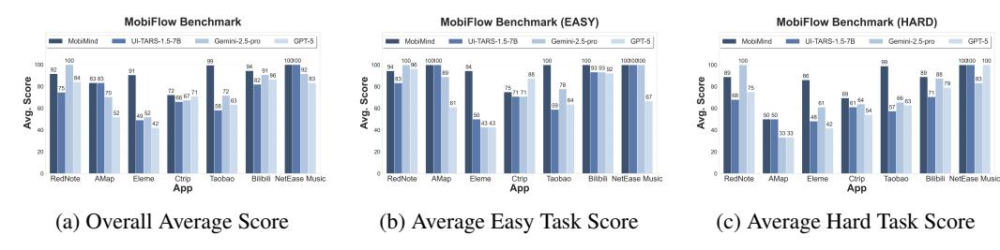

# 6.1 Task Completion Score

We evaluated the task completion rates of various models in real-world mobile scenarios. Our test suite covers the current widely-used mobile applications in China, as well as common tasks, such

> **[图片提取文字 (无描述)]:**
> MobiFlow Benchmark MobiFlow Benchmark (EASY) MobiFlow Benchmark (HARD) Eleme Ctrip App Taobao Bilbili NetEase Music Eleme Ctrip App Taobao Billbili NetEase Music App App (b) Average Easy Task Score (a) Overall Average Score (c) Average Hard Task Score

Figure 5: Average Task Completion Scores of Different Agent Models Under Realistic Workloads (MobiFlow): The performance is shown for (a) all tasks combined; (b) easy tasks; (c) and hard tasks.

as travel, shopping, entertainment and social networking. For each application, we defined a set of test case templates with multiple difficulty levels, where each template consists of milestone events structured in the form of a DAG. Prior to formal testing, we generated three real-world test cases for each type of template. All test cases are defined within our MobiFlow benchmark framework.

Figure [5](#page-12-0) presents a comparison of task completion rates between MobiAgent (MobiMind-Decider-7B + MobiMind-Grounder-3B) and several other VLM models, including the general-purpose LLMs (GPT-5, Gemini-2.5-pro) and the state-of-the-art GUI Agent model UI-TARS-1.5-7B. To ensure the accuracy of our evaluation, we manually verified all failed tasks. For cases caused by app anomalies, network interruptions, or non-existent tasks, we conducted repeated testing. In addition, we imposed a termination penalty on tasks where the agent could not complete or exit properly.

MobiAgent achieves the highest task completion rates across the majority of applications. In complex tasks such as shopping and food delivery, MobiAgent demonstrates superior performance in task understanding and decomposition, instruction following, and handling of exceptional cases. During execution, GPT and Gemini tend to input object descriptions, types, and details such as departure time and locations, directly into the search box. Because some apps support AI-powered search capabilities, these models can bypass most complex interactive steps, resulting in relatively higher task completion rates. However, such coarse-grained operation strategies lead to a significant drop in completion rates when faced with applications that do not support AI search.

Furthermore, we observed that existing agent models still suffer from task non-termination issues, such as the infinite repetition of certain actions. Specifically, GPT failed to properly terminate tasks in 11 application categories, while Gemini exhibited similar problems in 3 categories. In contrast, MobiAgent consistently achieved correct task termination across all evaluated scenarios.

