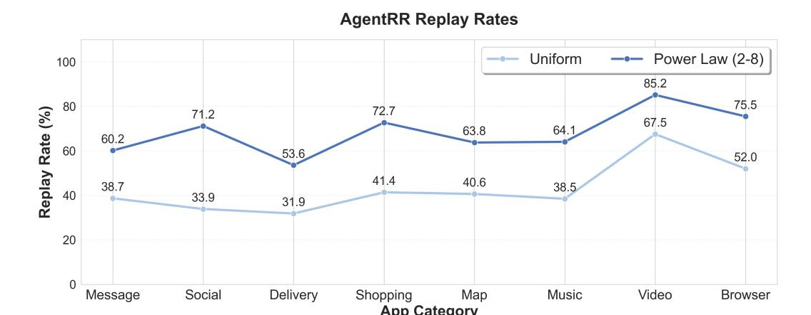

# 6.2 Accelerating the Mobile Agent using AgentRR

In addition to evaluating the task completion rates of agents, we also measure the speedup achieved by the AgentRR acceleration framework across various scenarios. By leveraging ActTree and a latent memory model, AgentRR can rapidly reuse historical agent trajectories, thereby reducing the inference overhead of VLMs. Consequently, the acceleration ratio of AgentRR in real-world mobile scenarios is positively correlated with the proportion of nodes in ActTree that can be reused.

To simulate different user behaviors on mobile devices, we constructed two types of user task distributions: a uniform distribution and a power law distribution. In the uniform distribution, users evenly utilize various application functionalities and randomly choose task parameters (e.g., search objects). In the power law distribution, 80% of user requests are concentrated within 20% of tasks, which more closely aligns with real-world user habits.

As Figure [6](#page-13-6) shows, under the uniform distribution, AgentRR achieves an action replay rate of 30%– 60%. Under the power law distribution, the action replay rate increases to 60%–85%. Moreover, owing to the accuracy of the latent model, the correctness of action replay exceeds 99% in our test cases.

In the real-world deployment scenarios, the performance advantage of AgentRR becomes even more pronounced, as the latent memory model can be deployed directly on edge devices, thereby reducing network communication overhead. In complex task scenarios such as food delivery and online

> **[图片提取文字 (无描述)]:**
> AgentRR Replay Rates Uniform Power Law (2-8) 100 85.2 75.5 80 Replay Rate (%) 72.7 71.2 67.5 63.8 64.1 60.2 60 53.6 52.0 41.4 40.6 38.7 38.5 40 33.9 31.9 20 Browser Message Social Delivery Shopping Мар Music Video App Category

Figure 6: Action Replay Rate with AgentRR under Different Distributions.

shopping, AgentRR achieves an average performance improvement of 2 to 3 times compared to baseline approaches.

