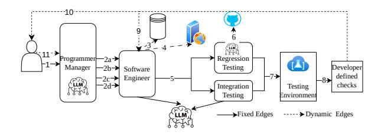

# 1 Introduction

Agentic applications [\[15,](#page-13-0) [21,](#page-14-0) [26,](#page-14-1) [27,](#page-14-2) [41\]](#page-15-0) are rapidly emerging as a powerful paradigm for automating complex, multi-step tasks. Built from interacting LLM-driven agents and external tools, these applications or "workflows" can decompose high-level instructions, invoke specialized services, maintain long-running state, and iteratively refine their outputs, unlocking capabilities well beyond single-shot LLM prompting. This has resulted in agentic workflows appearing in domains ranging from software engineering, financial planning to operations planning. The growing adoption brings to fore a

pressing challenge: delivering predictable performance and efficient resource use for agentic applications whose execution structure, resource profiles, and state dependencies evolve dynamically at runtime.

Serving such workloads is fundamentally harder than traditional inference or fixed-graph pipelines. A single user request for an agentic workflow often induces multiple requests through various heterogeneous components (LLMs, vector stores, APIs, test harnesses). Agentic workflows generate a rich state that must persist across long-running sessions. Furthermore, each agent invocation may change the future structure of the workflow, each tool call may introduce new dependencies, and each retry may require reusing cached state to maintain correctness or avoid redundant recomputation. These properties – data-dependent and dynamic control flow, non-determinism, and statefulness – create tight run-time coupling between workflow execution, scheduling, placement, and state management.

Existing agent frameworks offer partial serving solutions that force hard tradeoffs. Lightweight libraries [\[12,](#page-13-1) [13\]](#page-13-2) provide flexible programming interfaces but expose no control hooks to the runtime, leaving developers to embed ad hoc and rigid performance and resource management policies directly in workflow code. Conversely, systems that expose request scheduling or resource management [\[28,](#page-14-3) [39\]](#page-14-4) typically require rigid, statically declared graphs that fail to capture the dynamic execution patterns characteristic of real agentic applications. Neither approach provides the ideal combination of ensuring agentic applications' expressiveness, while supporting runtime visibility to enable fine-grained control.

This work identifies two key insights that enable a better design point. First, the agentic runtime can obtain the structural information it needs without restricting how developers write workflows; by replacing agent and tool invocations with lightweight, automatically generated stubs that return coordination objects instead of concrete values, the system can observe dependencies, track execution, and migrate work transparently. Second, efficient serving requires a runtime that maintains a global view of execution – spanning resource

∗Corresponding Author: sagarwal@cs.utexas.edu

conditions, request progress, and the availability of state – and uses this information to dynamically drive scheduling, placement, and prioritization decisions as workflows evolve.

Guided by these insights, we introduce NALAR, a groundup serving platform for agentic applications that brings together three complementary design elements. First, *a lightweight specification layer* that preserves full Python expressiveness, allowing developers to write workflows as ordinary code without adopting new abstractions or declaring static execution graphs. Second, NALAR instruments agent and tool invocations with *futures* that encode dependencies, dataflow relationships, and execution context. This transforms the serving problem into one of scheduling and coordinating futures, giving the runtime the semantic hooks needed for late binding, adaptive routing, and fine-grained prioritization. Third, a two-level control architecture separates global decision-making from local enforcement: component-level controllers react immediately to events such as future creation or completion, while a global controller periodically evaluates system-wide conditions and installs component-level policies that govern scheduling and state placement. Together, these mechanisms allow NALAR to orchestrate dynamically evolving agentic workflows efficiently and robustly, without burdening developers with explicit coordination logic.

NALAR's design incorporates several mechanisms that make agentic serving practical and scalable. Firstly, futures in NALAR are more than placeholders for pending results: they carry structured metadata that enables decentralized dependency tracking and execution control. This metadata allows component-level controllers to resolve dependencies, update executors, propagate readiness, and coordinate migrations without involving a centralized coordinator, maintaining responsiveness as workflows grow in complexity. Secondly, NALAR provides a managed state layer that cleanly decouples logical state from the physical instances executing agent calls. Managed state objects are runtime-tracked entities with usersession-based identities. This allows the system to relocate computation or retry operations while preserving state continuity, enabling safe reuse and informed placement decisions without developer involvement. Finally, the control layer's policy interface supports evolving and expressive policies. Policies operate over futures, state, and resource descriptors, expressing high-level intents using canonical primitives like routing, prioritization, or migration. The two-level control architecture translates policies into continuous, fine-grained adjustments that respond to queue dynamics, locality shifts, and emerging bottlenecks.

We implement NALAR in roughly 13,300 lines of Python, forming a complete end-to-end serving stack for agentic workflows. Across three representative multi-agent workloads, our evaluation shows that NALAR 's futures-centric execution model and two-level control plane deliver substantial performance improvements over existing agent frameworks. NALAR reduces P95–P99 tail latency by 34–74% in stateful

> **[图片提取文字 (无描述)]:**
> Programmer Regression Manager Testing Developer Software defined Engineer checks Testing Integration Testing Environmen →Fixed Edges -> Dynamic Edges

Figure 1: An example agentic application: Exemplifying a software engineering company setup based on a MetaGPT [\[21\]](#page-14-0) workflow for software development.

workloads, sustains < 50s average latency at 80 RPS whereas baselines fail under load imbalance, and achieves up to 2.9× end-to-end speedups through dynamic resource reallocation and mitigation of head-of-line blocking. We show that operators can implement new scheduling policies in only a few lines of code, yielding measurable gains.

