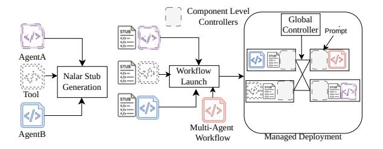

# 2.1 Challenges

The example above illustrates the expressive power of agentic workflows, but it also exposes fundamental challenges for both programming and serving them. In this section, we outline two central challenges that arise when building, running, and scaling such applications. These challenges motivate the design principles that guide our abstractions and architecture.

Challenge 1: A central challenge in building agentic applications is *reconciling developer freedom with the runtime control required for efficient serving*. Developers naturally express workflows as ordinary Python programs that contain long-running agent calls, data-dependent branches, retries, and session-scoped state. However, such imperative logic conceals the structural and state-use information needed by a serving system to make informed scheduling decisions, coordinate execution across heterogeneous agents, tools, and external resources, batch compatible work, migrate requests, and manage state placement. Existing systems force an undesirable tradeoff: either developers specify static graphs [\[39\]](#page-14-4) that cannot capture dynamic behavior, or the runtime is deprived of visibility into the workflow's dependency structure and operation, which undermines the ability to enforce quality of service, maintain consistent state across retries, or adapt to changing system conditions (as we discuss shortly in Section [2.3\)](#page-3-0). The core difficulty is enabling developers to program against simple callable agents while still allowing the serving system to observe and control the evolving computation graph and the state that connects agent invocations within and across requests[1](#page-2-0) and sessions[2](#page-2-1) .

Challenge 2: Beyond workflow expressiveness, *serving agentic applications requires coordinating heterogeneous,*

<span id="page-2-2"></span>> **[图片提取文字 (无描述)]:**
> Component Level Global Controllers Controller Prompt STUB 4/»--4/»--4/»---AgentA anua<sup>C</sup> STUB Workflow Nalar Stub Launch Generation 0 STUB 40 ---10-Tool STUB 4/3-4/3-4/3-</> Multi-Agent AgentB Managed Deployment Workflow


Figure 2: NALAR Overview: NALAR takes user-specified files and generates stubs (§ [3.1\)](#page-4-0) that replace original function calls with controllable hooks to generate futures (§ [3.2\)](#page-5-0). These stubs act as a conduit between the user program and the framework's controllers. At deployment, NALAR launches and manages the runtime (§ [4\)](#page-5-1), where component-level controllers and the global controller coordinate to enforce scheduling, routing, and resource policies.

*long-running components without constraining their inherently dynamic and unpredictable execution*. Agentic workflows traverse LLMs, specialized tools, databases, and external APIs, each with distinct performance characteristics and resource demands. Execution paths vary across requests due to conditional logic, tool results, retries, and human input, preventing the use of static routing or precomputed scheduling decisions. Meanwhile, meeting quality of service (QoS) objectives demands responsive decisions about where to place work, how to avoid head of line blocking, when to reassign requests, and how to maintain locality for session-specific state. Existing frameworks either relegate control to within each agent or impose rigid workflow structures, both of which hinder global coordination and limit the ability to adapt to workload variations or resource fluctuations. Equally important, they make it challenging to realize new QoS objectives as workflows and their requirements change. The overall challenge is designing a control plane that provides global visibility and adaptive policy enforcement without serializing execution or restricting the workflow's dynamism.

## 2.2 Our Key Ideas

The challenges above reveal a gap between how developers want to express agentic workflows and what a serving system needs to execute them efficiently. Our approach addresses this gap along two complementary dimensions: a programming model that exposes the right structural information to the runtime, and an execution architecture that enables finegrained, policy-driven control without sacrificing scalability. Figure [2](#page-2-2) provides a high-level overview, how NALAR takes a user-provided program and enables control. It also indicates at runtime how controllers interact.

To address the first challenge, we introduce *a programming model that preserves Python-level expressiveness while exposing the structure and semantics needed for runtime control*. First, agents and tools are wrapped in auto-generated stubs that make remote calls appear as local function invoca-

<span id="page-2-1"></span><span id="page-2-0"></span><sup>1</sup> a single inference request sent by the user

collection of multiple inference requests which require context from prior ones, *e.g.*, chat sessions

tions yet emit *futures* – rich runtime objects whose metadata captures dependencies, producers, consumers, and session context. By observing the creation and consumption of futures, our approach dynamically reconstructs the workflow's dataflow graph, enabling *late binding* of placement, adaptive scheduling, and fine-grained prioritization. Furthermore, the programming model provides managed state abstractions (lists, dictionaries, session-bound K,V caches) that decouple logical state from physical placement, allowing the runtime to exercise control over state lifecycle and locality, eliminating the need for developers to embed state coordination logic into their workflows. Together, these mechanisms give our system the hooks needed to orchestrate complex, dynamic workflows while keeping the programming experience simple.

To address the second challenge, we introduce a two-level agentic workflow execution architecture that decouples global policy decisions from local enforcement. A flexible policy interface allows the policies to evolve with workflow requirements without forcing deep mechanism changes across the systems. A global controller maintains a workflow-wide view of futures, resource usage, and agent behavior, and installs policies that govern routing, prioritization, and migration. Component-level controllers, co-located with each agent or tool, enforce the policies by scheduling futures, managing managed state and K,V caches, and propagating readiness and dependency updates. This division of responsibility avoids placing the global controller in the execution fast path while preserving the ability to make rapid, policy-driven adjustments such as reassigning requests to idle instances, migrating futures across nodes, or materializing state on demand. To enable controllers to coordinate without explicit synchronization, we introduce a node-level store that provides a low-latency metadata and telemetry substrate. Together, these mechanisms give our system the flexibility, scalability, responsiveness, and control required to serve dynamic multiagent workflows under diverse and evolving workloads and performance objectives.

## <span id="page-3-0"></span>2.3 Existing Agent Serving Systems

Before delving into our system, we describe the limitations of state-of-the-art agentic frameworks. There are primarily two classes of frameworks today.

**Specification-focused frameworks.** These include CrewAI [13] and Microsoft's AutoGen [40]; they provide only thin abstractions for defining agentic workflows. These frameworks lack resource management capabilities, leaving developers to manually allocate resources and embed custom policies into workflow code. Scaling deployments to meet performance and QoS targets typically involves replicating the entire workflow and all its components, rather than selectively scaling bottleneck agents, an approach that results in poor resource utilization and operational inefficiency.

End-to-end frameworks. Examples here include Lang-

```
import vllm_shared
zimport technical_documentation as documentation\nsimport testing_agent as tester
4class DeveloperAgent:
6    def __init__(self):
7    # Tries to generate working code in one-shot
9    def implement_and_test(self, task):
10    docs = documentation.get(task)
11    generated_code = vllm_shared.execute(self.role + task + docs)
12    test_result = tester.unit_test(generated_code)
13    return test_result, generated_code
```

Figure 3: **Example Agent**: A *software developer* agent definition. It calls a documentation lookup tool, a shared inference engine and another testing agent. These calls look like calls to local objects.

Graph [12], Parrot [28], and Ayo [39]. These frameworks aim to provide integrated support for both building and managing agentic workflows, but fall short in key areas.

Specification. Ayo [39] and LangGraph [12] require users to specify workflows as static graphs, which fails to capture the dynamic nature of agentic workflows. This design forces developers to enumerate all possible branches ahead of time, which is ill-matched with workflows that rely on conditional logic or runtime decisions. Parrot introduces semantic variables to track LLM requests, but its approach breaks down for data-dependent execution paths and flexible tool invocations. Scheduling and resource management. Ayo and Parrot provide limited point solutions for scheduling. Ayo supports parallel execution and pipelining, assuming a complete computation graph, which is often unavailable in dynamic workflows. Parrot attempts to batch LLM requests in agentic workflows, but its rigid strategy cannot adapt to data-dependent flows or dynamic control logic. LangGraph performs best-effort, FCFS scheduling and offers no mechanism for implementing policies like request prioritization or cross-agent coordination. State Management. Most commercial frameworks provide lightweight request-level state but require developers to manage session-level state, lifetime, and placement manually. This forces developers to reason about consistency and locality across retries and long-running sessions, which is difficult to scale and easy to misuse.

## 3 Programming Model

NALAR enables developers to express complex multi-agent workflows in ordinary Python, where agents and tools appear as local callable objects. Developers don't need to write custom communication or scheduling code. Nevertheless, the runtime needs visibility and control points for efficient end-to-end orchestration. NALAR achieves this through three tightly integrated components: an *agent and tool specification* interface, a *future* abstraction that exposes runtime workflow structure, and a *memory layer* that separates logical state from physical placement. We'll discuss these constructs using a simplified illustrative multi-agent workflow.

```
2 import planner_agent as planner
3 import developer_agent as developer
6 planner.init(preemptable=True, max resources={"GPU":2, "CPU":1})
7 developer.init(batchable=True, max_resources={ "GPU":4, "CPU":2})
9 def main(prompt, max retries):
      # 1. Flammer decomposes the request into su
subtasks = planner.plan(prompt)
subtask_done_list = [False] * len(subtasks)
generated_codes = [None] * len(subtasks)
      # 2. Assign each subtask to a different developer with relevant docs
       # Each developer immediately returns a future
# which eventually resolves to "Pass" / "Fail"
      futures = [developer.implement_and_test(subtask)
                                for subtask in subtasks]
      # 3. Developer might fail to generate to working code for its subtasks.
# So the driver implements fine-grained retry logic.
       retries = 0
             (False in subtask_done_list):
                raise Exception (f"Failed_to_implement_{prompt}")
           for i, future in enumerate(futures):
    if not future.available:
                     continue
                 test_result, generated_code = future.value\nif test_result == "Pass":
                 generated_codes[i] = True
generated_codes[i] = generated_code\nelse:
                      subtask_done_list[i] = True
                      futures[i] = developer.implement_and_test(subtasks[i])
                                    ach subtask and return it
      return concat (generated codes)
      deployment.main("Enable_OAuth_login_for_the_website", max_retries=3)
```

Figure 4: **Three-agent workflow:** The planner agent decomposes a natural-language coding request into subtasks. Each subtask is sent to a Developer agent from Figure 3, which returns a future indicating test success or failure. The program creates and consumes these futures, automatically retrying failing subtasks.

#### <span id="page-4-0"></span>3.1 Specifying Agentic Workflows

**Agent and workflow specification.** We start by discussing the programming model.

Agent and Tool specification. Agentic workflows are composed of shared tools, individual agents, and multi-agent subworkflows. In NALAR, developers define these agents, tools, and their interactions using standard Python classes and libraries of their choice. In our running example, three agents - planner, developer, and tester - and one tool, documentation, are implemented as ordinary Python classes. Figure 3 shows the implementation of the developer agent responsible for retrieving relevant documentation, generating code, and submitting it to the tester agent. From the developer's perspective, these interactions are written as simple method calls on local objects without explicit orchestration logic.

<u>Workflow Specification.</u> A multi-agent workflow, which strings together all the agents/tools, acts as a *driver* (this is where the request enters the agentic workflow). Writing a driver is similar to building these agents and tools.

Figure 4 shows the driver program for our three-agent workflow. In Lines 2-3, the programmer imports agents as if they were local modules. Lines 5-7 allow runtime directives discussed later in §3.4. Now, considering the *main* function. For simplicity of exposition, we show and explain the code here in three parts, labeled #1–#3. In #1, the planner agent is invoked

to generate a task breakdown. "subtasks" here is a *future*. The program doesn't block on this invocation; only when the number of subtasks is queried in the next line (Line 12) does the program block. This is because the number of subtasks is not known before the planning completes. In #2, each subtask is assigned to a developer agent. These invocations are done in parallel and the program doesn't block on them.

In #3, we first have the retry boilerplate. In our example, the developer agent in Figure 3 generates code for the subtask assigned to it in a one-shot manner. If this code doesn't pass the tester agent, the agent returns *test\_result* as "Fail" and doesn't retry. It is the driver's responsibility to invoke the developer agent again if a subtask couldn't be completed.

This example highlights the fact that the driver program can check if individual *futures* have resolved and to what value; in our example, if the value (i.e., *test\_result* of the future corresponding to the subtask assigned to the developer agent) is false, the corresponding subtask is relaunched.

The above code highlights three features: first, developers have no restrictions on the program they can specify, and they can build their agents and workflows using standard Python constructs. Second, unless the workflow programmer desires, they do not need to interact with the future objects (Line 11 in Figure 4, where future object is immediately consumed in Line 12). Third, the only difference between driver and agent specification is at Line 42, where the programmer's code calls NALAR's deployment functionality. In other words, an agent specification can itself contain a multi-agent workflow. One may wonder how function calls such as Line 12 return future objects rather than concrete outputs. Before introducing futures, we first explain how this transformation takes place. Transforming function calls into futures. Given a workflow specification written as ordinary Python code, NALAR must transform agent and tool invocations so that they return futures rather than concrete values. These futures serve as the coordination handles through which the runtime can track dependencies, manage execution, and apply policy-driven control. To achieve this, NALAR adopts a classic idea from programming languages: replace direct function calls with stubs that mediate execution.

NALAR provides an automated stub-generation tool for this purpose. Before deployment, developers run this tool on each agent or tool and supply a short YAML declaration describing the callable functions, their input parameters, and the agent's name. From this description, NALAR generates an importable Python module whose methods mirror the declared agent functions. When invoked, these methods do not execute the underlying logic; instead, they create and return future objects that encode the call's metadata, allowing the runtime to schedule, route, and monitor the computation.

This lightweight stub-generation step is what enables NALAR to observe and control workflow execution without requiring developers to modify their code or adopt new programming abstractions.

