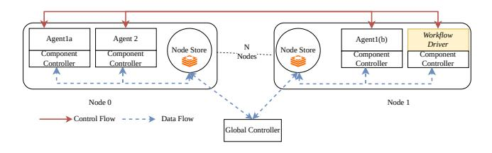
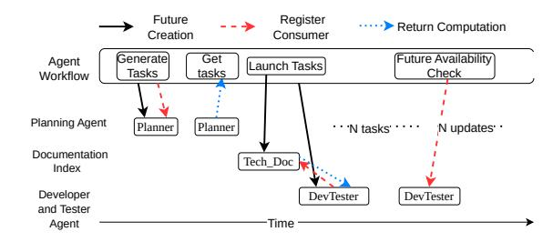
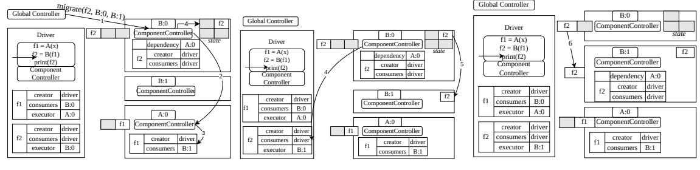
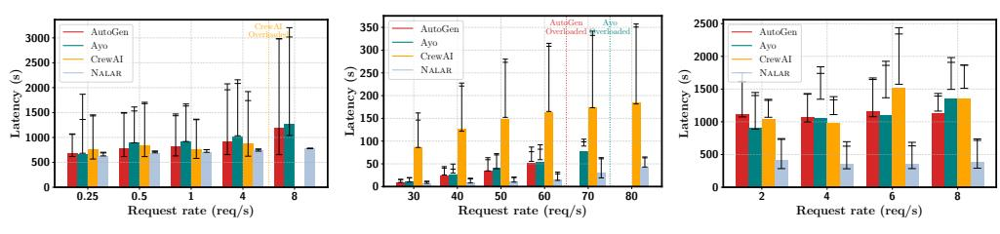
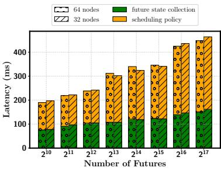

# 4 NALAR Control Architecture

NALAR's control architecture is responsible for leveraging the high-level abstractions expressed in workflow programs, namely, futures, state, and directives, for efficient serving. It must coordinate heterogeneous agents and tools, implement policy-driven routing and scheduling, and manage state placement and migration. We describe the NALAR control plane, the policy interface, and the runtime substrates that together realize control, and end with an example.

## 4.1 Control Components

Fine-grained control over request scheduling is essential for meeting both performance and QoS objectives for agentic workflows. Consider the three-agent workflow in Figure [4.](#page-4-1) Suppose multiple instances of each agent are running and

the goal is to minimize tail latency for a high-priority session while remaining resource-efficient. A naive policy that always selects the instance with the shortest queue can still suffer head-of-line blocking if that instance is occupied with a long-running request. In contrast, a runtime controller, given system-wide and workflow-level visibility, can identify idle instances and suitably migrate futures corresponding to high-priority requests, improving tail latency and utilization.

Systems like Ray [32] rely solely on event-driven scheduling, where scheduling is performed when a task associated with the future is created. This simplifies control logic because once a task associated with a future is scheduled, its placement never changes. In contrast, serving agentic workflows requires both event-driven *and* periodic scheduling. The former reacts to the creation of a future and decides where to execute its computation. However, agentic workflows are dynamic, and the definition of a "good" scheduling decision evolves as more information about future consumers and system state becomes available. To adapt, NALAR runs another periodic loop that revisits prior decisions, adjusts priorities, and performs migrations to optimize performance over time.

One might wonder whether periodic bulk scheduling, as used in deep-learning cluster schedulers [1, 31, 44], would suffice. However, futures in agentic workflows can execute anywhere from milliseconds to tens of minutes. To avoid delaying short tasks, periodic scheduling would need to run at sub-millisecond intervals — an impractical requirement that motivates our periodic-plus-event-driven approach.

Ideally, a single global controller that schedules every future and manages resources would suffice. However, this design quickly becomes a bottleneck at scale (show in §6.3), as a single agentic workflow can generate thousands of futures.

NALAR therefore adopts a *two-level control* design that cleanly *separates periodic policy computation from event-driven enforcement*. Shown in Figure 5, the global controller maintains a logically central workflow and system view. It periodically installs scheduling and routing policies at component-level controllers, which apply them immediately as events occur. A node store mediates information flow between the two levels.

**Component-Level Controllers.** When an agent or tool is launched, NALAR creates a component-level controller to manage its execution. These controllers serve three key roles.

First, they perform local scheduling using policies supplied by the global controller to determine which futures to execute on the agent/tool and when. They also maintain and update futures' metadata, crucial for efficient migration and ensuring that future values are propagated correctly across components.

Second, they act as the interface between the programming model and the runtime. The auto-generated stubs from §3.1 invoke the component-level controller rather than calling the user-provided code directly. This allows NALAR to intercept all agent and tool invocations, create futures, and coordinate state management. The local controllers also manage

> **[图片提取文字 (无描述)]:**
> Workflow Agent1a Agent 2 Agent1(b) Driver Node Store Node Store Component Component Component Component Nodes \*\*\*\* Controller Controller Controller Controller Node 0 Node 1 → Control Flow ---> Data Flow Global Controller

Figure 5: **NALAR's architecture:** The figure shows NALAR's twolevel control. Each component has an associated controller with it. Each node has a local node store. The global controller communicates with each agent and workflow driver, through the node store.

NALAR's state layer for the associated agent or tool.

Third, they collect serving-time metrics, including queue lengths, per-request latencies, and local resource usage that inform the global controller's periodic computations.

Global Controller. For each workflow, NALAR runs a global controller that implements policy logic specified by the operator. Running periodically, the global controller tracks the global state of NALAR during serving by aggregating metrics and metadata from component-level controllers through the node store, computing decisions related (for request routing, prioritization, and resource allocation) and pushing the computed decisions to component-level controllers.

Node Store. Because the component-level and global controllers operate at different frequencies, NALAR introduces a node-level store to decouple their communication. Each node maintains a local store that serves as both a metadata repository and a telemetry-and-decision broker: component-level controllers push metrics and local observations to the store, and the global controller writes policy updates into it. Implemented using Redis in our prototype, this design avoids direct synchronization between controllers while providing low-latency access to shared state. Component-level controllers consume policy changes asynchronously, allowing global decisions to propagate without placing the global controller on the critical path and thereby supporting scalability. The node store also holds future-associated metadata needed for dependency tracking and execution management.

## 4.2 Specifying Control Policies in NALAR

Agentic workflows evolve as developers add tools and agents, or introduce more complex control-flow, and scheduling must correspondingly keep pace. For an agent serving engine, it's thus key to support easy modification and expression of new scheduling strategies. Therefore, NALAR exposes a minimal yet expressive policy interface. Policies are expressed as programs that inspect metrics, reason about sessions and agents, and invoke a small set of primitives to influence routing, prioritization, migration, and provisioning decisions.

The global controller executes a single-threaded, pushbased policy loop. The single-threaded design ensures a single decision-maker and a single authoritative update stream, sim-

Table 2: NALAR's scheduling API

| Interface                                                             | Arguments                                                                                                                                                                                                                       | Descriptions                                                                             |  |
|-----------------------------------------------------------------------|---------------------------------------------------------------------------------------------------------------------------------------------------------------------------------------------------------------------------------|------------------------------------------------------------------------------------------|--|
| route                                                                 | (session-id, agent-type, agent-instance)                                                                                                                                                                                        | Route all request of a given session-id for agent-type to the suggestion agent-instance. |  |
|                                                                       | (agent-type, list(agent-instances), list(associate-weight))                                                                                                                                                                  | Route request of agent-type, to list of agent-instances, by given weight              |  |
| set_priority                                                          | (session-id, priority-value)                                                                                                                                                                                                    | Set session-id with associated priority value                                            |  |
| set_priority                                                          | (session-id, priority-value, agent)                                                                                                                                                                                             | Set priority-value of given session-id for the given agent                               |  |
| migrate (session-id, current-location, session-location)              |                                                                                                                                                                                                                                 | Migrate requests associated with session-id from source to destination                   |  |
| kill                                                                  | (agent-instance)                                                                                                                                                                                                                | Kill agent-instance                                                                      |  |
| provision                                                             | (agent-type, instance-ip)                                                                                                                                                                                                       | Launch agent-instance                                                                    |  |
| # The target 2 AGENTS = [Ag # The two ag 3 4 for agent in | Y_SESSION - S_star:     high-priority session ID\nentA, AgentB]\nents in the workflow     iAGENTS:     rity(HIGE_PRIORITY_SESSION, prior rity(HIGE_PRIORITY_SESSION, prior                                                      | ity_value-10)                                                                            |  |
| <pre>9 metrics 0 for agen 1 # If 2 if F</pre>                         | DLL_INTERVAL_MS) - poll_all_local_metrics() *fget a t in agentInstance: 'the high priority session is wai IGM_PRIORITY_SESSION in agent.wai for other_agents in agentInstance\nif other_agents_qsize 0 an # migrate the session | ting ting.session: 1 gentInstances:                                                      |  |
| 6                                                                     | migrate(HIGH_PRIORITY_SES                                                                                                                                                                                                       | SION, other_agent)                                                                       |  |

Figure 6: **Request prioritization policy using NALAR:** NALAR's level API (Lines 5 & 16) makes complex request prioritization and future management effortless.

plifying implementation. The push-based model keeps the global controller off the critical path.

Policy Implementation Interface. When trying to build policies for serving agentic workflows, we observed significant reuse of a small set of primitives. Building native support for these allowed us to simplify and standardize the design of policies, local controllers, and the global-local interface. Table 2 lists the core primitives that policies can use to control serving behavior. For instance, route can direct a session for an agent type to specific instances; set\_priority can adjust per-session priority globally or at a specific agent; and migrate can move a session between instances.

Figure 6 shows a simple policy that uses these primitives to minimize tail latency for a high-priority session; the policy raises the request's priority and migrates it away from busy instances. Even more complex policies, such as selectively prioritizing retries or adapting to dynamic DAG structure, can be implemented often with fewer than 15 lines of code, without modifying the workflow implementation. In §6.2 we show developers can implement simple policies in as little as 12 lines of code.

## 4.3 Runtime Handling of Futures and State

We describe how futures and state are represented in the runtime and their interaction with controllers and node stores.

#### 4.3.1 Futures

**Generation and Materialization.** Figure 7 provides the futures' timeline and operations in the context of our example workflow in Figure 4. There are three operations on futures: *Op 1. Future Creation:* This is a non-blocking operation.

> **[图片提取文字 (无描述)]:**
> Register Future ·····> Return Computation Creation Consumer (Generate) Get Future Availability Agent Launch Tasks Tasks tasks Check Workflow Planning Agent Planner Planner N updates: . · · · N tasks · · · · Documentation Tech\_Doc Index Developer DevTester **DevTester** and Tester Agent Time

Figure 7: **Future Generation Timeline:** For the agent workflow depicted in Figure 4 we depict a timeline for future generation and how their consumers are updated and their values realized in NALAR

*Op 2. Register Consumer:* When an agent or driver program calls a future, it is registered as a consumer, also non-blocking. *Op 3. Return:* Any call to the value of a future is blocking.

When the driver first calls the *planning* agent, a future called *subtasks* is created. When in Line 12 (Figure 7) the driver checks the subtasks' length, the future must be materialized; at this point, the driver's component controller registers with the component controller of the planner as one of the future's consumers. Once the *subtasks* future is ready, the driver receives the subtasks. The driver then dispatches each subtask from the *subtasks* future to the developer agents. Again, each call to the developer agent creates a future. When the driver agent tries to access the value of a future (Line 29), a callback is registered, and the process of waiting for the future to materialize repeats. For brevity, we end the example here.

**Metadata.** Futures in NALAR are designed to be routed across agents without requiring the global controller to supervise every step. To enable this, each future carries rich metadata, including its dependencies, dependents, output value, location, and creator information (Table 3). This metadata is sufficient for component-level controllers to route and execute the computation associated with futures locally, to update the consumers when a producer completes, and to apply policydriven changes such as migration. The global controller only installs the policies that govern future management.

**Properties.** We now describe important properties of NALAR's futures:

1. Immutable data, partially mutable metadata: Unlike Ray [32] and CIEL [33], futures in NALAR are selectively mutable. While a future's value remains immutable once materialized, the framework can update metadata such as its consumers and executor location. This mutable state enables NALAR to migrate already routed requests as serving state changes. For example, a future may initially be scheduled on a node with the smallest queue, but head-of-line blocking can occur, and another node may later become a better choice. NALAR can change the node where the future is scheduled in the future's metadata. Note that mutability is restricted to metadata only, to avoid the need for complex consistency management when managing the state of a future.

2. Dynamic dependency graph extraction. As the workflow dynamically evolves and it becomes apparent that a future has

Table 3: NALAR's future Metadata.

| Metadata                         | Structure | Descriptions                                                                  |  |
|----------------------------------|-----------|-------------------------------------------------------------------------------|--|
| list(agentA:ip,) dependencies |           | List all dependencies which are needed to compute the output of the future |  |
| agentName:ip creator          |           | List the agent name and the associated creator                                |  |
| agentName:ip executor         |           | The location where the future is slated to be executed                        |  |
| list(agentA:ip,) consumers    |           | The consumers of these executors and their location                           |  |

more consumers, the metadata of the future is modified. To aid in this, NALAR extracts the computation graph by tracking the three per-future operations above. As NALAR observes different futures blocking, it reasons about the structure of the graph and different dependencies.

*3. Push-Based Readiness.* NALAR futures use a push-based readiness model. When a future resolves, the producing node immediately transfers the value of the computations to all the consumers associated with the future. Employing pushbased coordination is what allows NALAR to incorporate late binding: until a future is ready, NALAR can take various actions - reacting in a timely fashion to state changes, migrating pending work, re-prioritizing tasks, moving or materializing memory state, or adjusting batching strategies based on the system's instantaneous conditions. This is significantly challenging to do in systems like Ray whose scheduler is eventdriven and the futures' metadata is immutable.

### 4.3.2 State Management

Agentic workflows are inherently stateful: agents accumulate state across retries and sessions; furthermore, LLM invocations benefit from K,V caches that capture prompt history. If the runtime cannot control where these states reside, scheduling is rendered sticky, forcing requests to be sent to the instances that hold the prior state, creating load imbalance, and hurting performance. NALAR therefore carefully manages both user-visible state and internal K,V caches.

*User State:* In existing frameworks [\[12,](#page-13-1) [40\]](#page-15-1), when serving multiple user sessions, the developer needs to maintain state associated with each session while serving associated requests. This state management requires developers to make code changes to access and maintain the state associated with the user session. Using NALAR 's state management layer, developers do not need to track sessions explicitly or ensure that the correct state is present at the correct instance; NALAR materializes state transparently. The key enabling insight is that, during inference, the local controller always knows which session a request belongs to. NALAR, when accepting a new session from a user, assigns a unique session ID, and propagates it with each future. This allows NALAR to attach and propagate session metadata automatically as state is accessed. Because controllers mediate all request executions, they can consistently tag, track, and relocate state as needed.

A major benefit of this design is that NALAR can move both requests and their associated state across instances to improve scheduling or placement. When an agent begins serving a request, the local controller consults the node store, where session state is indexed by session ID, and reconstructs the appropriate managed lists and dictionaries. To the developer, the state appears local and stable even as NALAR migrates it. *K,V caches:* Given the session-based nature of agentic workflows, K,V caches are essential for reducing LLM inference latency. Managing their lifetime and placement, however, is nontrivial: deciding how long a cache should persist and whether it should remain on GPU memory or be offloaded requires balancing performance against limited device resources. In principle, agent-serving systems could simplify this problem by providing information about future state requirements — for example, that a session has ended or that a particular request is likely to recur. Yet current agent-serving frameworks do not communicate such information to underlying LLM engines. As a result, systems such as vLLM [\[24\]](#page-14-12) and SGLang [\[43\]](#page-15-3) rely on prefix-based caching combined with generic eviction heuristics (e.g., LRU), which may inadvertently discard K,V caches that are about to be reused.

NALAR remedies this by leveraging its global view of workflow execution. Because NALAR tracks futures and knows which requests are pending or likely to arrive next, it can supply the LLM serving layer with explicit hints about which K,V caches should be retained. To support fine-grained control over cache lifetime and placement, NALAR extends existing caching mechanisms (e.g., LMCache [\[9\]](#page-13-8)) with hooks for policy-driven management. These hooks allow the global controller to decide whether a cache remains on the GPU, is offloaded to far memory, or is migrated across devices, ensuring that cache residency aligns with anticipated demand and resource availability.

Control Example in NALAR. We illustrate how the global and component-level controllers coordinate during a migration. Consider the simple two-agent workflow with agents agentA and agentB. Here, the driver is implementing the workflow, the output of agentA feeds into agentB, and two instances of agentB (B:0 and B:1) are running. This workflow is depicted in Figure [8](#page-9-0) and leads to creation of two futures f1 and f2 . Suppose the NALAR global controller decides to migrate a future f2 from B:0 to B:1. Since these futures are created by the driver, the creator of both futures is the driver. Future f1 is consumed by agentB, therefore f1's consumer is the location where f2 will be executed (initially B:0). For f2, since it's consumed by the driver, the consumer is the driver.

In Step 1 of Figure [8,](#page-9-0) the global controller issues a migrate command for f2. On receiving this command, the componentlevel controller for B:0 contacts the producer of f2, i.e., A:0, to check whether the dependency value has already been sent (Step 2). If not, the controller updates the dependency target to B:1 (Step 3). If the value is already in flight to B:0, the B:0 controller waits for it to arrive before proceeding.

Once the required dependencies arrive, the controller notifies the creator of f2 that its executor has changed (Step 4). The state associated with f2 at B:0 is then transferred to

> **[图片提取文字 (无描述)]:**
> \_\_\_migrate(f2, B:0, B:1)\_\_ Global Controller Global Controller B:0 Global Controller B:0 f2 ||ComponentController Driver f2 ComponentController state Driver f2 B:0 f1 = A(x)state Driver f2 ComponentController A:0 dependency f1 = A(x)f2 = B(f1)f2 state B:1 f1 = A(x)f2 = B(f1)driver creator A:0 dependency print(f2) f2 f2 = B(f1)print(f2) ComponentController driver driver consumers Component creator print(f2) Component Controller consumers driver Component A:0 dependency Controller B:1 Controller driver creator ComponentController driver f2 creator driver creator f2 consumers driver driver creator B:0 ComponentController consumers consumers B:0 B:0 consumers A:0 executor A:0 A:0 executor A:0 executor ComponentController A:0 ComponentController driver creator driver creator driver ComponentController creator driver driver consumers creator driver driver creator driver consumers consumers driver creator B:1 B:0 executor B:1 executor B:1 consumers consumers B:1 executor B:1 consumers

(a) Migration initiation

(b) Dependency Updates

(c) Migration Completion

Figure 8: Control Interaction in NALAR. The above figure shows the interaction and relevant updates to metadata when a future is being migrated. An important feature is that it's entirely locally coordinated, *i.e.*, the global controller only issues the migrate command, the component level controllers coordinate it among themselves.

B:1 (Step 5). Finally, the migrated future is activated at B:1 (Step 6), completing the migration.

Although migration is one of the more complex primitives in the API, the example shows how underlying mechanisms are composed of simple building blocks. It also illustrates how concise policies translate into coordinated actions between the global controller and the component-level controllers, while keeping the details hidden from the developer.

#### 5 Discussion

**State Management.** Using the state-management layer introduces a few constraints that clarify how NALAR handles execution. When an agent relies on managed state abstractions, NALAR ensures that all requests belonging to the same session are routed to the same instance of that agent; however, NALAR may still migrate the entire session – including its state – to a different instance when appropriate. This differs from marking an agent as fully *stateful*, in which case NALAR prohibits session migration altogether. These routing guarantees are enforced automatically by the scheduler. A second constraint is that a managed state cannot be combined with batchable agents. Because batching aggregates requests from multiple sessions, the framework cannot determine which session a given state update belongs to, making correct state tracking impossible under batching.

**Fault Tolerance.** Like most inference systems [2, 11, 18, 42], NALAR doesn't support fault tolerance. Instead, it notifies the driver program of requests that failed due to system errors, along with information associated with the failure. We believe this is reasonable, as faults typically cause SLO violations and users retry the request. However, additional coordination between the global and component-level controllers could enable recovery mechanisms, a subject for future work.

**Debuggability.** Building NALAR required significant investment in debuggability. Because NALAR has complete visibility into inter-agent calls, it can provide rich data for introspective debugging. We maintain detailed per-session logs, including time spent in each stage and the agents or tools accessed on each node. NALAR also includes a visualization tool for these logs, initially built for internal use but

planned for open-sourcing with NALAR. For runtime debugging, NALAR provides the driver program with detailed information about failed requests, including the workflow path, the agent where the failure occurred, and the full traceback.

### 6 Evaluation

Implementation. We implement NALAR in roughly 13,300 lines of Python, leveraging several existing libraries: (1) gRPC, which serves as the communication backend for all inter-component interactions; (2) ChromaDB, a vector search engine used in our workflows (more in the next section); (3) vLLM for serving LLM models; (4) a modified version of LMCache that exposes NALAR-level control for K,V cache migration; and (5) Redis, used as the node-local store to provide transactional support and reduce coordination overhead between controllers.

We compare NALAR against three different baselines, on three different types of workflow.

**Baselines.** The baselines we use are as follows.

Ayo Ayo [39] is a recent work that enables developers to specify agentic applications using a graph-based interface. It enables parallel execution and pipelining of different components in an agent serving pipeline. Internally, Ayo uses Ray to build the execution engine.

<u>CrewAI</u> CrewAI [13] is a popular library to build agents (with over 41K stars on GitHub). It provides a development framework to build and orchestrate agents.

<u>AutoGen</u> AutoGen [40] is another popular library by Microsoft (over 52K stars on GitHub). It supports event-driven programming to build agents.

**Experimental Setup.** Unless otherwise noted, all experiments use 2 nodes, each with 4 NVIDIA A100 GPUs (80GB HBM), 256GB DRAM, and 4TB SSDs. The nodes are connected via a 100Gbps Ethernet link.

**Workflow.** We use three representative workflows. *Financial Analyst:* In this workflow [14], an analyst agent invokes a stock analysis agent, a bond market agent, a market research agent, and a web/news search agent. The aggregated results are summarized for the user, who may issue follow-up

queries after long delays, making this a human-in-the-loop workflow. This workflow is stateful, meaning the same LLM engine is shared across tasks, creating resource contention. We use the FinQA dataset [\[8\]](#page-13-12) for evaluation.

*Router-based workflow:* This workflow follows a common pattern in which a lightweight agent classifies each query and routes it accordingly—either to a chat workflow or, for coding tasks, to a dedicated coding agent. We evaluate this workflow using Microsoft Azure LLM traces [\[37\]](#page-14-14), which report request volumes for two distinct workflow types.

*Software engineering workflow:* This workflow mirrors the structure in Figure [1.](#page-1-0) We integrate tool calling via web-search APIs and store documentation in ChromaDB. Due to their unique properties, each agent is paired with its own LLM. We evaluate this workflow on the SWE-bench dataset [\[23\]](#page-14-15). Unlike other workflows, this is a recursive workflow.

For LLM inference, we use vLLM [\[24\]](#page-14-12) as the serving backend with workflow-specific fine-tuned LLaMA-8B models.

## 6.1 End-to-End Evaluation

First, we present an end-to-end evaluation of NALAR. Figure [9](#page-11-1) shows the results. We measure average latency along with P50, P95, and P99 latencies under varying request rates to assess each framework's capacity. The bars show the average, while whiskers represent P50, P95, and P99 latencies.

For this evaluation, NALAR uses three default policies, one that actively balances load across resources through routing, a second that migrates a job if it's waiting in the queue and observing head-of-line blocking, and a third that performs resource reassignment from low-load agents to high-load agents. These policies were implemented using the interface discussed in [§4.2](#page-6-1) and required less than 100 lines of code cumulatively. We discuss additional policies in [§6.2.](#page-10-0)

Financial Analyst Workflow. Figure [9a](#page-11-1) shows the results on the Financial Analyst workflow. Given its stateful nature (a user can send multiple requests per session), every baseline must route successive requests with the same sessionID to the GPU originally assigned. By controlling K,V caches, however, NALAR is not bound by this constraint and can migrate sessions across GPUs. In this workflow, NALAR mitigates headof-line blocking through such request migrations, enabled by its system-wide view. As a result, NALAR improves P95 and P99 latencies by roughly 34% to 74% across request rates. At 8 RPS, while other frameworks exhibit extreme tail latency (P99 exceeding 3,000s) with a 1,300s average, NALAR remains robust, keeping P99 near 800s (3.75×). However, because the average is dominated by long-running requests (large context and generation lengths), NALAR improves average latency by only 8% to 35% across rates.

Router-based Workflow. Figure [9b](#page-11-1) shows results for the router-based workflow. We observe load imbalance as different branches are invoked at varying frequencies due to shifting query characteristics, causing under-utilization on

less-used branches. Existing serving frameworks cannot dynamically reallocate resources; *i.e.*, they lack control over execution mechanisms and visibility into resource use, leading to poor utilization. Azure agent traces [\[37\]](#page-14-14) show that this imbalance can exceed 90%. As a result, heavily used branches experience excessive load and out-of-memory failures, causing AutoGen and Ayo to fail at 70 and 80 RPS, respectively. In contrast, NALAR adapts to imbalance via dynamic resource allocation, redistributing capacity across workflows and sustaining average latency below 50s even at 80 RPS.

Software Engineering Workflow. Here, we observe that NALAR delivers speedups of up to 2.9×. As resource demands shift across agents, NALAR dynamically adjusts allocations, maintaining efficiency throughout the workflow. Unlike router-based workflow, load imbalance here arises due to the recursive nature of the workflow, *i.e.*, a non-deterministic set of requests can fail and requeue at the beginning of the application. We observed that compared to NALAR, baselines show more than 2.1× higher load-imbalance.

*Takeaways:* These results show that NALAR, with global control and complete workflow visibility, can easily support dynamic and agile multi-agent execution. We argue that existing solutions which lack global visibility and control and cannot achieve the same level of performance or run-time flexibility.

## 6.2 Adding New Policies

Next, we show how NALAR's scheduling API allows developers to easily implement diverse and effective policies.

Minimize JCT. A common way to reduce job completion time is to prioritize jobs with the least remaining work, *i.e.*, shortest remaining time first (SRTF). In call-graph–structured workloads such as the financial analyst agent, a practical heuristic is to prioritize calls originating from later stages of the graph. Implementing this policy in NALAR requires just *12 lines* of Python running on the global controller. The policy can be concisely expressed due to well designed policy interface provided by NALAR. We observe that this heuristic reduces average JCT by over 2.4% at the cost of a 3.3% increase in P95 latency.

Control Makespan. A standard way to reduce makespan compared to default approaches like FCFS is to prioritize the Longest Processing Time (LPT) job first. In call-graph workflows such as software engineering, this corresponds to prioritizing jobs that re-enter the graph because they failed to meet the specification. Implementing this policy also required just *12 lines* of code. We observed that it reduced makespan by 5.8%, with a 2.6% increase in P95 latency.

*Takeaways:* Although the gains are modest, we see that operators can easily explore new scheduling policies with NALAR to improve agentic inference performance. We attempted to implement a similar policy in AutoGen, the strongest baseline, but were unsuccessful: AutoGen's cross-agent communication, which is built using an asynchronous messaging engine,

> **[图片提取文字 (无描述)]:**
> AutoGen Avo Overloaded Weerloaded 2500 350 AutoGen AutoGen AutoGen 3000 Ayo Ayo 300 Ayo 2000 CrewAI 2500 CrewAI CrewAI @ 250 NALAR 2000 1 NALAR NALAR  $\widehat{\mathbf{s}}$ ු 1500 J 200 tenc? 1500 rate 1000 100 500 500 50 0.25 0.5 30 70 80 40 50 60 Request rate (req/s) Request rate (req/s) Request rate (req/s)

(a) Financial Analyst Agent

(b) Router-based Workflow

(c) Software Eng Workflow

Figure 9: End-to-End Evaluation The bars represent average latency, the whiskers represent P50, P95 and P99 latencies.

> **[图片提取文字 (无描述)]:**
> 64 nodes future state collection ZZ 32 nodes scheduling policy 400 Tatency (ms) 000 002 200 100 215 216 Number of Futures

Figure 10: **Global Control Loop Latency:** Global control loop latency vs the number of futures. Even at a 64 Node and 131K futures, the loop takes only 464ms, where the majority of time (over 65%) is spent in scheduling policy logic.

lacks the fine-grained policy control needed.

## **6.3** Scalability of NALAR

As an academic lab without access to large-scale GPU resources, we follow prior work [1, 10] and use emulation to study NALAR 's overhead and design implications on scalablity. Our setup profiles LLM inference calls to mimic execution behavior. Since NALAR 's design is not tied to GPUs, we believe this approach is reasonable.

Scalability with many futures. At its core, NALAR manages the execution of futures. To evaluate scalability, we measure the performance of NALAR's control mechanisms as the number of futures grows. We emulate large-scale deployments using 64 CPU nodes with 128 agents (each paired with a component-level controller) and a second setup with 32 nodes and 64 agents. Before evaluating global control, we reiterate that in our design, the global controller is not on the critical path; the only benefit of a faster global controller is faster propagation of policy updates to component-level controllers. Figure 10 shows that for the SRTF policy discussed earlier, the global control loop's execution time is largely independent of the number of nodes-scheduling on 64 nodes and 32 nodes takes nearly identical time. Scalability, however, depends on the number of futures: for example, collecting state for 1,024 futures from 64 nodes takes 76ms, while handling 130K futures requires 151ms; both are reasonably low.

**Impact of two-level design.** To evaluate the benefit of the two-level design, we measure the overhead a centralized global controller would incur if it routed every future directly rather than installing policies on component-level controllers to

Table 4: Impact of Two-level Control.

| Number of Futures | One-Level Design | Two-level Design |  |
|-------------------|------------------|------------------|--|
| rumber of rutures | Time(ms)         | Time(ms)         |  |
| 1024              | 1.2              | 0.1              |  |
| 2048              | 2.3              | 0.1              |  |
| 4096              | 2.8              | 0.2              |  |
| 8192              | 3.4              | 0.4              |  |
| 16384             | 3.9              | 0.4              |  |
| 32768             | 19.4             | 0.3              |  |
| 65536             | 32.3             | 0.4              |  |
| 131072            | 72.3             | 0.4              |  |

maintain the SRTF policy. Table 4 reports the time to schedule a single token. We observe that up to 16K futures, scheduling overhead remains below 4ms; however, beyond 16K, latency grows sharply due to queuing delays, reaching over 72ms for 130K futures. The two-level design in NALAR avoids queuing bottlenecks at scale on the global controller, as futures can be routed independently by their node controllers.

<u>Takeaways:</u> These results demonstrate that our design choices around global control significantly improve NALAR 's scalability, and using futures does not incur significant overhead in the current NALAR prototype.

### 7 Related Work

The Future Abstraction. Computing using futures and promises has had a long history in computing [4, 5, 19, 29]. There have been several distributed dynamic task scheduling frameworks like Ciel [33], Dask [34] and Ray [32]. Dask and Ray both integrate with Python. Unlike Dask and Ray, which use an event-driven scheduler (central in case of Dask, and bottom-up two-level in case of Ray), NALAR uses a two-level controller, one level is a global controller responsible for coarse-grained scheduling, and the second level is a component-level controller that is event-driven and performs scheduling based on the rules installed by the global controller. Compared to Ray, which supports both tasks and actors, NALAR exclusively targets long-running, stateful agents that often encapsulate heavy components such as LLMs and vector databases. Finally, NALAR supports a wide range of configurable policies for managing requests and agent performance. Implementing similar policies in Ray would require intervention at the level of every task, making customization complex and error-prone. These differences make NALAR better suited for dynamic, stateful, multi-agent workflows.

Global Control Plane. Logically centralized control planes

have appeared in several settings [\[16,](#page-13-17) [17,](#page-13-18) [20,](#page-13-19) [30,](#page-14-17) [32\]](#page-14-7). NALAR draws inspiration from this lineage, but differs in its complete decoupling of local component-level controllers from the global controller, an idea borrowed from SDN systems such as B4 [\[22\]](#page-14-18). This separation allows NALAR to override poor local decisions by migrating tasks, making scheduling changes reversible through job migration.

## 8 Conclusion

NALAR demonstrates that agentic workflows can be served efficiently without constraining developers by exposing finegrained structure, state semantics, and control points to the runtime. Its futures-centric execution model and two-level control plane enable adaptive scheduling, coordinated state management, and policy evolution as workflows and requirements change. We find that these mechanisms provide strong performance and flexibility across diverse applications.

