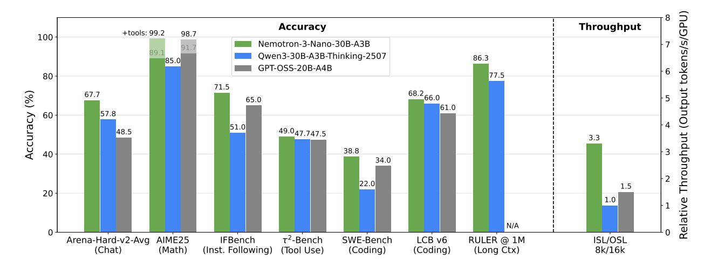
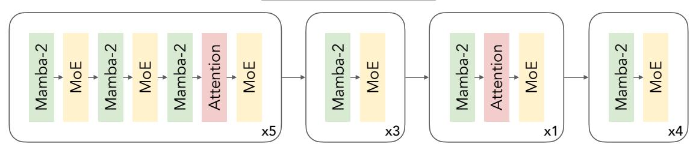
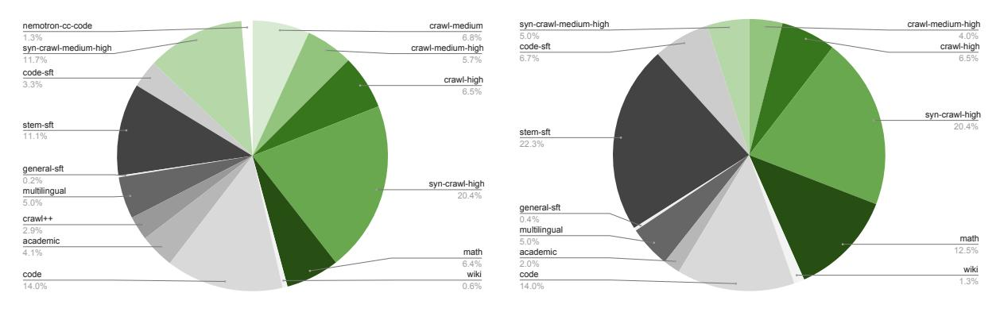

# **Nemotron 3 Nano: Open, Efficient Mixture-of-Experts Hybrid Mamba-Transformer Model for Agentic Reasoning**

## **NVIDIA**

**Abstract.** We present Nemotron 3 Nano 30B-A3B, a Mixture-of-Experts hybrid Mamba-Transformer language model. Nemotron 3 Nano was pretrained on 25 trillion text tokens, including more than 3 trillion new unique tokens over Nemotron 2, followed by supervised fine tuning and large-scale RL on diverse environments. Nemotron 3 Nano achieves better accuracy than our previous generation Nemotron 2 Nano while activating less than half of the parameters per forward pass. It achieves up to 3.3× higher inference throughput than similarly-sized open models like GPT-OSS-20B and Qwen3-30B-A3B-Thinking-2507, while also being more accurate on popular benchmarks. Nemotron 3 Nano demonstrates enhanced agentic, reasoning, and chat abilities and supports context lengths up to 1M tokens. We release both our pretrained Nemotron 3 Nano 30B-A3B Base and post-trained Nemotron 3 Nano 30B-A3B checkpoints on Hugging Face.

## **1. Introduction**

We present NVIDIA Nemotron 3 Nano, a Mixture-of-Experts (MoE) hybrid Mamba-Transformer model [\(Lieber et al.,](#page-30-0) [2024\)](#page-30-0) with agentic, reasoning, and chat capabilities. Like previous generations [\(NVIDIA,](#page-32-0) [2025e,](#page-32-0)[d\)](#page-32-1), Nemotron 3 Nano uses a combination of Mamba-2 [\(Dao & Gu,](#page-28-0) [2024\)](#page-28-0) and Grouped-Query-Attention (GQA) [\(Ainslie et al.,](#page-28-1) [2023\)](#page-28-1). In addition, Nemotron 3 Nano uses Mixture-of-Experts [\(Shazeer et al.,](#page-32-2) [2017\)](#page-32-2) layers to scale model parameters sparsely and achieve significant improvements on the inference-throughput-to-accuracy frontier. We use a granular MoE architecture [\(Dai et al.,](#page-28-2) [2024\)](#page-28-2) with a learnt MLP router that activates 6 out of 128 experts ([§2.1\)](#page-2-0). Nemotron 3 Nano totals 31.6B parameters out of which only 3.2B are activated per forward pass (3.6B including embeddings). Nemotron 3 Nano achieves better or on-par accuracy compared to GPT-OSS-20B [\(OpenAI,](#page-32-3) [2025\)](#page-32-3) and Qwen3-30B-A3B-Thinking-2507 [\(Yang et al.,](#page-34-0) [2025a\)](#page-34-0) as shown in Figure [1.](#page-1-0) Further, on the 8K input / 16K output token scenario, Nemotron 3 Nano provides 2.2× and 3.3× faster inference throughput compared to GPT-OSS-20B and Qwen3-30B-A3B-Thinking-2507 respectively. Nemotron 3 Nano also supports context lengths up to 1M tokens, outperforming both GPT-OSS-20B and Qwen3-30B-A3B-Instruct-2507 on RULER across different context lengths. Along with the model weights, we provide the recipe, code, and most of the data we used to train the model.

We pretrained our base model, Nemotron 3 Nano 30B-A3B Base, using the Warmup-Stable-Decay [\(Hu](#page-29-0) [et al.,](#page-29-0) [2024\)](#page-29-0) learning rate schedule on 25 trillion tokens of text data spanning 15 categories ([§2.2\)](#page-2-1). We divided pre-training into 2 phases with 23.5 trillion tokens of diverse data in the first phase, followed by 1.5 trillion tokens of high-quality data in the second phase ([§2.3\)](#page-7-0). Our base model achieves better accuracy than equivalent-sized Qwen3-30B-A3B-Base on most academic benchmarks across Code, Math, Long Context, General Knowledge, and Commonsense Understanding categories. We do not compare the accuracy of our base model to GPT-OSS-20B because no base model was released with it. Our model also achieves significantly better inference throughput than Qwen3-30B-A3B (3.3×) and GPT-OSS-20B (2.2×) on generation heavy 8K input / 16k output scenario when tested on a single H200 GPU. We measured throughput using the best configuration available for H200 GPUs

> **[图片提取文字 (无描述)]:**
> Throughput Accuracy +tools: 99.2 98.7 100 Nemotron-3-Nano-30B-A3B Qwen3-30B-A3B-Thinking-2507 86.3 85.0 GPT-OSS-20B-A4B 80 71.5 (Output 68.2 (%) 67.7 65.0 61.0 57.8 Accuracy 60 -51.0 49.047.747.5 48.5 **Throughput** 3.3 38.8 40 34.0 22.0 1.5 20 1.0 N/A τ2-Bench Arena-Hard-v2-Avg ISL/OSL AIME25 IFBench SWE-Bench LCB v6 RULER @ 1M (Inst. Following) (Chat) (Math) (Tool Use) (Coding) (Coding) (Long Ctx) 8k/16k

Figure 1 | Accuracy and throughput comparisons of Nemotron 3 Nano with Qwen3-30B-A3B-Thinking-2507 and GPT-OSS-20B. Nemotron 3 Nano achieves on-par or better accuracies across multiple benchmarks. RULER scores for 1M context length are available only for Nemotron 3 Nano and Qwen3 since GPT-OSS-20B has a context length of 128K tokens. Further, on 8K input / 16K output setting, Nemotron 3 Nano provides inference throughput that is  $3.3 \times$  higher than Qwen3-30B-A3B-Thinking-2507 and  $2.2 \times$  higher than GPT-OSS-20B. We measured throughput on a single H200 GPU with vLLM and TRT-LLM and used the best out of the two for each model. We used the OpenHands harness to evaluate SWE-Bench.

with both vLLM and TRT-LLM and used the better of the two for each model. We used FP8 for both weights and activations for throughput measurement of Nemotron 3 Nano and Qwen3. We used mxfp4 for weights and bfloat16 for activations for GPT-OSS-20B.

We post-trained Nemotron 3 Nano using three approaches: supervised fine tuning (SFT) (§3.1), multi-environment reinforcement learning from verifiable rewards (RLVR) (§3.2), and reinforcement learning from human feedback (RLHF) (§3.3). During SFT, we trained Nemotron 3 Nano on a diverse set of chat, agentic, and reasoning traces to imbue the model with reasoning budget control, reasoning on/off control, and tool-integrated reasoning capabilities. During RLVR, we trained on all environments simultaneously, resulting in a smooth and uniform improvement in model capabilities. During RLHF, we utilized a large and accurate generative reward model (GenRM) to enhance the performance of Nemotron 3 Nano on key chat benchmarks.

We also quantized Nemotron 3 Nano from bfloat16 to FP8 using post training quantization (PTQ). This helps achieve higher inference throughput with minimal loss in accuracy (§4.3).

Along with this report, we are releasing the model recipes1 and publishing the following:

#### Checkpoints

- Nemotron 3 Nano 30B-A3B FP8 😕: the final post-trained and FP8 quantized model
- Nemotron 3 Nano 30B-A3B BF16 : the post-trained model
- Nemotron 3 Nano 30B-A3B Base BF16 🙉: the pre-trained base model
- Qwen-3-Nemotron-235B-A22B-GenRM 😕: the GenRM used for RLHF

#### Data

&lt;sup>1https://github.com/NVIDIA-NeMo/Nemotron

#### Nemotron-3-Nano-30B-A3B

> **[图片提取文字 (无描述)]:**
> -ba-Man Mar Man Mar Mar

Figure 2 | Nemotron 3 Nano layer pattern. We use a hybrid Mamba-Transformer architecture similar to the previous generation of Nemotron models. In addition, we scale the model sparsely by using MoE layers instead of standard FFN layers.

- [Nemotron-CC-v2.1](https://huggingface.co/datasets/nvidia/Nemotron-CC-v2.1) : 2.5 trillion new English tokens from Common Crawl, including curated data from 3 recent snapshots, synthetic rephrasing, and translation to English from other languages.
- [Nemotron-CC-Code-v1](https://huggingface.co/datasets/nvidia/Nemotron-CC-Code-v1) : A pretraining dataset consisting of 428 billion high-quality code tokens obtained from processing Common Crawl Code pages using the Lynx + LLM pipeline from [Nemotron-CC-Math-v1](https://huggingface.co/datasets/nvidia/Nemotron-CC-Math-v1) . Preserves equations and code, standardizes math equations to LaTeX, and removes noise.
- [Nemotron-Pretraining-Code-v2](https://huggingface.co/datasets/nvidia/Nemotron-Pretraining-Code-v2) : Refresh of curated GitHub code references with multistage filtering, deduplication, and quality filters. Large-scale synthetic code data.
- [Nemotron-Pretraining-Specialized-v1](https://huggingface.co/datasets/nvidia/Nemotron-Pretraining-Specialized-v1) : Collection of synthetic datasets for specialized areas like STEM reasoning and scientific coding.
- [Nemotron-SFT-Data](https://huggingface.co/collections/nvidia/nemotron-post-training-v3) : Collection of new Nemotron 3 Nano SFT datasets.
- [Nemotron-RL-Data](https://huggingface.co/collections/nvidia/nemo-gym) : Collection of new Nemotron 3 Nano RL datasets.

We divide the remainder of the report into 3 sections: Pre-training ([§2\)](#page-2-2), Post-Training ([§3\)](#page-10-1), and Quantization ([§4\)](#page-23-1).

## **2. Pretraining**

In this section, we highlight the key features of Nemotron 3 Nano 30B-A3B Base, including its architecture, hyperparameters, and the data used for pretraining. We also show that Nemotron 3 Nano 30B-A3B Base achieves better accuracy than other public state-of-the-art models across a suite of benchmarks.

#### **2.1. Model Architecture**

Nemotron 3 Nano 30B-A3B Base builds upon the hybrid Mamba-Transformer architecture of our older Nemotron-H [\(NVIDIA,](#page-32-0) [2025e\)](#page-32-0) and Nemotron 2 Nano [\(NVIDIA,](#page-32-1) [2025d\)](#page-32-1) models by replacing the standard FFN layers with sparse Mixture-of-Experts (MoE) [\(Shazeer et al.,](#page-32-2) [2017\)](#page-32-2) layers. The MoE layers help us achieve better accuracy at a fraction of the active parameter count. Nemotron 3 Nano 30B-A3B Base contains 31.6B total parameters out of which 3.2B are active (3.6B including embeddings) per forward pass. To achieve the best accuracy, we use a granular MoE architecture along with shared experts [\(Dai et al.,](#page-28-2) [2024\)](#page-28-2). For the MoE layers, we use squared ReLU activation and a standard learnt MLP router with sigmoid gating. We do not use any positional embeddings, dropout, or bias on linear layers. We use RMSNorm for normalization and un-tie embedding and projection weights.

Table [1](#page-3-0) and Figure [2](#page-2-3) show the key architectural details of Nemotron 3 Nano.

| Model                       | Nemotron 3 Nano 30B-A3B Base |
|-----------------------------|------------------------------|
| Num Layers                  | 52                           |
| Model Dimension             | 2688                         |
| Q-heads                     | 32                           |
| KV-heads                    | 2                            |
| Head Dimension              | 128                          |
| Mamba State Dimension       | 128                          |
| Mamba Groups                | 8                            |
| Mamba Heads                 | 64                           |
| Mamba Head Dimension        | 64                           |
| Expert Dimension            | 1856                         |
| Total Routable Experts      | 128                          |
| Number of Activated Experts | 6                            |
| Number of Shared Experts    | 2                            |

Table 1 | Nemotron 3 Nano Architecture

#### **2.2. Pretraining Data**

In this sub-section, we describe new datasets that we added to our pretraining corpus since Nemotron Nano 2. We are releasing the vast majority of the new data on HuggingFace, divided into four main datasets. We describe each of these in more detail below.

#### *2.2.1. Nemotron-CC-Code-v1*

We first filtered out the code pages in Common Crawl based on a fast pattern matching code classifier for webpages. We then constructed our high-quality code pretraining corpus by applying a modified version of the Nemotron-CC-Math pipeline [\(Mahabadi et al.,](#page-31-0) [2025\)](#page-31-0) to Common Crawl pages containing code.

Starting from raw HTML, we rendered each document using Lynx, which reliably preserved code layout, indentation, and inline technical elements. The resulting text was processed by an LLMbased cleaning stage using the Phi-4 model, which removed boilerplate while strictly retaining code snippets, configuration blocks, API references, and mathematical expressions. To ensure that only programming-relevant documents are included, we applied a lightweight code-quality relevance classifier, filtering out non-technical pages and retaining documents with substantial or complete code content. This pipeline produced a 427.92B-token corpus in which equations are standardized to LaTeX, code blocks are preserved with structural fidelity, and noise is minimized. Compared to previous extraction approaches that often corrupt or truncate code examples, our method reliably recovered complete code snippets and technical context at scale.

#### *2.2.2. Nemotron-Pretraining-Code-v2*

We sourced additional code from GitHub for repositories we identified as missing from our existing corpus in addition to collecting recent data with a cut-off date of April 15, 2025. We used the same pipeline as described in [NVIDIA](#page-32-1) [\(2025d\)](#page-32-1) to curate the data and we remove exact and near-duplicate files already present in our existing corpus.

In addition to our raw source-code corpus, we synthetically generated additional mixed naturallanguage and source code documents using the Qwen3 32B LLM. Similar to our approach described in [NVIDIA](#page-32-0) [\(2025e\)](#page-32-0), we prompted the model to generate question and answer pairs using our new source-code data as seeds. Additionally, we prompted the model to generate student-teacher (Python only) and code-review (Python/C++) style dialogue grounded with a combination of code snippets and full source files.

Following the code-rewriting work presented in [Fujii et al.](#page-29-1) [\(2025\)](#page-29-1), we also found that using LLMs to rephrase source code improved downstream code-generation accuracies. Using Qwen3 32B, we rephrased all of our raw Python source code using a combination of the Style-Guided Code Rewriting (SGCR) and Self-Contained Optimization Rewriting (SCOR) prompts [\(Fujii et al.,](#page-29-1) [2025\)](#page-29-1), as well as our own prompt with similar intent. To ensure high-quality LLM rephrasing, as a post-processing step, we checked for syntax errors and assessed code-quality improvements using the Pylint Python linter for each of the rewritten files.

While LLM-based source-code rewriting can be observed as a transformation of the original sourcecode to an improved version, we extended this concept and applied it to source-code files from one language to another (i.e., code transpilation). Using Qwen3 32B we found that C++ tokens produced from Python using this transpilation procedure improved downstream C++ code-generation accuracy and thus served as a useful augmentation to our C++ subset. We applied this Python to C++ transpilation procedure to all Python source files in our source-code corpus.

#### *2.2.3. Nemotron-CC-v2.1*

For general English web crawl data, we added three more recent Common Crawl snapshots on top of [https://huggingface.co/datasets/nvidia/Nemotron-CC-v2](#page-0-0) (CC-MAIN-2025-18, CC-MAIN-2025-21, CC-MAIN-2025-26), prepared with the same Nemotron-CC recipe [\(Su et al.,](#page-32-4) [2025\)](#page-32-4). For all of the synthetic rephrasing, we used Qwen3-30B-A3B [\(Yang et al.,](#page-34-0) [2025a\)](#page-34-0). Just as for Nemotron Nano 2, we trained only on the Medium-Quality, Medium-High-Quality, and High-Quality buckets.

Previously, we rephrased only the High-Quality subset of Common Crawl data. To further expand our corpus of unique high-quality tokens, we applied five prompts [\(Su et al.,](#page-32-4) [2025\)](#page-32-4) to the Medium-High-Quality data from 110 Common Crawl snapshots (CC-MAIN-2013-20 - CC-MAIN-2025-26), resulting in 2.1T new tokens.

Finally, we employed a new strategy to source high-quality English tokens by translating to English from other languages using Qwen3-30B-A3B. We first translated documents from the latest three Common Crawl snapshots available at that time (CC-MAIN-2024-51, CC-MAIN-2025-08, and CC-MAIN-2025-18) in 9 languages (Chinese, French, German, Italian, Japanese, Polish, Portuguese, Russian, Spanish) to English. After that, we applied the Nemotron-CC ensemble of quality classifiers to retain only High-Quality and Medium-High-Quality documents from this translated subset. Additionally, we applied four of the five Nemotron-CC rephrasing prompts to the high-quality data to generate more unique tokens. After training of Nemotron 3 Nano 30B-A3B Base was already underway, we found that some uninformative translated documents (e.g., daily conversations, ads) were receiving high scores from the Nemotron-CC quality classifiers. To address this, for the released version of this dataset, we performed one additional pass of LLM-based quality filtering that removed approximately 10.6 % of tokens, which slightly improved accuracies across benchmarks in an internal ablation.

Overall, we curated or generated over 2.5T new tokens from Common Crawl data.

#### *2.2.4. Nemotron-Pretraining-Specialized-v1*

This dataset comprises various synthetic datasets that are specialized for specific topics like STEM Reasoning or scientific coding. We describe the subsets in more detail below.

**Synthetic Wikipedia Data** We revised English Wikipedia articles using Qwen3-30B-A3B-Instruct-2507 to improve clarity and formatting. We discarded disambiguation and redirect pages and removed References, See also, Notes, and External Links sections. We also instructed the model to remove any irrelevant content such as uncleaned HTML elements.

**Synthetic Math Textbook Data** We generated well-structured educational textbook-style sections from Nemotron-CC-Math [\(Mahabadi et al.,](#page-31-0) [2025\)](#page-31-0). We evaluated the mathematical content in each document and classify it into an educational level (e.g., grade school, middle school, high school) based on multiple factors such as involved mathematical concepts and complexity. We kept documents containing mathematical content at the undergraduate level and above and developed each into a textbook-style section with diverse educational features such as definitions and illustrative examples.

**Synthetic Scientific Coding Data** Using STEM-related documents retrieved from Nemotron-CC as the seed data, we synthesized two types of documents: (1) Code-embedded article: A comprehensive, in-depth, and well-formatted article that explores and implements a non-trivial, graduate- or research-level scientific or mathematical algorithm in Python; (2) Computational coding problem: An advanced, computational, graduate- or research-level coding problem with Python solution. The main problem is decomposed into 5 to 15 logically ordered non-trivial substeps, each solved by an individual function. We extract the main problem, dependencies, substep descriptions, and each function's signature, docstring, body, and return statement and exclude examples where any of these components are missing.

**Synthetic Cross-Domain Code Data** To generate more diverse and complex code data, we develop a novel approach we call *InfiniByte* that cross-breeds multiple datasets together. When applied to code, InfiniByte creates entirely new programming problems by bringing together concepts from different fields to pose never before seen questions. In doing so, InfiniByte fills the problem space between disparate domains, generates questions at the boundary of model capabilities, and mimics how science is often advanced at the intersection of two or more fields.

Starting with a curated list of competitive coding problems from our groundbreaking OpenCodeReasoning dataset [\(Ahmad et al.](#page-28-3) [\(2025b\)](#page-28-3)), we systematically inject concepts from datasets across mathematics (OpenMathReasoning, [Moshkov et al.](#page-31-1) [\(2025\)](#page-31-1)), physics (Physics Big, [Zaharov et al.](#page-34-1) [\(2024\)](#page-34-1)), chemistry (IChO, [Nguyen](#page-31-2) [\(2025\)](#page-31-2)), and other sciences. We generate multiple problem candidates per (problem, concept) combination, select the best problem candidate, based on LLMas-critic rubric that tests for clarity, difficulty, and adherence to the employed cross-breeding strategy. We then generate solutions to each new coding problem using a reasoning model such as Qwen3-235B-A22B-Thinking-2507 [\(Yang et al.,](#page-34-0) [2025a\)](#page-34-0). We cross-breed with two different strategies in mind:

- 1. Obfuscate without really changing the original problem (this is common in competitive coding problems and other competitions).
- 2. Complicate by actually making the new problem much more complex: the resulting problem is more challenging as it requires reasoning across multiple concepts to solve it.

The InfiniByte data generation pipeline was implemented in NeMo Data Designer [\(The NeMo](#page-33-0) [Data Designer Team](#page-33-0) [\(2025\)](#page-33-0)), NVIDIA's state-of-the-art synthetic data generation framework. This allowed our complex pipeline to benefit from the compound AI approach of the framework in order to enforce proper concept grounding via Jinja templating, guarantee structured outputs required at all stages, incorporate feedback loops, as well as perform data validation and automated retries.

**Synthetic STEM Reasoning** To reinforce complex reasoning capabilities within STEM domains, we built the Reasoning Question-Answer (RQA) dataset. Our goal in the creation of RQA was two-fold:

- i) Demonstrate advanced scientific reasoning and instruction following that can be further reinforced in post-training, as shown in [Akter et al.](#page-28-4) [\(2025\)](#page-28-4).
- ii) Reinforce correlations between advanced topics that are otherwise rarely observed in web-scale data.

The dataset was generated in four steps. First, we targeted diverse and advanced scientific texts as seed data. Starting from the STEM subset of the Essential-Web web-scale dataset [\(Hojel et al.,](#page-29-2) [2025\)](#page-29-2), we filtered the dataset using the Essential-Web taxonomy to documents that met the following criteria:

- Undergraduate or graduate education level.
- No extraction artifacts, no missing content.
- Advanced reasoning depth.
- High or exceptional technical correctness.
- Leverages one of the Bloom cognitive processes: *Analyze*, *Evaluate* or *Create*.
- Leverages one of the Bloom knowledge domains: *Conceptual*, *Procedural* or *Metacognitive*.
- In the English language and over 1000 characters.

This filtering resulted in approximately 14 million documents. Next, we used hierarchically stratified sampling on document topics to trade-off between seed document volume and diversity. Leveraging the Free Decimal Correspondence (FDC) numerical topic code from the Essential-Web taxonomy, documents were ordered in hierarchical round-robin fashion across multiple orders of magnitude in the FDC code, from high-level topic domains (e.g. Physics, Chemistry, Math, Computer Science) to lower-level subdomains (e.g. Thermodynamics, Quantum Mechanics). Using this approach, we could apply any cutoff N to the seed documents to ensure maximum diversity for a given volume of documents; while we generated RQA samples for the first 9 million samples, we ultimately chose to use the first 4.5 million for training. To limit the length of each seed document, we post-processed documents over 4096 characters in length to extract a random contiguous text chunk consisting of <4096 characters.

Each seed document was presented as context to Qwen3-235B-A22B-Thinking-2507, which was prompted to use the STEM content as inspiration for a difficult (yet answerable) graduate-level scientific reasoning question. The model was instructed to ensure that the question did not require access to the original seed passage to answer. Examples were discarded if they failed to produce a question within 8192 reasoning tokens.

Finally, this question was presented to Qwen3-235B-A22B-Thinking-2507 to answer in a second generation step, without including the seed passage as context. The resulting reasoning trace and answer were filtered to remove model-specific idiosyncrasies, limited to 8192 characters, and concatenated with the question to produce a single RQA example. The two-step generation process was designed to maximally engage the teacher model's reasoning capabilities, both in generating a difficult question from the seed document and in answering its own question. The resulting pretraining dataset consists of 4.3 million RQA demonstrations for a total of approximately 31.7 billion unique tokens.

To make further use of the stratified STEM seed documents, we also produced a diverse QA (DQA) version of the dataset, using the first 9 million seed documents in stratification order for a total of approximately 8 billion tokens. The STEM DQA dataset was built by using the DQA prompt & generation procedure as demonstrated in Nemotron-CC [\(Su et al.,](#page-32-4) [2025\)](#page-32-4), which concatenates a contiguous text chunk from the source document with short-form question-answer pairs. We utilized Qwen3-30B-A3B to generate these QA pairs.

Both RQA and DQA data generation pipelines were implemented in NeMo Data Designer [\(The](#page-33-0) [NeMo Data Designer Team](#page-33-0) [\(2025\)](#page-33-0)).

**SFT-style data.** We included new and refreshed SFT datasets in pretraining for code, math, and STEM, just as for Nemotron Nano 2. Detailed synthesis methods and pipelines can be found in prior works [\(Toshniwal et al.,](#page-33-1) [2024;](#page-33-1) [Moshkov et al.,](#page-31-1) [2025;](#page-31-1) [NVIDIA,](#page-31-3) [2025a;](#page-31-3) [Ahmad et al.,](#page-28-3) [2025b,](#page-28-3)[a;](#page-28-5) [Majumdar et al.,](#page-31-4) [2024\)](#page-31-4). We also incorporated a set of additional math and code SFT samples from AceReason-Nemotron-1.1 [\(Liu et al.,](#page-31-5) [2025a\)](#page-31-5). This collection encompasses a wide range of prompt sources, including NuminaMath [\(Li et al.,](#page-30-1) [2024b\)](#page-30-1), OrcaMathWordProblems [\(Mitra et al.,](#page-31-6) [2024\)](#page-31-6), MathInstruct [\(Yue et al.,](#page-34-2) [2023\)](#page-34-2), and MetaMathQA [\(Yu et al.,](#page-34-3) [2023\)](#page-34-3) for math tasks, as well as TACO [\(Li et al.,](#page-30-2) [2023\)](#page-30-2), APPs [\(Hendrycks et al.,](#page-29-3) [2021\)](#page-29-3), OpenCoder-Stage2 [\(Huang et al.,](#page-29-4) [2024\)](#page-29-4), and OpenCodeReasoning [\(Ahmad et al.,](#page-28-3) [2025b\)](#page-28-3) for coding tasks. The responses for these prompts are generated by DeepSeek-R1 [\(DeepSeek-AI,](#page-28-6) [2025a\)](#page-28-6).

## **2.3. Data Mixture and Ordering**

Our pretraining corpus spans fifteen data categories. The largest component is web crawl data, which we subdivide into five quality-based groups following the Nemotron-CC taxonomy [\(Su et al.,](#page-32-4) [2025\)](#page-32-4): crawl-medium, crawl-medium-high, syn-crawl-medium-high, crawl-high, and syn-crawl-high, representing medium, medium-high, high, crawl data. Beyond web crawl, the mixture also includes math, Wikipedia, code, nemotron-cc-code, academic text, Crawl++, multilingual data, and synthetic SFT-style datasets, the latter further grouped into general-sft, stem-sft, and code-sft categories. Crawl++ comprises the OpenWebText, BigScience and Reddit datasets. Our multilingual data has nineteen languages: Arabic, Chinese, Czech, Danish, Dutch, Finnish, French, German, Hebrew, Hindi, Italian, Japanese, Korean, Portuguese, Polish, Russian, Spanish, Swedish, and Thai. We design our data mixtures to balance coverage and quality by assigning comparable weight to sources of similar estimated quality. Higher-quality datasets are prioritized accordingly, receiving greater weight in the blend. Additional details on our dataset quality assessment and mixture construction methodology can be found in [Feng et al.](#page-28-7) [\(2024\)](#page-28-7) and [NVIDIA](#page-32-0) [\(2025e\)](#page-32-0).

We used a curriculum based on two phases to pre-train Nemotron 3 Nano 30B-A3B Base. In the first phase, we used a data mixture that promotes diversity in data; in the second phase, we primarily use high-quality datasets (e.g., Wikipedia). We switched to the second phase at the 94% point of training. The data mixtures used in each phase are shown in Figure [3.](#page-8-0)

#### **2.4. Hyperparameters**

We pretrained Nemotron 3 Nano 30B-A3B Base using the Warmup-Stable-Decay learning rate (LR) schedule for a total of 25 trillion tokens. We warmed up the LR over 8*.*4 billion tokens to a maximum of 10−3 . We maintained the maximum LR for 80% of training (20 trillion tokens) and then finally decayed to a minimum of 10−5 during the last 20% of training (5 trillion tokens). We used the AdamW [\(Loshchilov & Hutter,](#page-31-7) [2017\)](#page-31-7) optimizer with weight decay of 0*.*1, 1 = 0*.*9, and 2 = 0*.*95.

> **[图片提取文字 (无描述)]:**
> syn-crawl-medium-high crawl-medium-high crawl-medium nemotron-cc-code 4.0% 5.0% 1.3% 6.8% crawl-high code-sft syn-crawl-medium-high crawl-medium-high 6.5% 6.7% 11.7% 5.7% code-sft crawl-high 3.3% 6.5% syn-crawl-high stem-sft 20.4% stem-sft 11.1% 22.3% general-sft 0.2% syn-crawl-high multilingual 20.4% 5.0% general-sft crawl++ 0.4% 2.9% multilingual math academic 5.0% 12.5% academic 4.1% math 6.4% 2.0% wiki code wiki code 1.3% 14.0% 0.6% 14.0%

(a) Data mixture of Phase 1.

(b) Data mixture of Phase 2.

Figure 3 | Data mixtures for each phase of pre-training.

We pretrained the model with a sequence length of 8192 and a batch size of 3072, resulting in roughly 25 million tokens per batch. For the MoE layers, we used DeepSeek's aux-loss-free load balancing strategy [\(Wang et al.,](#page-33-2) [2024;](#page-33-2) [DeepSeek-AI,](#page-28-8) [2025b\)](#page-28-8) with an update rate of 10−3 in conjunction with the standard load balancing loss [\(Lepikhin et al.,](#page-30-3) [2020\)](#page-30-3). We used a load balancing loss coefficient of 10−4 .

#### **2.5. Long-Context Extension**

Similar to Nemotron 2 Nano, we added a long-context phase (LC-Phase) at the end of pretraining. In the LC-Phase, we performed continuous pretraining (CPT) to equip the base model with long-context ability. We used a constant learning rate of 10−5 and global batch size of 48. We used 8-way context parallelism, 8-way tensor parallelism, 8-way expert parallelism, and 4-way pipeline parallelism to train on H100 GPUs. We reused the long-context document QA dataset from Nemotron Nano 2, but scaled it to make it 3× larger. We also added a small amount of synthetic retrieval-focused data to the CPT data blend, with a maximum sequence length of 256k tokens, to help improve subset of RULER style tasks. We allocated the document QA and synthetic retrieval-focused data to 20% and 1% in the Phase LC data blend, with the remaining 79% being downscaled Phase 2 data. We initially tried performing CPT on data batches with only sequence lengths of 524,288 (512k) tokens, but found that short-context benchmark scores were impacted to a small extent. Consequently, we used a mixture of 512k and 4k sequences, which resulted in improved short-context benchmark scores, especially MMLU-Pro and Code, while also improving long-context benchmark scores. LC-Phase used a total of 121 billion tokens.

## **2.6. Base Model Evaluations**

Table [2](#page-9-0) presents a comprehensive accuracy comparison across general knowledge, code, math, commonsense understanding, reading comprehension, multilingual, and long context benchmarks. Evaluation settings adhered to standard community protocols to ensure fair comparison. All evaluation results were collected via Nemo Evaluator SDK[2](#page-8-1) and LM Evaluation Harness[3](#page-8-2) . For reproducibility purposes, more details on the evaluation settings can be found in the Nemo Evaluator SDK configs folder[4](#page-8-3) , and the open source container on LM Evaluation Harness packaged via NVIDIA's

2 <https://github.com/NVIDIA-NeMo/Evaluator>

3 <https://github.com/EleutherAI/lm-evaluation-harness>

4 <https://github.com/NVIDIA-NeMo/Evaluator>

| Task                               | Qwen3-30B A3B-Base | N-3-Nano 30B-A3B Base |
|------------------------------------|-----------------------|--------------------------|
| General Knowledge                  |                       |                          |
| MMLU (5-shot, acc)                 | 81.07                 | 78.56                    |
| MMLU-Pro (5-shot, CoT EM)          | 61.71                 | 65.05                    |
| AGIEval-En (3/5-shot, CoT acc)     | 63.12                 | 68.32                    |
| Code                               |                       |                          |
| HumanEval (0-shot)                 | 70.73                 | 78.05                    |
| MBPP-Sanitized (3-shot)            | 73.15                 | 75.49                    |
| Math                               |                       |                          |
| GSM8K (8-shot, acc)                | 89.01                 | 92.34                    |
| MATH (4-shot, acc)                 | 61.14                 | 82.88                    |
| MATH-500 (4-shot, avg@32)          | 55.08                 | 78.63                    |
| Commonsense Understanding          |                       |                          |
| ARC-Challenge (25-shot, acc_norm)  | 94.45                 | 91.89                    |
| HellaSwag (10-shot, acc_norm)      | 83.14                 | 85.56                    |
| OpenBookQA (0-shot, acc_norm)      | 44.80                 | 46.20                    |
| PIQA (0-shot, acc_norm)            | 81.01                 | 84.33                    |
| WinoGrande (5-shot, acc)           | 78.22                 | 79.64                    |
| Reading Comprehension              |                       |                          |
| RACE (0-shot, acc)                 | 90.05                 | 88.04                    |
| Multilingual                       |                       |                          |
| MMLU Global Lite (5-shot, avg acc) | 76.84                 | 74.47                    |
| MGSM (8-shot, avg acc)             | 82.53                 | 83.00                    |
| Long Context                       |                       |                          |
| RULER (64K, 0-shot, acc)           | 63.55                 | 87.50                    |
| RULER (128K, 0-shot, acc)          | 60.69                 | 82.92                    |
| RULER (256K, 0-shot, acc)          | -                     | 75.44                    |

Table 2 | Comparison of **Qwen3-30B-A3B-Base** and **Nemotron 3 Nano 30B-A3B Base**. Best results are marked in bold.

Nemo Evaluator SDK used for evaluations can be found here[5](#page-10-2) .

For the MATH-500 task, we employed a sampling strategy to report the avg@32 score (pass@1 estimated from 32 samples). For the rest of the tasks, we report accuracy (acc) or normalized accuracy (acc\_norm) obtained via greedy decoding (temperature = 0). For code evaluations, HumanEval and MBPP, we apply the same sanitization method as in Evalplus[6](#page-10-3) . Few-shot settings varied by benchmark, ranging from 0-shot for HumanEval to 25-shot for ARC-Challenge. Multilingual capabilities were evaluated on MMLU Global Lite (averaging across German, Spanish, French, Italian, Japanese, Korean, Portuguese, and Chinese) and MGSM (averaging across German, Spanish, French, Japanese, Russian, and Chinese).

To gain deeper insights into the model's capabilities, we further evaluate the model on two variants of MMLU-redux (See Appendix [B\)](#page-35-0).

