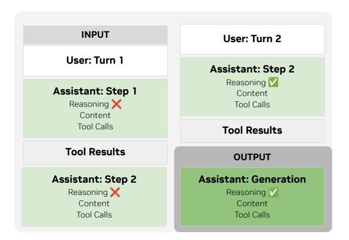
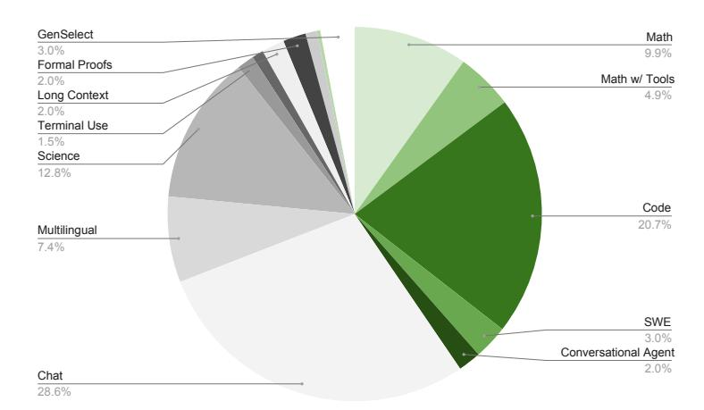
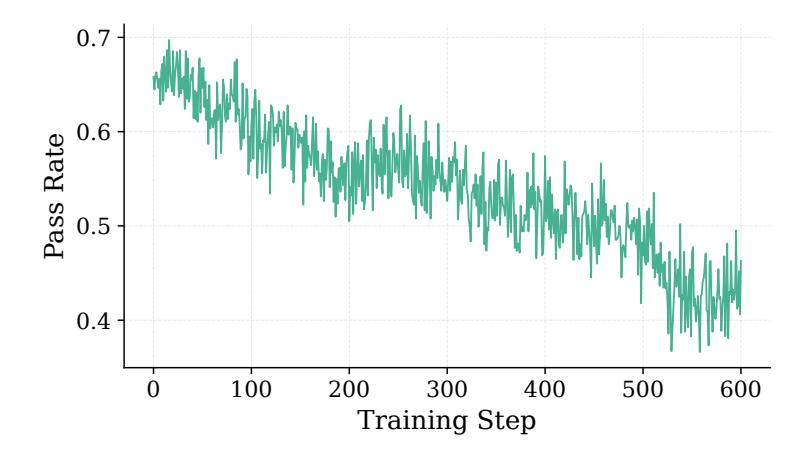
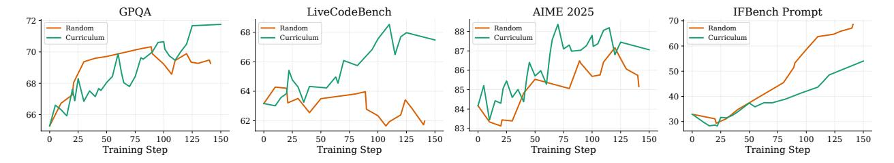
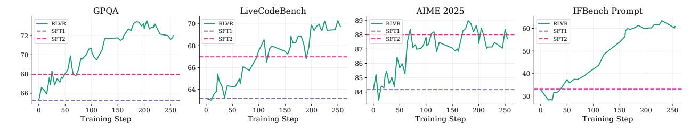
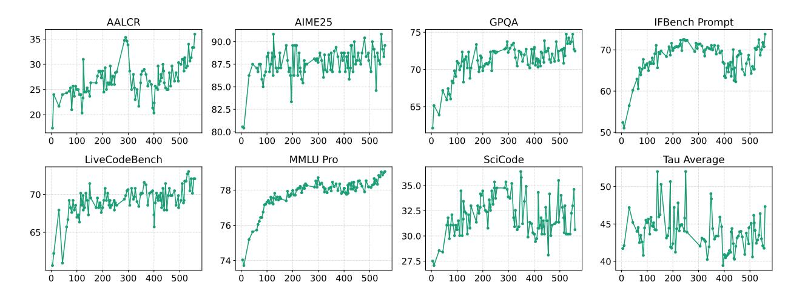
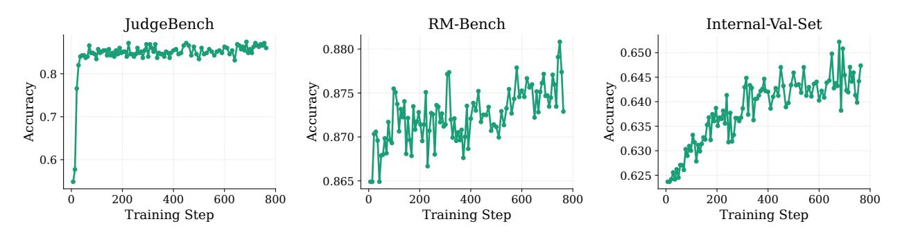
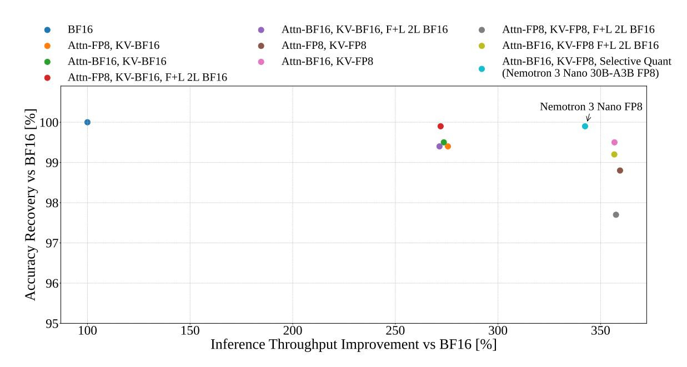

# **3. Post-Training**

In comparison to Nemotron Nano 2, we significantly scale up the compute in post-training for Nemotron 3 Nano. Noticeably Nemotron 3 Nano is our first effort to scale up reinforcement learning (RL) in the post-training stage. This RL scale up is empowered by multi-environment reinforcement learning (discussed in Sections [3.1](#page-10-0) to [3.3\)](#page-18-0), where we train on all environments simultaneously for the first time. We adopted Nemo-Gym, a RL training environment orchestration framework with a large collection of RL environments; this is integrated with Nemo-RL as the RL training framework as discussed in Section [3.2.4](#page-17-0) [\(NVIDIA,](#page-31-8) [2025b](#page-31-8)[,c\)](#page-31-9). We open source Nemo-Gym and Nemo-RL to enable the broader community to facilitate large-scale RL training, as well as collaborative and distributed RL environment building.

In the rest of this section, we discuss the post-training methodology for Nemotron 3 Nano, which includes supervised finetuning (SFT) in [§3.1,](#page-10-0) multi-environment reinforcement learning in [§3.2,](#page-15-0) and reinforcement learning from human feedback (RLHF) in [§3.3.](#page-18-0) The final evaluation results can be found in [§3.4.](#page-20-0) Our post-training methodology results in best-in-class performance in a variety of reasoning and agentic tasks, along with token efficiency, reasoning on/off control, reasoning budget control, and tool-integrated reasoning capabilities.

#### **3.1. Supervised Fine Tuning**

Since the release of Nemotron 2 Nano, we have significantly improved our SFT strategy. We increased dataset quality and diversity, adding a wide variety of new data with an emphasis on multi-step and multi-turn agentic tasks. Different from the SFT data in the pre-training stage, the SFT stage data is more focused on agentic tasks and has the chat-template applied. We release the majority of our training data and open source our SFT codebase.

#### *3.1.1. Chat Template*

We allow using Nemotron 3 Nano in reasoning or non-reasoning mode through the chat template. In reasoning mode, we alter the reasoning flow for the following conversation scenarios:

• *Multi-Step*: In a series of assistant model calls, the existing reasoning tokens are preserved to allow the model to re-use existing reasoning for subsequent step.

5 <https://catalog.ngc.nvidia.com/orgs/nvidia/teams/eval-factory/containers/lm-evaluation-harness> 6 <https://github.com/evalplus/evalplus>

> **[图片提取文字 (无描述)]:**
> INPUT User: Turn 2 User: Turn 1 Assistant: Step 2 Reasoning V Assistant: Step 1 Content Reasoning X Tool Calls Content Tool Calls Tool Results **Tool Results** OUTPUT Assistant: Step 2 Assistant: Generation Reasoning X Reasoning V Content Content Tool Calls Tool Calls

Figure 4 | Example prompt materialization using the Nemotron 3 Nano chat template for a 2-turn conversation. For a given generation, only reasoning content from the current turn is materialized into the prompt.

• *Multi-Turn*: When a user message is introduced, any reasoning from previous turns are dropped.

For tool calling, we use XML-style special tags to reduce character escaping, following the observations of GLM-4.5 [\(Team,](#page-33-3) [2025a\)](#page-33-3) and Qwen3-Coder [\(Yang et al.,](#page-34-0) [2025a\)](#page-34-0).

#### *3.1.2. Data*

**Competition Math.** For math, we use a similar strategy to Nemotron Nano 2 [\(NVIDIA,](#page-32-1) [2025d\)](#page-32-1). However, we refresh the responses with GPT-OSS 120B [\(OpenAI,](#page-32-3) [2025\)](#page-32-3). In addition, we create tool-integrated reasoning traces using Python tools and GPT-OSS 120B as the teacher model.

**Competition Code.** For code we use the same data from Nemotron Nano 2, which is made up of the prompts from [Ahmad et al.](#page-28-3) [\(2025b\)](#page-28-3) complemented with responses from DeepSeek-R1-0528 [\(DeepSeek-AI,](#page-28-6) [2025a\)](#page-28-6).

**Conversational Tool Use.** We generate synthetic multi-turn trajectories to demonstrate conversational tool use. The generation of these trajectories involves a user that is given a task to accomplish, an agent that is instructed to help the user accomplish their task, and a tool execution environment, each of which is simulated by a language model. To limit the trajectories in the SFT training data to ones in which the actions of all of these entities are consistent with their goals, we employ a language model as a judge to evaluate the trajectories, and filter out trajectories for which the judge considers an action of an entity to be inconsistent with its goals. We use Qwen3-235B-A22B-Thinking-2507 [\(Yang et al.,](#page-34-0) [2025a\)](#page-34-0), Qwen3-32B [\(Yang et al.,](#page-34-0) [2025a\)](#page-34-0), GPT-OSS-120b [\(OpenAI,](#page-32-3) [2025\)](#page-32-3), and Qwen3- 235B-A22B-Instruct-2507 [\(Yang et al.,](#page-34-0) [2025a\)](#page-34-0) to generate data in this synthetic tool use trajectory generation pipeline.

**Long Context.** We generate synthetic data with a mean token length of 128k tokens and a maximum of 256k tokens to improve long-context performance, validated against a subset of RULER tasks.

**Formal Proofs.** For Lean theorem proving, we curated SFT data by first autoformalizating 580k natural language theorems from online mathematics communities (AoPS, Math StackExchange, MathOverflow) into 550k Lean 4 statements using an iterative refinement pipeline based on GPT-OSS-120B with backtranslation-based semantic verification. We then ran large-scale proof generation

using Goedel-Prover-V2-32B with up to 4 independent attempts and 8 self-correction rounds per statement, yielding 920k proof traces with compiler-verified solutions. After filtering, the final dataset contains 300k examples pairing formal theorem statements with successful reasoning traces and proofs.

**Multilingual.** We generate multilingual data in a similar manner to Nemotron Nano 2 [\(NVIDIA,](#page-32-1) [2025d\)](#page-32-1). We used Qwen2*.*5-Instruct to translate our existing English post-training data into 5 target languages, French, Spanish, Italian, German and Japanese. Our pipeline translates inputs line-by-line and skips non-translatable content like code, XML tags, URLs, etc. Following the translation of the English source text, we utilized a language identification tool [https://pypi.org/project/](https://pypi.org/project/langdetect/) [langdetect/](https://pypi.org/project/langdetect/) to filter out samples that did not predominantly consist of target language tokens. Additionally, we excluded samples containing specific failure modes where the Qwen model explicitly stated its inability to translate the source text.

Our multilingual corpus was further comprised of 1*.*62 million text translation samples, aggregated from a combination of news-commentary datasets and proprietary sources. These samples covered bidirectional translation tasks between English and the five target languages.

**Terminal Use.** To teach Nemotron 3 Nano to complete autonomous terminal-based tasks, we generate a diverse set of verifiable tasks based on Terminal Bench [\(Team,](#page-33-4) [2025c\)](#page-33-4). In particular, we adapt data from our competitive coding, competitive math, and long context datasets to terminal bench problems. We also constructed synthetic tasks requiring data analysis and file creation and operations. Additionally, we incorporated data from SWE-Smith [\(Yang et al.,](#page-34-4) [2025b\)](#page-34-4), which provides real-world software engineering tasks. We use Qwen3-Coder-480B-A35B-Instruct [\(Qwen,](#page-32-5) [2025\)](#page-32-5) and Kimi-K2-Instruct-0905 [\(Team,](#page-33-5) [2025b\)](#page-33-5) to generate action trajectories for each task using the Terminus-1 and Terminus-2 agents [\(Team,](#page-33-4) [2025c\)](#page-33-4).

**General Chat.** We create SFT data by generating responses to the LMSYS [\(Zheng et al.,](#page-34-5) [2023\)](#page-34-5) and WildChat datasets [\(Li et al.,](#page-30-4) [2024d\)](#page-30-4) using GPT-OSS-120B, Qwen3-235B-A22B-Thinking-2507, and Qwen3-235B-A22B-Instruct-2507. The data is extended to multi-turn by having the same language model simulate the user and further continue the conversation.

**Instruction Following.** We create targeted instruction following data with the methodology used in Tülu 3 [\(Lambert et al.,](#page-30-5) [2025\)](#page-30-5). We simulate users in a conversation using language models seeded with a user persona from Nemotron-Personas-USA [\(Meyer & Corneil,](#page-31-10) [2025\)](#page-31-10) and instructions from IFeval [\(Zhou et al.,](#page-34-6) [2023\)](#page-34-6) and IFBench [\(Pyatkin et al.,](#page-32-6) [2025\)](#page-32-6) train splits. The user language model is prompted to generate precise instruction following queries for one or more turns. We then use GPT-OSS-120B, Qwen3-235B-A22B-Thinking-2507, and Qwen3-235B-A22B-Instruct-2507 to generate responses to the user queries. The generated data is first filtered to only keep samples where all turns pass the respective instruction verifier implementations in IFEval and IFBench. Further filtering is done with a language model judge to remove samples where the responses only trivially or superficially follow instructions.

**Safety.** We compile a diverse set of unsafe prompts sourced from the Nemotron Content Safety v2 [\(Ghosh et al.,](#page-29-5) [2025\)](#page-29-5) and the Gretel Safety Alignment v1 [\(Gretel,](#page-29-6) [2024\)](#page-29-6) datasets to target content safety risks, and Harmful Tasks [\(Hasan et al.,](#page-29-7) [2024\)](#page-29-7) and Red-Team-2K [\(Luo et al.,](#page-31-11) [2024\)](#page-31-11) datasets to target common jailbreak techniques. This collection is further balanced with safe prompts derived from Nemotron Content Safety v2.

For supervised fine-tuning (SFT), we apply safe prompt wrappers to unsafe prompts enabling the models to learn appropriate refusal behaviors while preserving user engagement. Various refusal strategies are implemented to align with good user experience. For instance, self-harm related prompts are paired with prompt templates encouraging the use of appropriate suicide prevention helplines. A content-safety classifier is employed to filter the responses, ensuring alignment with safety objectives.

**Software Engineering.** To train Nemotron 3 Nano for autonomous software engineering capabilities including code exploration, issue reproduction and bug fixing, we curate a dataset of coding tasks derived from real-world GitHub issues. We use the issue description and containerized execution environments from SWE-Gym [\(Pan et al.,](#page-32-7) [2025\)](#page-32-7) and R2E-Gym [\(Jain et al.,](#page-30-6) [2025\)](#page-30-6) datasets. We distill trajectories from three open-source agent harnesses - OpenHands [\(Wang et al.,](#page-33-6) [2025a\)](#page-33-6), SWE-Agent [\(Yang et al.,](#page-34-7) [2024\)](#page-34-7), and Mini-SWE-Agent [\(Yang et al.,](#page-34-7) [2024\)](#page-34-7) using Qwen3-Coder-480B-A35B-Instruct [\(Qwen,](#page-32-5) [2025\)](#page-32-5) as the teacher model.

**Science.** The science dataset spans physics, chemistry, and biology, and is produced through a unified pipeline that integrates synthetic, real, and document-based seed sources. We began by curating a set of challenging seed questions derived from Nemotron Nano v2 [\(NVIDIA,](#page-32-1) [2025d\)](#page-32-1) as well as from scientific articles contained in the pre-training corpus. In parallel, we incorporated additional scientific articles from the same corpus as a complementary reservoir of seed material. Each article was annotated with three attributes: (1) education domain based on bert-based finetuned classifier [\(Li et al.,](#page-30-7) [2024a\)](#page-30-7), (2) content level (ranging from elementary to graduate), and (3) fine-grained topical categories (e.g., biology, chemistry, mathematics, law). Focusing on the graduate-level subset, we indexed these documents in a vector database and used a diverse set of science-oriented query prompts to retrieve thousands of highly relevant passages. These retrieved segments served as the foundation for generating multiple-choice question (MCQ) data, which were subsequently converted into an open-ended question-answering (OpenQA) format.

All seed sources—synthetic, real, and doc-retrieved—were subsequently processed through NeMo Data Designer [\(The NeMo Data Designer Team,](#page-33-0) [2025\)](#page-33-0). The Data Designer was used to paraphrase prompts, produce multiple format and instruction variants, and enhance robustness across prompt styles. Reasoning traces for the SFT stage were generated using tool-integrated Python reasoning traces from GPT-OSS 120B [\(OpenAI,](#page-32-3) [2025\)](#page-32-3). Crucially, all generated variants underwent rigorous LLM-judge filtering, ensuring strict format compliance, intent preservation, and high-quality reasoning consistency. During the RL stage, we further introduced targeted prompt and format augmentations to reduce prompt sensitivity and improve generalization.

A subset of STEM datasets developed in this work are released in both the multiple-choice question (MCQ[7](#page-13-0) ) and open question-answering (OpenQA[8](#page-13-1) ) formats to support Nano-V3 training and broader downstream research. These datasets are fully integrated into the RLVR pipeline, with both MCQ[9](#page-13-2) and OpenQA[10](#page-13-3) environments provided through NeMo Gym [\(NVIDIA,](#page-31-8) [2025b\)](#page-31-8). This unified pipeline ensures consistent quality standards and supports robust reinforcement-learning-based evaluation and training across all STEM domains.

**GenSelect.** We improve our model's capability as a generative reward model by training it to identify the best solution among multiple candidates, following the approach in [Toshniwal et al.](#page-33-7) [\(2025\)](#page-33-7). We adapted the problems in our math and coding SFT data by generating synthetic solutions and then selection reasoning traces including their final verdicts using GPT-OSS 120B [\(OpenAI,](#page-32-3) [2025\)](#page-32-3) and DeepSeek-R1-0528 [\(DeepSeek-AI,](#page-28-6) [2025a\)](#page-28-6).

**CUDA.** We collect and synthesize 21k (PyTorch, Cuda C) pairs with seeds from HuggingFace Transformers [\(Wolf et al.,](#page-33-8) [2020\)](#page-33-8) and KernelBook [\(Paliskara & Saroufim,](#page-32-8) [2025\)](#page-32-8). We first parse the

7 <https://huggingface.co/datasets/nvidia/Nemotron-RL-knowledge-mcqa>

8 <https://huggingface.co/datasets/nvidia/Nemotron-RL-knowledge-openqa>

9 [https://github.com/NVIDIA-NeMo/Gym/tree/main/resources\\_servers/mcqa](https://github.com/NVIDIA-NeMo/Gym/tree/main/resources_servers/mcqa)

10[https://github.com/NVIDIA-NeMo/Gym/tree/main/resources\\_servers/equivalence\\_llm\\_judge](https://github.com/NVIDIA-NeMo/Gym/tree/main/resources_servers/equivalence_llm_judge)

> **[图片提取文字 (无描述)]:**
> GenSelect Math 3.0% 9.9% Formal Proofs Math w/ Tools 2.0% Long Context 4.9% 2.0% Terminal Use 1.5% Science 12.8% Code 20.7% Multilingual 7.4% SWE 3.0% Conversational Agent 2.0% Chat 28.6%

Figure 5 | SFT data blend for Nemotron 3 Nano.

PyTorch code from Transformers [\(Wolf et al.,](#page-33-8) [2020\)](#page-33-8) and KernelBook [\(Paliskara & Saroufim,](#page-32-8) [2025\)](#page-32-8), and then use DeepSeek-R1-0528 [\(DeepSeek-AI,](#page-28-6) [2025a\)](#page-28-6) to generate corresponding Cuda C code. We only include PyTorch, Cuda C pairs with Cuda C code that is successfully compiled and numerically verified against PyTorch reference code.

#### *3.1.3. Data Filtering*

For all domains, we apply a unified data filtering pipeline to ensure that only high-quality, licensecompliant, and verifiable samples are used for training. We first discard malformed examples using structural checks (e.g., missing tool definitions when tool calls are present). We then aggressively filter reasoning traces exhibiting pathological repetition, such as repeated n-grams within a sliding window or across the entire trajectory, which we found to be a strong indicator of malformed or low-quality reasoning. Finally, based on internal audits of synthetically generated datasets, we observed that some teacher models occasionally produce reasoning traces and final responses that implicitly align with specific political entities or promote nationalistic narratives. To mitigate this, we apply targeted keyword- and regex-based filters (e.g., patterns such as "our nation/party [. . . ]", "our values") and remove all trajectories matching such behavior.

#### *3.1.4. Data Mixture*

Our exact data blend can be found in Figure [5](#page-14-0) (all datasets not listed make up less than 1% of the blend). We train over 18M total samples. For each dataset we decide how much data to include based on the approximate amount of data required to achieve optimal performance in single task settings. As the size of different datasets varies significantly, we employ a dynamic sampling approach where smaller datasets may be trained over for many epochs and larger datasets are trained for only a few epochs.

#### *3.1.5. Reasoning Control*

Nemotron 3 Nano allows for two different forms of reasoning control: reasoning on/off control and token budget control. Similar to [NVIDIA](#page-32-1) [\(2025d\)](#page-32-1), to enable reasoning on/off control we strip the reasoning traces from a random 10% of samples, and to enable budget control, we randomly truncate 3% of reasoning traces to different reasoning budgets, before continuing with the original post-reasoning response.

#### *3.1.6. Hyperparameters*

We train for 13000 steps using a batch size of 64 and employ sequence packing to a sequence length of 256K. We use a learning rate of 5 · 10−5 and use 800 steps of learning rate warmup. We use a sequence-level MoE load balancing regularizer and set the loss coefficient to 10−4 .

#### **3.2. Multi environment Reinforcement Learning from Verifiable Rewards**

We employ a unified RLVR stage, training on all environments simultaneously. We find that this results in stable gains across all benchmarks throughout training, while single environment training often results in un-recoverable degradation of other benchmarks. We do two stages of such RLVR: one immediately after SFT and one after RLHF.

#### *3.2.1. Environments*

**Competition Math.** We train on the DAPO [\(Yu et al.,](#page-34-8) [2025\)](#page-34-8) and SkyWorks math [\(He et al.,](#page-29-8) [2025\)](#page-29-8) datasets. These datasets have 17K and 104K tasks respectively.

**Competition Coding.** We use competitive coding problems from [Ahmad et al.](#page-28-3) [\(2025b\)](#page-28-3). We limit the number of unit tests to 50 in order to reduce verification time. This filtering leaves us with 22K tasks.

**Question Answering.** We train on a variety of difficult multiple choice datasets focusing on STEM domains. Here the questions and answers are generated based on information from reference documents. This dataset has with 135K tasks.

**Structured Outputs.** We train Nemotron 3 Nano to have strong JSON schema adherence capabilities. We utilized NeMo Data Designer [\(The NeMo Data Designer Team,](#page-33-0) [2025\)](#page-33-0) to create the seed dataset for RL. We start by constructing (JSON schema, document) pairs conditioned on diverse topics using Qwen3-235B-A22B-Instruct-2507 [\(Yang et al.,](#page-34-0) [2025a\)](#page-34-0). We then utilized these pairs to create RL prompts by taking the model to summarize the document according to the schema. To ensure high syntactic validity, the pipeline enforced strict complexity controls and applied rejection sampling, while simultaneously varying instruction difficulty and phrasing to maximize input diversity. This pipeline produces 9K tasks.

In the RL stage, a positive reward is given when the output matches the exact schema constraints, and no reward is given otherwise. For simplicity, we do not add a reward for the semantic content of the output.

**Instruction Following.** We use two instruction following environments during the training. The first environment is similar to the IFEval style environment used in [NVIDIA](#page-31-3) [\(2025a\)](#page-31-3), but with refreshed constraints from the IFBench training set [\(Pyatkin et al.,](#page-32-6) [2025\)](#page-32-6). We create 46K tasks for this environment.

The second environment uses LLM as a judge to verify whether or not the agent has followed complex instructions in multi-turn settings, where the instructions may be quite subtle. This environment is inspired by the Multi-Challenge benchmark [\(Deshpande et al.,](#page-28-9) [2025\)](#page-28-9). We create 3K total tasks for it.

**Long Context.** We generate challenging long-context QA pairs using Qwen3-235B-A22B-Thinking-2507 [\(Yang et al.,](#page-34-0) [2025a\)](#page-34-0), drawing from a subset of our pre-training mixture designed for multidocument synthesis. Each question is required to reference at least five documents, with the total input limited to 32k tokens. We employ Qwen3-235B-A22B-Instruct-2507 [\(Yang et al.,](#page-34-0) [2025a\)](#page-34-0) as the LLM judge to evaluate the model's rollouts. This dataset contains 12K tasks.

Agentic Tool Use. We use two environments to improve tool use capabilities. The first is Workplace Assistant, a multi-step verifiable tool-calling setup adapted from Styles (Styles et al., 2024) that was also used in Nemotron 2 Nano (NVIDIA, 2025d). This is a tool use - multi step agentic environment that tests the agent's ability to execute tasks in a workplace setting. Workplace Assistant contains a sandbox environment with five databases, 26 tools, and 690 tasks. These tasks represent common business activities, such as sending emails, scheduling meetings, etc. The correctness is verified through executing the tool calls issued by the agent and comparing it to the ground truth database state.

The second environment is a Multi-turn conversational agent environment. It tests an agent's tool-calling and proactive asking capability. Comprising approximately 1K tasks, this environment simulates complex banking scenarios like assisting customers with unblocking a credit card or solving account disputes. The correctness of the agent's actions is automatically verified by executing the tool calls it issues and comparing the resulting database state against the predefined ground truth.

#### 3.2.2. Data Mixture and Curriculum

We begin by profiling all reinforcement learning (RL) tasks using our supervised fine-tuning (SFT) checkpoint. To focus training on challenging cases, we filter out samples where the SFT checkpoint already achieves a 100% pass rate. We then adopt the curriculum training method introduced in NVIDIA (2025a), which dynamically adjusts task difficulty throughout training.

In each batch, we maintain a fixed ratio of samples across different domains. For each domain, we model the target pass-rate distribution as a Gaussian function, shifting from high pass-rate (easier) samples early in training to low pass-rate (harder) samples later. The target mean of Gaussian distribution decreases linearly throughout training steps. Within each batch, samples from different domains are shuffled. This Gaussian sampling strategy prevents overfitting to either overly easy or overly difficult examples, ensuring a balanced learning progression.

This approach enables a controlled and gradual increase in task difficulty while preserving domain diversity and ensuring efficient batch composition. Figure 6 illustrates how sample difficulty evolves over the course of RL training. Once training progress plateaus, we re-profile the tasks using the best RL checkpoint and construct a new curriculum to further refine performance.

> **[图片提取文字 (无描述)]:**
> 0.7 0.6 Pass Rate 0.5 0.4 100 600 400 500 200 300 Training Step

Figure 6 | Batch-wise pass rates across the RL curriculum.

We compare curriculum sampling against random sampling using an intermediate SFT checkpoint, maintaining identical domain ratios in both cases. As shown in Figure 7, curriculum sampling ensures stable learning across multiple domains throughout training. In contrast, random sampling

biases the model toward easier tasks, preventing it from effectively learning more challenging ones.

> **[图片提取文字 (无描述)]:**
> **GPQA** LiveCodeBench **AIME 2025** IFBench Prompt 72 70 Random Random Random Random 68 -88 -Curriculum - Curriculum Curriculum — Curriculum 60 87 70 66 86 50 68 85 64 40 84 66 -62 30 83 -150 100 125 150 125 25 125 150 100 150 Training Step Training Step Training Step Training Step

Figure 7 | Comparison between curriculum sampling and random sampling.

#### *3.2.3. Surpassing SFT with RLVR*

Recent works have demonstrated that supervised fine-tuning (SFT) alone on small models can achieve strong performance [\(Ahmad et al.,](#page-28-3) [2025b;](#page-28-3) [DeepSeek-AI,](#page-28-6) [2025a\)](#page-28-6). In this study, we investigate whether RLVR can outperform a heavily fine-tuned SFT baseline. As illustrated in Figure [8,](#page-17-2) we compare the accuracy of model during RLVR training with two SFT checkpoints:

- SFT1: Our initial RLVR starting point, fine-tuned for approximately 3 epochs.
- SFT2: A heavily fine-tuned checkpoint, trained to full convergence (approximately 5 epochs).

Our results show that even with relatively short training, RLVR consistently exceeds or matches the accuracy of the heavily fine-tuned SFT model across all evaluated domains.

> **[图片提取文字 (无描述)]:**
> **GPQA** LiveCodeBench IFBench Prompt AIME 2025 89 - RLVR 70 -— RLVR - RLVR - RLVR 60 SFT1 -- SFT1 SFT1 88 72 --- SFT2 SFT2 SFT2 68 87 50 70 -86 66 -40 68 85 64 66 84 30 200 250 150 200 250 150 250 250 50 150 50 100 50 100 200 50 100 150 200 Training Step Training Step Training Step Training Step

Figure 8 | RLVR surpasses or matches heavily fine-tuned SFT model across all evaluated domains.

#### *3.2.4. Infrastructure*

RL at the frontier of model post-training is currently defined by scaling up to an increasing diversity of tasks or environments designed for the model to learn increasingly general capabilities. Scaling RL to many environments requires a high-performance, extensible, and standardized interface for coordinating between rollouts and training. To address the scaling performance and extensibility challenges using one standard framework, we adopt NeMo Gym [\(NVIDIA,](#page-31-8) [2025b\)](#page-31-8) and NeMo RL [\(NVIDIA,](#page-31-9) [2025c\)](#page-31-9) for enabling large-scale RL on many different environments/verifiers.

NeMo Gym is based on the abstraction of *servers*. There are three core varieties of servers in Gym: (1) *agents*, (2) *models*, and (3) *resources*. An *agent* server implements the rollout kernel of a RL environment. A *model* server wraps an inference engine such as vLLM [\(Kwon et al.,](#page-30-8) [2023\)](#page-30-8) to provide a prompt-response API, and also carefully preserves token and inference log-prob data and metadata required for RL. A *resource* server provides a verification API for computing rewards from a given rollout.

Our Nemotron Nano 3 RLVR experiments were all based on an integrated infrastructure of NeMo RL and NeMo Gym: NeMo RL acts as the RL training loop controller, using Megatron-Core [\(Shoeybi](#page-32-10) [et al.,](#page-32-10) [2020\)](#page-32-10) for model training at scale, and routing all rollouts through NeMo Gym and vLLM.

#### *3.2.5. Algorithm*

We train Nemotron 3 Nano using synchronous GRPO with masked importance sampling to mitigate training-inference misalignment [\(Shao et al.,](#page-32-11) [2024;](#page-32-11) [Team et al.,](#page-33-9) [2025;](#page-33-9) [Yao et al.,](#page-34-9) [2025\)](#page-34-9). We use 128 prompts per step and use 16 generations per prompt. We train with a batch size of 2048, making our updates on-policy. To further stabilize training we also freeze the MoE router weights. We employ the aux-loss-free load balancing approach and keep updating expert bias [\(Wang et al.,](#page-33-2) [2024\)](#page-33-2).

Our entire training run is done with a maximum generation length of 49K. We use overlong filtering [\(Yu et al.,](#page-34-8) [2025\)](#page-34-8), which we find boosts performance on reasoning intensive benchmarks.

> **[图片提取文字 (无描述)]:**
> **AALCR** AIME25 **GPQA** IFBench Prompt 90.0 87.5 85.0 82.5 80.0 LiveCodeBench SciCode Tau Average MMLU Pro 35.0 32.5 30.0 27.5 40 -

Figure 9 | Benchmark performance throughout RL training.

#### **3.3. Reinforcement Learning from Human Feedback**

## *3.3.1. Scaling Reinforcement Learning for Generative Reward-Model Training*

Many recent works [\(Liu et al.,](#page-31-12) [2025b;](#page-31-12) [Wang et al.,](#page-33-10) [2025b;](#page-33-10) [Chen et al.,](#page-28-10) [2025\)](#page-28-10) have demonstrated that generative reward models (GenRMs) generalize better than traditional Bradley-Terry models, reducing the risk of reward hacking during RLHF. In order to train an accurate and robust GenRM, we leverage reinforcement learning at scale. Building on the methodology of [Wang et al.](#page-33-10) [\(2025b\)](#page-33-10), we train Qwen3-235B-A22B-Thinking-2507 [\(Yang et al.,](#page-34-0) [2025a\)](#page-34-0) to become a GenRM with GRPO algorithm. Given the conversation history, a new user request, and two candidate assistant responses, the GenRM first reasons through the strength and weakness of both responses, then produce an individual helpfulness score for each response as well as a ranking score. For GenRM training, we use 128 prompts per batch, 8 generations per prompt, and do one gradient step on the full batch. We define the reward as

$$\mathbf{R} = -C_1 I_{\text{format}} - |P_{h1} - G_{h1}| - |P_{h2} - G_{h2}| - C_2 |P_r - G_r|, \tag{1}$$

where , denote the predicted and ground-truth preference rankings; *ℎ*1, *ℎ*1, *ℎ*2, *ℎ*2 denote the predicted and ground-truth helpfulness scores for responses 1 and 2, respectively;  indicates whether the prediction violates the format requirement;  $C_1$  and  $C_2$  are hyper-parameters controlling the weights. We set  $C_1 = 10$  and  $C_2 = 1$ .

We leverage data from HelpSteer3 (Wang et al., 2025b), a commercially-friendly subset of lmarena-ai/arena-human-preference-140k (Chiang et al., 2024), and a synthetic safety blend (see details in Appendix D) for model training. In our dataset, individual helpfulness scores range from 1 to 5, where higher means more helpful, while ranking score ranges from 1 to 6, in which 1 denotes that response 1 is far superior to response 2 and 6 denotes that response 2 is far superior to response 1 (Wang et al., 2025b). We augment each sample by switching positions of two responses to prevent positional bias. Figure 10 demonstrates that the performance of GenRM on RM-Bench (Liu et al., 2024), JudgeBench (Tan et al., 2024), and our internal validation set steadily improves as training progresses.

> **[图片提取文字 (无描述)]:**
> JudgeBench RM-Bench Internal-Val-Set 0.880 -0.650 0.8 0.645 Accuracy - 528.0 Accuracy ccuracy 0.640 0.635 -0.630 0.6 0.625 0.865 -800 800 200 400 600 800 200 400 600 200 400 600 Training Step Training Step Training Step

Figure 10 | GenRM performance improves across benchmarks as we scale up RL training.

#### 3.3.2. RLHF with Group Relative Length Control

With a trained GenRM, we conduct RLHF on the same set of prompts. Same as RLVR, we use a batch of 128 prompts and 16 responses per prompt. Naively comparing all pairs of N responses would require  $\binom{N}{2}$  GenRM calls per prompt, which scales quadratically and becomes prohibitively expensive for large N. With N=16 responses, this would require 120 comparisons per prompt. Instead, we adopt a circular comparison strategy where each response is compared only with its successor:  $(r_1, r_2), (r_2, r_3), \ldots, (r_{N-1}, r_N), (r_N, r_1)$ , yielding exactly N comparisons. This reduces computational cost from  $O(N^2)$  to O(N) while still connecting all responses in a comparison graph. Each response is also judged twice in different positions so as to alleviate positional bias.

For each pairwise comparison  $(r_i, r_j)$ , the GenRM produces individual helpfulness scores  $s_i, s_j \in [1, 5]$  and a ranking score  $s_r \in [1, 6]$ . In the case where  $s_i = s_j$ , we further employ a simple tiebreaker mechanism:

$$s_i = s_i + (3.5 - s_r), (2)$$

$$s_j = s_j + (s_r - 3.5). (3)$$

The base reward  $R_i^{\text{(base)}}$  for response  $r_i$  is then computed by averaging its scores from two matches.

When training with base reward, we find that the length of response can rapidly increase as RLHF training proceeds. This is different from reward hacking, as the increase of length mostly comes from reasoning trace while only final answer is judged by GenRM. It is similar to observations in DeepSeek-AI (2025a) where model spends more inference time compute to achieve better rewards. However, unlike reasoning heavy tasks like math and coding, prompts in RLHF datasets usually don't

require extensive reasoning. In order to reduce redundant thinking, we propose a Group Relative Length Control mechanism during RLHF. Specifically, for each prompt, we generate a group of candidate responses {1*,* 2*, . . . ,*  }. Each response is decomposed into a reasoning component (think) and an answer component (answer) , with corresponding lengths *ℓ* (think) and *ℓ* (answer) .

**Length-Normalized Reward Adjustment.** We compute a zero-mean, group-relative length bonus that encourages shorter responses within a group. For the reasoning component, we first normalize lengths within the group

$$w_i^{(\text{think})} = 1 - \frac{\ell_i^{(\text{think})} - \ell_{\min}^{(\text{think})}}{\ell_{\max}^{(\text{think})} - \ell_{\min}^{(\text{think})}},\tag{4}$$

where *ℓ* (think) min = min *ℓ* (think) and *ℓ* (think) max = max *ℓ* (think) . To ensure the adjustment is zero-sum across the group (preserving the overall reward scale), we center the weights

$$\tilde{w}_i^{\text{(think)}} = w_i^{\text{(think)}} - \frac{1}{N} \sum_{j=1}^N w_j^{\text{(think)}}.$$
 (5)

The same procedure is applied to answer lengths to obtain ˜ (answer) . The final reward for response is then

$$R_i = R_i^{\text{(base)}} + \lambda^{\text{(think)}} \tilde{w}_i^{\text{(think)}} + \lambda^{\text{(answer)}} \tilde{w}_i^{\text{(answer)}}, \tag{6}$$

where (base) is the base reward from pairwise comparisons and (think) *,* (answer) are coefficients controlling the strength of the length penalty. We set (think) = 0*.*5, (answer) = 0*.*5.

**Quality-Gated Conciseness Bonus.** To further encourage concise responses without sacrificing quality, we introduce optional bonuses for the shortest responses that achieve top-tier quality scores. Let denote the -th percentile threshold of scores within the group. For the response with minimum reasoning length:

$$R_k \leftarrow R_k + \beta^{(\text{think})} \cdot \mathbb{1}\left[R_k^{(\text{base})} \ge \tau_p\right]$$

Similarly, for the response with minimum answer length:

$$R_m \leftarrow R_m + \beta^{(\text{answer})} \cdot \mathbb{1}\left[R_m^{(\text{base})} \ge \tau_p\right]$$

where (think) and (answer) are the reasoning and answer conciseness bonuses respectively, and ⊮[·] is the indicator function. We set (think) = 0*.*5, (answer) = 0*.*5, and = 80.

This mechanism ensures that (1) length penalties are relative within each prompt group rather than absolute, avoiding bias against inherently complex problems; and (2) conciseness bonuses are only awarded to high-quality responses, preventing the model from learning to produce short but low-quality answers. We observe that the verbosity level reduces 30% during the training without sacrificing accuracy.

| Benchmark                          | N-3-Nano | Qwen3  | GPT-OSS |
|------------------------------------|----------|--------|---------|
| General Knowledge                  |          |        |         |
| MMLU-Pro                           | 78.30    | 80.90  | 75.00   |
| Reasoning                          |          |        |         |
| AIME25 (no tools)                  | 89.06    | 85.00  | 91.70   |
| AIME25 (with tools)                | 99.17    | -      | 98.7    |
| GPQA (no tools)                    | 73.04    | 73.40  | 71.50   |
| GPQA (with tools)                  | 75.00    | -      | 74.20   |
| LiveCodeBench (v6 2024-08↔2025-05) | 68.25    | 66.00  | 61.00   |
| SciCode (subtask)                  | 33.28    | 33.00  | 34.00   |
| HLE (no tools)                     | 10.57    | 9.80   | 10.90   |
| HLE (with tools)                   | 15.48    | -      | 17.30   |
| MiniF2F pass@1                     | 50.03    | 5.72*  | 12.05*  |
| MiniF2F pass@32                    | 79.92    | 16.80* | 43.03*  |
| Agentic                            |          |        |         |
| Terminal Bench (hard subset)       | 8.51     | 5.00   | 10.00   |
| SWE-Bench (OpenHands)              | 38.76    | 22.00* | 34.00*  |
| TauBench V2                        |          |        |         |
| Airline                            | 48.00    | 58.00  | 38.00   |
| Retail                             | 56.91    | 58.80  | 54.80   |
| Telecom                            | 42.21    | 26.30  | 49.70   |
| Average                            | 49.04    | 47.70  | 47.50   |
| BFCL v4                            | 53.76    | 46.40* | -       |
| Chat & Instruction Following       |          |        |         |
| IFBench (prompt)                   | 71.51    | 51.00  | 65.00   |
| Scale AI Multi Challenge           | 38.45    | 44.75  | 33.75   |
| Arena-Hard-V2 (Hard Prompt)        | 72.10    | 49.60* | 71.20*  |
| Arena-Hard-V2 (Creative Writing)   | 63.20    | 66.00* | 25.90*  |
| Arena-Hard-V2 (Average)            | 67.65    | 57.80  | 48.55   |
| Long Context                       |          |        |         |
| AA-LCR                             | 35.85    | 59.00  | 34.00   |
| RULER-100 @ 256k                   | 92.92    | 89.40  | -       |
| RULER-100 @ 512K                   | 91.25    | 84.00  | -       |
| RULER-100 @ 1M                     | 86.34    | 77.50  | -       |
| Multilingual                       |          |        |         |
| MMLU-ProX (avg over langs)         | 59.50    | 77.60* | 69.10*  |
| WMT24++ (en→xx)                    | 86.20    | 85.60  | 83.20   |

Table 3 | Nemotron 3 Nano compared to Qwen3-30B-A3B-Thinking-2507, and GPT-OSS 20B.

#### **3.4. Post-trained Model Evaluations**

#### *3.4.1. Evaluation Benchmarks*

We evaluate Nemotron 3 Nano across a broad suite of established benchmarks spanning mathematical and scientific reasoning, coding, agentic tool use, instruction following, long-context understanding, and multilingual capability. Table [3](#page-21-0) summarizes the final results.

All evaluation results were collected via Nemo Evaluator SDK[11](#page-22-0) and for most benchmarks, the Nemo Skills Harness[12](#page-22-1). For reproducibility purposes, the open source container on Nemo Skills packaged via NVIDIA's Nemo Evaluator SDK used for evaluations can be found here[13](#page-22-2). In addition to Nemo Skills, the evaluations also used dedicated packaged containers for Tau-2 Bench, ArenaHard v2, AA\_LCR. More details on the evaluation settings can be found in the Nemo Evaluator SDK configs folder[14](#page-22-3). The following benchmarks are not onboarded yet in our open source tools and for these we used their official open source implementation: Terminal Bench, SWE-Bench, Scale AI Multi Challenge.

For mathematical and STEM reasoning, we evaluate on AIME25 (with and without tools), GPQA [\(Rein et al.,](#page-32-12) [2023\)](#page-32-12), LiveCodeBench v6 [\(Jain et al.,](#page-29-9) [2024\)](#page-29-9), SciCode [\(Tian et al.,](#page-33-12) [2024\)](#page-33-12), and Humanity's Last Exam [\(Phan et al.,](#page-32-13) [2025\)](#page-32-13). We additionally include MMLU-Pro to assess general academic and knowledge-intensive reasoning.

Agentic and tool-augmented capabilities are measured using TerminalBench, SWE-Bench (OpenHands) [\(Jimenez et al.,](#page-30-9) [2023;](#page-30-9) [Wang et al.,](#page-33-6) [2025a\)](#page-33-6), TauBench V2 (airline, retail, telecom) [\(Barres et al.,](#page-28-12) [2025\)](#page-28-12), and BFCL v4 [\(Patil et al.,](#page-32-14) [2025\)](#page-32-14), each of which provides verifiable reward signals via unit tests, database state transitions, or structured schema constraints.

Instruction-following and conversational ability are evaluated with IFBench, Scale AI Multi-Challenge, and Arena-Hard-V2 [\(Li et al.,](#page-30-10) [2024c\)](#page-30-10). These benchmarks probe multi-constraint instructions, preference-aligned chat behavior, and faithfulness to user intent. For Arena-Hard-V2, we follow [Yang et al.](#page-34-0) [\(2025a\)](#page-34-0) and use GPT-4.1 as judge.

Long-context performance is assessed with RULER-100 at 256k, 512k, and 1M tokens [\(Hsieh](#page-29-10) [et al.,](#page-29-10) [2024\)](#page-29-10), together with AA-LCR, evaluating retrieval, stability, and chain-of-thought coherence over extreme context lengths. RULER-100 is evaluated with reasoning off, whereas AA-LCR is measured with reasoning on.

For multilingual capability, we report results on MMLU-ProX [\(Xuan et al.,](#page-34-10) [2025\)](#page-34-10) and WMT24++ (en→xx) [\(Deutsch et al.,](#page-28-13) [2025\)](#page-28-13), covering a mix of reasoning and translation settings across multiple high-resource languages.

For comparison with GPT-OSS 20B and Qwen3-30B-A3B-Thinking-2507, we use the officially reported numbers whenever available; if a benchmark is not reported, we take the value from ArtificialAnalysis (AA)[15](#page-22-4); and if neither source provides results, we may compute the scores ourselves using the official evaluation protocol.

Table [3](#page-21-0) presents a comprehensive performance comparison between the three models. Nemotron 3 Nano shows strong results, surpassing both GPT-OSS 20B and Qwen3-30B-A3B-Thinking-2507 in all categories. On reasoning benchmarks Nemotron 3 Nano surpasses the Qwen3 model and is

11<https://github.com/NVIDIA-NeMo/Evaluator>

12<https://github.com/NVIDIA-NeMo/Skills>

13[https://catalog.ngc.nvidia.com/orgs/nvidia/teams/eval-factory/containers/nemo\\_skills](https://catalog.ngc.nvidia.com/orgs/nvidia/teams/eval-factory/containers/nemo_skills)

14<https://github.com/NVIDIA-NeMo/Evaluator>

15<https://artificialanalysis.ai/>

competitive with GPT-OSS, which was the previous best model in these categories. In the agentic, chat, and long context categories Nemotron 3 Nano significantly outperforms both of the other models, demonstrating the strength of our post-training pipeline.

## **4. Quantization**

After post-training the model in BF16, we applied Post-Training Quantization (PTQ) using ModelOpt[16](#page-23-2) and Megatron-LM to quantize the model to FP8.

#### **4.1. Post-Training Quantization Calibration Dataset**

For PTQ calibration, we used a small subset containing 1K samples from post-training reasoning SFT dataset. Using calibration data based on the post-training SFT data yielded slightly better accuracy recovery compared to the cnn\_dailymail dataset.

We also ablated with PTQ using calibration data curated from on-policy generations from the BF16 model, but did not observe any benefit in accuracy recovery compared to the SFT-based calibration dataset.

#### **4.2. Selective Post-Training Quantization**

To preserve accuracy while improving efficiency, we used a selective quantization strategy. We performed quantization sensitivity analysis and explored a set of quantization configurations for mixed-precision models. This study showed that self-attention layers (6 out of 52 layers for Nemotron 3 Nano) are the most sensitive components, hence we keep them in BF16. Also, the Mamba layers that feed into the self-attention layers were found to be sensitive and are kept in BF16. Overall, keeping the 6 self-attention layers and the 6 Mamba layers in BF16 provided a sweet-spot configuration for accuracy recovery and efficiency trade-off.

The model weights, activations, and KV cache are quantized to FP8. Conv1D within all the Mamba layers are kept in BF16.

#### **4.3. Accuracy and Throughput**

Table [4](#page-24-0) compares accuracy numbers of Nemotron 3 Nano FP8 with BF16 on multiple benchmarks. Overall, the FP8 model achieves approximately 99% median accuracy recovery compared to the BF16 model.

To verify the effectiveness of our selective quantization strategy and to better understand the accuracy–efficiency trade-off, we evaluated several quantization configurations. We conducted an ablation study by applying PTQ to different model components. Specifically, we examined three factors: attention layer quantization (BF16 or FP8), Mamba layer quantization (FP8 or a mix of BF16 and FP8), and KV cache quantization (BF16 or FP8).

As shown in Figure [11,](#page-25-0) KV cache with FP8 quantization significantly improves throughput by enabling larger batch sizes. While other quantization configurations suffer from accuracy degradation, our selective quantization can retain the accuracy numbers even with KV cache quantization. The results confirm that retaining the self-attention layers and their preceding Mamba layers in BF16, while quantizing the remaining layers and the KV cache in FP8, yields a strong accuracy–efficiency trade-off.

16<https://github.com/NVIDIA/Model-Optimizer>

| Benchmark                          | N-3-Nano BF16 | N-3-Nano FP8 |  |  |  |  |
|------------------------------------|---------------|--------------|--|--|--|--|
| General Knowledge                  |               |              |  |  |  |  |
| MMLU-Pro                           | 78.30         | 78.10        |  |  |  |  |
| Reasoning                          |               |              |  |  |  |  |
| AIME25 (no tools)                  | 89.06         | 87.71        |  |  |  |  |
| AIME25 (with tools)                | 99.17         | 98.80        |  |  |  |  |
| GPQA (no tools)                    | 73.04         | 72.47        |  |  |  |  |
| GPQA (with tools)                  | 75.00         | 73.40        |  |  |  |  |
| LiveCodeBench (v6 2024-08↔2025-05) | 68.25         | 67.62        |  |  |  |  |
| SciCode (subtask)                  | 33.28         | 31.88        |  |  |  |  |
| HLE (no tools)                     | 10.57         | 10.33        |  |  |  |  |
| HLE (with tools)                   | 15.48         | 14.27        |  |  |  |  |
| Agentic                            |               |              |  |  |  |  |
| TauBench V2                        |               |              |  |  |  |  |
| Airline                            | 48.00         | 44.79        |  |  |  |  |
| Retail                             | 56.91         | 55.59        |  |  |  |  |
| Telecom                            | 42.21         | 40.75        |  |  |  |  |
| Average                            | 49.04         | 47.04        |  |  |  |  |
| BFCL v4                            | 53.76         | 53.15        |  |  |  |  |
| Chat & Instruction Following       |               |              |  |  |  |  |
| IFBench (prompt)                   | 71.51         | 72.19        |  |  |  |  |
| Long Context                       |               |              |  |  |  |  |
| AA-LCR                             | 35.85         | 36.06        |  |  |  |  |
| Multilingual                       |               |              |  |  |  |  |
| MMLU-ProX (avg over langs)         | 59.50         | 59.63        |  |  |  |  |

Table 4 | Accuracy numbers of Nemotron 3 Nano before/after FP8 quantization.

> **[图片提取文字 (无描述)]:**
> BF16 Attn-BF16, KV-BF16, F+L 2L BF16 Attn-FP8, KV-FP8, F+L 2L BF16 Attn-FP8, KV-BF16 Attn-FP8, KV-FP8 Attn-BF16, KV-FP8 F+L 2L BF16 Attn-BF16, KV-BF16 Attn-BF16, KV-FP8 Attn-BF16, KV-FP8, Selective Quant (Nemotron 3 Nano 30B-A3B FP8) Attn-FP8, KV-BF16, F+L 2L BF16 Nemotron 3 Nano FP8 Accuracy Recovery vs BF16 [%] 100 99 98 96 95 100 150 200 250 300 350 Inference Throughput Improvement vs BF16 [%]

Figure 11 | Ablation study of different quantization configurations for accuracy—throughput trade-offs. Accuracy recovery and throughput improvements are computed relative to the Nemotron 3 Nano BF16 checkpoint, with values normalized such that the BF16 baseline is 100%. Accuracy recovery is defined as the median of the recovery rates across all benchmarks. The benchmark was conducted on a single H100 with ISL/OSL=8K/16K. Given that more aggressively quantized models can accommodate larger batch sizes due to lower memory footprint, we used the maximum batch size for each quantization configuration for fair comparisons under the same hardware constraints.

#### 5. Conclusion

We present Nemotron 3 Nano, an open and efficient MoE Hybrid Mamba-Transformer model for agentic reasoning. Nemotron 3 Nano achieves better or on-par accuracy than competitive models while having up-to  $3.3 \times$  higher inference throughput. Nemotron 3 Nano supports context lengths of up to 1M tokens. We have released the weights for both the base (Nemotron 3 Nano 30B-A3B Base) and final (Nemotron 3 Nano 30B-A3B) models on HuggingFace. Along with the weights, we have also open-sourced the training recipe, data, and code.

#### Contributors

We thank the following people for their invaluable contributions to NVIDIA Nemotron 3 Nano.

Pretraining Data. Abhinav Khattar, Aleksander Ficek, Alisa Liu, Arham Mehta, Asif Ahamed, Ayush Dattagupta, Benedikt Schifferer, Brandon Norick, Branislav Kisacanin, Dan Su, Dane Corneil, Daria Gitman, Dhruv Nathawani, Dima Rekesh, Divyanshu Kakwani, Edgar Minasyan, Eileen Long, Ellie Evans, Eric Tramel, Evelina Bakhturina, Felipe Soares, Feng Chen, Gantavya Bhatt, George Armstrong, Igor Gitman, Ivan Moshkov, Jane Polak Scowcroft, John Kamalu, Johnny Greco, Joseph Jennings, Jupinder Parmar, Kezhi Kong, Markus Kliegl, Maarten Van Segbroeck, Matvei Novikov, Mehrzad Samadi, Miguel Martinez, Mohammad Shoeybi, Mostofa Patwary, Nabin Mulepati, Oleksii Hrinchuk, Rabeeh Karimi Mahabadi, Rima Shahbazyan, Riyad Islam, Roger Waleffe, Rohit Watve, Sadegh Mahdavi, Sanjeev Satheesh, Sean Narentharen, Shrimai Prabhumoye, Shubham Pachori, Shubham Toshniwal, Shuoyang Ding, Somshubra Majumdar, Stephen Ge, Sumeet Kumar Barua,

Suseella Panguluri, Syeda Nahida Akter, Vahid Noorozi, Vitaly Kurin, Vitaly Lavrukhin, Wasi Uddin Ahmad, Wei Du, Wei Ping, Yejin Choi, Yev Meyer, Ying Lin, Zihan Liu

**Architecture.** Abhinav Khattar, Bita Darvish Rouhani, Deepak Narayanan, Ilya Loshchilov, Jatin Mitra, Joey Guman, Mohammad Shoeybi, Mostofa Patwary, Kezhi Kong, Krishna C. Puvvada, Maor Ashkenazi, Nidhi Bhatia, Pavlo Molchanov, Rabeeh Karimi Mahabadi, Rasoul Shafipour, Ritika Borkar, Roger Waleffe, Ryan Prenger, Sanjeev Satheesh, Venmugil Elango, Yonggan Fu

**Pretraining Software.** Aarti Basant, Ashwath Aithal, Abhinav Khattar, Deepak Narayanan, Duncan Riach, Eric Harper, Hexin Wang, Jared Casper, Jimmy Zhang, Kezhi Kong, Mike Chrzanowski, Nima Tajbakhsh, Pranav Prashant Thombre, Roger Waleffe, Russell J. Hewett, Seonmyeong Bak, Shiqing Fan, Vijay Korthikanti, Xiaowei Ren, Yashaswi Karnati, Zijie Yan

**Pretraining.** Abhinav Khattar, Brandon Norick, Dan Su, Eric Tramel, Deepak Narayanan, John Kamalu, Joseph Jennings, Jupinder Parmar, Markus Kliegl, Miguel Martinez, Mohammad Shoeybi, Mostofa Patwary, Kezhi Kong, Kevin Shih, Rabeeh Karimi Mahabadi, Roger Waleffe, Ryan Prenger, Shrimai Prabhumoye, Sanjeev Satheesh, Syeda Nahida Akter, Ying Lin

**Long Context.** Boris Ginsburg, Cheng-Ping Hsieh, Dan Su, Dima Rekesh, Faisal Ladhak, Fei Jia, John Kamalu, Kezhi Kong, Krishna C. Puvvada, Markus Kliegl, Mostofa Patwary, Roger Waleffe, Samuel Kriman, Sanjeev Satheesh, Shantanu Acharya, Simeng Sun, Ushnish De

**Posttraining Software.** Adi Renduchintala, Alexander Bukharin, Ali Taghibakhshi, Banghua Zhu, Brian Yu, Duncan Riach, Frankie Siino, Gerald Shen, Jiaqi Zeng, Kezhi Kong, Li Ding, Luis Vega, Maanu Grover, Marc Romeijn, Parth Chadha, Peter Jin, Soumye Singhal, Terry Kong, Tugrul Konuk, Yi-Fu Wu, Yubo Gao

**Posttraining.** Abhibha Gupta, Adi Renduchintala, Akanksha Shukla, Aleksander Ficek, Alexander Bukharin, Ameya Sunil Mahabaleshwarkar, Banghua Zhu, Besmira Nushi, Branislav Kisacanin, Cheng-Ping Hsieh, Charles Wang, Damon Mosk-Aoyama, Daria Gitman, Dhruv Nathawani, Dima Rekesh, Edgar Minasyan, Edward Lin, Evelina Bakhturina, Fei Jia, Felipe Soares, Feng Chen, George Armstrong, Grigor Nalbandyan, Haifeng Qian, Hayley Ross, Igor Gitman, Ivan Moshkov, Jeffrey Glick, Jiaqi Zeng, Jian Zhang, Jie Lou, Julien Veron Vialard, Junkeun Yi, Katherine Luna, Khushi Bhardwaj, Krishna C. Puvvada, Luis Vega, Makesh Narsimhan Sreedhar, Matvei Novikov, Mehrzad Samadi, Mengru Wang, Michael Evans, Nikolai Ludwig, Oleksii Hrinchuk, Oleksii Kuchaiev, Olivier Delalleau, Ouye Xie, Peter Jin, Pritam Gundecha, Prasoon Varshney, Rima Shahbazyan, Ritu Gala, Sadegh Mahdavi, Sahil Modi, Sanjay Kariyappa, Sean Narenthiran, Shantanu Acharya, Shubham Toshniwal, Shuoyang Ding, Somshubra Majumdar, Soumye Singhal, Stephen Ge, Sugam Dipak Devare, Suseella Panguluri, Tugrul Konuk, Vahid Noroozi, Venkat Srinivasan, Vitaly Lavrukhin, Wasi Uddin Ahmad, Wei Du, Yev Meyer, Yian Zhang, Yoshi Suhara

**Evaluation, Safety and Release.** Aaron Grattafiori, Barnaby Simkin, Besmira Nushi, Bilal Kartal, Christopher Parisien, Daniel Rohrer, David Mosallanezhad, Eileen Peters Long, Erick Galinkin, Fay Wang, Ferenc Galko, Gorkem Batmaz, Jane Polak Scowcroft, Katherine Luna, Khushi Bhardwaj, Leon Derczynski, Michael Boone, Michael Evans, Piotr Januszewski, Rich Harang, Rishabh Garg, Riyad Islam, Sanjay Kariyappa, Sanjeev Satheesh, Shaona Ghosh, Wojciech Prazuch, Yoshi Subara, Zhen Dong, Zijia Chen

**Infrastructure.** Aaron Blakeman, Anubhav Mandarwal, Alex Kondratenko, Aleksandr Shaposhnikov, Ashwin Poojary, Brandon Soubasis, Collin Neale, Dong Ahn, Evan Briones, Gargi Prasad, Harsh Sharma, Herman Sahota, Himanshu Soni, Jining Huang, Kumar Anik, Maer Rodrigues de Melo, Nikhil Jukar, Pasha Shamis, Rick Izzo, Ruoxi Zhang, Satish Pasumarthi, Sergey Kashirsky, Shelby Thomas, Stefania Alborghetti

**Quantization.** Aditya Vavre, Akhiad Bercovich, Ameya Sunil Mahabaleshwarkar, Amnon Geifman, Asma Kuriparambil Thekkumpate, Ben Lanir, Bilal Kartal, Chenhan Yu, Daniel Afrimi, Darko Stosic, Dusan Stosic, Ganesh Ajjanagadde, Huizi Mao, Ido Shahaf, Jenny Chen, Kai Xu, Nave Assaf, Omer Ullman Argov, Ran Zilberstein, Sharath Turuvekere Sreenivas, Sweta Priyadarshi, Tijmen Blankevoort, Tomer Asida, Yoshi Suhara, Zach Moshe, Zijia Chen

**Inference.** Amir Klein, Amit Zuker, Chenghao Zhang, Daniel Afrimi, Daniel Serebrenik, Gal Hubara Agam, Helen Ngo, Joyjit Daw, Kan Zhu, Keshav Santhanam, Lawrence McAfee, Lucas Liebenwein, Luis Vega, Nave Assaf, Neta Zmora, Netanel Haber, Omer Ullman Argov, Peter Dykas, Pranav Prashant Thombre, Ran Zilberstein, Roi Koren, Shahar Mor, Shanmugam Ramasamy, Siddharth Singh, Suyog Gupta, Teodor-Dumitru Ene, Tomer Asida, Tomer Bar Natan, Vijay Korthikanti, Wanli Jiang, William Zhang, Yashaswi Karnati

**Deployment.** Alexandre Milesi, Anahita Bhiwandiwalla, Huy C Nguyen, Huy Q Nguyen, Izzy Putterman, Manoj Kilaru, Maryam Moosaei, Pawel Morkisz, Tan Bui, Thanh Do

**Legal and Compliance.** Barnaby Simkin, Chantal Hwang, Chetan Mungekar, Dina Yared, Hiren Upadhyay, Iain Cunningham, Katherine Cheung, Laya Sleiman, Meredith Price, Michael Boone, Nikki Pope, Saori Kaji

**Marketing.** Amelia Barton, Chintan Patel, Erik Pounds, Mark Cai, Natalie Hereth, Nicola Sessions, Nirmal Juluru, Shreya Gopal, Will Jennings

**Project Management.** Amy Shen, Ann Guan, Bardiya Sadeghi, Daria Levy, Elena Lantz, Elliott Ning, Krzysztof Pawelec, Melissa Corpuz, Negar Habibi, Pinky Xu, Qing Miao, Ryan Timbrook, Seth Poulos, Smita Ithape, Twinkle Vashishth

**Product.** Chris Alexiuk, Ellie Evans, Jane Polak Scowcroft, Jesse Oliver, Joey Conway, Tom Balough, Udi Karpas, Wenfei Zhou

**Leadership.** Andrew Tao, Bita Darvish Rouhani, Boris Ginsburg, Bryan Catanzaro, Carlo del Mundo, Eileen Long, Eric Chung, Jane Polak Scowcroft, Jan Kautz, Jian Zhang, Joey Conway, Jonathan Cohen, Kari Briski, Mohammad Shoeybi, Mostofa Patwary, Oleksii Kuchaiev, Oluwatobi Olabiyi, Pavlo Molchanov, Ran El-Yaniv, Ran Zilberstein, Yonatan Geifman, Yejin Choi

## **References**

- Wasi Uddin Ahmad, Aleksander Ficek, Mehrzad Samadi, Jocelyn Huang, Vahid Noroozi, Somshubra Majumdar, and Boris Ginsburg. OpenCodeInstruct: A Large-scale Instruction Tuning Dataset for Code LLMs. *arXiv preprint arXiv:2504.04030*, 2025a.
- Wasi Uddin Ahmad, Sean Narenthiran, Somshubra Majumdar, Aleksander Ficek, Siddhartha Jain, Jocelyn Huang, Vahid Noroozi, and Boris Ginsburg. OpenCodeReasoning: Advancing Data Distillation for Competitive Coding. *arXiv preprint arXiv:2504.01943*, 2025b.
- Joshua Ainslie, James Lee-Thorp, Michiel de Jong, Yury Zemlyanskiy, Federico Lebrón, and Sumit Sanghai. GQA: Training Generalized Multi-Query Transformer Models from Multi-Head Checkpoints, 2023. URL <https://arxiv.org/abs/2305.13245>.
- Syeda Nahida Akter, Shrimai Prabhumoye, Eric Nyberg, Mostofa Patwary, Mohammad Shoeybi, Yejin Choi, and Bryan Catanzaro. Front-Loading Reasoning: The Synergy Between Pretraining and Post-Training Data. *arXiv preprint arXiv:2510.03264*, 2025.
- Victor Barres, Honghua Dong, Soham Ray, Xujie Si, and Karthik Narasimhan. 2 -Bench: Evaluating Conversational Agents in a Dual-Control Environment. *arXiv preprint arXiv:2506.07982*, 2025.
- Xiusi Chen, Gaotang Li, Ziqi Wang, Bowen Jin, Cheng Qian, Yu Wang, Hongru Wang, Yu Zhang, Denghui Zhang, Tong Zhang, et al. RM-R1: Reward Modeling as Reasoning. *arXiv preprint arXiv:2505.02387*, 2025.
- Wei-Lin Chiang, Lianmin Zheng, Ying Sheng, Anastasios Nikolas Angelopoulos, Tianle Li, Dacheng Li, Hao Zhang, Banghua Zhu, Michael Jordan, Joseph E. Gonzalez, and Ion Stoica. Chatbot Arena: An Open Platform for Evaluating LLMs by Human Preference, 2024.
- Damai Dai, Chengqi Deng, Chenggang Zhao, RX Xu, Huazuo Gao, Deli Chen, Jiashi Li, Wangding Zeng, Xingkai Yu, Yu Wu, et al. DeepSeekMoE: Towards Ultimate Expert Specialization in Mixture-of-Experts Language Models. *arXiv preprint arXiv:2401.06066*, 2024.
- Tri Dao and Albert Gu. Transformers are SSMs: Generalized Models and Efficient Algorithms Through Structured State Space Duality, 2024. URL <https://arxiv.org/abs/2405.21060>.
- DeepSeek-AI. DeepSeek-R1: Incentivizing Reasoning Capability in LLMs via Reinforcement Learning, 2025a. URL <https://arxiv.org/abs/2501.12948>.
- DeepSeek-AI. DeepSeek-V3 Technical Report, 2025b. URL <https://arxiv.org/abs/2412.19437>.
- Kaustubh Deshpande, Ved Sirdeshmukh, Johannes Baptist Mols, Lifeng Jin, Ed-Yeremai Hernandez-Cardona, Dean Lee, Jeremy Kritz, Willow E Primack, Summer Yue, and Chen Xing. MultiChallenge: A Realistic Multi-Turn Conversation Evaluation Benchmark Challenging to Frontier LLMs. In *Findings of the Association for Computational Linguistics: ACL 2025*, pp. 18632–18702, 2025.
- Daniel Deutsch, Eleftheria Briakou, Isaac Rayburn Caswell, Mara Finkelstein, Rebecca Galor, Juraj Juraska, Geza Kovacs, Alison Lui, Ricardo Rei, Jason Riesa, et al. WMT24++: Expanding the Language Coverage of WMT24 to 55 Languages & Dialects. In *Findings of the Association for Computational Linguistics: ACL 2025*, pp. 12257–12284, 2025.
- Steven Feng, Shrimai Prabhumoye, Kezhi Kong, Dan Su, Mostofa Patwary, Mohammad Shoeybi, and Bryan Catanzaro. Maximize Your Data's Potential: Enhancing LLM Accuracy with Two-Phase Pretraining, 2024. URL <https://arxiv.org/abs/2412.15285>.

- Kazuki Fujii, Yukito Tajima, Sakae Mizuki, Hinari Shimada, Taihei Shiotani, Koshiro Saito, Masanari Ohi, Masaki Kawamura, Taishi Nakamura, Takumi Okamoto, et al. Rewriting Pre-Training Data Boosts LLM Performance in Math and Code. *arXiv preprint arXiv:2505.02881*, 2025. URL <https://arxiv.org/abs/2505.02881>.
- Shaona Ghosh, Prasoon Varshney, Makesh Narsimhan Sreedhar, Aishwarya Padmakumar, Traian Rebedea, Jibin Rajan Varghese, and Christopher Parisien. AEGIS2.0: A Diverse AI Safety Dataset and Risks Taxonomy for Alignment of LLM Guardrails. In Luis Chiruzzo, Alan Ritter, and Lu Wang (eds.), *Proceedings of the 2025 Conference of the Nations of the Americas Chapter of the Association for Computational Linguistics: Human Language Technologies (Volume 1: Long Papers)*, pp. 5992–6026, Albuquerque, New Mexico, April 2025. Association for Computational Linguistics. ISBN 979-8-89176-189-6. doi: 10.18653/v1/2025.naacl-long.306. URL [https://](https://aclanthology.org/2025.naacl-long.306/) [aclanthology.org/2025.naacl-long.306/](https://aclanthology.org/2025.naacl-long.306/).
- Gretel. Gretel Synthetic Safety Alignment Dataset, 12 2024. URL [https://huggingface.co/](https://huggingface.co/datasets/gretelai/gretel-safety-alignment-en-v1) [datasets/gretelai/gretel-safety-alignment-en-v1](https://huggingface.co/datasets/gretelai/gretel-safety-alignment-en-v1).
- Adib Hasan, Ileana Rugina, and Alex Wang. Pruning for Protection: Increasing Jailbreak Resistance in Aligned LLMs Without Fine-Tuning. *arXiv preprint arXiv:2401.10862*, 2024.
- Jujie He, Jiacai Liu, Chris Yuhao Liu, Rui Yan, Chaojie Wang, Peng Cheng, Xiaoyu Zhang, Fuxiang Zhang, Jiacheng Xu, Wei Shen, et al. Skywork Open Reasoner 1 Technical Report. *arXiv preprint arXiv:2505.22312*, 2025.
- Dan Hendrycks, Steven Basart, Saurav Kadavath, Mantas Mazeika, Akul Arora, Ethan Guo, Collin Burns, Samir Puranik, Horace He, Dawn Song, and Jacob Steinhardt. Measuring Coding Challenge Competence With APPS. *NeurIPS*, 2021.
- Andrew Hojel, Michael Pust, Tim Romanski, Yash Vanjani, Ritvik Kapila, Mohit Parmar, Adarsh Chaluvaraju, Alok Tripathy, Anil Thomas, Ashish Tanwer, Darsh J Shah, Ishaan Shah, Karl Stratos, Khoi Nguyen, Kurt Smith, Michael Callahan, Peter Rushton, Philip Monk, Platon Mazarakis, Saad Jamal, Saurabh Srivastava, Somanshu Singla, and Ashish Vaswani. Essential-Web v1.0: 24T tokens of organized web data, 2025. URL <https://arxiv.org/abs/2506.14111>.
- Cheng-Ping Hsieh, Simeng Sun, Samuel Kriman, Shantanu Acharya, Dima Rekesh, Fei Jia, Yang Zhang, and Boris Ginsburg. RULER: What's the Real Context Size of Your Long-Context Language Models? *arXiv preprint arXiv:2404.06654*, 2024.
- Shengding Hu, Yuge Tu, Xu Han, Ganqu Cui, Chaoqun He, Weilin Zhao, Xiang Long, Zhi Zheng, Yewei Fang, Yuxiang Huang, Xinrong Zhang, Zhen Leng Thai, Chongyi Wang, Yuan Yao, Chenyang Zhao, Jie Zhou, Jie Cai, Zhongwu Zhai, Ning Ding, Chao Jia, Guoyang Zeng, dahai li, Zhiyuan Liu, and Maosong Sun. MiniCPM: Unveiling the potential of small language models with scalable training strategies. In *First Conference on Language Modeling*, 2024. URL [https:](https://openreview.net/forum?id=3X2L2TFr0f) [//openreview.net/forum?id=3X2L2TFr0f](https://openreview.net/forum?id=3X2L2TFr0f).
- Siming Huang, Tianhao Cheng, Jason Klein Liu, Jiaran Hao, Liuyihan Song, Yang Xu, J Yang, JH Liu, Chenchen Zhang, Linzheng Chai, et al. Opencoder: The open cookbook for top-tier code large language models. *arXiv preprint arXiv:2411.04905*, 2024.
- Naman Jain, King Han, Alex Gu, Wen-Ding Li, Fanjia Yan, Tianjun Zhang, Sida Wang, Armando Solar-Lezama, Koushik Sen, and Ion Stoica. Livecodebench: Holistic and contamination free evaluation of large language models for code. *arXiv preprint arXiv:2403.07974*, 2024.

- Naman Jain, Jaskirat Singh, Manish Shetty, Liang Zheng, Koushik Sen, and Ion Stoica. R2E-Gym: Procedural Environments and Hybrid Verifiers for Scaling Open-Weights SWE Agents, 2025. URL <https://arxiv.org/abs/2504.07164>.
- Carlos E Jimenez, John Yang, Alexander Wettig, Shunyu Yao, Kexin Pei, Ofir Press, and Karthik Narasimhan. SWE-bench: Can Language Models Resolve Real-World GitHub Issues? *arXiv preprint arXiv:2310.06770*, 2023.
- Woosuk Kwon, Zhuohan Li, Siyuan Zhuang, Ying Sheng, Lianmin Zheng, Cody Hao Yu, Joseph E. Gonzalez, Hao Zhang, and Ion Stoica. Efficient Memory Management for Large Language Model Serving with PagedAttention. In *Proceedings of the ACM SIGOPS 29th Symposium on Operating Systems Principles*, 2023.
- Nathan Lambert, Jacob Morrison, Valentina Pyatkin, Shengyi Huang, Hamish Ivison, Faeze Brahman, Lester James V. Miranda, Alisa Liu, Nouha Dziri, Shane Lyu, Yuling Gu, Saumya Malik, Victoria Graf, Jena D. Hwang, Jiangjiang Yang, Ronan Le Bras, Oyvind Tafjord, Chris Wilhelm, Luca Soldaini, Noah A. Smith, Yizhong Wang, Pradeep Dasigi, and Hannaneh Hajishirzi. Tulu 3: Pushing frontiers in open language model post-training, 2025. URL [https://arxiv.org/abs/](https://arxiv.org/abs/2411.15124) [2411.15124](https://arxiv.org/abs/2411.15124).
- Dmitry Lepikhin, HyoukJoong Lee, Yuanzhong Xu, Dehao Chen, Orhan Firat, Yanping Huang, Maxim Krikun, Noam Shazeer, and Zhifeng Chen. GShard: Scaling Giant Models with Conditional Computation and Automatic Sharding. *arXiv preprint arXiv:2006.16668*, 2020.
- Jeffrey Li, Alex Fang, Georgios Smyrnis, Maor Ivgi, Matt Jordan, Samir Yitzhak Gadre, Hritik Bansal, Etash Guha, Sedrick Scott Keh, Kushal Arora, et al. DataComp-LM: In Search of the Next Generation of Training Sets for Language Models. *Advances in Neural Information Processing Systems*, 37:14200–14282, 2024a.
- Jia Li, Edward Beeching, Lewis Tunstall, Ben Lipkin, Roman Soletskyi, Shengyi Costa Huang, Kashif Rasul, Longhui Yu, Albert Jiang, Ziju Shen, Zihan Qin, Bin Dong, Li Zhou, Yann Fleureau, Guillaume Lample, and Stanislas Polu. NuminaMath. [\[https://huggingface.co/AI-MO/NuminaMath-CoT\]\(https://github.com/project-numina/]([https://huggingface.co/AI-MO/NuminaMath-CoT](https://github.com/project-numina/aimo-progress-prize/blob/main/report/numina_dataset.pdf)) [aimo-progress-prize/blob/main/report/numina\\_dataset.pdf\)]([https://huggingface.co/AI-MO/NuminaMath-CoT](https://github.com/project-numina/aimo-progress-prize/blob/main/report/numina_dataset.pdf)), 2024b.
- Rongao Li, Jie Fu, Bo-Wen Zhang, Tao Huang, Zhihong Sun, Chen Lyu, Guang Liu, Zhi Jin, and Ge Li. TACO: Topics in Algorithmic COde generation dataset. *arXiv preprint arXiv:2312.14852*, 2023.
- Tianle Li, Wei-Lin Chiang, Evan Frick, Lisa Dunlap, Tianhao Wu, Banghua Zhu, Joseph E Gonzalez, and Ion Stoica. From crowdsourced data to high-quality benchmarks: Arena-hard and benchbuilder pipeline. *arXiv preprint arXiv:2406.11939*, 2024c.
- Xuehai Li, Zi Ye, Xiaoxin Zhang, Xinshi Lu, Yingqiang Xia, Bairu Wu, Shihan Dong, Qipeng Jin, Jialu Wang, Heng Ji, et al. WildChat: 1M ChatGPT Interaction Logs in the Wild. *arXiv preprint arXiv:2405.01470*, 2024d.
- Opher Lieber, Barak Lenz, Hofit Bata, Gal Cohen, Jhonathan Osin, Itay Dalmedigos, Erez Safahi, Shaked Meirom, Yonatan Belinkov, Shai Shalev-Shwartz, Omri Abend, Raz Alon, Tomer Asida, Amir Bergman, Roman Glozman, Michael Gokhman, Avashalom Manevich, Nir Ratner, Noam Rozen, Erez Shwartz, Mor Zusman, and Yoav Shoham. Jamba: A Hybrid Transformer-Mamba Language Model, 2024. URL <https://arxiv.org/abs/2403.19887>.

- Yantao Liu, Zijun Yao, Rui Min, Yixin Cao, Lei Hou, and Juanzi Li. RM-Bench: Benchmarking Reward Models of Language Models with Subtlety and Style . *arXiv preprint arXiv:2410.16184*, 2024.
- Zihan Liu, Zhuolin Yang, Yang Chen, Chankyu Lee, Mohammad Shoeybi, Bryan Catanzaro, and Wei Ping. AceReason-Nemotron 1.1: Advancing Math and Code Reasoning through SFT and RL Synergy. *arXiv preprint arXiv:2506.13284*, 2025a.
- Zijun Liu, Peiyi Wang, Runxin Xu, Shirong Ma, Chong Ruan, Peng Li, Yang Liu, and Yu Wu. Inference-time scaling for generalist reward modeling. *arXiv preprint arXiv:2504.02495*, 2025b.
- Ilya Loshchilov and Frank Hutter. Decoupled Weight Decay Regularization. *arXiv preprint arXiv:1711.05101*, 2017.
- Weidi Luo, Siyuan Ma, Xiaogeng Liu, Xiaoyu Guo, and Chaowei Xiao. JailBreakV: A Benchmark for Assessing the Robustness of MultiModal Large Language Models against Jailbreak Attacks, 2024. URL <https://arxiv.org/abs/2404.03027>.
- Rabeeh Karimi Mahabadi, Sanjeev Satheesh, Shrimai Prabhumoye, Mostofa Patwary, Mohammad Shoeybi, and Bryan Catanzaro. Nemotron-CC-Math: A 133 Billion-Token-Scale High Quality Math Pretraining Dataset, 2025. URL <https://arxiv.org/abs/2508.15096>.
- Somshubra Majumdar, Vahid Noroozi, Mehrzad Samadi, Sean Narenthiran, Aleksander Ficek, Wasi Uddin Ahmad, Jocelyn Huang, Jagadeesh Balam, and Boris Ginsburg. Genetic Instruct: Scaling up Synthetic Generation of Coding Instructions for Large Language Models. *arXiv preprint arXiv:2407.21077*, 2024.
- Yev Meyer and Dane Corneil. Nemotron-Personas-USA: Synthetic personas aligned to real-world distributions, June 2025. URL [https://huggingface.co/datasets/nvidia/](https://huggingface.co/datasets/nvidia/Nemotron-Personas-USA) [Nemotron-Personas-USA](https://huggingface.co/datasets/nvidia/Nemotron-Personas-USA).
- Arindam Mitra, Hamed Khanpour, Corby Rosset, and Ahmed Awadallah. Orca-math: Unlocking the potential of slms in grade school math. *arXiv preprint arXiv:2402.14830*, 2024.
- Ivan Moshkov, Darragh Hanley, Ivan Sorokin, Shubham Toshniwal, Christof Henkel, Benedikt Schifferer, Wei Du, and Igor Gitman. AIMO-2 Winning Solution: Building State-of-the-Art Mathematical Reasoning Models with OpenMathReasoning dataset. *arXiv preprint arXiv:2504.16891*, 2025.
- Grigor Nalbandyan, Rima Shahbazyan, and Evelina Bakhturina. SCORE: Systematic COnsistency and Robustness Evaluation for Large Language Models. *arXiv preprint arXiv:2503.00137*, 2025.
- Tue Nguyen. IChO-IPhO-RL-v2-formated, 2025. URL [https://huggingface.co/datasets/](https://huggingface.co/datasets/II-Vietnam/IChO-IPhO-RL-v2-formated) [II-Vietnam/IChO-IPhO-RL-v2-formated](https://huggingface.co/datasets/II-Vietnam/IChO-IPhO-RL-v2-formated).
- NVIDIA. Llama-Nemotron: Efficient Reasoning Models, 2025a. URL [https://arxiv.org/abs/](https://arxiv.org/abs/2505.00949) [2505.00949](https://arxiv.org/abs/2505.00949).
- NVIDIA. NeMo Gym: An Open Source Framework for Scaling Reinforcement Learning Environments for LLM. <https://github.com/NVIDIA-NeMo/Gym>, 2025b. GitHub repository.
- NVIDIA. NeMo RL: A Scalable and Efficient Post-Training Library. [https://github.com/](https://github.com/NVIDIA-NeMo/RL) [NVIDIA-NeMo/RL](https://github.com/NVIDIA-NeMo/RL), 2025c. GitHub repository.

- NVIDIA. NVIDIA Nemotron Nano 2: An Accurate and Efficient Hybrid Mamba-Transformer Reasoning Model. *arXiv preprint arXiv:2508.14444*, 2025d.
- NVIDIA. Nemotron-H: A Family of Accurate and Efficient Hybrid Mamba-Transformer Models, 2025e. URL <https://arxiv.org/abs/2504.03624>.
- OpenAI. gpt-oss-120b & gpt-oss-20b model card, 2025. URL <https://arxiv.org/abs/2508.10925>.
- Sahan Paliskara and Mark Saroufim. Kernelbook, 5 2025. URL [https://huggingface.co/](https://huggingface.co/datasets/GPUMODE/KernelBook) [datasets/GPUMODE/KernelBook](https://huggingface.co/datasets/GPUMODE/KernelBook).
- Jiayi Pan, Xingyao Wang, Graham Neubig, Navdeep Jaitly, Heng Ji, Alane Suhr, and Yizhe Zhang. Training Software Engineering Agents and Verifiers with SWE-Gym, 2025. URL [https:](https://arxiv.org/abs/2412.21139) [//arxiv.org/abs/2412.21139](https://arxiv.org/abs/2412.21139).
- Shishir G. Patil, Huanzhi Mao, Charlie Cheng-Jie Ji, Fanjia Yan, Vishnu Suresh, Ion Stoica, and Joseph E. Gonzalez. The Berkeley Function Calling Leaderboard (BFCL): From Tool Use to Agentic Evaluation of Large Language Models. In *Forty-second International Conference on Machine Learning*, 2025.
- Long Phan, Alice Gatti, Ziwen Han, Nathaniel Li, Josephina Hu, Hugh Zhang, Chen Bo Calvin Zhang, Mohamed Shaaban, John Ling, Sean Shi, et al. Humanity's last exam, 2025. URL <https://arxiv.org/abs/2501.14249>.
- Valentina Pyatkin, Saumya Malik, Victoria Graf, Hamish Ivison, Shengyi Huang, Pradeep Dasigi, Nathan Lambert, and Hannaneh Hajishirzi. Generalizing verifiable instruction following. *arXiv preprint arXiv:2507.02833*, 2025.
- Qwen. Qwen2.5 Technical Report, 2025. URL <https://arxiv.org/abs/2412.15115>.
- David Rein, Betty Li Hou, Asa Cooper Stickland, Jackson Petty, Richard Yuanzhe Pang, Julien Dirani, Julian Michael, and Samuel R. Bowman. GPQA: A Graduate-Level Google-Proof Q&A Benchmark, 2023.
- Zhihong Shao, Peiyi Wang, Qihao Zhu, Runxin Xu, Junxiao Song, et al. DeepSeekMath: Pushing the Limits of Mathematical Reasoning in Open Language Models. *arXiv preprint arXiv:2402.03300*, 2024.
- Noam Shazeer, Azalia Mirhoseini, Krzysztof Maziarz, Andy Davis, Quoc Le, Geoffrey Hinton, and Jeff Dean. Outrageously Large Neural Networks: The Sparsely-Gated Mixture-of-Experts Layer. *arXiv preprint arXiv:1701.06538*, 2017.
- Mohammad Shoeybi, Mostofa Patwary, Raul Puri, Patrick LeGresley, Jared Casper, and Bryan Catanzaro. Megatron-LM: Training Multi-Billion Parameter Language Models Using Model Parallelism, 2020. URL <https://arxiv.org/abs/1909.08053>.
- Olly Styles, Sam Miller, Patricio Cerda-Mardini, Tanaya Guha, Victor Sanchez, and Bertie Vidgen. Workbench: a benchmark dataset for agents in a realistic workplace setting. *arXiv preprint arXiv:2405.00823*, 2024. doi: 10.48550/arXiv.2405.00823.
- Dan Su, Kezhi Kong, Ying Lin, Joseph Jennings, Brandon Norick, Markus Kliegl, Mostofa Patwary, Mohammad Shoeybi, and Bryan Catanzaro. Nemotron-CC: Transforming Common Crawl into a refined long-horizon pretraining dataset. In Wanxiang Che, Joyce Nabende, Ekaterina Shutova, and Mohammad Taher Pilehvar (eds.), *Proceedings of the 63rd Annual Meeting of the Association*

- *for Computational Linguistics (Volume 1: Long Papers)*, pp. 2459–2475, Vienna, Austria, July 2025. Association for Computational Linguistics. ISBN 979-8-89176-251-0. doi: 10.18653/v1/2025. acl-long.123. URL <https://aclanthology.org/2025.acl-long.123/>.
- Sijun Tan, Siyuan Zhuang, Kyle Montgomery, William Y Tang, Alejandro Cuadron, Chenguang Wang, Raluca Ada Popa, and Ion Stoica. JudgeBench: A Benchmark for Evaluating LLM-based Judges. *arXiv preprint arXiv:2410.12784*, 2024.
- GLM-4.5 Team. GLM-4.5: Agentic, Reasoning, and Coding (ARC) Foundation Models, 2025a. URL <https://arxiv.org/abs/2508.06471>.
- Kimi Team. Kimi K2: Open Agentic Intelligence, 2025b. URL [https://arxiv.org/abs/2507.](https://arxiv.org/abs/2507.20534) [20534](https://arxiv.org/abs/2507.20534).
- Ling Team, Anqi Shen, Baihui Li, Bin Hu, Bin Jing, Cai Chen, Chao Huang, Chao Zhang, Chaokun Yang, Cheng Lin, et al. Every step evolves: Scaling reinforcement learning for trillion-scale thinking model. *arXiv preprint arXiv:2510.18855*, 2025.
- The Terminal-Bench Team. Terminal-bench: A benchmark for ai agents in terminal environments, Apr 2025c. URL <https://github.com/laude-institute/terminal-bench>.
- NVIDIA The NeMo Data Designer Team. Nemo data designer: A framework for generating synthetic data from scratch or based on your own seed data. [https://github.com/NVIDIA-NeMo/](https://github.com/NVIDIA-NeMo/DataDesigner) [DataDesigner](https://github.com/NVIDIA-NeMo/DataDesigner), 2025. GitHub Repository.
- Minyang Tian, Luyu Gao, Shizhuo Dylan Zhang, Xinan Chen, Cunwei Fan, Xuefei Guo, Roland Haas, Pan Ji, Kittithat Krongchon, Yao Li, Shengyan Liu, Di Luo, Yutao Ma, Hao Tong, Kha Trinh, Chenyu Tian, Zihan Wang, Bohao Wu, Yanyu Xiong, Shengzhu Yin, Minhui Zhu, Kilian Lieret, Yanxin Lu, Genglin Liu, Yufeng Du, Tianhua Tao, Ofir Press, Jamie Callan, Eliu Huerta, and Hao Peng. SciCode: A Research Coding Benchmark Curated by Scientists, 2024. URL <https://arxiv.org/abs/2407.13168>.
- Shubham Toshniwal, Wei Du, Ivan Moshkov, Branislav Kisacanin, Alexan Ayrapetyan, and Igor Gitman. OpenMathInstruct-2: Accelerating AI for Math with Massive Open-Source Instruction Data. *arXiv preprint arXiv:2410.01560*, 2024.
- Shubham Toshniwal, Ivan Sorokin, Aleksander Ficek, Ivan Moshkov, and Igor Gitman. GenSelect: A Generative Approach to Best-of-N, 2025. URL <https://arxiv.org/abs/2507.17797>.
- Lean Wang, Huazuo Gao, Chenggang Zhao, Xu Sun, and Damai Dai. Auxiliary-Loss-Free Load Balancing Strategy for Mixture-of-Experts. *arXiv preprint arXiv:2408.15664*, 2024.
- Xingyao Wang, Boxuan Li, Yufan Song, Frank F. Xu, Xiangru Tang, Mingchen Zhuge, Jiayi Pan, Yueqi Song, Bowen Li, Jaskirat Singh, Hoang H. Tran, Fuqiang Li, Ren Ma, Mingzhang Zheng, Bill Qian, Yanjun Shao, Niklas Muennighoff, Yizhe Zhang, Binyuan Hui, Junyang Lin, Robert Brennan, Hao Peng, Heng Ji, and Graham Neubig. OpenHands: An Open Platform for AI Software Developers as Generalist Agents, 2025a. URL <https://arxiv.org/abs/2407.16741>.
- Zhilin Wang, Jiaqi Zeng, Olivier Delalleau, Hoo-Chang Shin, Felipe Soares, Alexander Bukharin, Ellie Evans, Yi Dong, and Oleksii Kuchaiev. HelpSteer3-Preference: Open Human-Annotated Preference Data across Diverse Tasks and Languages. *arXiv preprint arXiv:2505.11475*, 2025b.
- Thomas Wolf, Lysandre Debut, Victor Sanh, Julien Chaumond, Clement Delangue, Anthony Moi, Pierric Cistac, Tim Rault, Rémi Louf, Morgan Funtowicz, Joe Davison, Sam Shleifer, Patrick

- von Platen, Clara Ma, Yacine Jernite, Julien Plu, Canwen Xu, Teven Le Scao, Sylvain Gugger, Mariama Drame, Quentin Lhoest, and Alexander M. Rush. Transformers: State-of-the-art natural language processing. In *Proceedings of the 2020 Conference on Empirical Methods in Natural Language Processing: System Demonstrations*, pp. 38–45, Online, October 2020. Association for Computational Linguistics. URL <https://www.aclweb.org/anthology/2020.emnlp-demos.6>.
- Weihao Xuan, Rui Yang, Heli Qi, Qingcheng Zeng, Yunze Xiao, Aosong Feng, Dairui Liu, Yun Xing, Junjue Wang, Fan Gao, et al. MMLU-ProX: A Multilingual Benchmark for Advanced Large Language Model Evaluation. *arXiv preprint arXiv:2503.10497*, 2025.
- An Yang, Anfeng Li, Baosong Yang, Beichen Zhang, Binyuan Hui, Bo Zheng, Bowen Yu, Chang Gao, Chengen Huang, Chenxu Lv, et al. Qwen3 technical report, 2025a. URL [https://arxiv.](https://arxiv.org/abs/2505.09388) [org/abs/2505.09388](https://arxiv.org/abs/2505.09388).
- John Yang, Carlos E Jimenez, Alexander Wettig, Kilian Lieret, Shunyu Yao, Karthik R Narasimhan, and Ofir Press. SWE-agent: Agent-computer interfaces enable automated software engineering. In *The Thirty-eighth Annual Conference on Neural Information Processing Systems*, 2024. URL <https://arxiv.org/abs/2405.15793>.
- John Yang, Kilian Lieret, Carlos E Jimenez, Alexander Wettig, Kabir Khandpur, Yanzhe Zhang, Binyuan Hui, Ofir Press, Ludwig Schmidt, and Diyi Yang. SWE-smith: Scaling Data for Software Engineering Agents. *arXiv preprint arXiv:2504.21798*, 2025b.
- Feng Yao, Liyuan Liu, Dinghuai Zhang, Chengyu Dong, Jingbo Shang, and Jianfeng Gao. Your Efficient RL Framework Secretly Brings You Off-Policy RL Training, August 2025. URL [https:](https://fengyao.notion.site/off-policy-rl) [//fengyao.notion.site/off-policy-rl](https://fengyao.notion.site/off-policy-rl).
- Longhui Yu, Weisen Jiang, Han Shi, Jincheng Yu, Zhengying Liu, Yu Zhang, James T Kwok, Zhenguo Li, Adrian Weller, and Weiyang Liu. MetaMath: Bootstrap Your Own Mathematical Questions for Large Language Models. *arXiv preprint arXiv:2309.12284*, 2023.
- Qiying Yu, Zheng Zhang, Ruofei Zhu, Yufeng Yuan, Xiaochen Zuo, Yu Yue, Weinan Dai, Tiantian Fan, Gaohong Liu, Lingjun Liu, et al. DAPO: An Open-Source LLM Reinforcement Learning System at Scale. *arXiv preprint arXiv:2503.14476*, 2025.
- Xiang Yue, Xingwei Qu, Ge Zhang, Yao Fu, Wenhao Huang, Huan Sun, Yu Su, and Wenhu Chen. MAmmoTH: Building Math Generalist Models through Hybrid Instruction Tuning. *arXiv preprint arXiv:2309.05653*, 2023.
- Timur Zaharov, Konstantin Korolev, and Aleksandr Nikolich. Physics Big, 2024. URL [https:](https://huggingface.co/datasets/Vikhrmodels/physics_big) [//huggingface.co/datasets/Vikhrmodels/physics\\_big](https://huggingface.co/datasets/Vikhrmodels/physics_big).
- Lianmin Zheng, Wei-Lin Chiang, Ying Sheng, Yonghao Li, Zhuohan Chen, Zhewei Wong, Siyuan Zhuang, Yakun Shao, Kai Xu, Zhenyu Zhang, et al. Judging LLM-as-a-Judge with MT-Bench and Chatbot Arena. *arXiv preprint arXiv:2309.11998*, 2023.
- Jeffrey Zhou, Tianjian Lu, Swaroop Mishra, Siddhartha Brahma, Sujoy Basu, Yi Luan, Denny Zhou, and Le Hou. Instruction-Following Evaluation for Large Language Models. *arXiv preprint arXiv:2311.07911*, 2023.

