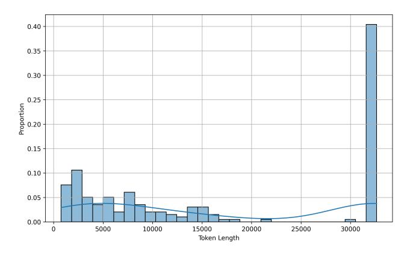

# Prompt Template

## Prompt Template For Training

## Supervised Fine Tune

Given the following problem, solve it step by step.

QUESTION: {question}

<think> {thought process} </think>

{Final Answer}

### Prompt Template for Obtaining High-Quality Corpus

Compress the given reasoning steps to short expressions, and such that you (Deepseek) can understand reasoning and reconstruct it as close as possible to the original.

Unlike the usual text compression, I need you to comply with the 5 conditions below:

- 1. You can ONLY remove unimportant words.
- 2. Do not reorder the original words.
- 3. Do not change the original words.
- 4. Do not use abbreviations or emojis.
- 5. Do not add new words or symbols.

Compress the origin aggressively by removing words only. Compress the origin as short as you can, while retaining as much information as possible. If you understand, please compress the following reasoning steps:

{reasoning steps}

The compressed reasoning steps are:

## Case Study

As shown in Table 3, the compressed model does learn to omit unimportant tokens, as indicated by the red text in the responses. However, TokenSkip may remove critical tokens required for the model to properly conclude its reasoning process. This can cause the model to enter a loop when repeatedly failing to generate a valid solution, as demonstrated by the blue text in the responses.

Furthermore, as shown in Figure 8, 9 and 10, by examining the distribution of output token lengths across different benchmarks, we observe that most responses reach the maximum output length. This suggests that models compressed via TokenSkip lose the ability to properly terminate reasoning. Consequently, when faced with challenging problems, they are more prone to entering repetitive loops.

```
Question: Let \omega \neq 1 be a 13th root of unity. Find the remainder when \prod_{k=0}^{12} (2-2\omega^k+\omega^{2k}) is divided by 1000.
Response: <think>
Okay, let's see, need to find remainder when product from k=0 to 12 of (2-2\omega^k+\omega^{2k}) divided by 1000,
where \omega is 13th root of unity and \omega \neq 1, sounds complicated, but maybe I can break it down.
First, since \omega is a primitive 13th root of unity, means \omega^1 3 = 1, and \omega^k \neq 1 for k from 1 to 12.
product is over k from 0 to 12, includes \omega^0, is 1, check each term in product. For each k, term is (2-2\omega^k+\omega^{2k}).
see if can simplify this expression. Maybe factor it or relate it to some polynomial?
Alternatively, since \omega is a root of unity, maybe way to express this product in terms of cyclotomic polynomials?
cyclotomic polynomials evaluated at \omega might relate to products over roots.
not sure. think step by step. , note \omega^{13}=1, so \omega^{2k}=(\omega^k)^2.
Maybe can let x = \omega^k, so each term becomes 2 - 2x + x^2.
Then product becomes product from x being 13th roots of unity (excluding x = 1) of (2 - 2x + x^2).
, no., in original product, each term is (2-2\omega^k+\omega^{2k}), which is 2-2\omega^k+(\omega^k)^2. if let x=\omega^k, each term is 2-2x+x^2.
product is product over all x, x is 13th root of unity except x = 1.
maybe can consider polynomial P(x) = 2 - 2x + x^2, and product is product of
P(x) over all x being 13th roots of unity except x = 1. how does that help?
Alternatively, maybe can factor P(x) = x^2 - 2x + 2.
Since \omega is a primitive 13th root of unity, modulo 8, \omega is a root of unity not an integer, can't directly compute \omega.
\omega_{0}^{13} \equiv 1 \mod 8, \ \omega_{0}^{13} - 1 \equiv 0 \mod 8, \ \omega_{0}^{13} = 1 \equiv 0 \mod 8, \ \omega_{0}^{13} - 1 \equiv 0 \mod 8, \ \omega_{0}^{13} = 1 \mod 8, \ \omega_{0}^{13} = 1 \mod 8, \ \omega_{0}^{13} = 1 \mod 8, \ \omega_{0}^{13} = 1 \mod 8, \ \omega_{0}^{13} = 1 \mod 8, \ \omega_{0}^{13} = 1 \mod 8, \ \omega_{0}^{13} = 1 \mod 8, \ \omega_{0}^{13} = 1 \mod 8, \ \omega_{0}^{13} = 1 \mod 8, \ \omega_{0}^{13} = 1 \mod 8, \ \omega_{0}^{13} = 1 \mod 8, \ \omega_{0}^{13} = 1 \mod 8, \ \omega_{0}^{13} = 1 \mod 8, \ \omega_{0}^{13} = 1 \mod 8, \ \omega_{0}^{13} = 1 \mod 8, \ \omega_{0}^{13} = 1 \mod 8, \ \omega_{0}^{13} = 1 \mod 8, \ \omega_{0}^{13} = 1 \mod 8, \ \omega_{0}^{13} = 1 \mod 8, \ \omega_{0}^{13} = 1 \mod 8, \ \omega_{0}^{13} = 1 \mod 8, \ \omega_{0}^{13} = 1 \mod 8, \ \omega_{0}^{13} = 1 \mod 8, \ \omega_{0}^{13} = 1 \mod 8, \ \omega_{0}^{13} = 1 \mod 8, \ \omega_{0}^{13} = 1 \mod 8, \ \omega_{0}^{13} = 1 \mod 8, \ \omega_{0}^{13} = 1 \mod 8, \ \omega_{0}^{13} = 1 \mod 8, \ \omega_{0}^{13} = 1 \mod 8, \ \omega_{0}^{13} = 1 \mod 8, \ \omega_{0}^{13} = 1 \mod 8, \ \omega_{0}^{13} = 1 \mod 8, \ \omega_{0}^{13} = 1 \mod 8, \ \omega_{0}^{13} = 1 \mod 8, \ \omega_{0}^{13} = 1 \mod 8, \ \omega_{0}^{13} = 1 \mod 8, \ \omega_{0}^{13} = 1 \mod 8, \ \omega_{0}^{13} = 1 \mod 8, \ \omega_{0}^{13} = 1 \mod 8, \ \omega_{0}^{13} = 1 \mod 8, \ \omega_{0}^{13} = 1 \mod 8, \ \omega_{0}^{13} = 1 \mod 8, \ \omega_{0}^{13} = 1 \mod 8, \ \omega_{0}^{13} = 1 \mod 8, \ \omega_{0}^{13} = 1 \mod 8, \ \omega_{0}^{13} = 1 \mod 8, \ \omega_{0}^{13} = 1 \mod 8, \ \omega_{0}^{13} = 1 \mod 8, \ \omega_{0}^{13} = 1 \mod 8, \ \omega_{0}^{13} = 1 \mod 8, \ \omega_{0}^{13} = 1 \mod 8, \ \omega_{0}^{13} = 1 \mod 8, \ \omega_{0}^{13} = 1 \mod 8, \ \omega_{0}^{13} = 1 \mod 8, \ \omega_{0}^{13} = 1 \mod 8, \ \omega_{0}^{13} = 1 \mod 8, \ \omega_{0}^{13} = 1 \mod 8, \ \omega_{0}^{13} = 1 \mod 8, \ \omega_{0}^{13} = 1 \mod 8, \ \omega_{0}^{13} = 1 \mod 8, \ \omega_{0}^{13} = 1 \mod 8, \ \omega_{0}^{13} = 1 \mod 8, \ \omega_{0}^{13} = 1 \mod 8, \ \omega_{0}^{13} = 1 \mod 8, \ \omega_{0}^{13} = 1 \mod 8, \ \omega_{0}^{13} = 1 \mod 8, \ \omega_{0}^{13} = 1 \mod 8, \ \omega_{0}^{13} = 1 \mod 8, \ \omega_{0}^{13} = 1 \mod 8, \ \omega_{0}^{13} = 1 \mod 8, \ \omega_{0}^{13} = 1 \mod 8, \ \omega_{0}^{13} = 1 \mod 8, \ \omega_{0}^{13} = 1 \mod 8, \ \omega_{0}^{13} = 1 \mod 8, \ \omega_{0}^{13} = 1 \mod 8, \ \omega_{0}^{13} = 1 \mod 8, \ \omega_{0}^{13} = 1 \mod 8, \ \omega_{0}^{13} = 1 \mod 8, \ \omega_{0}^{13} = 1 \mod 8, \ \omega_{0}^{13} = 1 \mod 8, \ \omega_{0}^{13} = 1 \mod 8, \ \omega_{0}^{13} = 1 \mod 8, \ \omega_{0}^{13} = 1 \mod 8, \ \omega_{0}^{13} = 1 \mod 8, \ \omega_{0}^{13} = 1 \mod 8, \ \omega_{0}^{13} = 1 \mod 8, \ \omega_{0}^{13} = 1 \mod 8, \ \omega_{0}^{1
Since \omega \neq 1, it satisfies x^{12} + x^{11} + ... + x + 1 \equiv 0 \mod 8.
, \omega^{12} + \omega^{11} + . + \omega + 1 \equiv 0 \mod 8., \omega^{12} \equiv -(\omega^{11} + . + \omega + 1) \mod 8.
, \omega^2 is also a root of x^{12} + x^{11} + . + x + 1 \equiv 0 mod 8, \omega^{24} + \omega^{22} + . + \omega^2 + 1 \equiv 0 mod 8.
, compute A = 2 - 2\omega + \omega^2. compute A + 2\omega - 2. A + 2\omega - 2 = (2 - 2\omega + \omega^2) + 2\omega - 2 = \omega^2 mod 8.,
A + 2\omega - 2 = \omega^2 mod 8., not sure, compute A + 2\omega - 2:
A + 2\omega - 2 = (2 - 2\omega + \omega^2) + 2\omega - 2 = \omega^2 mod 8... A + 2\omega - 2 = \omega^2 mod 8.A = \omega^2 - 2\omega + 2mod 8.
, compute A^2: A^2 = (2-2\omega+\omega^2)^2 = 4-8\omega+4\omega^2+4\omega^3-4\omega^4+\omega^4-4\omega^3+2\omega^5+\omega^6
, messy.
compute A^2 modulo 8.
, since \omega^1 3 \equiv 1 mod 8, \omega^{13} \equiv 1 mod 8, \omega^{13k+m} \equiv \omega^m mod 8., \omega^4 \equiv \omega^4 mod 8., \omega^3 \equiv \omega^3 mod 12 \equiv \omega^3 mod 8.,
\omega^2, \omega^5, etc., modulo 8., compute A^2 = (2 - 2\omega + \omega^2)^2:
, expand it: (2-2\omega+\omega^2)^2=4-8\omega+4\omega^2+(-8\omega+4\omega^2)+4\omega^3+(-4\omega^2+2\omega^3)+\omega^4.
, step by step:
(a+b+c)^2 = a^2 + b^2 + c^2 + 2ab + 2ac + 2bca = 2, b = -2\omega, c = \omega^2, a^2 = 4b^2 = (-2\omega)^2 = 4\omega^2
c^2 = (\omega^2)^2 = \omega^4 \ 2ab = 2 * 2 * (-2\omega) = -8\omega \ 2ac = 2 * 2 * \omega^2 = 4\omega^2 \ 2bc = 2 * (-2\omega) * \omega^2 = -4\omega^3
, combining all terms:
4+4\omega^2+\omega^4-8\omega+4\omega^2-4\omega^3 Combine terms:
4 + (4\omega^2 + 4\omega^2) + (-8\omega) + (-4\omega^3) + \omega^4 \\ 4 + 8\omega^2 - 8\omega - 4\omega^3 + \omega^4 \\ mod \\ 8., A^2 = 4 + 8\omega^2 - 8\omega - 4\omega^3 + \omega^4 \\ mod \\ 8.
Simplify modulo 8:
4 + 0\omega^2 - 8\omega - 4\omega^3 + \omega^4 mod8. -8\omega mod8is0\omega, and 4 + 0 - 4\omega^3 + \omega^4 mod8. A^2 \equiv 4 - 4\omega^3 + \omega^4 mod8.
, not helpful.
another approach.
, compute A = 2 - 2\omega + \omega^2 mod 8. compute A + 2\omega - 2:
A + 2\omega - 2 = (2 - 2\omega + \omega^2) + 2\omega - 2 = \omega^2 mod 8.,
A + 2\omega - 2 = \omega^2 mod8., A = \omega^2 - 2\omega + 2mod8.
, A = \omega^2 - 2\omega + 2mod8.
, compute A^6 = (\omega^2 - 2\omega + 2)^6 mod 8.
, compute A=\omega^2-2\omega+2.compute A+2\omega-2=\omega^2 mod 8, A+2\omega-2=\omega^2., A=\omega^2-2\omega+2 mod 8.
, compute A + 2\omega - 2 = \omega^2 mod 8, A + 2\omega - 2 = \omega^2., A = \omega^2 - 2\omega + 2mod 8.
, compute A+2\omega-2=\omega^2 mod 8, A=\omega^2-2\omega+2 mod 8.
, compute A+2\omega-2=\omega^2 mod 8, A=\omega^2-2\omega+2 mod 8.
, compute A+2\omega-2=\omega^2 mod 8, A=\omega^2-2\omega+2 mod 8.
```

> **[图片提取文字 (无描述)]:**
> 0.6 -0.5 -0.4 -Proportion 0.3 0.2 0.1 0.0 5000 30000 20000 25000 10000 15000 Token Length


Figure 8: Inference token length distribution of Qwen2.5-7B-Instruct under TokenSkip with a compression ratio of 0.9 on AIME24 dataset.

> **[图片提取文字 (无描述)]:**
> 0.35 0.30 0.25 Proportion 0.20 0.15 0.10 0.05 0.00 ò 5000 15000 20000 25000 30000 10000 Token Length


Figure 9: Inference token length distribution of Qwen2.5-7B-Instruct under TokenSkip with a compression ratio of 0.9 on MATH500 dataset.

> **[图片提取文字 (无描述)]:**
> 0.40 0.35 0.30 Proportion 0 0 00.52 0.15 0.10 0.05 0.00 5000 10000 25000 30000 15000 20000 Token Length


Figure 10: Inference token length distribution of Qwen2.5-7B-Instruct under TokenSkip with a compression ratio of 0.9 on GPQA-Diamond dataset.

## **Additional Experimental Results**

Table 4: Inference tokens of the Qwen2.5-14B-Instruct model on the MATH500 dataset across various compression ratios in ablation experiments.

| Ratio | Base | + RM | + Conditional | Proposed |
|-------|------|------|---------------|----------|
| 0.9   | 5023 | 5597 | 4563          | 5012     |
| 0.8   | 2510 | 2992 | 5001          | 4703     |
| 0.7   | 2511 | 2369 | 2883          | 3310     |
| 0.6   | 2270 | 2167 | 1952          | 3787     |
| 0.5   | 1998 | 2036 | 1787          | 2036     |

Table 5: Experimental results of the Qwen2.5-Instruct series on code benchmarks.

#### (a) HumanEval benchmark

| Scale      | Methods  | ActRatio | Accuracy | Tokens |
|------------|----------|----------|----------|--------|
|            | Original | -        | 51.2     | 10153  |
|            |          | 0.87     | 59.8     | 8205   |
| 7B         |          | 0.81     | 54.9     | 9585   |
| / <b>D</b> | CTS      | 0.74     | 48.2     | 7718   |
|            |          | 0.66     | 44.5     | 2949   |
|            |          | 0.58     | 43.9     | 2970   |
|            | Original | -        | 64.0     | 7595   |
|            |          | 0.87     | 65.9     | 5365   |
| 14B        |          | 0.81     | 64.6     | 5826   |
| 14D        | CTS      | 0.74     | 61.0     | 5333   |
|            |          | 0.66     | 57.3     | 4890   |
|            |          | 0.58     | 48.2     | 2459   |

#### (b) MBPP benchmark

| Scale      | Methods   | ActRatio | Accuracy | Tokens |
|------------|-----------|----------|----------|--------|
|            | Original  | -        | 51.2     | 10153  |
|            |           | 0.87     | 59.8     | 8205   |
| 7B         |           | 0.81     | 54.9     | 9585   |
| / <b>D</b> | TokenSkip | 0.74     | 48.2     | 7718   |
|            | -         | 0.66     | 44.5     | 2949   |
|            |           | 0.58     | 43.9     | 2970   |
|            | Original  | -        | 64.0     | 7595   |
|            |           | 0.87     | 65.9     | 5365   |
| 14B        |           | 0.81     | 64.6     | 5826   |
| 146        | TokenSkip | 0.74     | 61.0     | 5333   |
|            | -         | 0.66     | 57.3     | 4890   |
|            |           | 0.58     | 48.2     | 2459   |

Table 4 presents the number of inference tokens for different variants under various compression ratios in the ablation study conducted on the MATH500 dataset. Table 5 demonstrates the results of the generalization experiments for CTS.

Tables 6 and 7 present the experimental results of various approaches on the Qwen2.5-7B-Instruct and Llama-3.1-8B-Instruct models, respectively.

