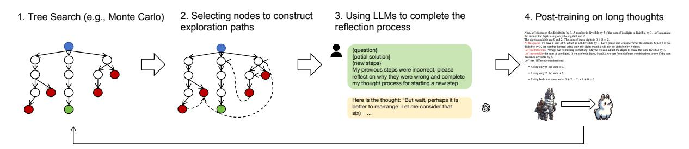
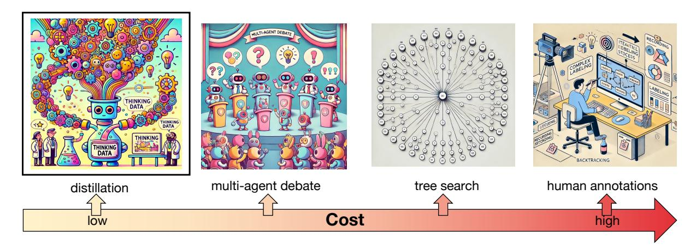

# 2 The "Shortcut" Path to O1 Replication

### 2.1 Core Technical Stack for O1 Replication

In the first part of our o1 replication journey [\(Qin et al.,](#page-15-0) [2024\)](#page-15-0), we introduce a novel method to synthesize long thinking processes called "journey learning", as illustrated in Figure [2.](#page-2-0) The approach utilizes tree-searching algorithms (e.g., Monte Carlo) to explore different solution paths, followed by strategic node selection to construct promising exploration trajectories. These exploration trajectories often contain incorrect results or unpromising methods and end with the correct answers. To address the lack of reflection content in the trees, we leverage LLMs to analyze previous steps and identify reasoning errors, enabling better course correction. This process produces complete trajectories leading to correct answers. We collect these trajectories, including both reflection and correction steps, to fine-tune the LLMs. The tuned LLMs can then be utilized for subsequent iterations of training.

> **[图片提取文字 (无描述)]:**
> 3. Using LLMs to complete the Selecting nodes to construct Tree Search (e.g., Monte Carlo) 4. Post-training on long thoughts reflection process exploration paths New, let's focus on the dissubility by 3. A number is divisible by 3 if the sum of its diens is divisible by 3. Let's calculus. the sum of the digits using only the digits 0 and 2. The distinuouslable are 0 and 2. The sum of these distinuis 0 + 2 = 2. At this polit, we have a sum of 2, which is not divisible by 3. Let's pursu and consider what this means. Since 2 is not divisible by 3, the number formed using only the digits 0 and 2 will not be divisible by 3 either. {question} Let's robbits this. Perhaps we've missing something. Maybe we can adjust the digits to make the sum divisible by 3.
> 
> Let's reconsider the sum of the digits. If we are both digits, 0 and 2, we can form different combinations to see if the sum {patial solution} becomes divisible by 3. Let's to different combinations: {new steps} . United early O. the state in D. My previous steps were incorrect, please . Using only 2, the sum is 2, reflect on why they were wrong and complete Using both, the sum can be 0 + 2 = 2 or 2 + 0 = 2. my thought process for starting a new step Here is the thought: "But wait, perhaps it is better to rearrange. Let me consider that ß s(x) = ...

Figure 2: The framework of journey learning.

> **[图片提取文字 (无描述)]:**
> multi-agent debate human annotations tree search distillation Cost

Figure 3: Different methods of collecting the long thought data. The distillation method offers a cost-effective and reliable approach to obtaining high-quality data.

#### 2.2 Alternative Methods for Long-thought Synthesis

In the O1 technical pipeline, one of the most challenging aspects is effectively synthesizing long chains of reasoning for solving complex problems. These chains typically incorporate reflection, error correction, and backtracking steps. While tree search, as discussed above, represents one of the most effective approaches, it can be computationally expensive and time-consuming. Beyond tree search, alternative methods for synthesizing long reasoning chains are listed as follows. Each of these methods offers different trade-offs between computational efficiency and reasoning thoroughness.

**Method I: Complete Human Thought Process Annotation** Human problem-solving rarely follows a linear path to success or failure. Instead, people regularly pause to reflect, backtrack, and revise their approach when encountering obstacles. This natural process mirrors the characteristics of long thought. By thoroughly documenting how humans solve problems, we can generate authentic long thought training data.

**Method II: Multi-Agent Approach** Different from journey learning where the policy model does not react to feedback directly, we can involve multi-agents to complete the exploration process, instructing them to play different roles. For example, we can construct a multi-agent debate system where a policy model generates continuous reasoning while a critique model evaluates whether to proceed or backtrack. This interactive process naturally produces long thought training data when solutions are found.

**Method III: Distillation from Advanced Models** Advanced models like o1 demonstrate strong reflection and self-correction abilities. Following common practice of instructing weaker models using stronger ones, distilling responses from o1 is a natural approach. However, careful prompting is needed since o1 restricts access to its internal thought processes.

While diverse methods exist for generating long thoughts, the distillation method offers a cost-effective and reliable approach to obtaining high-quality data.

#### 2.3 Distillation-based Long Thought Synthesis

**Background of Distillation** In the era of Large Language Models (LLMs), the quality of training data has emerged as a critical factor in model development. Recent research indicates that data quality exerts a more substantial influence on model performance than either model size or data volume. For instance, LIMA (Zhou et al., 2024) demonstrated superior performance through Supervised Fine-Tuning (SFT) using only 1,000 meticulously

curated prompts and responses, outperforming models trained on extensive but lower-quality datasets. Similarly, Phi-1 [\(Gunasekar et al.,](#page-14-5) [2023\)](#page-14-5) achieved remarkable results by leveraging high-quality data synthesized from GPT-3.5, surpassing models with significantly larger parameter counts on both MBPP [\(Austin et al.,](#page-14-6) [2021\)](#page-14-6) and HumanEval [\(Chen et al.,](#page-14-7) [2021a\)](#page-14-7) benchmarks. Given advanced LLMs' comprehensive knowledge base, sophisticated reasoning capabilities, and robust instruction-following abilities [\(Wei et al.,](#page-15-7) [2022;](#page-15-7) [Brown et al.,](#page-14-8) [2020\)](#page-14-8), coupled with their decreasing operational costs, the practice of distilling high-quality data from these models to train smaller models has become increasingly prevalent. Notable examples include Alpaca [\(Taori et al.,](#page-15-8) [2023\)](#page-15-8), an instruction finetuning dataset derived from GPT-3.5, and WizardLM [\(Xu et al.,](#page-15-9) [2023\)](#page-15-9), which enhances the complexity and diversity of existing instruction data. For reasoning tasks, which also have verifiable solutions, researchers have implemented rejection sampling methodologies that, when combined with distillation, enable the extraction and validation of advanced models' reasoning processes [\(Zelikman et al.,](#page-15-10) [2022;](#page-15-10) [Yu et al.,](#page-15-11) [2023\)](#page-15-11) . Given O1's exceptional performance and sophisticated reasoning capabilities, implementing a distillation process of its cognitive mechanisms represents the most viable approach for model replication.

Post-training Data Curation To prepare the dataset for downstream post-training (e.g. SFT), we start with a subset of Olympic-level problems from the open-source datasets and self-curated datasets. A filtering process is applied to refine the dataset: we remove problems dependent on images, those lacking explicitly labeled answers, and all proof-based problems using carefully-designed rules, while retaining problems where the answer type is numerical.

Reformatted Technology We use the reformatted technology [\(Fan et al.,](#page-14-9) [2024\)](#page-14-9) to further enhance the dataset, we use GPT-4o-mini to rewrite the original solutions. The rewriting process adheres to specific guidelines, ensuring that solutions are step-by-step, highly detailed, and longer in length. This step also standardizes the output format, requiring the final answers to be explicitly highlighted using \boxed, aligning with the long thought format.

Quality Control Mechanism We select Qwen2.5-Math-72B [\(Yang et al.,](#page-15-12) [2024b\)](#page-15-12) as our base model due to its exceptional foundational capability in mathematical reasoning. This strong baseline provides a robust foundation for further enhancing the model's reasoning abilities, ensuring a solid starting point for subsequent improvements.

#### 2.3.1 Supervised fine-tuning approach

To familiarize and adapt the model to the long thought format, we perform an initial SFT phase before distillation. Using the refined and reformatted dataset described above, we train the model to generate longer, more fine-grained step-by-step solutions. This phase focuses on ensuring that the model becomes proficient in both producing detailed reasoning and adhering to a standardized output style, preparing it for subsequent distillation phases. Following this, we proceed with the next SFT phase using the distilled dataset. This dataset, generated through our distillation process, is specifically curated to capture high-quality, detailed reasoning aligned with the long-thought format. During this phase, the model is further fine-tuned to not only enhance its reasoning capabilities but also to ensure consistency in producing precise and coherent outputs.

