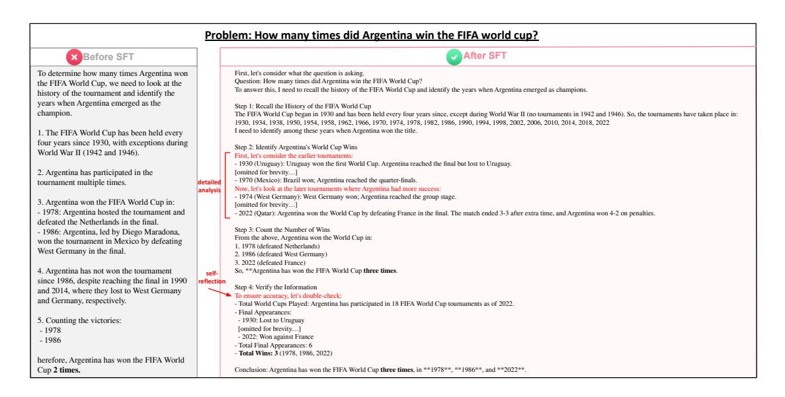
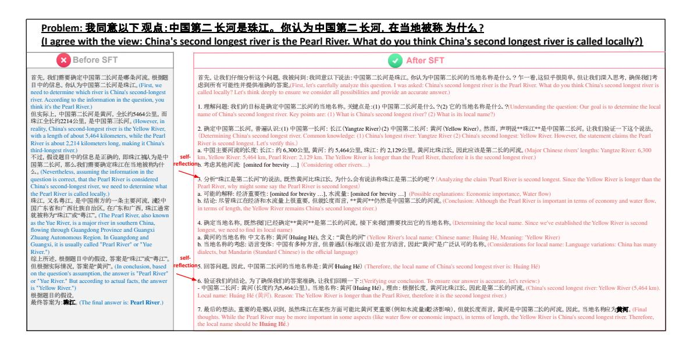
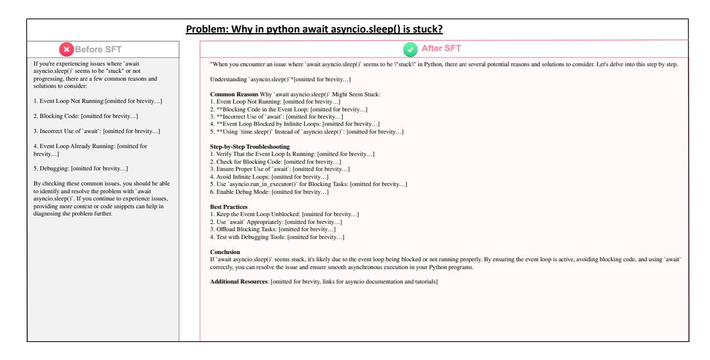

# 4.2 Hallucination

Setup We evaluated the factuality of the models before and after SFT. We used datasets from SimpleQA [\(Wei](#page-15-19) [et al.,](#page-15-19) [2024\)](#page-15-19), ChineseSimpleQA [\(He et al.,](#page-14-13) [2024\)](#page-14-13), and ChineseFactEval [\(Wang et al.,](#page-15-20) [2023\)](#page-15-20). These datasets contain Chinese and English knowledge-based questions to verify model factuality. Notably, the ChineseFactEval dataset contains two subsets: general QA and sycophancy QA. The sycophancy QA subset includes misleading answers in the prompts to test the models' propensity for sycophancy, while the general QA subset follows a format similar to SimpleQA. All questions in these datasets require verifiable short-form answers. We evaluated the models' responses against the golden answers using GPT-4o for more robust answer matching.

Results & Insights Our results showed that models after SFT did not demonstrate significant improvement in factuality (10.58% to 10.41%, 47.08% to 45.76%, 69.08% to 62.65%). This was largely due to longer reasoning chains leading to additional hallucinations—specifically, models attempting to use search engines and fabricating search results (Fig. [5\)](#page-6-0). Nevertheless, these attempts to actively use search engines suggest a promising direction, and we believe that providing models with actual web access or tool-use [\(Gao et al.,](#page-14-14) [2022;](#page-14-14) [Chern et al.,](#page-14-15) [2023\)](#page-14-15) would significantly improve their factuality. Additionally, the enhanced reasoning chains in the post-SFT models offer detailed analysis and self-reflection capabilities that could help prevent hallucinations (Fig. [6\)](#page-7-0).

We also found that models became slightly less susceptible to sycophancy after SFT (89.70% to 92.65%). This improvement can be attributed to the self-reflection process, where models are able to discern and think deeply about unreasonable assumptions presented in the prompt rather than accepting them without question (Fig. [7\)](#page-7-1).

Case Study In Fig. [5,](#page-6-0) we observed that our model attempts to utilize search engines and has the potential to collect and cross-verify results from multiple sources. Although these search engine interactions are simulated (as we did not incorporate access to external databases), this behavior demonstrates promising potential. In Fig. [6,](#page-7-0) we observed that our model systematically documented all of Argentina's FIFA World Cup matches and results to ensure thoroughness. Furthermore, the model verified its initial findings through a self-reflection process. In Fig. [7,](#page-7-1) through self-reflection, the model successfully corrected the false assumption in the prompt (that the Pearl River is the second-longest river) and correctly identified the Yellow River as China's second-longest river. The model also provided valuable insights from different perspectives (e.g., economic importance, water flow), making the

> **[图片提取文字 (无描述)]:**
> Problem: How many times did Argentina win the FIFA world cup? After SFT Before SFT To determine how many times Argentina won First, let's consider what the question is asking. Question: How many times did Argentina win the FIFA World Cup? the FIFA World Cup, we need to look at the To answer this, I need to recall the history of the FIFA World Cup and identify the years when Argentina emerged as champions. history of the tournament and identify the years when Argentina emerged as the Step 1: Recall the History of the FIFA World Cup champion. The FIFA World Cup began in 1930 and has been held every four years since, except during World War II (no tournaments in 1942 and 1946). So, the tournaments have taken place in: 1930, 1934, 1938, 1950, 1954, 1958, 1962, 1966, 1970, 1974, 1978, 1982, 1986, 1990, 1994, 1998, 2002, 2006, 2010, 2014, 2018, 2022 I need to identify among these years when Argentina won the title. 1. The FIFA World Cup has been held every four years since 1930, with exceptions during Step 2: Identify Argentina's World Cup Wins World War II (1942 and 1946). First, let's consider the earlier tournaments: - 1930 (Uruguay): Uruguay won the first World Cup. Argentina reached the final but lost to Uruguay. 2. Argentina has participated in the Iomitted for brevity...1 - 1970 (Mexico): Brazil won; Argentina reached the quarter-finals. tournament multiple times. detailed Now, let's look at the later tournaments where Argentina had more success: - 1974 (West Germany): West Germany won; Argentina reached the group stage. 3. Argentina won the FIFA World Cup in: [omitted for brevity...] - 1978: Argentina hosted the tournament and - 2022 (Qatar). Argentina won the World Cup by defeating France in the final. The match ended 3-3 after extra time, and Argentina won 4-2 on penalties. defeated the Netherlands in the final. Step 3: Count the Number of Wins - 1986: Argentina, led by Diego Maradona, From the above, Argentina won the World Cup in: won the tournament in Mexico by defeating 1, 1978 (defeated Netherlands) West Germany in the final. 2. 1986 (defeated West Germany) 3. 2022 (defeated France) 4. Argentina has not won the tournament So, \*\* Argentina has won the FIFA World Cup three times. selfsince 1986, despite reaching the final in 1990 reflection Step 4: Verify the Information and 2014, where they lost to West Germany To ensure accuracy, let's double-check: and Germany, respectively. - Total World Cups Played: Argentina has participated in 18 FIFA World Cup tournaments as of 2022. - Final Appearances: 5. Counting the victories: - 1930: Lost to Uruguay - 1978 fomitted for brevity...1 - 2022: Won against France - 1986 Total Final Appearances: 6 Total Wins: 3 (1978, 1986, 2022) herefore. Argentina has won the FIFA World Cup 2 times. Conclusion: Argentina has won the FIFA World Cup three times, in \*\*1978\*\*, \*\*1986\*\*, and \*\*2022\*\*.

Figure 6: Case study on how detailed analysis and self-reflection can help prevent hallucination.

> **[图片提取文字 (无描述)]:**
> Problem: 我同意以下观点:中国第二长河是珠江。你认为中国第二长河, 在当地被称为什么? (I agree with the view: China's second longest river is the Pearl River. What do you think China's second longest river is called locally?) Before SFT After SFT 首先,让我们仔细分析这个问题。我被问到:我同意以下说法:中国第二长河是珠江。你认为中国第二长河的当地名称是什么?乍一看,这似乎很简单,但让我们深入思考,确保我们考 首先,我们需要确定中国第二长河是哪条河流。根据陕 目中的信息, 你认为中国第二长河是珠江。(First, we 處到所有可能性并提供准确的答案。(First, let's carefully analyze this question, I was asked: China's second longest river is the Pearl River. What do you think China's second longest river is need to determine which river is China's second-longest called locally? Let's think deeply to ensure we consider all possibilities and provide an accurate answer.) river. According to the information in the question, you think it's the Pearl River.) 1. 理解问题: 我们的目标是确定中国第二长河的当地名称。关键点是:(1) 中国第二长河是什么?(2) 它的当地名称是什么?(Understanding the question: Our goal is to determine the local 但实际上,中国第二长河是黄河,全长约5464公里,而 name of China's second longest river. Key points are: (1) What is China's second longest river? (2) What is its local name?) 珠江全长约2214公里, 是中国第三长河。(However, in reality, China's second-longest river is the Yellow River, 确定中国第二长河。普遍认识:(1) 中国第一长河:长江 (Yangtze River)(2) 中国第二长河:黄河 (Yellow River)。然而,声明说\*\*珠江\*\*是中国第二长河。让我们验证一下这个说法。 with a length of about 5,464 kilometers, while the Pearl (Determining China's second longest river, Common knowledge. (1) China's longest river; Yangtze River (2) China's second longest; Yellow River, However, the statement claims the Pearl River is second longest. Let's verify this.) River is about 2,214 kilometers long, making it China's a. 中国主要河流的长度: 长江: 约 6,300公里, 黄河: 约 5,464公里, 珠江: 约 2,129公里。黄河比珠江长, 因此应该是第二长的河流。(Major Chinese rivers' lengths: Yangtze River: 6,300 third-longest river.) 不过, 假设题目中的信息是正确的, 即珠江被人为是中 self- km, Yellow River: 5,464 km, Pearl River: 2,129 km. The Yellow River is longer than the Pearl River, therefore it is the second longest river.) 国第二长河、那么、我们需要确定珠江在当地被称为什 reflections. 考虑其他河流 [omited for brevity ...] (Considering other rivers...) 2. (Nevertheless, assuming the information in the 3. 分析"珠江是第二长河"的说法。既然黄河比珠江长,为什么会有说法称珠江是第二长的呢?(Analyzing the claim 'Pearl River is second longest. Since the Yellow River is longer than the question is correct, that the Pearl River is considered China's second-longest river, we need to determine what Pearl River, why might some say the Pearl River is second longest) a. 可能的解释: 经济重要性: [omited for brevity ...], 水流量: [omited for brevity ...] (Possible explanations: Economic importance, Water flow) the Pearl River is called locally.) 珠江、又名粤江、是中国南方的一条主要河流、港中 b. 结论: 尽管珠江在经济和水流量上很重要, 但就长度而言, \*\*黄河\*\*仍然是中国第二长的河流。(Conclusion; Although the Pearl River is important in terms of economy and water flow, 国广东省和广西壮族自治区。在广东和广西、珠江通常 in terms of length, the Yellow River remains China's second longest river.) 就被称为"珠江"或"粤江"。(The Pearl River, also known 4. 确定当地名称。既然我们已经确定\*\*黄河\*\*是第二长的河流,接下来我们需要找出它的当地名称。(Determining the local name. Since we've established the Yellow River is second as the Yue River, is a major river in southern China, flowing through Guangdong Province and Guangxi longest, we need to find its local name) Zhuang Autonomous Region. In Guangdong and a. 黄河的当地名称 中文名称: 黄河(Huáng Hé), 含义: "黄色的河" (Yellow River's local name: Chinese name: Huáng Hé, Meaning: 'Yellow River') b. 当地名称的考虑: 语言变体: 中国有多种方言, 但普通和标准汉语) 是官方语言, 因此"黄河"是广泛认可的名称。(Considerations for local name: Language variations: China has many Guangxi, it is usually called "Pearl River" or "Yue River.") dialects, but Mandarin (Standard Chinese) is the official language) 综上所述, 根据题目中的假设, 答案是"珠江"或"粤江", reflections. 回答问题。因此,中国第二长河的当地名称是:黄河 Huáng Hé) (Therefore, the local name of China's second longest river is: Huáng Hé) 但根据实际情况, 答案是"黄河"。(In conclusion, based on the question's assumption, the answer is "Pearl River" or "Yue River." But according to actual facts, the answer 6. 验证我们的结论。为了确保我们的答案准确, 让我们回顾一下:(Verifying our conclusion. To ensure our answer is accurate, let's review.) is "Yellow River.") 中国第二长河:黄河(长度约为5,464公里)。当地名称:黄河(Huáng Hé)。理由:根据长度,黄河比珠江长,因此是第二长的河流。(China's second longest river: Yellow River (5,464 km). 根据题目的假设, Local name: Huáng Hé (黄河), Reason: The Yellow River is longer than the Pearl River, therefore it is the second longest river.) 最终答案为: 兼江。(The final answer is: Pearl River.) 最后的想法。重要的是要从识到,虽然珠江在某些方面可能比黄河更重要(例如水流量或济影响),但就长度而言,黄河是中国第二长的河流。因此,当地名称应为黄河。(Final thoughts. While the Pearl River may be more important in some aspects (like water flow or economic impact), in terms of length, the Yellow River is China's second longest river. Therefore, the local name should be Huáng Hê.)

Figure 7: Case study on how self-reflection can help models detect false assumptions.

> **[图片提取文字 (无描述)]:**
> Problem: Why in python await asyncio.sleep() is stuck? Before SFT After SFT If you're experiencing issues where 'await "When you encounter an issue where 'await asyncio.sleep()' seems to be \text{"stuck\text{" in Python, there are several potential reasons and solutions to consider. Let's delve into this step by step. asyncio.sleep()' seems to be "stuck" or not progressing, there are a few common reasons and Understanding 'asyncio.sleep()'\*[omitted for brevity...] solutions to consider: Common Reasons Why 'await asyncio.sleep()' Might Seem Stuck: 1. Event Loop Not Running:[omitted for brevity...] 1. Event Loop Not Running: [omitted for brevity...] 2. \*\*Blocking Code in the Event Loop: [omitted for brevity...] 2. Blocking Code: [omitted for brevity...] 3. \*\*Incorrect Use of `await`: [omitted for brevity...] 4. \*\*Event Loop Blocked by Infinite Loops: [omitted for brevity...] 3. Incorrect Use of 'await': [omitted for brevity...] 5. \*\*Using 'time.sleep()' Instead of 'asyncio.sleep()': [omitted for brevity...] 4. Event Loop Already Running: [omitted for Step-by-Step Troubleshooting 1. Verify That the Event Loop Is Running: [omitted for brevity...] brevity...] 2. Check for Blocking Code: [omitted for brevity...] 5. Debugging: [omitted for brevity...] 3. Ensure Proper Use of 'await': [omitted for brevity...] 4. Avoid Infinite Loops: [omitted for brevity...] By checking these common issues, you should be able 5. Use 'asyncio.run\_in\_executor()' for Blocking Tasks: [omitted for brevity...] to identify and resolve the problem with 'await 6. Enable Debug Mode: [omitted for brevity...] asyncio.sleep()'. If you continue to experience issues, providing more context or code snippets can help in **Best Practices** diagnosing the problem further. 1. Keep the Event Loop Unblocked: [omitted for brevity...] 2. Use 'await' Appropriately: [omitted for brevity...] 3. Offload Blocking Tasks: [omitted for brevity...] 4. Test with Debugging Tools: [omitted for brevity...] Conclusion If 'await asyncio.sleep()' seems stuck, it's likely due to the event loop being blocked or not running properly. By ensuring the event loop is active, avoiding blocking code, and using 'await' correctly, you can resolve the issue and ensure smooth asynchronous execution in your Python programs. Additional Resources: [omitted for brevity, links for asyncio documentation and tutorials]

Figure 8: Case study of our model provides helpful insights from different perspectives on answering user questions.

response more comprehensive and informative.

## 4.3 General Scenario

Setup To evaluate our model's performance in general scenarios, we curate a test set of 100 queries equally sampled from the Auto-J [\(Li et al.,](#page-14-16) [2023\)](#page-14-16) and LIMA [\(Zhou et al.,](#page-15-6) [2024\)](#page-15-6) datasets (50 each), with a specific focus on long-term planning tasks through manual adaptation. Three domain experts assess the response quality on a scale of 0-100.

Results & Insights The evaluation results show notable improvement after fine-tuning. The scores increase from 81.6% to 88% on Auto-J queries and from 77.2% to 87.2% on LIMA queries. This performance enhancement suggests that our fine-tuning approach not only improves bilingual conversation capabilities but also strengthens the model's ability in handling general open-domain QA tasks, particularly for scenarios requiring long-term planning and structured thinking.

Case Study Figure [8](#page-8-0) presents a detailed case study comparing responses from Qwen2.5-72B-Instruct and our model on a technical programming query about Python's asyncio library. The query "Why in python await asyncio.sleep() is stuck?" represents a common programming challenge that requires both technical accuracy and clear explanation.

Qwen2.5-72B-Instruct's response, while technically accurate, provided a relatively basic structure with five main points and corresponding code examples. It covered essential aspects like event loop issues, blocking code, and incorrect await usage, but lacked depth in several areas. Notable limitations included insufficient debugging guidance, potentially misleading thread-safe operation suggestions, and absence of performance considerations and best practices.

Our model demonstrated substantial improvements across multiple dimensions. First, the response adopted a more sophisticated structure with clear hierarchical sections and logical flow, making complex concepts more accessible. Second, it significantly expanded the technical coverage to include advanced topics such as systematic debugging approaches, event loop management strategies, and detailed analysis of blocking code scenarios. Third, it enhanced practical value by incorporating comprehensive debugging tips, concrete examples of common mistake patterns, and systematic troubleshooting steps. Finally, it integrated references to official documentation and reliable learning resources, supporting continued learning.

Despite our SFT dataset being exclusively focused on mathematical problem-solving, our model demonstrates remarkable generalization abilities across diverse domains. This suggests that the systematic thinking patterns and structured approaches inherent in mathematical problem-solving can effectively transfer to other fields. The improvements seen in our case study, particularly in terms of structural organization, comprehensive analysis, and logical flow, reflect the successful transfer of mathematical reasoning patterns to general problem-solving scenarios. This finding indicates that carefully curated mathematical instruction data can serve as an effective foundation for developing general-purpose reasoning capabilities in LLMs.

