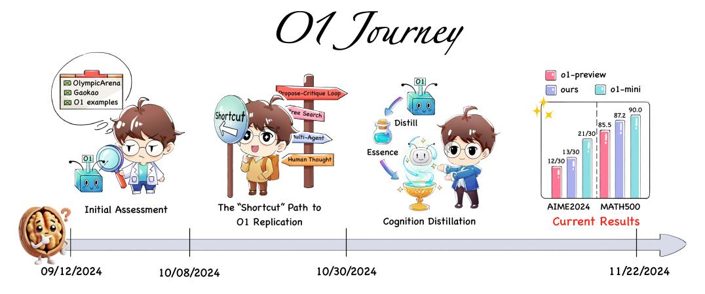

# Abstract

This paper presents a critical examination of current approaches to replicating OpenAI's O1 model capabilities, with particular focus on the widespread but often undisclosed use of knowledge distillation techniques. While our previous work (Part 1 [\(Qin et al.,](#page-15-0) [2024\)](#page-15-0)) explored the fundamental technical path to O1 replication, this study reveals how simple distillation from O1's API, combined with supervised fine-tuning, can achieve superior performance on complex mathematical reasoning tasks. Through extensive experiments, we show that a base model fine-tuned on simply tens of thousands of samples O1-distilled long-thought chains outperforms O1-preview on the American Invitational Mathematics Examination (AIME) with minimal technical complexity. Moreover, our investigation extends beyond mathematical reasoning to explore the generalization capabilities of O1-distilled models across diverse tasks: hallucination, safety and open-domain QA. Notably, despite training only on mathematical problem-solving data, our models demonstrated strong generalization to open-ended QA tasks and became significantly less susceptible to sycophancy after fine-tuning. We deliberately make this finding public to promote transparency in AI research and to challenge the current trend of obscured technical claims in the field. Our work includes: (1) A detailed technical exposition of the distillation process and its effectiveness, (2) A comprehensive benchmark framework for evaluating and categorizing O1 replication attempts based on their technical transparency and reproducibility, (3) A critical discussion of the limitations and potential risks of over-relying on distillation approaches, our analysis culminates in a crucial "*bitter lesson*": while the pursuit of more capable AI systems is important, the development of researchers grounded in firstprinciples thinking is paramount. This educational imperative represents not just a technical consideration, but a fundamental human mission that will shape the future of AI innovation.[1](#page-0-0) Relevant resources will be available at <https://github.com/GAIR-NLP/O1-Journey>.

> **[图片提取文字 (无描述)]:**
> O1 Tourney o1-preview ⊠ OlympicArena o1-mini ⊠ Gaokao Propose-Critique Loop □ O1 examples 90.0 ree Search 87.2 Distill 85.5 21/30 tulti-Agent Essence 13/30 **Human Thought** 12/30 The "Shortcut" Path to AIME2024 MATH500 Initial Assessment Cognition Distillation **Current Results** O1 Replication 09/12/2024 10/30/2024 11/22/2024 10/08/2024

Figure 1: Illustration of our O1 replication journey from September 12 to November 22, 2024.

\* Co-first authors

† Corresponding author

1 Per OpenAI's Terms of Use, our distillation of the OpenAI O1 series models is strictly for research purposes and will not be fully disclosed publicly.

