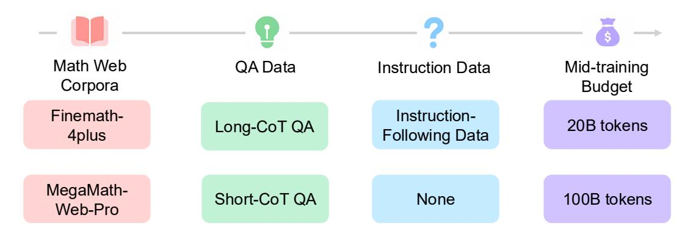
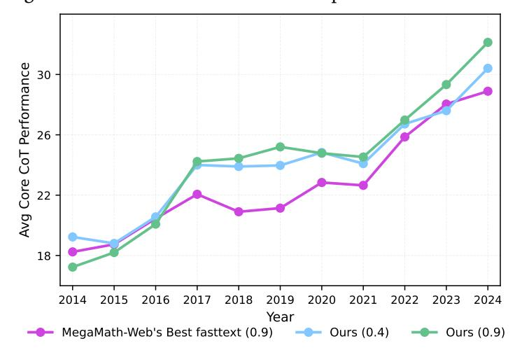
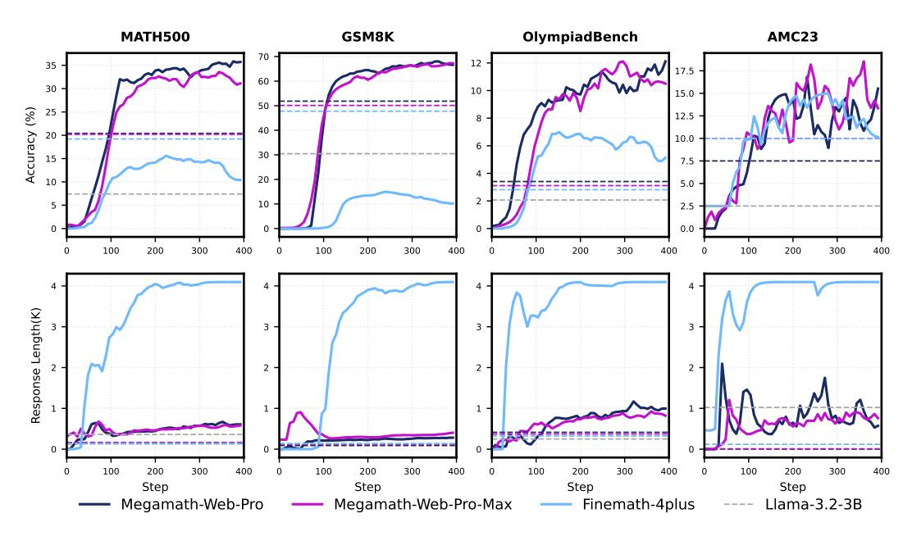
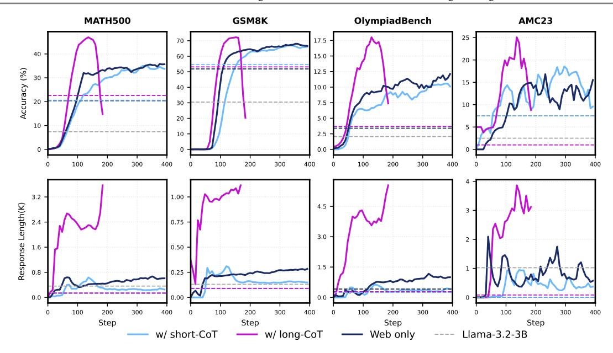
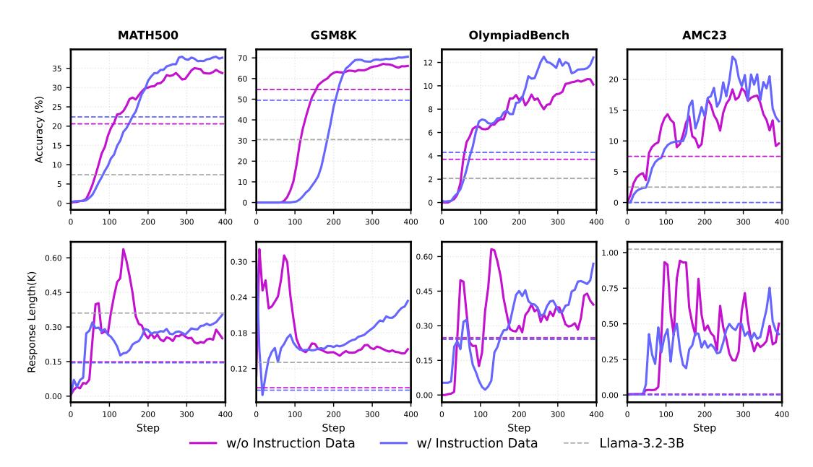
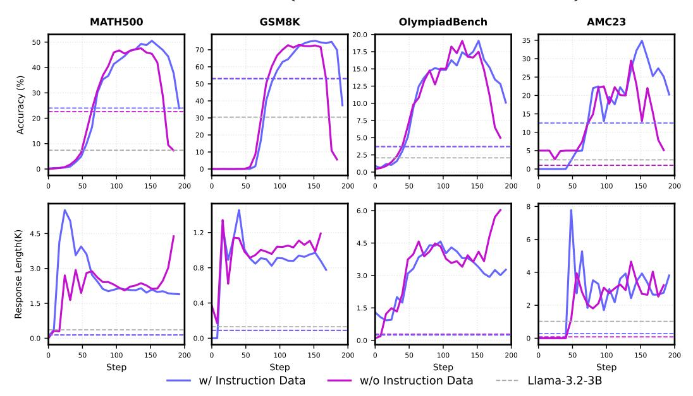
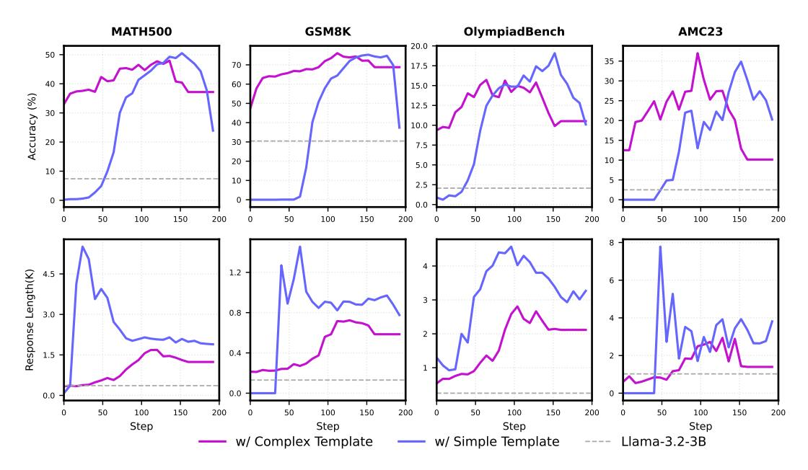
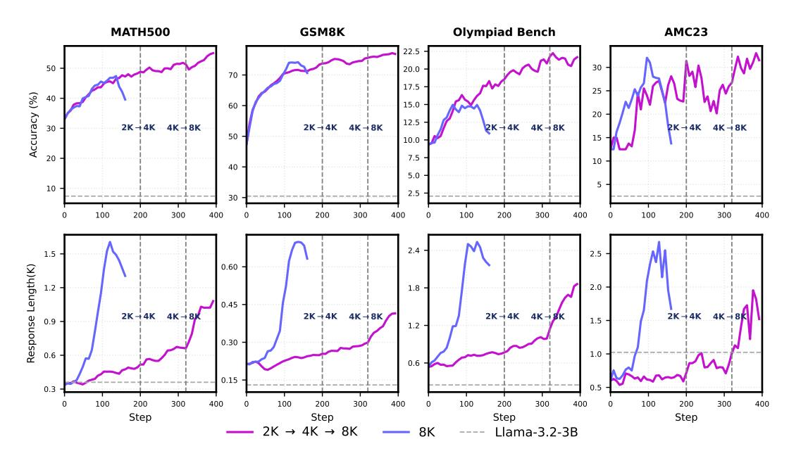
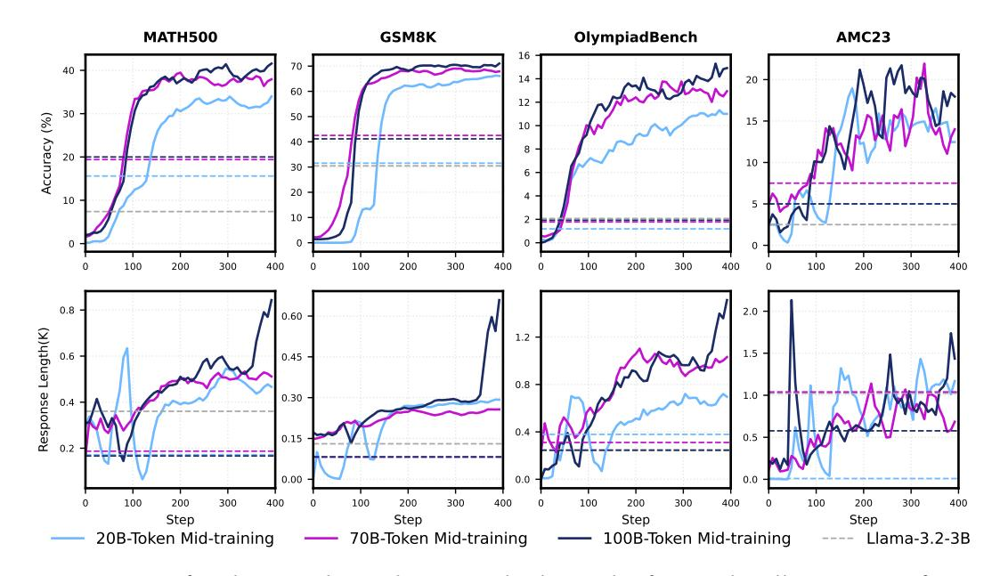

# **3. Digging Deeper: Exploring Key Factors through Controllable Mid-training**

We aim to investigate the impact of several factors during mid-training on RL performance through head-to-head experiments, as shown in Figure [3.](#page-4-0) Specifically, we examine the effects of data quality of math web corpora, the inclusion or exclusion of QA-format data, the nature of the QA data itself, the presence of general instruction-following data in mid-training, as well as the pre-training token budget. These systematic analyses help us gain a deeper understanding of the connection between pre-training and RL dynamics and figure out suitable recipes for scaled-up mid-training. Controlled Factors During Mid-training

> **[图片提取文字 (无描述)]:**
> Math Web Mid-training QA Data Instruction Data Corpora Budget Finemath-Instruction-Long-CoT QA 20B tokens Following Data 4plus MegaMath-100B tokens Short-CoT QA None Web-Pro

**Figure 3** | Potential factors in mid-training that could impact the post-training stage.

## **3.1. Experimental Setup**

**Mid-training setup** By default, we perform mid-training with Llama-3.2-3B-Base on diverse datasets and training configurations within a 20B-token training budget. We use a cosine learning rate scheduler without warmup, with a peak learning rate of 3e-5 and a minimum learning rate set to one-tenth of the peak. The default sequence length is 8,192, and the batch size is 4 million tokens. Training is conducted using the Nanotron framework. [2](#page-4-1)

**RL setup** We follow the exact same RL setup as described above in Section [2,](#page-2-1) unless stated otherwise.

**Table 1** | Statistics and Types of different datasets used in our experiments. ⋄We use the TULU3-sft-personna-instruction-following subset.

| Dataset                                                                                                       | Type                            | # Tokens (B)           |
|---------------------------------------------------------------------------------------------------------------|---------------------------------|------------------------|
| FineMath-4plus (Allal et al., 2025) MegaMath-Web-Pro (Zhou et al., 2025) MegaMath-Web-Pro-Max (Ours) | Math Web Documents              | 9.57 13.00 73.80 |
| MegaMath-QA (Zhou et al., 2025) OpenR1-Math-220K (HuggingFace, 2025)                                       | QA (Short-CoT) QA (Long-CoT) | 5.94 1.05           |
| TULU3-sft⋄ (Lambert et al., 2024a) WildChat (Zhao et al., 2024) UltraChat-220K (Ding et al., 2023a)  | General Instruction Following   | 0.01 0.29 0.51   |

**Datasets** The datasets used to support our controllable experiments are summarized in Table [1.](#page-4-2) For the OpenR1 dataset, we concatenate the question and the thinking process enclosed within <think> and </think> using a line break. For the general instruction following datasets, we only retain

2<https://github.com/huggingface/nanotron>

high-quality conversations, such as those derived from GPT-4, and formated the conversations as "User:{}\nAssistant:{}".

The Curation of MegaMath-Web-Pro-Max We curate MegaMath-Web-Pro-Max to support large-scale ablation studies and mid-training. The corpus is constructed using an efficient classifier to recall documents from MegaMath-Web (Zhou et al., 2025), followed by refinement using a powerful instruction-following LLM. Specifically, we uniformly and randomly sample millions of documents from the MegaMath-Web corpus, stratified by publication year, and annotate them using Llama-3.1-70B-instruct. Each document is graded for its usefulness in studying mathematics on a scale from 0 to 5 using a grading prompt (see Figure 15). We heuristically extract scores from the model's critiques: documents scoring below 3 were labeled as negative examples, while those scoring 3 or above were considered positive. We observe that existing classifiers, such as finemath-classifier, are highly sensitive to the choices of text extractors during data curation. This motivates us to train our own classifier, selecting fasttext for its efficiency. Consistent with the findings of Zhou et al. (2025), we find preprocessing to be critical for recall performance. Our preprocessing pipeline includes lowercasing text, filtering excessively long words, and removing line breaks and extraneous non-alphanumeric characters.

Following MegaMath-Web's yearly dump comparison setup, we evaluate the quality of our recalled corpus under different thresholds, as shown in Figure 4. The recall threshold controls the trade-off between data quantity and quality: a higher threshold (e.g., 0.9) yields better quality but retains fewer tokens. Finally, we select a threshold of 0.4. Given the noisy and poorly structured nature of many documents, we employ Llama-3.1-70B-instruct to refine the text using a prompt (see Figure 16) inspired by MegaMath-Web-Pro. The resulting dataset, MegaMath-Web-Pro-Max, contains approximately 5.5 times more tokens than MegaMath-Web-

> **[图片提取文字 (无描述)]:**
> Avg Core CoT Performance Year MegaMath-Web's Best fasttext (0.9) Ours (0.4) Ours (0.9)

**Figure 4** | Comparison between our fasttext-recalled corpus (w/o LLM refinement) and MegaMath-Web, following its yearly dump comparison setup under a 5B-token pre-training budget. Recall thresholds shown accordingly.

Pro. Empirical evaluations during pre-training indicate that MegaMath-Web-Pro-Max maintains comparable data quality, making it a strong candidate as a foundational corpus for large-scale midtraining. Besides, we also explored to supplement the positive seed set with (long)CoT examples from common math problem-solving datasets to improve the classifier's ability to recall reasoning-intensive content. However, this approach retained only around 20B tokens, which we deemed insufficient in scale and thus did not adopt.

#### 3.2. On the Inclusion and Data Quality of Math Web Corpora

Web corpora provide a solid foundation during pre-training. We believe that math-specific web corpora, along with their data quality, continue to play a crucial role during mid-training. We begin our systematic analysis by performing mid-training on different math web corpora and holding other factors being constant. As shown in the Figure 5, mid-training on math web data improves performance over the base model, with MegaMath-Web-Pro and MegaMath-Web-Pro-Max showing slightly better gains than Finemath-4plus. After RL training, we find that mid-training on math web corpora improves RL performance to varying degrees. MegaMath-Web-Pro and MegaMath-Web-Pro-Max bring significant

> **[图片提取文字 (无描述)]:**
> **MATH500** GSM8K OlympiadBench AMC23 15.0 Accuracy (%) 12.5 10.0 7.5 5.0 2.5 0.0 Response Length(K) Step Step Step Step Finemath-4plus Megamath-Web-Pro Megamath-Web-Pro-Max Llama-3.2-3B

**Figure 5** | The effect of different math web corpora during mid-training. We performed mid-training on each corpus with a 20B-token training budget.

gains for Llama in RL training, while Finemath-4plus yields only marginal improvements—highlighting the clear differences in data quality. Furthermore, we observe that models trained on FineMath-4plus exhibited abnormal behavior, with response lengths rapidly increasing until reaching the maximum limit of 4,096 tokens. The outputs typically begin with "\boxed{}" and devolve into repetitive "Solution" statements. Given these observations, we select MegaMath-Web-Pro as our default mathematical corpus and also MegaMath-Web-Pro-Max for scaled mid-training.

**Takeaway:** High-quality math pre-training corpora play a dominant role in RL scaling. We finally adopt MegaMath-Web-Pro and our curated MegaMath-Web-Pro-Max in this work.

#### **3.3. On the Inclusion and Nature of QA-Format Data**

Intuitively, introducing QA data into pre-training and mid-training improves model performance, as previously examplified in [Bi et al.](#page-18-8) [\(2024\)](#page-18-8) and [Hu et al.](#page-20-7) [\(2024b\)](#page-20-7). We further investigate this using a 9:1 web-to-QA data mix. We hypothesize that QA data's short Chain-of-Thought (short-CoT, from MegaMath-QA) and long-CoT (from OpenR1-Math-220K) reasoning, which may include self-reflection and backtracking, enhance base model performance and RL training. Maximum response lengths were 8,192 tokens for long-CoT models and 4,096 for others.

As shown in Figure [6,](#page-7-0) incorporating QA data into mid-training generally yields performance gains for the base model, though these gains are marginal, as indicated by dashed lines. After RL training, incorporating short-CoT data into mid-training shows no improvements compared to mid-training on web data alone, possibly due to the data distribution gap (see § [4.2](#page-11-0) for more ablation studies), while long-CoT data brings significant performance gains. However, incorporating long-CoT data introduces challenges with unstable RL training, evidenced by sudden performance drops and sharp increases in response length. We also explore methods for stabilizing RL training, which we discuss in the following sections.

> **[图片提取文字 (无描述)]:**
> GSM8K **MATH500** OlympiadBench AMC23 17.5 70 40 15.0 60 20 Accuracy (%) 12.5 10.0 7.5 30 10 20 5.0 10 2.5 10 0.0 0 100 200 300 100 200 300 100 200 300 100 200 300 400 400 400 400 3.2 1.00 Response Length(K) 4.5 0.75 3.0 0.50 1.6 1.5 0.25 0.8 0.0 0.0 0.00 200 300 100 200 300 400 100 300 400 100 200 400 100 200 300 400 0 0 Step Step Step Step w/ short-CoT Web only Llama-3.2-3B w/ long-CoT

**Figure 6** | Impact of incorporating CoT data with varying characteristics during mid-training (9:1 mixture ratio). The figure also illustrates performance and average lengths of correct responses for Llama-3.2-3B-Base and its mid-trained variants for reference (in dashed line with different colors).

**Takeaway:** QA data could aid RL scaling, but gains depend on its distribution gap with downstream tasks. Long CoT patterns often induce excessive responses and sudden performance drops in RL-tuned models.

## **3.4. On the Inclusion of Instruction-following Data**

Incorporating instruction-following data into earlier-stage training has become an increasingly common practice. Works such as MiniCPM [\(Hu et al.,](#page-20-7) [2024b\)](#page-20-7) demonstrate that including high-quality unlabeled data and instruction-following data significantly improves downstream performance. We believe this inclusion is critically important for enhancing the base model's ability to follow instructions, which may be a potential key determining factor for successful RL training. We incorporate instruction-following data alongside web data and QA data in a 1:89:10 ratio. For this, we combine these high-quality datasets with appropriate filtering and formatting: TULU3-sft-personas-instructionfollowing [\(Lambert et al.,](#page-20-8) [2024b\)](#page-20-8), WildChat [\(Zhao et al.,](#page-23-6) [2024\)](#page-23-6), and UltraChat-200K [\(Ding et al.,](#page-18-9) [2023b\)](#page-18-9), totaling approximately 0.8B tokens.

**Incorporating instruction-following data into the short-CoT mid-training mixture.** As shown in Figure [7,](#page-8-0) after RL training, incorporating instruction-following data, unlocks the potential of short-CoT data, showing performance advantages over the exclusion case after 200 steps. Additionally, this inclusion helps stabilize response length, resulting in smoother increases compared to when instruction-following data is excluded.

**Incorporating instruction-following data into the long-CoT mid-training mixture.** Similar to the challenges encountered earlier in RL training with the long-CoT mid-trained base model, as shown in Figure [8,](#page-8-1) incorporating instruction-following data shows performance improvements after 150 steps. However, this addition still fails to prevent the overall decline in RL performance and the rapid increase in response length. Note that we set the maximum response length to 8,192 tokens for these experiments.

> **[图片提取文字 (无描述)]:**
> **MATH500** GSM8K OlympiadBench AMC23 Accuracy (%) 10 -1.00 0.60 0.60 0.30 Response Length(K) 0.75 0.45 0.45 0.24 0.50 0.30 0.30 0.18 0.25 0.15 0.12 0.00 0.00 0.00 Step Step Step Step w/o Instruction Data w/ Instruction Data Llama-3.2-3B

**Figure 7** | Impact of incorporating instruction-following data during mid-training with a mixture of web, short-CoT and instruction data in a ratio of 89: 10: 1 . The maximum response length is 4,096. The figure also illustrates performance and average lengths of correct responses for Llama-3.2-3B-Base and its mid-trained variants for reference (in dashed line with different colors).

> **[图片提取文字 (无描述)]:**
> **MATH500** GSM8K OlympiadBench AMC23 20.0 17.5 15.0 Accuracy (%) 12.5 10.0 7.5 5.0 2.5 0.0 6.0 1.2 Response Length(K) 4.5 0.8 3.0 0.4 1.5 0.0 0.0 0.0 Step Step Step Step w/ Instruction Data w/o Instruction Data Llama-3.2-3B

**Figure 8** | Impact of incorporating instruction-following data during mid-training with a mixture of web, long-CoT and instruction data in a ratio of 89: 10: 1. The maximum response length is 8,192. The figure also illustrates performance and average lengths of correct responses for Llama-3.2-3B-Base and its mid-trained variants for reference (in dashed line with different colors).

Given the challenges encountered during RL training on the base model mid-trained on long-CoT data, we explore strategies to stabilize RL training by modifying the RL prompt template and maximum length scheduler.

**Effect of RL prompt template** The default template is "Question:{}\nAnswer:{}", which we refer to as "*Simple Template*". Here, we introduce an alternative, the "*Complex Template*", adapted from the prompt design in Open-Reasoner-Zero [\(Hu et al.,](#page-20-0) [2025\)](#page-20-0):

> **[图片提取文字 (无描述)]:**
> **MATH500** GSM8K OlympiadBench AMC23 20.0 17.5 15.0 Accuracy (%) 12.5 10.0 7.5 5.0 2.5 Response Length(K) 1.2 4.5 3.0 0.8 0.4 0.0 0.0 Step Step Step Step w/ Simple Template w/ Complex Template Llama-3.2-3B

**Figure 9** | Impact of different RL prompt templates. The figure also illustrates performance and average lengths of correct responses for Llama-3.2-3B-Base (in dashed line with different colors).

**Prompt Template:** A conversation between User and Assistant. The user asks a question, and the Assistant solves it. The assistant first thinks about the reasoning process in the mind and then provides the user with the answer. User: You must put your answer inside \\boxed{} and your final answer will be extracted automatically by the \\boxed{} tag. {{prompt}}

Assistant:

We also control the maximum response length as 8,192 tokens. As shown in Figure [9,](#page-9-0) we find this *complex template* could clearly stabilize RL training compared to the *simple template*, as evidenced by a smoother, more gradual increase in mean response length, as opposed to the sharp spikes observed with the simple template. Despite this stabilization, performance across evaluation benchmarks still deteriorates during the later stages of RL training, indicating need more exploring. Note that we adopt the *complex template* as the default for all subsequent RL experiments.

**Effect of the maximum response length** The default maximum context length is set to 8,192 tokens for long-CoT mid-trained models. Intuitively, we can delay the sharp rise in response length by gradually increasing the maximum response length in multiple stages. Specifically, we start with a limit of 2,048 tokens for the first 200 steps, increase it to 4,096 tokens from step 200 to step 320, and then further expand to the full 8,192-token context length from step 320 to step 400. As shown in Figure [10,](#page-10-0) this progressive scheduling strategy significantly stabilizes RL training up to 400 steps, while consistently improving performance across benchmarks. In addition, the response lengths grow steadily and appropriately, highlighting the effectiveness of the progressive length scheduler.

**Takeaway:** Introducing a small amount of instruction-following data can help unlock the potential of QA data and mitigate RL training collapse caused by long CoT. We address this issue by modifying the RL prompt template and applying a progressive maximum response length scheduler.

> **[图片提取文字 (无描述)]:**
> **MATH500** GSM8K **Olympiad Bench** AMC23 22.5 50 30 20.0 70 17.5 25 Accuracy (%) 15.0 60 20 12.5 2K-4K 4K-8K 2K → 4K 4K → 8K 2K → 4K 4K → 8K 2K → 4K 4K → 8K 50 15 10.0 7.5 10 40 5.0 10 2.5 30 100 200 300 400 100 200 300 400 100 200 300 400 100 200 300 400 0 2.4 1.5 2.5 Response Length(K) 0.60 2.0 1.8 1.2 0.45 2K-4K 4K-8K 2K-4K 4K-8K/ 2K - 4K 4K - 8K 2K -4K 4K -8K 1.5 1.2 0.30 1.0 0.6 0.6 0.15 0.5 0.3 200 300 300 100 200 300 400 100 400 0 100 200 400 100 200 300 400 0 Step Step Step Step  $2K \rightarrow 4K \rightarrow 8K$ 8K Llama-3.2-3B

**Figure 10** | Impact of the maximum length scheduler on the model response. The figure also illustrates performance and average lengths of correct responses for Llama-3.2-3B-Base in a dashed line.

> **[图片提取文字 (无描述)]:**
> GSM8K OlympiadBench AMC23 MATH500 Accuracy (%) 0.8 2.0 0.60 Response Length(K) 1.2 1.5 0.6 0.45 0.8 1.0 0.30 0.4 0.4 0.15 0.00 0.0 0.0 Step Step Step Step 20B-Token Mid-training 70B-Token Mid-training 100B-Token Mid-training Llama-3.2-3B

**Figure 11** | Impact of scaling up the mid-training budget. The figure also illustrates performance and average lengths of correct responses for Llama-3.2-3B-Base and its mid-trained variants for reference (in dashed lines with different colors).

### **3.5. On the Issue of Mid-training Budget**

Could further scaling up mid-training improve RL performance? To explore this, we conduct a 100Btoken mid-training run on MegaMath-Web-Pro-Maxusing a default cosine learning rate scheduler. We select three intermediate checkpoints—trained on 20B, 70B, and 100B tokens, respectively—and perform RL training. When evaluating the base models, we observe that the 70B and 100B checkpoints achieved comparable performance, both significantly outperforming the 20B model. After RL training, interestingly, we find that increasing the mid-training token count consistently leads to improvements on RL performance despite varying degrees, whether moving from 20B to 70B or from 70B to 100B tokens. These findings highlight the importance of further scaling up the mid-training budget to

unlock additional gains in downstream RL performance.

**Takeaway:** Increasing the mid-training budget can improve RL performance, even if such gains are not evident in base model evaluations.

