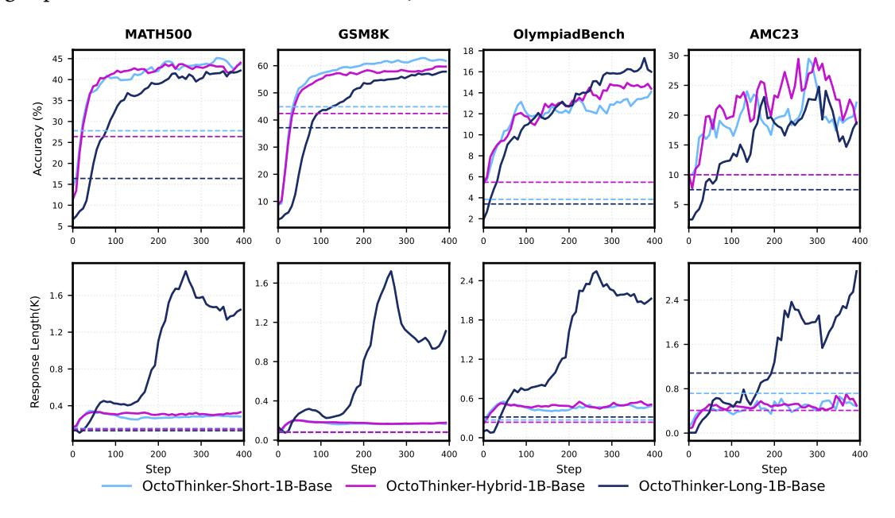
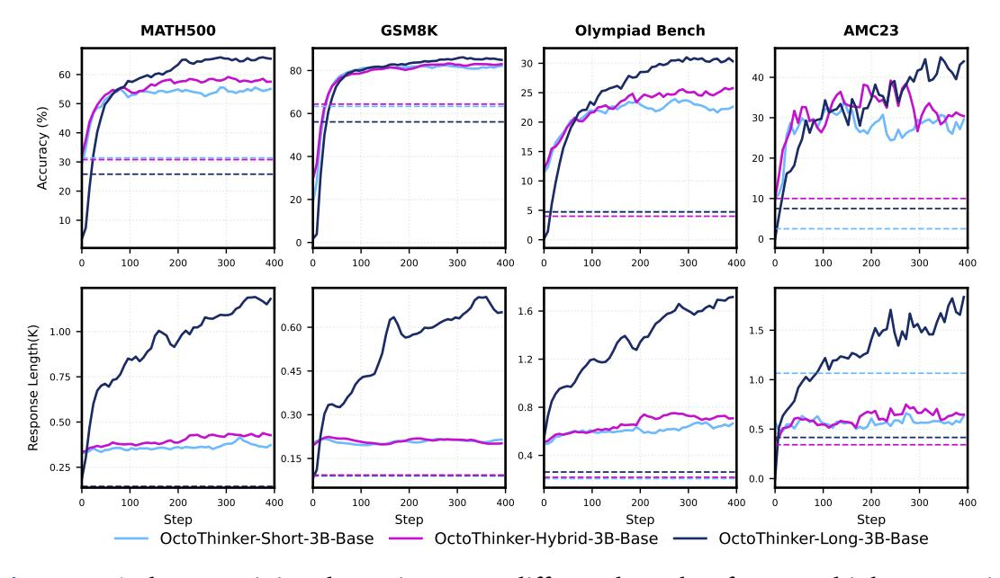
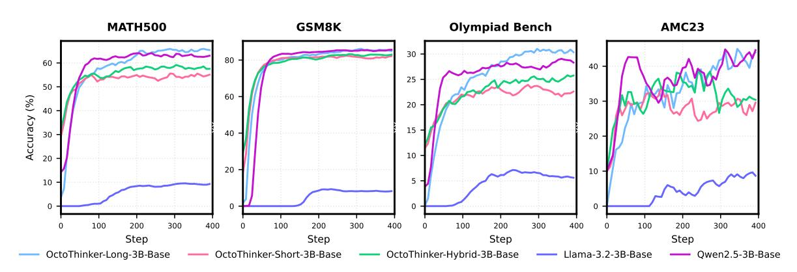

# **5. OctoThinker-Zero Families: RL Scaling with Diverse Thinking Behaviors**

We further train all OctoThinker base models—spanning different decay branches and model sizes (1B and 3B)—through a reinforcement learning stage, following our previously established setup. This yields a family of models optimized specifically for mathematical reasoning. As in the decay stage, the final RL-tuned models fall into three categories, each reflecting the data mixture used during decay and the distinct behaviors shaped during RL: OctoThinker-Short-Zero, OctoThinker-Hybrid-Zero, and OctoThinker-Long-Zero. The training dynamics of these models are shown in Figure [12](#page-15-0)[,13.](#page-15-1) The OctoThinker-Long branch tends to produce longer responses—within a controlled range—compared to other branches. While it slightly underperforms at the 1B scale, it demonstrates stronger performance as model size increases, such as at 3B.

> **[图片提取文字 (无描述)]:**
> **MATH500** GSM8K OlympiadBench AMC23 Accuracy (%) 2.4 1.6 1.6 Response Length(K) 2.4 1.8 1.2 1.6 1.2 0.8 0.8 0.6 0.4 0.0 0.0 Step Step Step Step OctoThinker-Short-1B-Base OctoThinker-Hybrid-1B-Base OctoThinker-Long-1B-Base

**Figure 12** | The RL training dynamics across different branches for OctoThinker-1B series

> **[图片提取文字 (无描述)]:**
> **Olympiad Bench** MATH500 GSM8K AMC23 Accuracy (%) 1.6 0.60 Response Length(K) 1.5 1.00 1.2 0.45 0.75 1.0 8.0 0.30 0.50 0.5 0.4 0.15 0.25 0.0 Step Step Step Step OctoThinker-Short-3B-Base OctoThinker-Hybrid-3B-Base OctoThinker-Long-3B-Base

**Figure 13** | The RL training dynamics across different branches for OctoThinker-3B series

> **[图片提取文字 (无描述)]:**
> **Olympiad Bench** MATH500 GSM8K AMC23 Accuracy (%) Step Step Step Step OctoThinker-Long-3B-Base OctoThinker-Short-3B-Base OctoThinker-Hybrid-3B-Base Llama-3.2-3B-Base Qwen2.5-3B-Base

**Figure 14** | RL training dynamics among Llama-3.2-3B-Base, OctoThinker series and Qwen2.5-Base.

**OctoThinker vs. Qwen2.5** An important question we investigate is: *To what extent can our OctoThinker models close the performance gap between the Llama-3.2 series and the stronger Qwen2.5 models in the RL setting?* To address this, we compare three 3B-scale base models: Llama-3.2-3B-Base, OctoThinker-Long-3B-Base, and Qwen2.5-3B-Base. As illustrated in Figure [14,](#page-16-0) during the reinforcement learning phase, OctoThinker-Long-3B consistently outperforms the original Llama-3.2-3B model. Remarkably, it reaches performance on par with Qwen2.5-3B, a model known for its strong reasoning capabilities and extensive pre-training, while the hybrid and short branches are marginally inferior, especially on challenging benchmarks. Overall, these results highlight the substantial gains introduced by our mid-training strategy and confirm that OctoThinker effectively narrows the performance gap, elevating Llama-3.2 models to a new level of competitiveness in mathematical reasoning tasks.

