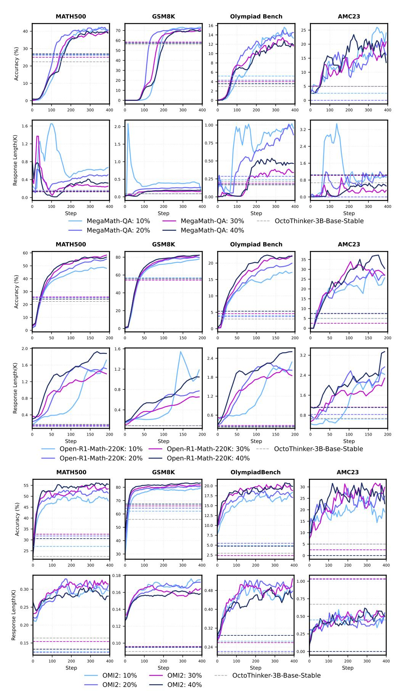

# **Appendix**

### **Scoring Prompt of Usefulness for Studying Mathematics**

Evaluate the following text extract for its potential usefulness for studying mathematics up to high school and early undergraduate levels. Use the following 5-point scoring system described below. Points are accumulated based on the satisfaction of each criterion:

- Add 1 point if the extract contains some mathematical content, even if it's not very useful for studying, or if it contains non-academic content such as advertisements and generated pages for converting weight and currencies.
- Add another point if the extract touches on mathematical topics, even if it's poorly written if it's too complex such as an academic paper that is too advanced.
- Award a third point if the extract demonstrates problem solving or logical reasoning in a mathematical context, even if it lacks step-by-step explanations.
- Grant a fourth point if the extract is at an appropriate level (up to high school and early undergraduate levels) and contains clear mathematical deductions and step-by-step solutions to mathematical problems. It should be similar to a chapter from a textbook or a tutorial.
- Give a fifth point if the extract is outstanding in its educational value for teaching and studying mathematics in middle school and high school. It should include very detailed and easy to follow explanations.

Question-answer formats (e.g., from educational websites or forums) are acceptable if they meet the criteria.

The text extract: " <document> "

After examining the extract:

- Briefly justify your total score, up to 100 words.
- Conclude with the score using the format: Final score: <total points>.

**Figure 15** | Scoring prompt in FineMath [\(Allal et al.,](#page-18-0) [2025\)](#page-18-0) of usefulness for studying mathematics.

#### **Web Text Refinement Prompt**

#### Task:

- Carefully analyze the provided text to extract key facts, concrete details, important numbers, and core concepts.
- Remove any irrelevant or noisy information, and reorganize the content into a logically structured, information-dense, and concise version that is easy to learn from. Output only the refined text.
- Strive to maintain the original length as much as possible (avoid excessive shortening).
- Refine multiple choice questions and answers if any.

Text:

<EXAMPLE>

Just output the refined text, no other text.

**Figure 16** | Web text refinement prompt used in MegaMath-Web-Pro [\(Zhou et al.,](#page-23-4) [2025\)](#page-23-4)

> **[图片提取文字 (无描述)]:**
> **Olympiad Bench** MATH500 AMC23 GSM8K 25 40 60 20 30 Accuracy (%) 15 8 30 10 20 10 10 400 400 100 200 300 400 200 300 100 200 300 100 300 1.00 1.6 3.2 Response Length(K) 0.75 1.2 1.5 2.4 0.50 8.0 1.0 1.6 0.25 0.4 0.5 8.0 0.0 0.0 100 200 300 400 100 200 300 400 200 300 400 300 Step Step Step Step MegaMath-QA: 10% MegaMath-QA: 30% ---- OctoThinker-3B-Base-Stable MegaMath-QA: 20% MegaMath-QA: 40% Olympiad Bench AMC23 MATH500 GSM8K 60 80 20 50 30 Accuracy (%) 40 25 20 40 10 15 20 20 10 150 50 100 150 200 50 100 200 50 100 150 200 50 100 150 2.0 3.2 2.4 Response Length(K) 1.6 1.2 2.4 1.8 1.2 0.8 1.6 1.2 8.0 0.4 0.8 100 200 50 100 150 200 100 150 200 100 150 200 Step Step Step Step Open-R1-Math-220K: 10% — Open-R1-Math-220K: 30% ---- OctoThinker-3B-Base-Stable AMC23 OlympiadBench MATH500 GSM8K 55 30 80 17.5 50 25 70 Accuracy (%) 15.0 45 20 60 12.5 40 15 10.0 50 35 10 7.5 30 40 25 30 200 300 100 200 100 200 300 400 400 100 300 400 100 200 300 400 0.18 1.00 0.30 0.48 Response Length(K) 0.16 0.75 0.25 0.14 0.40 0.50 0.20 0.12 0.32 0.25 0.15 0.10 0.24 100 200 200 300 400 100 300 400 100 200 300 400 100 200 300 400 Step Step Step Step OMI2: 10% OMI2: 30% OctoThinker-3B-Base-Stable OMI2: 20% OMI2: 40%

**Figure 17** | RL dynamics under different QA datasets and mixing ratios during the decay stage.