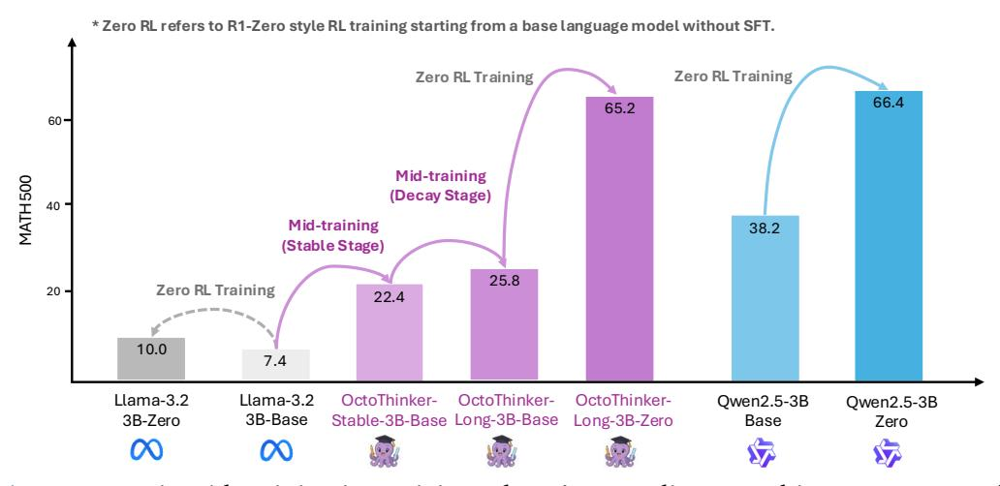

# OctoThinker: Mid-training Incentivizes Reinforcement Learning Scaling

Zengzhi Wang\*, Fan Zhou\*, Xuefeng Li\*, Pengfei Liu\*
Shanghai Jiao Tong University, SII, GAIR Lab
{zengzhi.wang, zhoufan98, xuefengli, pengfei}@sjtu.edu.cn

GAIR-NLP/OctoThinker OctoThinker

Different base language model families—such as Llama and Qwen—exhibit divergent behaviors during post-training with reinforcement learning (RL), especially on reasoning-intensive tasks. What makes a base language model suitable for reinforcement learning? Gaining deeper insight into this question is essential for developing RL-scalable foundation models of the next generation. In this work, we investigate how mid-training strategies shape RL dynamics, focusing on two representative model families: Qwen and Llama. Our study reveals that (1) high-quality mathematical corpora, such as MegaMath-Web-Pro, significantly improve both base model and RL performance, while existing alternatives (e.g., FineMath-4plus) fail to do so; (2) further adding QA-style data, particularly long chain-of-thought (CoT) reasoning examples, enhances RL outcomes, and instruction data further unlocks this effect; (3) while long-CoT improves reasoning depth, it can also induce verbosity of model responses and unstability of RL training, underscoring the importance of data formatting; (4) scaling mid-training consistently leads to stronger downstream RL performance. Building on these insights, we introduce a two-stage mid-training strategy—Stable-then-Decay—in which base models are first trained on 200B tokens with a constant learning rate, followed by 20B tokens across three CoT-focused branches with learning rate decay. This yields OctoThinker, a family of models demonstrating strong RL compatibility and closing the performance gap with more RL-friendly model families, i.e., Qwen. We hope our work will help shape pre-training strategies for foundation models in the RL era. To support further research, we release our open-source models along with a curated math reasoning-intensive corpus of over 70 billion tokens (i.e., MegaMath-Web-Pro-Max).

> **[图片提取文字 (无描述)]:**
> \* Zero RL refers to R1-Zero style RL training starting from a base language model without SFT. Zero RL Training Zero RL Training 66.4 65.2 60-Mid-training MATH 500 (Decay Stage) 40 -Mid-training 38.2 (Stable Stage) 25.8 Zero RL Training 20 22.4 10.0 7.4 Llama-3.2 Llama-3.2 OctoThinker-OctoThinker-OctoThinker-Qwen2.5-3B Qwen2.5-3B 3B-Base 3B-Zero Stable-3B-Base Long-3B-Base Long-3B-Zero Base Zero

Figure 1 | Our strategic mid-training incentivizes Llama's RL scaling, matching Qwen2.5 performance.

\*Equal contribution. \*Corresponding author.

