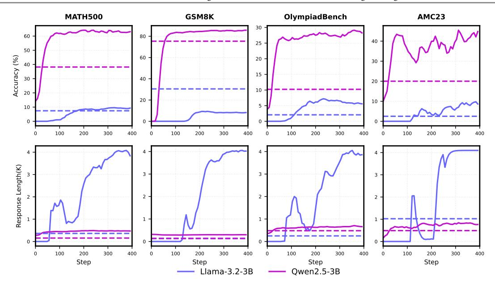

# **2. Preliminaries**

We begin by identifying a key difference in RL dynamics between two prominent model families—Qwen and Llama—through the lens of mathematical reasoning. This observation offers a concrete and measurable foundation that grounds our systematic investigation.

### **2.1. Experiment Setup**

**RL Setup** We perform our RL experiments based on the verl [\(Sheng et al.,](#page-22-0) [2024\)](#page-22-0) framework and utilize the GRPO [\(Shao et al.,](#page-22-1) [2024\)](#page-22-1) algorithm. For RL training prompts, we adopt the MATH8K [1](#page-2-0) dataset due to its moderate difficulty and concise composition. We configure the global training batch size to 128, set the number of rollout responses per query to 16, and use a PPO mini-batch size of 64. The sampling temperature is set to 1.0, with a maximum output length of 4096 tokens. We use a learning rate of 1 × 10−6 and set the KL loss coefficient to 0 in the verl configuration. Empirically, we find that setting the ratio between sampling and gradient updates to 2 leads to more stable RL training. Unless otherwise specified, we employ a simple prompt template of "Question:{}\nAnswer:{}" to format training examples.

**Choices of Base Model** We employ Llama-3.2-3B-Base [\(Dubey et al.,](#page-19-2) [2024\)](#page-19-2) and Qwen2.5-3B-Base [\(Yang et al.,](#page-23-3) [2024b\)](#page-23-3) to perform R1-Zero styled RL training given the moderate model size.

**Evaluation** We adopt the few-shot prompting evaluation for base language models and employ zero-shot evaluation for RL-tuned models. Specifically, we employ GSM8K [\(Cobbe et al.,](#page-18-1) [2021\)](#page-18-1), MATH500 [\(Lightman et al.,](#page-20-1) [2023\)](#page-20-1), OlympiadBench [\(He et al.,](#page-19-3) [2024\)](#page-19-3), and AMC23 as indicator tasks to analyze RL dynamics. To assess base model performance, we further include MATH [\(Hendrycks et al.,](#page-19-4) [2021\)](#page-19-4), SAT-MATH [\(Azerbayev et al.,](#page-18-2) [2024\)](#page-18-2) , MathQA [\(Amini et al.,](#page-18-3) [2019\)](#page-18-3), MMLU-STEM [\(Hendrycks](#page-19-4) [et al.,](#page-19-4) [2021\)](#page-19-4), OCW Course [\(Lewkowycz et al.,](#page-20-2) [2022\)](#page-20-2), MAWPS [\(Koncel-Kedziorski et al.,](#page-20-3) [2016\)](#page-20-3), SVAMP [\(Patel et al.,](#page-22-2) [2021\)](#page-22-2), ASDiv [\(Miao et al.,](#page-21-5) [2020\)](#page-21-5), and TabMWP [\(Lu et al.,](#page-21-6) [2023\)](#page-21-6).

#### **2.2. Observations**

During RL training on Llama-3.2-3B-Base and Qwen2.5-3B-Base, we observe notably different and intriguing training dynamics regardless of their performance, as shown in Figure [2.](#page-3-0) Specifically, the length of correct responses from the Qwen model increases steadily and reasonably throughout training, whereas Llama exhibits abnormal behavior—its average response length escalated dramatically, reaching up to 4,096 tokens.

1[https://hf.co/datasets/hkust-nlp/SimpleRL-Zoo-Data/tree/main/simplelr\\_qwen\\_level3to5](https://hf.co/datasets/hkust-nlp/SimpleRL-Zoo-Data/tree/main/simplelr_qwen_level3to5)

> **[图片提取文字 (无描述)]:**
> **MATH500** OlympiadBench GSM8K AMC23 Accuracy (%) Response Length(K) Step Step Step Step Qwen2.5-3B Llama-3.2-3B

**Figure 2** | Training dynamics comparison (downstream performance and the average length of correct responses) between Llama-3.2-3B and Qwen2.5-3B. The dashed line indicates the few-shot evaluation performance and average length of correct responses of the corresponding base models.

Upon closer inspection of the Llama model's output, we find that it typically begins with "\boxed:{}", followed by extremely obvious repetition until hitting the max response length, in stark contrast to Qwen's coherent and natural reasoning output. The evaluation results further highlight the divergence: The RL-tuned Qwen2.5-3B achieves substantial improvements over its base model across a wide spectrum of benchmarks, from simple to complex math reasoning tasks. Meanwhile, Llama-3.2-3B experiences only marginal gains—or even regressions, as seen on GSM8K—likely due to the distributional gap between the RL training set (e.g., MATH8K) and GSM8K. The above observations motivate us to attribute the reason to their potential divergence of pre-training despite their opaque details.

These observations also further prompt a more fundamental question: *Can we intervene in the Llama base language models via mid-training to make it more amenable to RL scaling?* Specifically, in this work, we aim to explore a range of mid-training intervention strategies—methods that adjust the pre-training trajectory of LLMs—to examine their downstream impact on RL dynamics.

### **What is Mid-training?**

Mid-training is a mid-stage whose computational and data (token) requirements are intermediate between pre-training and post-training. It aims to achieve specific objectives—such as domain and language expansion [\(Dou et al.,](#page-18-4) [2025,](#page-18-4) *inter alia*), long-context extension [\(Abdin](#page-17-0) [et al.,](#page-17-0) [2024a](#page-17-0)[,b,](#page-17-1) *inter alia*), improving data quality [\(Hu et al.,](#page-20-4) [2024a;](#page-20-4) [OLMo et al.,](#page-21-7) [2025,](#page-21-7) *inter alia*), leveraging large-scale synthetic data [\(Yang et al.,](#page-23-5) [2024a,](#page-23-5) [2025,](#page-23-2) [2024b,](#page-23-3) *inter alia*), and preparing for post-training, among others—by significantly altering data quality and distribution [\(Dubey et al.,](#page-19-2) [2024;](#page-19-2) [Wake et al.,](#page-22-3) [2024,](#page-22-3) *inter alia*) (and/or modifying model architecture to improve inference efficiency [\(Bercovich et al.,](#page-18-5) [2024,](#page-18-5) [2025,](#page-18-6) *inter alia*)).*[a](#page-3-1)*

*a* In the absence of a precise or widely agreed-upon definition, here, we aim to introduce a concise and rigorous definition of *mid-training* within this context. The term was reportedly first mentioned in an OpenAI job description in mid-2024. A detailed blog for this term is available at [https://vintagedata.org/blog/posts/](https://vintagedata.org/blog/posts/what-is-mid-training) [what-is-mid-training](https://vintagedata.org/blog/posts/what-is-mid-training)

