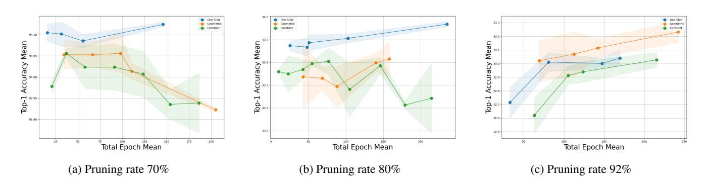

# 5 Pruning regime empirical evaluation

This section consists of five parts. We first present some main takeaways and then present the detailed experiments. In the second part, we present broad results in Computer Vision and Natural Language Processing settings for the most common magnitude pruning. In the third part, we extend the results to other pruning criteria and highlight that the choice of pruning regime impacts the pruning outcomes differently when different pruning criteria are applied, a problem broadly overlooked in the literature. In the fourth section, we consider comparing the regimes when the pruning computational budget is fixed. In the final part, based on our analysis of one-shot and iterative regimes, we propose a novel hybrid approach that combines both existing pruning regimes, retaining its strength and producing a more informed and better-performing pruning regime.

Experimental set-up. We perform experiments on several datasets and model architectures. The datasets include vision datasets, CIFAR-10 [27], CIFAR-100, and Imagenet1K [8] and the language dataset TinyStories [11]. The experiments are performed both on convolutional neural networks and transformers, in particular ResNet [21], EfficientNet [50], Visual Transformer [10] and TinyStories-33M [11]. The open-sourced codebase allows for other custom choices. As recommended in [16], we use 1/10th of the original learning rate for the fine-tuning phase.

## *5.1 Key observations*

- One-shot pruning can perform better than iterative pruning for CNNs and lower pruning rates, and iterative pruning is better for transformers and higher rates.
- One-shot pruning typically reduces retraining time compared to iterative pruning by avoiding repeated cycles of pruning and retraining, which is especially helpful when computational resources are limited.
- Iterative geometric pruning is superior to constant iterative pruning in most cases.
- Early stopping ensures optimal fine-tuning time.
- Number of retraining iterations matters significantly.
- Iterative pruning is preferable for second-derivative methods.

## *5.2 Comparison of one-shot and iterative regimes.*

One-shot pruning with patience-based retraining. We demonstrate that one-shot pruning, when paired with an adaptive retraining duration, can be highly effective, surpassing both forms of iterative pruning, as shown in Fig. 2. Our approach to one-shot pruning uses patience-based retraining, allowing the model to stop fine-tuning

> **[图片提取文字 (无描述)]:**
> One-Shot (Pat) One-Shot (Pat) 80 86 Geometric (Pat) Geometric (Pat) 74 Geometric Geometric Accuracy Mean 22 21 75 Wean 70 Top-1 Accuracy Mean 8 8 8 -- Constant (Pat) Constant (Pat) Accuracy 0 1-dol 55 One-Shot (Pat) Geometric (Pat) Geometric 78 69 Constant (Pat) 70 85 70 75 80 85 90 70 75 80 90 75 Pruning Percentage Pruning Percentage Pruning Percentage ResNet-18 / CIFAR-100 (b) EfficientNet / CIFAR-100 (c) ViT / CIFAR-100 (a) One-Shot (Pat) 0.72 92 Geometric (Pat) One-Shot (Pat) 90.70 Wean Accuracy Mean 96.0 Wean 96.0 Geometric 67.5 Geometric (Pat) Top-1 Accuracy Mean Constant (Pat) Geometric Top-1 Accuracy Mean 62.5 60.0 57.5 55.0 Constant (Pat) 다 0.62 인 0.60 84 - One-Shot (Pat) Iterative Geometric 0.58 Iterative Geometric (Pat) - Iterative Constant 52.5 70 75 65 70 80 90 85 90 95 Pruning Percentage Pruning Percentage 70 95 75 85 90 Pruning Percentage ResNet-18 / CIFAR-10 ResNet-18 / CIFAR-100 (f) (e) ResNet-18 / Imagenet (d) (Structured) (Structured)

Figure 2: Comparison of pruning regimes across architectures and datasets. Method with (Pat) in the name indicate the patience-based fine-tuning. The performance of one-shot, iterative constant and iterative geometric regimes are plotted. 'Geometric' outperforms 'Constant' in most high-sparsity scenarios. The y-axis represents Top-1 Accuracy (%). See Appendix for fixed-length regimes.

once there is no improvement over a specified number of epochs. This method is more adaptive than using a fixed number of epochs, which may result in either insufficient or excessive retraining. Notably, one-shot pruning consistently outperforms iterative pruning, particularly at pruning rates below 80%.

Iterative pruning with fixed retraining. In contrast, iterative pruning in the literature is often paired with a fixed fine-tuning phase, sometimes limited to as little as one epoch [7]. In our experiments, we test a range of fixed retraining durations for both iterative geometric and iterative constant pruning, selecting the best-performing configuration, which is plotted in Figure 2. Results indicate that short, fixed retraining phases in iterative pruning lead to suboptimal performance. Geometric iterative pruning performs better at higher pruning ratios and in transformer models and structured pruning contexts.

Iterative pruning with patience-based retraining. To enable a fair comparison with one-shot pruning, we propose implementing patience-based fine-tuning for iterative pruning, allowing both methods to benefit from early stopping. Since iterative pruning removes smaller fractions of weights in each step, we set a shorter patience period than in one-shot pruning to maintain efficiency. An ablation study on patience values is included in Section A. As shown in Figure 2, patience-based iterative pruning improves fine-tuning effectiveness over standard iterative pruning, achieving higher accuracies, especially at high pruning ratios where heavily pruned networks are more sensitive to overtraining or undertraining. Iterative pruning is also preferable for transformers.

#### 5.2.1 Natural language processing

In addition to computer vision tasks, we also conduct experiments on a natural language processing (NLP) task, specifically text generation. For these experiments, we prune the pre-trained TinyStories-33M language model [12], which is based on GPT-Neo [4]. We use the perplexity metric to evaluate pruning and fine-tuning on the TinyStories dataset. Perplexity measures how well a probabilistic model predicts a sequence of words, with lower perplexity indicating better performance. As in our previous experiments, we explore various pruning schedules and apply patience-based fine-tuning. The results are shown in Fig. 3. Generally, we observe a similar relative performance pattern between pruning regimes: one-shot pruning performs better at lower pruning ratios, while iterative pruning excels at higher compression rates, with iterative pruning showing a notably larger advantage in this context. However, unlike vision tasks, in case NLP models are more sensitive to one-shot pruning, showing performance degradation even when only 10-20% of the parameters are removed. On the other hand, interestingly, we find that in the case of iterative pruning, perplexity decreases as pruning progresses, suggesting that the LLM contains a substantial number of redundant parameters and benefits from pruning.

## 5.3 Pruning methods comparison

We then examine how the choice of pruning criteria influences the selection of a training regime. In this study, we compare three key criteria: magnitude-based, Taylor Expansion, and Hessian-based pruning. The results are presented in Fig. 5.

Generally, for lower pruning ratios, the one-shot regime performs better across all criteria except the constant regime. Notably, second-

> **[图片提取文字 (无描述)]:**
> One-Shot (Pat) One-Shot Geometric (Pat) Mean 65 - Geometric -- Constant (Pat) Perplexity - Constant 9 60 One-Shot (Pat) - One-Shot (Pat) One-Shot One-Shot 3.8 Geometric (Pat) Geometric Geometric -- Constant (Pat) - Constant (Pat) -- Constant - Constant 0.10 0.15 0.25 0.30 0.35 0.40 0.45 0.50 Pruning Percentage Pruning Percentage Pruning Percentage (a) TinyStories/TinyStories-33M (GPT-Neo) (b) ResNet-18 / CIFAR-100 / Hessian (c) ResNet-18 / CIFAR-10 / Hessian

Figure 3: The performance of training regimes for (a) natural language processing TinyStories text generation dataset. Lower perplexity means better performance. (b-c) second-derivative pruning criteria on vision datasets.

> **[图片提取文字 (无描述)]:**
> One-Shot
> Geometric
> Constant - One-Shot - Geometric - Constant Mean Accuracy Mean Mean ccuracy l Accuracy **-1** 93.95 Top-1 -dol odo ≅ Total Epoch Mean Total Epoch Mean Total Epoch Mean 200 200 (c) Pruning rate 92% (a) Pruning rate 70% (b) Pruning rate 80%

Figure 4: The performance of training regimes for fixed computational budget, given in terms of total number of epochs. One-shot is more efficient for pruning rates below 80% while iterative geometric for higher pruning rates.

> **[图片提取文字 (无描述)]:**
> Pruning methods comparison accounting for training regime. 0.72 -0.70 -0.68 -Accuracy 0.66 Max: Constant (Pat) 0.64 Max: One-Shot (Pat) Max: Geometric (Pat) 0.62 Taylor Hessian 0.60 -Max: Geometric Magnitude 0.58 70 75 80 85 90 95 100 Pruning rate

Figure 5: Each dashed line tracks the performance of a single pruning criterion. The coloured dot on the line indicates which regime (oneshot, iterative, etc.) achieved that best result at a given pruning ratio.

order approaches outperform Taylor Expansion at 70% pruning and Hessian-based pruning at 88%. However, at higher pruning rates (over 90%), an interesting conclusion emerges: the pruning regime becomes less significant, as all criteria yield similar performance. In these cases, the iterative geometric approach is preferred across the board.

From a computational perspective, these findings are encourag-

ing. The cost of computing pruning rankings varies: it is lowest for magnitude-based pruning and highest for second-order approaches. Since second-order pruning performs better at lower pruning ratios, it is computationally efficient in one-shot scenarios, as the rankings need to be computed only once. Conversely, for higher pruning ratios where iterative pruning is preferable, the choice of criterion becomes less critical. In such cases, magnitude-based pruning is advantageous due to its faster ranking computation.

## *5.4 Retraining Budget*

In this section, we consider the retraining budget alongside pruning rate and accuracy. We pose the question: *For a given pruning rate and computational budget, which method yields the best performance?* In Figure 4 we present three plots representing different pruning rates, comparing the budgets used by one-shot and iterative pruning to achieve a given accuracy. The results shown here are based on the ResNet architecture trained on CIFAR-10; additional examples can be found in the Appendix.

The retraining budget is measured in terms of the total number of retraining epochs. For one-shot pruning, this budget corresponds to a single sequence of epochs. For iterative pruning, it represents the sum of epochs over all iterations. As illustrated in Figure 4, oneshot pruning proves to be the most efficient approach for pruning rates up to 80% across all computational budgets, achieving higher accuracy across the range of total epochs. However, at higher pruning rates, iterative pruning shows improved performance, making it the preferred method in these cases.

> **[图片提取文字 (无描述)]:**
> 74 94.0 Mean Top-1 Accuracy Mean 73 93.5 Accuracy 93.0 71 Top-One-Shot (Pat) One-Shot (Pat) 92.5 Iterative Geometric (Pat) Iterative Geometric (Pat) Iterative Constant Iterative Constant - Hybrid -- Hybrid 70 70 75 80 85 90 95 75 80 85 Pruning Percentage Pruning Percentage (a) ResNet-18 / CIFAR-10 (b) ResNet-18 / CIFAR-100

> **[图片提取文字 (无描述)]:**
> Top-1 Accuracy Mean One-Shot (Pat) Iterative Geometric (Pat) Iterative Constant Hybrid Pruning Percentage (b) ResNet-18 / CIFAR-100

Figure 6: Hybrid approach in comparison with one-shot and iterative pruning.

## *5.5 Hybrid Regime*

The findings from this work indicate that for lower pruning ratios, one-shot pruning is generally more effective than iterative pruning. Building on this insight, we propose a hybrid few-shot approach that combines elements of one-shot and iterative pruning. This hybrid method prunes a large portion of the network in a one-shot-like step, followed by a more refined, geometric pruning strategy. The results, shown in Figure 6, demonstrate that the hybrid approach performs best across nearly all pruning rates, particularly enhancing performance at lower pruning rates. Hybrid pruning leverages the strengths of both one-shot and iterative approaches: it removes the majority of weights in the initial iteration, reducing redundant cycles early in the pruning process, while retaining the precision of geometric iterations at higher pruning rates, where remaining weights carry greater importance and require finer adjustment.

Benchmarking the hybrid approach provides valuable insights into optimal parameter settings. As a general guideline, in the initial step, 60–80% of the target pruning rate p can be pruned (denoted as pk), followed by retraining with extended patience (approximately 200 epochs). The remaining weights are then pruned iteratively with a rate pi ≪ pk, using diminishing amounts defined by a geometric sequence. For final pruning rates p < 80%, the iterative pruning rate pk can be around 10%, while for higher pruning rates pk decreases to about 2%. Fine-tuning then continues with patience set to approximately 1 20 of the patience used in one-shot pruning.

## 6 Conclusion

In summary, this study provides a broad evaluation of one-shot and iterative pruning strategies, addressing a critical gap in neural network optimization research. While one-shot pruning is effective at lower pruning ratios, iterative pruning proves superior for higher pruning rates, and arguably transformer architectures and secondderivative pruning criteria. Additionally, our proposed hybrid pruning integrates the strengths of both one-shot and iterative approaches.

This study offers an empirical basis for practitioners to select a pruning regime, including key hyperparameters such as pruning length, incorporating a proposed patience-based approach and step size. Choosing an optimal pruning strategy should be tailored to the specific performance objectives and computational constraints. Future research should further investigate the impact of pruning strategies under different pruning criteria, addressing limitations identified in this work and refining techniques for more effective pruning regimes.

## 7 Acknowledgments

We gratefully acknowledge Polish high-performance computing infrastructure PLGrid (HPC Center: ACK Cyfronet AGH) for providing computer facilities and support within computational grant no. PLG/2024/017173. The work of Tomasz Wojnar was supported by the National Centre of Science (Poland) Grant No. 2023/50/E/ST6/00068. The work of Mikołaj Janusz was funded by the "Interpretable and Interactive Multimodal Retrieval in Drug Discovery" project. The "Interpretable and Interactive Multimodal Retrieval in Drug Discovery" project (FENG.02.02-IP.05-0040/23) is carried out within the First Team programme of the Foundation for Polish Science co-financed by the European Union under the European Funds for Smart Economy 2021-2027 (FENG).

## References

- [1] K. Adamczewski and M. Park. Dirichlet pruning for neural network compression. *The 24th International Conference on Artificial Intelligence and Statistics (AISTATS)*, 2021.
- [2] K. Adamczewski, C. Sakaridis, V. Patil, and L. Van Gool. Neuron ranking – an informed way to condense convolutional neural networks architecture. In *NeurIPS EMC2 workshop*, 2019.
- [3] C. Baykal, L. Liebenwein, I. Gilitschenski, D. Feldman, and D. Rus. Sipping neural networks: Sensitivity-informed provable pruning of neural networks. *arXiv preprint arXiv:1910.05422*, 2019.
- [4] S. Black, L. Gao, P. Wang, C. Leahy, and S. Biderman. GPT-Neo: Large Scale Autoregressive Language Modeling with Mesh-Tensorflow, Mar. 2021. URL https://doi.org/10.5281/zenodo.5297715. If you use this software, please cite it using these metadata.
- [5] C. Chen, F. Tung, N. Vedula, and G. Mori. Constraint-aware deep neural network compression. In *Proceeding of the European Conference on Computer Vision*, pages 400–415, 2018.
- [6] H. Cheng, M. Zhang, and J. Q. Shi. A survey on deep neural network pruning-taxonomy, comparison, analysis, and recommendations. *arXiv preprint arXiv:2308.06767*, 2023.
- [7] E. J. Crowley, J. Turner, A. Storkey, and M. O'Boyle. A closer look at structured pruning for neural network compression. *arXiv preprint arXiv:1810.04622*, 2018.
- [8] J. Deng, W. Dong, R. Socher, L.-J. Li, K. Li, and L. Fei-Fei. ImageNet: A large-scale hierarchical image database. In *Proceedings of the IEEE Conference on Computer Vision and Pattern Recognition*, pages 248– 255. IEEE, 2009.
- [9] X. Ding, G. Ding, Y. Guo, and J. Han. Centripetal SGD for pruning very deep convolutional networks with complicated structure. In *Proceed-*

- *ings of the IEEE Conference on Computer Vision and Pattern Recognition*, pages 4943–4953, 2019.
- [10] A. Dosovitskiy, L. Beyer, A. Kolesnikov, D. Weissenborn, X. Zhai, T. Unterthiner, M. Dehghani, M. Minderer, G. Heigold, S. Gelly, et al. An image is worth 16x16 words: Transformers for image recognition at scale. *arXiv preprint arXiv:2010.11929*, 2020.
- [11] R. Eldan and Y. Li. Tinystories: How small can language models be and still speak coherent english? *arXiv preprint arXiv:2305.07759*, 2023.
- [12] R. Eldan and Y. Li. Tinystories: How small can language models be and still speak coherent english?, 2023. URL https://arxiv.org/abs/2305. 07759.
- [13] G. Fang, X. Ma, M. Song, M. B. Mi, and X. Wang. Depgraph: Towards any structural pruning. In *Proceedings of the IEEE/CVF Conference on Computer Vision and Pattern Recognition*, pages 16091–16101, 2023.
- [14] J. Frankle and M. Carbin. The lottery ticket hypothesis: Finding sparse, trainable neural networks. *arXiv preprint arXiv:1803.03635*, 2018.
- [15] S. Han, H. Mao, and W. J. Dally. Deep compression: Compressing deep neural networks with pruning, trained quantization and Huffman coding. In *Proceedings of International Conference on Learning Representations*, 2015.
- [16] S. Han, J. Pool, J. Tran, and W. Dally. Learning both weights and connections for efficient neural network. In *Advances in Neural Information Processing Systems*, pages 1135–1143, 2015.
- [17] S. Han, X. Liu, H. Mao, J. Pu, A. Pedram, M. A. Horowitz, and W. J. Dally. Eie: Efficient inference engine on compressed deep neural network. *ACM SIGARCH Computer Architecture News*, 44(3):243–254, 2016.
- [18] P. J. Hancock. Pruning neural nets by genetic algorithm. In I. ALEKSANDER and J. TAYLOR, editors, *Artificial Neural Networks*, pages 991–994. North-Holland, Amsterdam, 1992. ISBN 978- 0-444-89488-5. doi: https://doi.org/10.1016/B978-0-444-89488-5. 50036-1. URL https://www.sciencedirect.com/science/article/pii/ B9780444894885500361.
- [19] B. Hassibi and D. G. Stork. Second order derivatives for network pruning: Optimal brain surgeon. In *Advances in Neural Information Processing Systems*, pages 164–171, 1993.
- [20] K. He, X. Zhang, S. Ren, and J. Sun. Delving deep into rectifiers: Surpassing human-level performance on imagenet classification. In *Proceedings of the IEEE International Conference on Computer Vision*, pages 1026–1034, 2015.
- [21] K. He, X. Zhang, S. Ren, and J. Sun. Deep residual learning for image recognition. In *Proceedings of the IEEE Conference on Computer Vision and Pattern Recognition*, pages 770–778, 2016.
- [22] Y. He, J. Lin, Z. Liu, H. Wang, L.-J. Li, and S. Han. AMC: AutoML for model compression and acceleration on mobile devices. In *Proceeding of the European Conference on Computer Vision*, pages 784–800, 2018.
- [23] Y. He, P. Liu, Z. Wang, Z. Hu, and Y. Yang. Filter pruning via geometric median for deep convolutional neural networks acceleration. In *Proceedings of the IEEE Conference on Computer Vision and Pattern Recognition*, pages 4340–4349, 2019.
- [24] T. Hoefler, D. Alistarh, T. Ben-Nun, N. Dryden, and A. Peste. Sparsity in deep learning: Pruning and growth for efficient inference and training in neural networks. *The Journal of Machine Learning Research*, 22(1): 10882–11005, 2021.
- [25] G. Huang, Z. Liu, L. van der Maaten, and K. Q. Weinberger. Densely connected convolutional networks. In *Proceedings of the IEEE Conference on Computer Vision and Pattern Recognition*, pages 2261–2269, 2017.
- [26] Z. Huang and N. Wang. Data-driven sparse structure selection for deep neural networks. In *Proceeding of the European Conference on Computer Vision*, pages 304–320, 2018.
- [27] A. Krizhevsky, V. Nair, and G. Hinton. Cifar-10 (canadian institute for advanced research). URL http://www.cs.toronto.edu/~kriz/cifar.html.
- [28] A. Krizhevsky, I. Sutskever, and G. E. Hinton. Imagenet classification with deep convolutional neural networks. In *Advances in Neural Information Processing Systems*, pages 1097–1105, 2012.
- [29] Y. LeCun, J. S. Denker, and S. A. Solla. Optimal brain damage. In *Advances in neural information processing systems*, pages 598–605, 1990.
- [30] N. Lee, T. Ajanthan, and P. H. Torr. SNIP: Single-shot network pruning based on connection sensitivity. *arXiv preprint arXiv:1810.02340*, 2018.
- [31] J. Li, Q. Qi, J. Wang, C. Ge, Y. Li, Z. Yue, and H. Sun. OICSR: Outin-channel sparsity regularization for compact deep neural networks. In *Proceedings of the IEEE Conference on Computer Vision and Pattern Recognition*, pages 7046–7055, 2019.
- [32] Y. Li, S. Gu, C. Mayer, L. Van Gool, and R. Timofte. Group sparsity: The hinge between filter pruning and decomposition for network compression. In *Proceedings of the IEEE Conference on Computer Vision*

- *and Pattern Recognition*, 2020.
- [33] Y. Li, S. Gu, K. Zhang, L. Van Gool, and R. Timofte. DHP: Differentiable meta pruning via hypernetworks. In *Proceeding of the European Conference on Computer Vision*, pages 608–624. Springer, 2020.
- [34] Y. Li, W. Li, M. Danelljan, K. Zhang, S. Gu, L. Van Gool, and R. Timofte. The heterogeneity hypothesis: Finding layer-wise differentiated network architectures. In *Proceedings of the IEEE/CVF Conference on Computer Vision and Pattern Recognition*, pages 2144–2153, 2021.
- [35] Y. Li, K. Adamczewski, W. Li, S. Gu, R. Timofte, and L. Van Gool. Revisiting random channel pruning for neural network compression. In *Proceedings of the IEEE International Conference on Computer Vision*, 2022.
- [36] L. Liebenwein, C. Baykal, H. Lang, D. Feldman, and D. Rus. Provable filter pruning for efficient neural networks. *arXiv preprint arXiv:1911.07412*, 2019.
- [37] J. Lin, W.-M. Chen, Y. Lin, C. Gan, S. Han, et al. Mcunet: Tiny deep learning on iot devices. *Advances in Neural Information Processing Systems*, 33:11711–11722, 2020.
- [38] M. Lin, R. Ji, Y. Wang, Y. Zhang, B. Zhang, Y. Tian, and L. Shao. HRank: Filter pruning using high-rank feature map. In *Proceedings of the IEEE/CVF Conference on Computer Vision and Pattern Recognition*, pages 1529–1538, 2020.
- [39] L. Liu, S. Zhang, Z. Kuang, A. Zhou, J.-H. Xue, X. Wang, Y. Chen, W. Yang, Q. Liao, and W. Zhang. Group fisher pruning for practical network compression. In *International Conference on Machine Learning*, pages 7021–7032. PMLR, 2021.
- [40] Z. Liu, H. Mu, X. Zhang, Z. Guo, X. Yang, T. K.-T. Cheng, and J. Sun. MetaPruning: Meta learning for automatic neural network channel pruning. In *Proceedings of the IEEE International Conference on Computer Vision*, 2019.
- [41] Z. Liu, M. Sun, T. Zhou, G. Huang, and T. Darrell. Rethinking the value of network pruning. In *Proceedings of International Conference on Learning Representations*, 2019.
- [42] J.-H. Luo and J. Wu. Neural network pruning with residual-connections and limited-data. In *Proceedings of the IEEE/CVF Conference on Computer Vision and Pattern Recognition*, pages 1458–1467, 2020.
- [43] J.-H. Luo, J. Wu, and W. Lin. Thinet: A filter level pruning method for deep neural network compression. In *Proceedings of the IEEE international conference on computer vision*, pages 5058–5066, 2017.
- [44] P. Molchanov, S. Tyree, T. Karras, T. Aila, and J. Kautz. Pruning convolutional neural networks for resource efficient transfer learning. *arXiv preprint arXiv:1611.06440*, 3, 2016.
- [45] P. Molchanov, A. Mallya, S. Tyree, I. Frosio, and J. Kautz. Importance estimation for neural network pruning. In *Proceedings of the IEEE Conference on Computer Vision and Pattern Recognition*, pages 11264–11272, 2019.
- [46] C. Oh, K. Adamczewski, and M. Park. Radial and directional posteriors for bayesian deep learning. In *Proceedings of the AAAI Conference on Artificial Intelligence*, 2020.
- [47] A. Renda, J. Frankle, and M. Carbin. Comparing rewinding and finetuning in neural network pruning. *arXiv preprint arXiv:2003.02389*, 2020.
- [48] K. Simonyan and A. Zisserman. Very deep convolutional networks for large-scale image recognition. *arXiv preprint arXiv:1409.1556*, 2014.
- [49] Y. Sui, M. Yin, Y. Xie, H. Phan, S. Aliari Zonouz, and B. Yuan. Chip: Channel independence-based pruning for compact neural networks. In M. Ranzato, A. Beygelzimer, Y. Dauphin, P. Liang, and J. W. Vaughan, editors, *Advances in Neural Information Processing Systems*, volume 34, pages 24604–24616. Curran Associates, Inc., 2021. URL https://proceedings.neurips.cc/paper\_files/paper/2021/file/ ce6babd060aa46c61a5777902cca78af-Paper.pdf.
- [50] M. Tan and Q. V. Le. Efficientnet: Rethinking model scaling for convolutional neural networks. *arXiv preprint arXiv:1905.11946*, 2019.
- [51] H. Tanaka, D. Kunin, D. L. K. Yamins, and S. Ganguli. Pruning neural networks without any data by iteratively conserving synaptic flow. In H. Larochelle, M. Ranzato, R. Hadsell, M. Balcan, and H. Lin, editors, *Advances in Neural Information Processing Systems 33: Annual Conference on Neural Information Processing Systems 2020, NeurIPS 2020, December 6-12, 2020, virtual*, 2020. URL https://proceedings.neurips.cc/paper/2020/hash/ 46a4378f835dc8040c8057beb6a2da52-Abstract.html.
- [52] L. Theis, I. Korshunova, A. Tejani, and F. Huszár. Faster gaze prediction with dense networks and fisher pruning. *arXiv preprint arXiv:1801.05787*, 2018.
- [53] H. Wang, C. Qin, Y. Bai, Y. Zhang, and Y. Fu. Recent advances on neural network pruning at initialization. *arXiv preprint arXiv:2103.06460*, 2021.
- [54] Z. Wang, C. Li, and X. Wang. Convolutional neural network pruning

- with structural redundancy reduction. In *Proceedings of the IEEE/CVF Conference on CVPR*, pages 14913–14922, 2021.
- [55] J. Ye, X. Lu, Z. Lin, and J. Z. Wang. Rethinking the smaller-norm-lessinformative assumption in channel pruning of convolution layers. In *Proceedings of International Conference on Learning Representations*, 2018.

