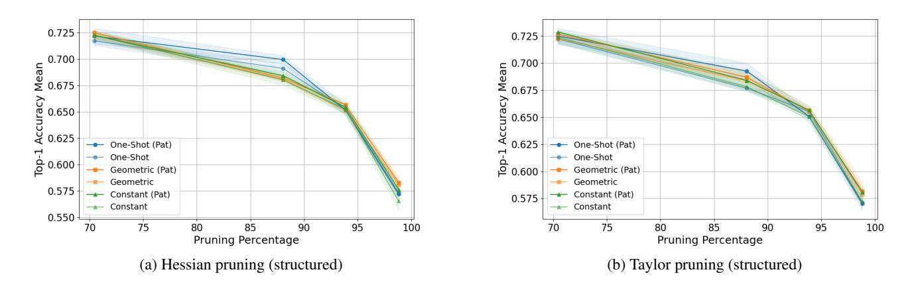

# D Structured and unstructured pruning

Unstructured pruning. Unstructured pruning involves selectively removing individual weights from the neural network based on criteria such as weight magnitude or their impact on the loss function [15, 14]. This method creates sparse weight matrices with many zero elements, which can significantly reduce the parameter count. However, practical computational gains often require specialized hardware or software optimizations because the remaining weights are irregularly distributed across the network.

Structured pruning. In contrast, structured pruning removes entire components within the neural network, such as filters, channels, neurons, or even layers [22, 55, 41, 32, 33]. This method produces a more compact and regular network structure that retains a dense matrix format, making it easier to optimize on standard hardware. Structured pruning can substantially reduce both model size and computational requirements while maintaining a more organized network. However, achieving high sparsity ratios with structured pruning is more challenging, as it requires removing entire rows or columns rather than individual elements within a weight matrix.

The pruning regimes discussed in the following section apply to both unstructured and structured pruning. However, implementation details may vary due to constraints imposed by the structure of the pruned components.

## *D.1 Structured pruning pruning ratios*

We then provide details on the pruning percentages for each layer in structured pruning. In unstructured pruning, we perform global pruning, allowing pruning to occur freely in any layer. However, applying this approach to structured pruning can lead to pruning collapse, where a layer ends up without any channels. To prevent this, we define a separate pruning ratio for each layer. These ratios are chosen so that the total number of pruned channels across the entire network matches the desired overall pruning percentage. The details of each

> **[图片提取文字 (无描述)]:**
> Accuracy Std Day 10p-1 Accuracy Mean -- 10p-1 Accuracy Mean → 10p-1 Accuracy Mean Accuracy Std Dev Accuracy Std Dev Accuracy Std Dev 93.9 o 93.6 0.04 0.05 0.06 0.07 0.08 0.09 0.10 7.5 10.0 12.5 15.0 17.5 20.0 7.5 10.0 12.5 15.0 0.04 0.05 0.06 Iterative Pruning Step Size Iterative Pruning Step Size Early Stopper Patience Early Stopper Patience Early Stopper Patience geometric (b) Iterative constant prun- (c) pruning (d) Iterative constant prun-Iterative One-shot geometric

Figure 7: Varying patience and step size (x-axis) impacts the pruning performance (y-axis). In Fig. (a-c) patience is varied and in Fig. (d-e) step size is varied (only for iterative pruning regimes). All experiments are done for pruning rate 88% and CIFAR-10 / ResNet-18.

(varying patience)

> **[图片提取文字 (无描述)]:**
> 0.725 0.725 0.700 W 0.675 © 0.700 E 0.675 0.675 Accuracy 0.650 0.625 0.650 0.625 One-Shot (Pat) One-Shot (Pat) One-Shot One-Shot <u>ලි</u> 0.600 요 0.600 Geometric (Pat) Geometric (Pat) Geometric Geometric 0.575 → Constant (Pat) Constant (Pat) 0.575 -- Constant -- Constant 0.550 -75 85 90 95 100 70 75 85 90 95 100 70 80 Pruning Percentage Pruning Percentage (a) Hessian pruning (structured) (b) Taylor pruning (structured)

Figure 8: Second-derivative (Hessian) pruning criteria. Iterative vs. one-shot pruning for CIFAR-100 and CIFAR-10.

layer's pruning ratio and the final pruning percentages are given in Table 2.

ing (varying patience)

## E Hybrid regime experimental details

In the hybrid regime experiments, we used the same configuration as in the ResNet-18 experiments on CIFAR-100 and CIFAR-10 datasets. The hybrid regime consisted of an initial one-shot pruning step to a value of p%, followed by iterative geometric steps with a ratio of pi until reaching the desired total pruning percentage. The first iterative step begins at pk%. For the hybrid regime, we used different patience values for the one-shot part and the iterative geometric part. We tested all the configurations provided in Tables 3 and 4. For the sake of preciseness we provide the exact pruning percentages pk which were used in the iterative phase of the hybrid regime; however in this phase, we aimed to test a set of iterative percentages from the set, pk = 0.02, 0.05, 0.10. The adjustments were necessary to obtain the exact final pruning ration p and the fair comparison with other pruning methods.

## F Experiments set-up

pruning (varying patience)

## *F.1 Dependencies*

The technical setup for the experiments included the following dependencies:

- Python 3.11
- CUDA 12.1
- PyTorch 2.2

- Torchvision 0.17.0
- timm 0.9.16
- torch-pruning 1.4.2

Experiments were conducted mainly on NVIDIA A100 and RTX 2080ti GPU's.

## *F.2 Dataset transformations*

ing (varying step size)

pruning (varying step-size)

Cifar-10 and Cifar-100 transformations include normalization (values are located in the code repository), random crop of size 32×32 with padding 4 and random horizontal flip. The images were also resized to higher resolution for some models. ImageNet1K was normalized, resized and cropped.

## *F.3 Checkpoints*

The checkpoints for the models used in the experiments are shared here: https://www.dropbox.com/scl/fo/ u0d8a087o3c2ynzpb6chd/AJz5w2ozXzcrBzxUwXVMiYM? rlkey=gag0w2r89kmt1huek6zsy9re2&st=4guxofag&dl=0.

## *F.4 Parameters*

All experiments were conducted using the SGD optimizer with the following parameters:

• Learning rate: 0.01

• Momentum: 0.9

> **[图片提取文字 (无描述)]:**
> One-Shot (Pat) 95 97.0 Geometric (Pat) Geometric Top-1 Accuracy Mean 5:00 0:00 0:00 0:00 0:00 0:00 0:00 0:0 Top-1 Accuracy Mean 96.5 95.5 95.0 94.5 Top-1 Accuracy Mean 98 98 24 98 Constant (Pat) One-Shot (Pat) One-Shot (Pat) Geometric (Pat) Geometric (Pat) 92.5 Geometric - Geometric 94.0 -- Constant (Pat) - Constant (Pat) 80 85 Pruning Percentage 70 80 85 Pruning Percentage 70 80 85 Pruning Percentage 90 75 90 95 75 90 75 95 (b) EfficientNet / CIFAR-10 ViT / CIFAR-10 ResNet-18 / CIFAR-10 (c) (a) One-Shot (Pat) One-Shot (Pat) 80 Geometric (Pat) 86 Geometric (Pat) 74 Geometric Geometric . Accuracy Mean 99 09 09 Top-1 Accuracy Mean Top-1 Accuracy Mean - Constant (Pat) - Constant (Pat) 구 6 50 One-Shot (Pat) Geometric (Pat) Geometric 69 78 80 85 Pruning Percentage 80 85 Pruning Percentage 80 85 Pruning Percentage 70 70 90 70 (d) ResNet-18 / CIFAR-100 (e) EfficientNet / CIFAR-100 (f) ViT / CIFAR-100 One-Shot (Pat) 92 Geometric (Pat) One-Shot (Pat) 0.70 0.68 Geometric 67.5 Geometric (Pat) Top-1 Accuracy Mean Constant (Pat) Geometric Tob-1 Accuracy Mean 60.0 60.0 57.5 55.0 Constant (Pat) Accuracy 69.0 0.62 0.60 - One-Shot (Pat) - Iterative Geometric 0.58 Iterative Geometric (Pat)
> Iterative Constant 52.5 75 80 Pruning Percentage 80 85 9 Pruning Percentage 65 85 90 70 75 80 90 70 75 85 90 Pruning Percentage ResNet-18 / CIFAR-10 ResNet-18 / CIFAR-100 (i) (h) ResNet-18 / Imagenet (Structured) (Structured) (g)

Figure 9: Comparison of one-shot and iterative pruning across various network architectures and vision datasets.

| Layer Name | Conv1 (%) | Layer1 (%) | Layer2 (%) | Layer3 (%) | Layer4 (%) | Pruning Ratio (%) |
|------------|-----------|------------|------------|------------|------------|-------------------|
| Model 1    | 20        | 20         | 30         | 40         | 50         | 69.61             |
| Model 2    | 50        | 50         | 60         | 70         | 80         | 93.27             |
| Model 3    | 40        | 40         | 50         | 60         | 70         | 85.25             |
| Model 4    | 65        | 65         | 75         | 85         | 95         | 97.63             |

Table 2: Pruning percentages for layers and corresponding pruning ratios.

Table 3: Pruning Hybrid Scheduler Parameters

| One-shot step | Iterative step | Target pruning value |  |  |
|---------------|----------------|----------------------|--|--|
| 0.5           | 0.01842        | 0.7                  |  |  |
| 0.6           | 0.01741        | 0.7                  |  |  |
| 0.5           | 0.04365        | 0.7                  |  |  |
| 0.6           | 0.03451        | 0.7                  |  |  |
| 0.5           | 0.07168        | 0.7                  |  |  |
| 0.6           | 0.1            | 0.7                  |  |  |
| 0.5           | 0.01962        | 0.8                  |  |  |
| 0.6           | 0.01842        | 0.8                  |  |  |
| 0.7           | 0.01741        | 0.8                  |  |  |
| 0.5           | 0.04968        | 0.8                  |  |  |
| 0.6           | 0.04365        | 0.8                  |  |  |
| 0.7           | 0.03451        | 0.8                  |  |  |
| 0.5           | 0.08531        | 0.8                  |  |  |
| 0.6           | 0.07168        | 0.8                  |  |  |
| 0.7           | 0.05132        | 0.8                  |  |  |
| 0.5           | 0.01972        | 0.88                 |  |  |
| 0.6           | 0.01914        | 0.88                 |  |  |
| 0.7           | 0.01965        | 0.88                 |  |  |
| 0.8           | 0.01654        | 0.88                 |  |  |
| 0.5           | 0.04668        | 0.88                 |  |  |
| 0.6           | 0.04585        | 0.88                 |  |  |
| 0.7           | 0.0484         | 0.88                 |  |  |
| 0.8           | 0.04083        | 0.88                 |  |  |
| 0.5           | 0.09118        | 0.88                 |  |  |
| 0.6           | 0.07884        | 0.88                 |  |  |
| 0.7           | 0.09446        | 0.88                 |  |  |
| 0.8           | 0.08           | 0.88                 |  |  |

• Weight decay: 0.0005

The batch size was set to 512, consistent across all pruning experiments. The training data was shuffled for every run.

## *F.4.1 CIFAR-100 / ResNet18*

We used the ResNet-18 model from the following GitHub repository: https://github.com/kuangliu/pytorch-cifar/blob/master/models/ resnet.py

Before pruning, the model was trained for 328 epochs with the following configuration:

- SGD optimizer with learning rate: 0.1, momentum: 0.9, and weight decay: 0.0005
- Linear scheduler for 100 epochs with start factor: 0.01
- After 100 epochs: CosineAnnealingWarmRestarts with T0 = 50, Tmult = 2, and ηmin = 1 × 10−5
- Early stopping with patience of 100 epochs

Before pruning, the top-1 accuracy was 74.64%.

