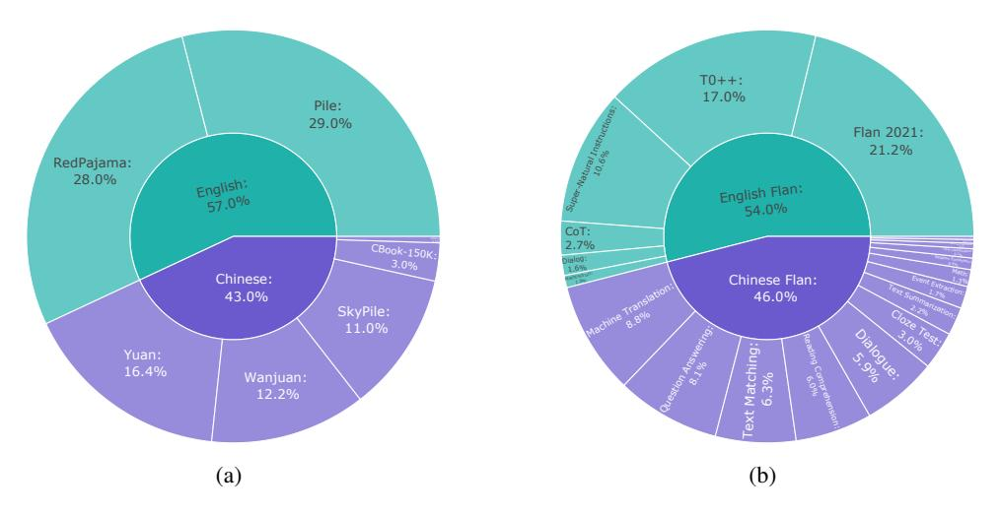

# 3 Dataset Preparation

Compared to OpenBA (Li et al., 2023b), we employ a more meticulous data processing process in OpenBA-V2 to ensure the quality of the training data. Specifically, during the pre-training phase, we incorporate a greater diversity of pre-training data sources and combine more Chinese data, thereby further expanding the dataset domain distribution range. As for the instruction data, we introduce BiFlan-V2, which builds upon the BiFlan dataset (Li et al., 2023b) by implementing additional template designs and incorporating a wider variety of instructions. We will introduce the collection and processing process of pre-training data and the instruction data in Sec. 3.1 and Sec. 3.2, respectively.

## 3.1 Pre-training Data Collection and Processing

**Data Sources** Due to the rapid development of the open-source community, there are quite a few publicly available pre-training data. Considering the computation budget and data distribution, we collect a total of 4.4 TB pre-training data to enrich the data diversity and ensure comprehensive coverage. Specifically, we collect English pre-training data from two sources: Pile (Gao et al., 2020) and RedPajama (Together, 2023) 3. All the 22 diverse high-quality subsets of Pile are kept for pre-training, while we use six subsets of RedPajama: ArXiv, Books, C4, GitHub, StackExchange, and Wikipedia. For Chinese pre-training data, we collect data from the following sources: an open-source version corpus released from Yuan (Wu et al., 2021), WanJuan (He et al., 2023), SkyPile (Wei et al., 2023), CBook-150K 4, Encyclopedias (i.e., Baidu Baike 5, Chinese Wikipedia 6) and Chinese Q&A community (Zhihu 7). We use five subsets of WanJuan as pre-training data: ChinaNews-cn, Exam-cn, Law-cn, Patent-cn, and WebText-cn.

**Data Processing** Although we carefully select high-quality pre-training data sources and remove the same part from different sources, the rest may still have low-quality and repetitive data. Therefore, we conduct the following data processing process to further improve the pre-training data quality and prevent potential risks:

• **Privacy Filtering**: To prevent potential privacy leakage, we removed all phone numbers, email addresses, and web links from the collected pre-training data.

&lt;sup>3https://huggingface.co/datasets/togethercomputer/RedPajama-Data-1T

4https://github.com/FudanNLPLAB/CBook-150K

5https://baike.baidu.com/

6https://zh.wikipedia.org/wiki/

&lt;sup>7https://www.zhihu.com/

> **[图片提取文字 (无描述)]:**
> T0++: 17.0% Pile: Super-Natural Instructions 29.0% Flan 2021: 21.2% RedPajama: 28.0% English: 57.0% English Flan: 54.0% CoT: 2.7% CBook-150K: 3.0% Chinese: Chinese Flan: 43.0% 46.0% Text Matching: 6.3% 16.4% 12.2% (b) (a)

Figure 1: Data distribution of different training corpus, where Figure (a) shows the distribution of the pre-training data and Figure (b) shows the distribution of the BiFlan-V2 instruction data.

- • **Deduplication**: Our pre-training data are collected from various open-sourced datasets. To ensure data quality after merging, we employ deduplication strategies at multiple levels: document, character, and paragraph. At the document level, each sample is treated as a document, and redundant documents are eliminated using a hash algorithm, thus retaining only unique documents. Besides, at the paragraph level, we utilize a hash algorithm combined with an extra sentence segmenter to identify and remove duplicate sentences or paragraphs (where consecutive 1-99 sentences are considered a paragraph). Finally, at the character level, redundant characters are removed, and sequences of repeated characters are condensed to a single character.
- Language Filtering We utilize Polyglot 8 to ascertain the language of the text, retaining only those texts confidently identified as either Chinese or English. This filtering process proves invaluable in filtering out gibberish, particularly for texts extracted from PDFs using OCR algorithms.
- Internet Data Cleaning The data collected from the Internet frequently contains incompletions, unrecognizable characters, and web page tags. Consequently, we implement filtering procedures to remove sentences containing fewer than 10 words and filter out unusual characters and HTML tags.

**Data Statistics** All the pre-training data mentioned above requires 4.4 TB disk space to save, and the final pre-training data consists of 57.0% English data and 43.0% Chinese data. The pre-training data distribution is illustrated in Fig. 1(a).

#### 3.2 BiFlan-V2: Instruction Data Collection

**English Instruction Data Collection** Following the distribution and collection source of the BiFlan dataset introduced in OpenBA (Li et al., 2023b), our English instruction data is mainly collected from the Flan Collection (Chung et al., 2022; Longpre et al., 2023). The Flan Collection encompasses more than 1800 tasks, which is currently the most comprehensive instruction collection. We follow the official guidelines to collect and process the English Flan collection with two steps, i.e., downloading five sub-mixtures from the Flan Collection and then combining them according to the specified mixture rates 9. Besides, we also incorporate the MathInstruct dataset (Yue et al., 2023) 10 to improve the model reasoning ability.

8https://github.com/aboSamoor/polyglot

9https://github.com/google-research/FLAN/tree/main/flan/v2

10 https://huggingface.co/datasets/TIGER-Lab/MathInstruct

| Models       | #Params | Pruned-Enc | Pruned-Dec         | Loss After Prune | Loss After training |
|--------------|---------|------------|--------------------|------------------|---------------------|
| OpenBA       | 15B     | -          | -                  | -                | 1.73                |
| Direct Prune | 9.9B    | all        | all                | 2.69             | -                   |
| Stage1       | 12.3B   | [4,8]      | [7,11,18,20,22,30] | 1.85             | 1.76                |
| Stage2       | 11.0B   | [6,10]     | [4,16,27]          | 1.90             | 1.80                |
| Stage3       | 9.9B    | -          | [10,24,33]         | 1.89             | 1.82                |

Table 1: Overview of the layer pruning process.

Chinese Instruction Data Collection For the Chinese instruction data, apart from the Chinese Flan data introduced in OpenBA sourcing from various competitions, academic papers, and opensource projects, we incorporate more math reasoning, text-matching, question-answering, reading comprehension, and event-extraction data in this version. Besides, we also use BELLE School Math dataset [\(BELLEGroup, 2023;](#page-14-8) [Yunjie Ji, 2023;](#page-18-11) [Wen et al., 2023\)](#page-18-12) [11](#page-4-0) to improve the math reasoning abilities. Finally, the Chinese Instruction data is collected from 44 different Chinese tasks with 50 million data entries. The Chinese instructions for each task are still designed manually.

BiFlan-V2 Data Statistics We show the instruction data distribution in Fig. [1\(b\).](#page-3-5) Following OpenBA, we filter out samples with lengths exceeding the encoder's maximum length, ensuring the critical parts of instructions are not truncated. Finally, the instruction data consists of 54.0% English data and 46.0% Chinese data.

