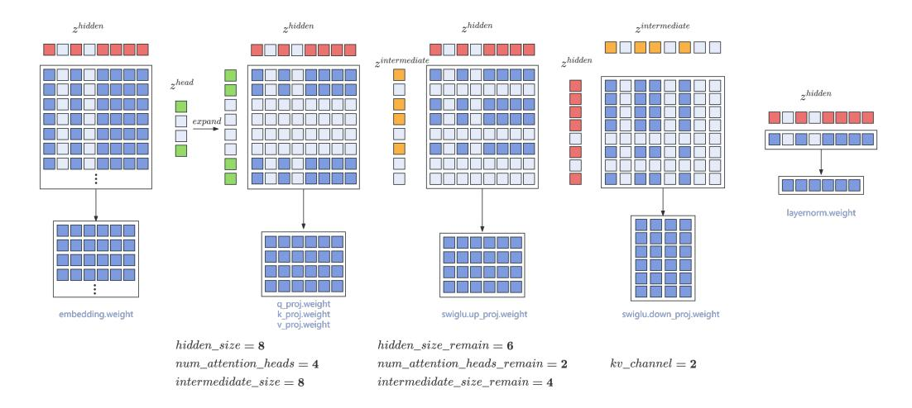
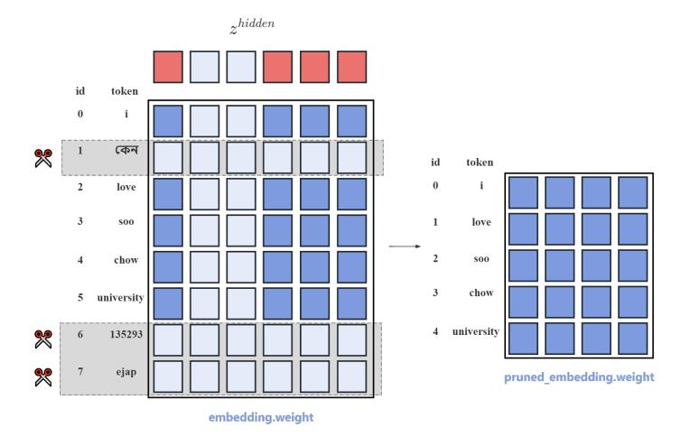
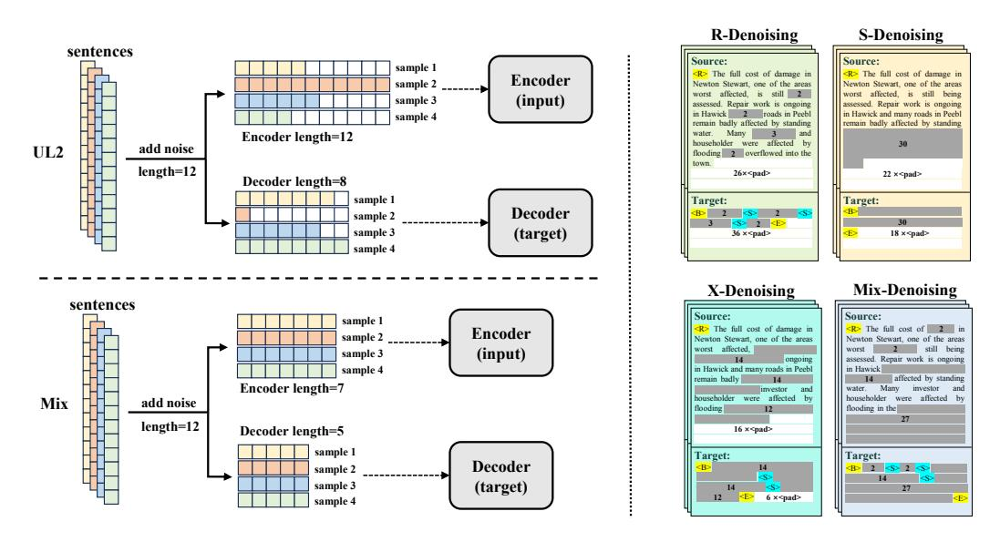

# 4 Fast Multi-Stage Pruning

In this section, we introduce the Fast Multi-Stage Pruning, including layer pruning, neural pruning, vocabulary pruning, and the objectives used in each stage.

#### 4.1 Pruning Strategies

## 4.1.1 Layer Pruning

Layerdrop [\(Fan et al., 2019;](#page-15-9) [Zhang & He, 2020\)](#page-18-13) is a straightforward method for pruning Transformer model parameters by randomly dropping entire layers of the model. Layer pruning does not severely damage the model's architecture. Therefore, a pruned model can maintain a relatively low perplexity (PPL) even without recovery training. Thus, we choose to perform layer pruning first. We conduct preliminary experiments to determine the optimal layers to prune, leading to the following insights:

- Compared with the top and bottom layers, pruning intermediate layers causes less damage to the model, which is also shown in LLM-Pruner [\(Ma et al., 2023a\)](#page-17-2).
- Pruning layers with more intervals cause less damage to the model.

Additionally, we investigate the effects of the quantity of pruned parameters on the model's performance. We observe that once the quantity of pruned parameters reaches a certain threshold, the model's performance will plummet. Consequently, we adopt a staged approach to pruning the model's layers. After each stage, we use a small amount of data to recover the model performance.

#### 4.1.2 Neural Pruning

Existing works have explored how to prune the matrix parameters of the model while minimizing performance degradation [\(Ma et al., 2023a;](#page-17-2) [Sun et al., 2023;](#page-17-12) [Han et al., 2015;](#page-15-10) [Xia et al., 2024\)](#page-18-2). Some of the works attempt to compute the importance of each element in the parameter matrix and zero out some of these elements, utilizing coefficient matrices for computation.

The importance of parameters often correlates with their absolute values, parameter gradients, and activation values. Therefore, these methods typically require the model to undergo forward and backward propagation on a certain amount of data. Another limitation is that these methods do

<span id="page-4-0"></span><sup>11</sup>[https://huggingface.co/datasets/BelleGroup/school\\_math\\_0.25M](https://huggingface.co/datasets/BelleGroup/school_math_0.25M)

> **[图片提取文字 (无描述)]:**
> $z^{hidden}$  $z^{intermediate}$  $z^{hidden}$  $z^{hidden}$  $z^{hidden}$  $z^{intermediate}$  $z^{head}$  $z^{hidden}$ expand layernorm.weight q\_proj.weight embedding.weight k\_proj.weight swiglu.up\_proj.weight swiglu.down\_proj.weight v proj.weight  $hidden\_size = 8$  $hidden\_size\_remain = 6$  $num\_attention\_heads = 4$  $num\_attention\_heads\_remain = 2$  $kv\_channel = 2$  $intermedidate\_size = 8$  $intermedidate\_size\_remain = 4$


<span id="page-5-0"></span>Figure 2: Illustraion of random neural pruning.

not truly prune the parameter matrix to another shape; instead, they zero out some parameters and utilize sparse matrix operations to perform model inference. Such methods have minimal impact on the model when pruning a small number of parameters. However, when the target pruning amount reaches 30% or more, the model's performance will drop sharply. Moreover, since they only sparsify the matrix and do not facilitate subsequent retraining, this becomes disadvantageous.

Both Sheard-LLaMA [\(Xia et al., 2024\)](#page-18-2) and LLM-Pruner [\(Ma et al., 2023a\)](#page-17-2) reveal that when pruning the parameter matrix of the model into another shape of a dense matrix, we should not disrupt the dependent structures within the model. The dependent structures have been clearly defined in [Ma](#page-17-2) [et al.](#page-17-2) [\(2023a\)](#page-17-2). Furthermore, experiments from various studies have shown that the method of pruning, whether following specific importance criteria or being random, has little impact on the model's performance after it has been pruned and subsequently retrained for a while. Therefore, our approach involves directly randomly pruning the rows and columns of the matrix based on dependent structures and the dimensions of the target model. Figure [2](#page-5-0) can help better understand our method.

#### 4.1.3 Vocabulary Pruning

The original OpenBA model employs a multilingual vocabulary comprising approximately 260,000 tokens. However, it is primarily trained on Chinese and English corpora and is designed to serve the Chinese-English language pair exclusively. Consequently, many tokens in the vocabulary exhibit very low usage frequencies, resulting in a considerable number of idle or rarely used embedding vectors within the model's embedding matrix.

To address this issue, we conduct a comprehensive analysis of token occurrences in the pre-training corpus and sort all tokens based on their frequency of occurrence. Then, we retain the top K tokens with the highest occurrence frequencies while pruning the remaining tokens. Additionally, we prune the embedding associated with these tokens and reorganized the token IDs and embedding matrices accordingly. This approach enables us to further reduce the number of parameters in the model, thereby decreasing the memory footprint. Figure [3](#page-6-0) shows how we prune the embedding weights and rearrange the token IDs according to the pruned embedding.

#### 4.2 Training Objective

## 4.2.1 UL2

The 15B OpenBA model employs the UL2 training strategy, a mixture of denoisers approach proposed by [\(Tay et al., 2022\)](#page-17-13), which requires the model to reconstruct sentences in various types of noise.

• R-Denoising Regular denoising is the standard span corruption that sets a range of 2 to 5 tokens as the masked span length and masks ratio about 15% of the input tokens. This

> **[图片提取文字 (无描述)]:**
> $z^{hidden}$ id token 0 i কেন id token 0 2 love 3 love 500 1 4 chow 800 3 chow 5 university university 135293 6 ejap pruned\_embedding.weight embedding.weight


<span id="page-6-0"></span>Figure 3: Illustraion of how to prune the vocabulary and the corresponding embedding.

denoising task is relatively simple since the span is short and efficient for the model to acquire knowledge embedded in the text.

- S-Denoising Sequence denoising aims to endow the model with generation capability, where the input text is split into two sub-sequences, and the model should predict the latter sequence conditioned on the first sequence. In the S-Denoising setting, the model can acquire the generation ability.
- X-Denoising To bridge the gap between the R-Denoising and S-Denoising, X-Denoising can be viewed as an extreme version of denoising, where approximately 50% of the input sequence is masked by increasing either the masked span length or the corruption rate. Such a denoising strategy simulates the situation where a model needs to generate long targets from memory with relatively limited information.

The detailed information for corruption ratio and span length can be found in Table [2.](#page-6-1)

| Type      | Span Length (µ) | Corruption Ratio (%) | #Num | Sentinel |
|-----------|-----------------|----------------------|------|----------|
| <r>-1</r> | 3               | 15.0                 | K    | <r></r>  |
| <r>-2</r> | 8               | 15.0                 | K    | <r></r>  |
| <s></s>   | -               | 25.0                 | 1    | <s></s>  |
| <x>-1</x> | 3               | 50.0                 | K    | <x></x>  |
| <x>-2</x> | 8               | 50.0                 | K    | <x></x>  |
| <x>-3</x> | 64              | 15.0                 | K    | <x></x>  |
| <x>-4</x> | 64              | 50.0                 | K    | <x></x>  |

<span id="page-6-1"></span>Table 2: Details of different noise type in UL2 objective.

## 4.2.2 Dynamic-UL2

Previous studies have shown that model pruning can affect different capabilities to different extents. Consequently, works such as [Xia et al.](#page-18-2) [\(2024\)](#page-18-2); [Xie et al.](#page-18-14) [\(2024\)](#page-18-14) suggest dynamically adjusting the sampling ratio for each domain according to the model's loss.

The UL2 objective utilized in OpenBA incorporates various types of noise, with each denoising process specifically training the model to enhance specific capabilities. For example, the <S> task improves the model's capabilities in text continuation and generation, while the <S> and <X> tasks help the model attain better comprehension and extraction capabilities. Inspired by previous works, we propose Dynamic-UL2, which dynamically adjusts the proportion of each type of noise based on the loss for each noise on the valid set. The Dynamic-UL2 Algorithm can be found in Algorithm [1.](#page-7-0)

#### **Algorithm 1:** Dynamic-UL2

<span id="page-7-0"></span>**Require**: Training dataset D, validation data  $D_1^{\text{val}}, D_2^{\text{val}}, \cdots, D_7^{\text{val}}$ , where  $D_i^{\text{val}}$  denote the valid data with noise type i, the initial UL2 noise prop  $p_0 \in \mathbb{R}^7$ , the  $\ell_{\text{ref}} \in \mathbb{R}^7$ , LM loss function  $\mathcal{L}$ , noise adding function  $\mathcal{F}$ ,training steps T, evaluation interval m, model parameters  $\theta$ .

```
2 for t=1,\cdots,T do
         if t \mod m = 0 then
              \ell_t[i] \leftarrow \mathcal{L}\left(\theta, D_i^{\text{val}}\right)
                                                                                    ▷ Calculate the loss of each noise type
              \Delta_t[i] \leftarrow \max\left\{\ell_t[i] - \ell_{\text{ref}}[i], 0\right\}
 5

              p_t \leftarrow \texttt{UpdateWight}(p_{t-m}, \Delta_t)
 6
 7
         Sample a batch of data B from D
 8
         Adding noise to B to obtain \hat{B} according to p_t
10
         Update \theta with \mathcal{L}(\theta, B)
11 end
12 Subroutine UpdateWight (p, \Delta)
         \alpha \leftarrow p \cdot \exp(\Delta)
                                                                   ▷ Calculate the new noise ratio for each noise type
         return p
15
16 return \theta
```

> **[图片提取文字 (无描述)]:**
> S-Denoising R-Denoising sentences Source: Source: sample 1 <R> The full cost of damage in <R> The full cost of damage in Encoder sample 2 Newton Stewart, one of the areas Newton Stewart, one of the areas worst affected, is still 2 worst affected, is still being sample 3 (input) assessed. Repair work is ongoing assessed. Repair work is ongoing in Hawick 2 roads in Peebl in Hawick and many roads in Peebl sample 4 remain badly affected by standing remain badly affected by standing water. Many Encoder length=12 householder were affected by add noise UL2 flooding 2 overflowed into the town. length=12 26×<pad> 22 ×<nad> Decoder length=8 sample 1 Target: Target: Decoder sample 2 30 S 2 E sample 3 (target) 36 ×<pad> 18 ×<nad> sample 4 Mix-Denoising X-Denoising sentences Source: Source: sample 1 <R> The full cost of 2 in <R> The full cost of damage in Encoder sample 2 Newton Stewart, one of the areas Newton Stewart, one of the areas worst affected. (input) sample 3 assessed. Repair work is ongoing ongoing in Hawick and many roads in Peebl sample 4 in Hawick 14 remain badly affected by standing Encoder length=7 water. Many investor investor householder were affected by householder were affected by Mix add noise flooding flooding in the length=12 Decoder length=5 16 ×<pad> sample 1 Target: Target: Decoder <B> 2 <S> 2 <S> sample 2 14 <S> sample 3 (target) 12 <E> 6 ×<pad>> sample 4


Figure 4: Illustration of Optimized-UL2, which allows training with various types of noise with few padding tokens.

#### 4.2.3 Optimized-UL2

While UL2 demonstrates significant performance enhancements by integrating various noise types, mixing multiple noises necessitates extensive padding tokens to accommodate diverse noise types within a batch. Therefore, the training efficiency of UL2 is relatively low.

As shown in Figure 1, different noise types will influence the input length of the encoder and decoder. For a given sentence, if more tokens need to be masked based on the selected noise type, the length of the encoder will increase while the length of the decoder will decrease, and vice versa. Hence, we must pad the input of the encoder and decoder to a predefined maximum length throughout the training process. Our estimations show that roughly 40% of the tokens in UL2 are padding tokens, impeding actual training efficiency.

| Models           | #Params      | Enc        | Dec        | Hidden     | FFN            | Heads         |
|------------------|--------------|------------|------------|------------|----------------|---------------|
| OpenBA           | 15B          | 12         | 36         | 4,096      | 11,008         | 40            |
| Stage1           | 12.3B        | 10         | 30         | 4,096      | 11,008         | 40            |
| Stage2           | 11.0B        | 8          | 27         | 4,096      | 11,008         | 40            |
| Stage3           | 9.9B         | 8          | 24         | 4,096      | 11,008         | 40            |
| Stage4           | 3.8B         | 8          | 24         | 2,560      | 6,912          | 20            |
| Stage5           | 3.8B         | 8          | 24         | 2,560      | 6,912          | 20            |
|                  |              |            |            |            |                |               |
| Models           | #Params      | Enc-Len    | Dec-Len    | Tokens     | Objective      | Flops (×1020) |
| OpenBA           | 15B          | 570        | 380        | 350B       | UL2            | 277.1         |
|                  |              |            |            |            |                |               |
| Stage1           | 12.3B        | 570        | 380        | 10B        | D-UL2          | 6.7           |
| Stage2           | 11.0B        | 570        | 380        | 10B        | D-UL2          | 5.9           |
| Stage3<br>Stage4 | 9.9B<br>3.8B | 570<br>570 | 380<br>380 | 15B<br>65B | D-UL2<br>D-UL2 | 8.1<br>13.0   |

Table 3: Overview of our entire compression and training process, including the model architecture at each stage, the objective functions, the scale of the training data, and computational requirements.

To address this issue, we keep a global mask rate and fuse various noise types into a single sentence called Mix-Denoising. Specifically, we initially apply S-noise to introduce noise to a single sentence. Subsequently, we employ R-noise and X-noise to add noise to the rest of the sentence, ensuring the total number of masked tokens reaches a predefined target. For S-noise, we set a lower and an upper bound, and randomly sample the number of masked tokens from a normal distribution within these limits. For R-noise and X-noise, we can calculate the number of tokens that need to be masked based on the length of the rest of the sentence. For simplicity, we select [X] as the prefix token. With Mix-Denoising, we can keep the input length of the encoder and decoder as a fixed value through the whole training process with few padding tokens, thus improving the training efficiency of UL2. However, Mix-Denoising may cause the model to lose some generation ability, as R-noise and X-noise have disrupted the natural language order of its decoder. Therefore, we preserve the original S-Denoising task to enhance the model's generation capability. It is worth noting that we fix the number of masked tokens for S-noise to ensure consistency. Furthermore, Mix-Denoising has more sentinel tokens than S-Denoising, resulting in more input tokens. To standardize the input lengths between the two tasks, we truncate the original sentence in Mix-Denoising. During training, Mix-Denoising and S-Denoising comprise about 20% and 80% of our training data, respectively.

These adaptations mitigate the need for excessive padding, achieving model performance comparable to UL2 with almost no padding token. Our approach has more valid tokens than UL2, thus enabling superior performance at equivalent training costs.

