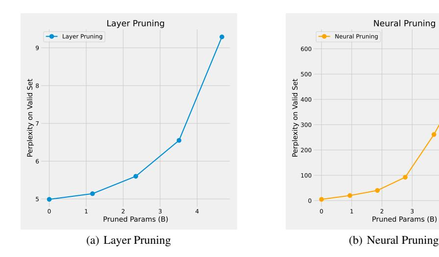

# 6.3 Main Results

We compare the model performance with other baselines in Table [5](#page-10-0) and [6.](#page-10-1) In each table, the first group includes models with more than 6B parameters. The second group includes models with 3B or fewer parameters trained on open-sourced data. The third group includes models with 3B or fewer parameters trained on Non-open-sourced data. The final group includes all versions of OpenBA models.

Overall, OpenBA-V2 outperforms all models with 3B or fewer parameters trained on open-sourced data, demonstrating its strong competitiveness among models of the same size. OpenBA-V2 is weaker than larger models, but it still demonstrates its competitiveness. For example, OpenBA-V2 surpasses Chinese-LLaMA2 on the Chinese benchmark and shows no significant gap compared to other larger models in commonsense reasoning and reading comprehension tasks. Compared to models with fewer than 3B parameters trained on non-open-source data, OpenBA-V2 outperforms them only in specific tasks, and there is a gap in most scenarios, highlighting the importance of high-quality data for LLMs. Compared to OpenBA, OpenBA-V2 achieves strong performance with just 23% parameters, indicating a significant potential for model compression. The model can be more lightweight and cost-effective by implementing effective compression strategies and recovery training.

| Model          | #Param. |           | English Benchmark |        | Chinese Benchmark |           |          |  |
|----------------|---------|-----------|-------------------|--------|-------------------|-----------|----------|--|
|                |         | Avg. (EN) | MMLU(5)           | BBH(3) | Avg. (ZH)         | C-EVAL(5) | CMMLU(5) |  |
| LLaMA2         | 7B      | 38.8      | 44.3              | 33.2   | -                 | -         | -        |  |
| Chinese-LLaMA2 | 7B      | -         | -                 | -      | 34.5              | 35.9      | 33.0     |  |
| Baichuan2      | 7B      | 47.9      | 54.2              | 41.6   | 55.6              | 54.0      | 57.1     |  |
| ChatGLM3       | 6B      | 63.8      | 61.4              | 66.1   | 68.3              | 69.0      | 67.5     |  |
| TinyLlama      | 1.1B    | 26.1      | 25.4              | 26.8   | -                 | -         | -        |  |
| OpenLLaMA-v2   | 3B      | 27.9      | 26.2              | 29.5   | -                 | -         | -        |  |
| BLOOM          | 3B      | 23.2      | 25.8              | 20.5   | 25.3              | 25.4      | 25.2     |  |
| MindLLM        | 1.3B    | 17.7      | 25.4              | 9.9    | 26.9              | 28.0      | 25.7     |  |
| GPT-NEO        | 2.7B    | 25.9      | 25.0              | 26.7   | -                 | -         | -        |  |
| INCITE-Base    | 3B      | 27.0      | 27.0              | 27.0   | -                 | -         | -        |  |
| Sheard-LLaMA   | 2.7B    | 28.2      | 27.1              | 29.2   | -                 | -         | -        |  |
| Qwen           | 1.8B    | 33.8      | 45.3              | 22.3   | 54.1              | 56.1      | 52.1     |  |
| MiniCPM        | 2.7B    | 45.2      | 53.5              | 36.9   | 51.1              | 51.1      | 51.1     |  |
| Phi2           | 2.7B    | 56.4      | 56.9              | 59.1   | 33.8              | 35.1      | 32.5     |  |
| OpenBA         | 15B     | 37.2      | 40.2              | 34.1   | 40.7              | 39.8      | 41.5     |  |
| OpenBA-V2      | 3.8B    | 34.2      | 38.4              | 29.9   | 38.4              | 38.3      | 38.5     |  |
| OpenBA-V2†     | 3.4B    | 34.2      | 38.4              | 30.0   | 38.4              | 38.3      | 38.5     |  |

Table 5: Model performance on world knowledge tasks with different languages (English and Chinese), where † denotes the model with pruned vocabulary (the vocab size is 12k).

| Model          |      |      |      |      |      | #Param. AVG. SciQ(0) PIQA(0) ARC-E(0) ARC-C(25) LogiQA(0) BoolQ(32) |      |      |
|----------------|------|------|------|------|------|---------------------------------------------------------------------|------|------|
| LLaMA2         | 7B   | 69.0 | 93.7 | 78.1 | 76.4 | 53.0                                                                | 30.7 | 82.1 |
| Baichuan2      | 7B   | 67.4 | 94.7 | 78.4 | 78.9 | 49.7                                                                | 29.3 | 73.2 |
| ChatGLM3       | 6B   | 66.3 | 94.4 | 73.5 | 68.6 | 52.3                                                                | 30.3 | 78.7 |
| TinyLlama      | 1.1B | 56.1 | 94.0 | 73.3 | 55.3 | 30.1                                                                | 26.3 | 57.8 |
| OpenLLaMA-v2   | 3B   | 61.9 | 91.8 | 76.2 | 66.5 | 39.0                                                                | 28.1 | 69.6 |
| BLOOM          | 3B   | 59.2 | 93.5 | 70.7 | 64.2 | 35.2                                                                | 29.3 | 62.1 |
| MindLLM        | 1.3B | 49.5 | 80.2 | 64.9 | 47.1 | 24.8                                                                | 28.0 | 52.1 |
| GPT-NEO        | 2.7B | 59.7 | 93.3 | 74.2 | 65.3 | 35.2                                                                | 28.4 | 61.8 |
| INCITE-Base-3B | 3B   | 61.1 | 90.7 | 74.6 | 67.7 | 40.2                                                                | 27.7 | 65.9 |
| Sheard-LLaMA   | 2.7B | 62.9 | 90.8 | 75.8 | 67.0 | 41.2                                                                | 28.9 | 73.7 |
| Qwen           | 1.8B | 61.1 | 92.2 | 73.6 | 63.7 | 38.5                                                                | 31.6 | 66.8 |
| MiniCPM        | 2.7B | 71.8 | 96.0 | 76.6 | 85.4 | 68.0                                                                | 31.2 | 73.7 |
| Phi2           | 2B   | 73.5 | 97.1 | 79.3 | 85.2 | 61.2                                                                | 33.8 | 84.2 |
| OpenBA         | 15B  | 68.7 | 94.6 | 72.0 | 69.7 | 60.0                                                                | 33.3 | 82.4 |
| OpenBA-V2      | 3.8B | 63.4 | 94.7 | 70.0 | 63.9 | 45.4                                                                | 31.6 | 74.6 |
| OpenBA-V2 †    | 3.4B | 63.4 | 94.6 | 70.4 | 63.8 | 45.4                                                                | 31.6 | 74.7 |

Table 6: Model performace on commonsense & reading comprehension tasks. † denotes the model with pruned vocabulary.

#### 6.4 NER Finetuning Performance

We further explore the potential of the OpenBA model series for Named-Entity-Recognition (NER). We utilize the Pile-NER [\(Zhou et al., 2023\)](#page-19-1) dataset as our training dataset, comprising approximately 240,000 entities across 13,000 distinct categories. Following this, we evaluate the model on the MIT [\(Liu et al., 2013\)](#page-16-14) and CrossNER [\(Liu et al., 2021\)](#page-16-15) datasets, where the entity labels are mostly unseen during the training phase. We adopt the method outlined in GNER [\(Ding et al., 2024\)](#page-15-14) for incorporating negative instances into the training phase. Additionally, we compare our approach with three baselines: sheard-llama [\(Xia et al., 2024\)](#page-18-2), open-llama-v2 [\(Geng & Liu, 2023\)](#page-15-0) and OpenBA-15B [\(Li et al., 2023b\)](#page-16-1), employing identical training methodologies and strict entity-level F1 score as evaluation metrics. The results are summarized in table [7.](#page-11-0) Our model significantly outperforms the others, achieving superior performance that exceeds the original 15B model before its pruning.

| Model            | Movie | Rest. | AI   | Literature | Music | Politics | Science | Avg.      |
|------------------|-------|-------|------|------------|-------|----------|---------|-----------|
| Sheard-LLaMA     | 29.4  | 15.7  | 34.5 | 33.7       | 39.7  | 33.3     | 35.8    | 31.7      |
| OpenLLaMA-v2     | 63.0  | 44.3  | 58.9 | 50.2       | 72.0  | 66.4     | 62.5    | 59.6      |
| OpenBA-NER-15B   | 51.4  | 37.4  | 58.5 | 54.6       | 69.1  | 68.4     | 68.2    | 58.2 61.7 |
| OpenBA-V2-NER-3B | 60.3  | 43.3  | 63.8 | 54.3       | 72.4  | 67.4     | 70.6    |           |

Table 7: Zero-shot performance in out-of-domain evaluation on MIT (Liu et al., 2013) and CrossNER (Liu et al., 2021) datasets.

> **[图片提取文字 (无描述)]:**
> Layer Pruning **Neural Pruning** Layer Pruning **Neural Pruning** 9 600 500 Perplexity on Valid Set Perplexity on Valid Set 6 100 5 0 Pruned Params (B) Pruned Params (B) (a) Layer Pruning (b) Neural Pruning

Figure 5: Model performance with different pruning strategies and pruning parameters.

