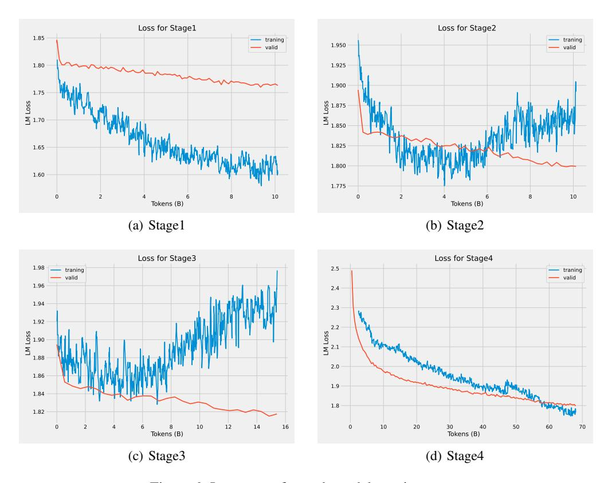
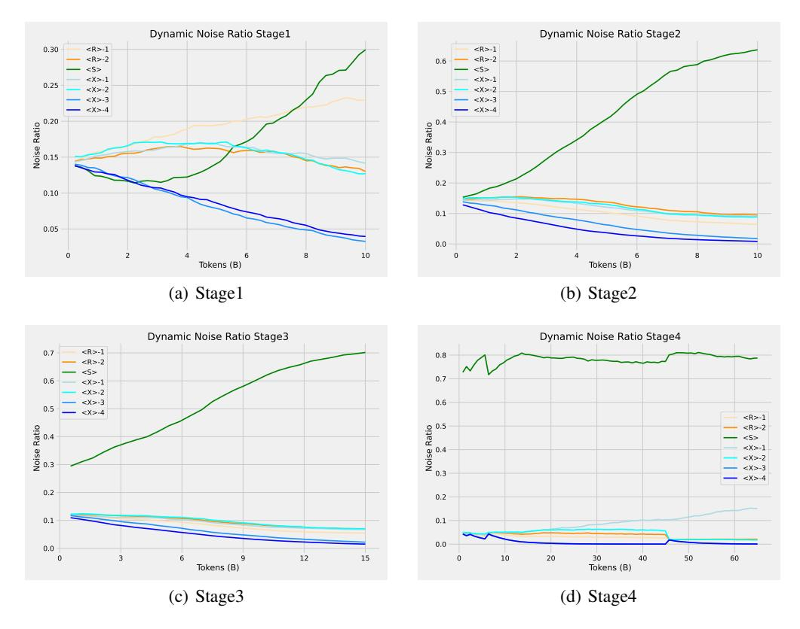
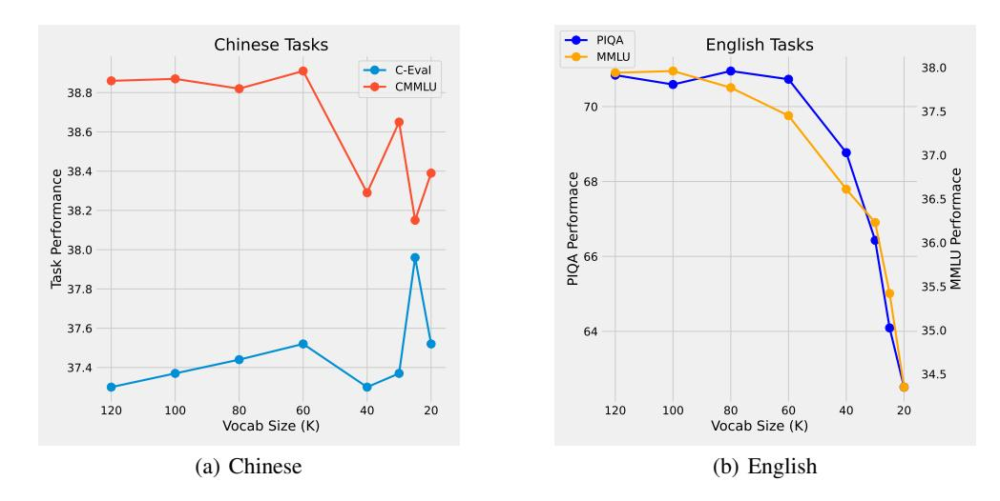

# 7 Analysis

In this section, we mainly illustrate the motivation behind multi-stage pruning (Sec. 7.1), the effectiveness of Dynamic-UL2 strategy (Sec. 7.2), as well as the impact of vocabulary pruning on the final performance (Sec. 7.3).

#### 7.1 Motivation behind Multi-Stage Pruning

Before performing multi-stage pruning, we conduct a preliminary study to determine if we can directly reduce the LLM parameters on the depth dimension (layer pruning) and width dimension (neural pruning). We conduct the study with the LLaMA-2-7B model (Touvron et al., 2023). We iteratively prune the model's parameters and observe the pruned model's PPL on the development set 12. We plot the relationship between model performance and pruning parameters in Fig. 5. We can observe that: (1) For both layer pruning and neural pruning, the model's PPL increases as the number of pruned parameters grows. (2) For a 7B model, after pruning 3B parameters, which accounts for 42.8% of the original model parameters, there is a significant explosion in PPL. Such a phenomenon suggests that aggressively pruning a large number of model parameters through directed pruning can lead to a collapse in model performance, which may be irrecoverable even with recovery training. (3) Compared with Neural Pruning, Layer Pruning has a smaller impact on the model, as reflected by lower PPL. Based on the findings mentioned above, we adopt a multi-stage pruning strategy. Concretely, we first conduct layer pruning and then conduct neural pruning, aiming to retain as much original model knowledge as possible during the pruning process. After each pruning stage, we retrain the model to help it recover its capabilities.

&lt;sup>12We randomly sample the development set from The Pile dataset.

> **[图片提取文字 (无描述)]:**
> Loss for Stage1 Loss for Stage2 1.85 traning traning 1.950 valid valid 1.80 1.925 1.900 1.75 SSO J 1.70 S 1.875 W 1.850 1.825 1.65 1.800 1.60 1.775 10 Tokens (B) Tokens (B) (a) Stage1 (b) Stage2 Loss for Stage3 Loss for Stage4 1.98 2.5 traning traning valid - valid 1.96 2.4 1.94 2.3 1.92 2.2 SS 1.90 E 1.88 TW Loss 2.0 1.86 1.9 1.84 1.8 1.82 10 12 10 20 30 4 Tokens (B) 50 60 14 16 0 40 70 Tokens (B) (c) Stage3 (d) Stage4

Figure 6: Loss curve for each model pruning stage.

#### 7.2 Effectiveness of Dynamic-UL2 Strategy

In this section, we analyze the model's recovery during the pruning process using the Dynamic-UL2 Strategy. We plot all loss curves during the training process in Fig. 6 and the noise ratios in the Dynamic-UL2 training strategy in Fig. 7. It is worth mentioning that at each stage, the model's loss on the development set steadily decreases. However, the training loss exhibits different characteristics at different stages, which will be analyzed below.

Stage  $1\sim 3$  (Layer Pruning) In these stages, the Dynamic-UL2 strategy keeps <S> noisier dominant throughout, with the proportion of <S> noisier gradually increasing along with the training progress. After the pruning of 2.7B model parameters in stage 1, we observe a gentle descent in the loss curve (Subfig. 6(a)). However, during the subsequent pruning stages, the training loss curve takes on a U-shape, indicating that it becomes increasingly challenging to recover the model performance as more parameters are pruned. Additionally, we observe that in stages 2 and 3, the proportion of <S> noise is higher than in Stage 1. This suggests that the Dynamic-UL2 strategy effectively facilitates performance recovery by adapting to more challenging tasks.

**Stage 4 (Neural Pruning)** In this stage, the model's parameters are reduced from 9.9B to 3.8B through neural pruning, resulting in a notable increase in loss (from 1.96 at the end of Stage 3 to 2.28 at the beginning of Stage 4). Therefore, Dynamic-UL2 focuses more on <S> noise to facilitate model performance recovery, as shown in Subfig. 6(d).

## 7.3 Impact of Vocabulary Pruning

We present the results of the model performance with vocabulary pruning in Fig 8. We can observe that, for Chinese tasks, performance does not deteriorate but instead shows improvement, even when the vocabulary is pruned from 120K to 20K. In contrast, the model's performance declines for English tasks as the vocabulary size is reduced. This disparity may be attributed to the fact that each Chinese

> **[图片提取文字 (无描述)]:**
> Dynamic Noise Ratio Stage1 Dynamic Noise Ratio Stage2 0.30 <R>-1 <R>-1 <R>-2 <\$> <5> < X > -1< X > -10.25 <X>-2 < x > -2<X>-3 <X>-3 < X>-4 < X>-4 Noise Ratio 0.15 Noise Ratio 0.2 0.10 0.1 0.05 0.0 0 8 10 0 2 8 10 Tokens (B) Tokens (B) (a) Stage1 (b) Stage2 Dynamic Noise Ratio Stage3 Dynamic Noise Ratio Stage4 <R>-1 0.7 0.8 <R>-2 <S> 0.7 0.6 < X > -1<X>-2 <X>-3 0.6 0.5 <X>-4 <R>-1 Noise Ratio Noise Ratio Noise Ratio <R>-2 <S> < X > -1<X>-2 < X > -3<X>-4 0.2 0.2 0.1 0.1 0.0 0.0 0 12 20 30 40 60 15 10 50 Tokens (B) Tokens (B) (c) Stage3 (d) Stage4

Figure 7: Visualization of the noise ratio in Dynamic-UL2.

> **[图片提取文字 (无描述)]:**
> -- PIQA Chinese Tasks **English Tasks** MMLU 38.0 C-Eval CMMLU 38.8 70 37.5 38.6 37.0 38.4 38.2 38.0 37.8 36.5 WMFN Berformace PIQA Performace 37.8 37.6 35.0 64 37.4 34.5 120 100 80 60 40 20 120 100 80 60 40 20 Vocab Size (K) Vocab Size (K) (a) Chinese (b) English

Figure 8: Model performance under different vocabulary sizes on Chinese and English tasks.

character is represented by independent tokens, and there is a relative redundancy of Chinese tokens in the vocabulary. On the contrary, English words often consist of multiple tokens, meaning a reduction in vocabulary size has a more pronounced effect on English.

