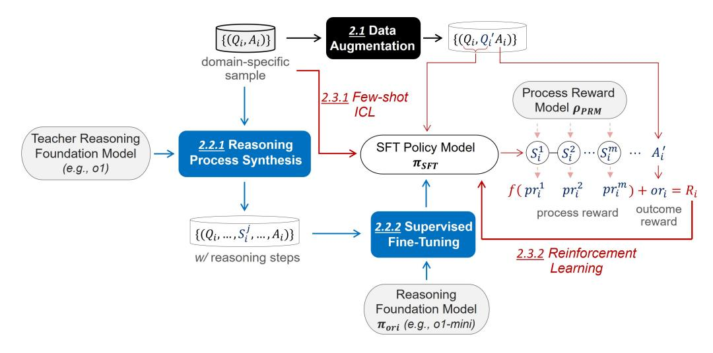

# 2 METHOD

The key to Reinforcement Fine-Tuning lies in the effective utilization of limited domain-specific samples. Based on the way domain-specific samples are leveraged, as illustrated in Fig. [1,](#page-2-0) the framework of OpenRFT can be divided into three modules. (1) *Data augmentation*: By rewriting questions and shuffling options, we explicitly generate more domain-specific data. This helps explore a broader range of states and actions in the RL stage. (2) *SFT-based imitation*: Using a stronger reasoning foundation model as a teacher [1](#page-1-0) , the missing reasoning steps are synthesized for the provided domain-specific data. These enhanced samples are then used to pre-adapt the student policy model through SFT. (3) *RL-based exploration and self-improvement*: The domain-specific samples are incorporated into the policy model in a few-shot ICL manner. The policy model, under process supervision by the PRM, explores and continuously optimizes within an RL environment.

1Typically, a smaller reasoning foundation model (e.g., o1-mini) is desired to ensure efficiency in domainspecific applications. When synthesizing reasoning step data, it is ideal to use a stronger reasoning foundation model as the teacher model for distillation (e.g., o1). It is important to ensure that the action space of the teacher and student models remains consistent.

Due to the lack of a stronger reasoning model with consistent actions, in our reported experiments, the synthesis is instead performed by the policy model itself.

> **[图片提取文字 (无描述)]:**
> 2.1 Data  $\{(Q_i,Q_i'A_i)\}$  $\{(Q_i, A_i)\}$ Augmentation domain-specific sample Process Reward 2.3.1 Few-shot Model  $\rho_{PRM}$ ICL Teacher Reasoning 2.2.1 Reasoning SFT Policy Model Foundation Model **Process Synthesis**  $\pi_{SFT}$ (e.g., o1)  $pr_i^m) + or_i = R_i$ outcome process reward reward 2.2.2 Supervised  $\{(Q_i, ..., S_i^J, ..., A_i)\}$ Fine-Tuning 2.3.2 Reinforcement w/reasoning steps Learning Reasoning Foundation Model  $\pi_{ori}$  (e.g., o1-mini)

Figure 1: OpenRFT framework.

