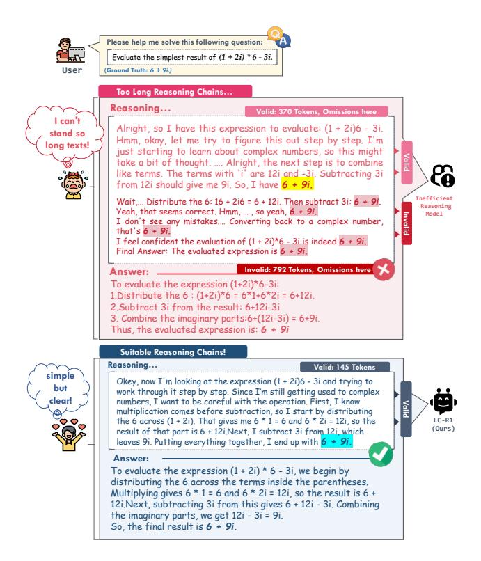
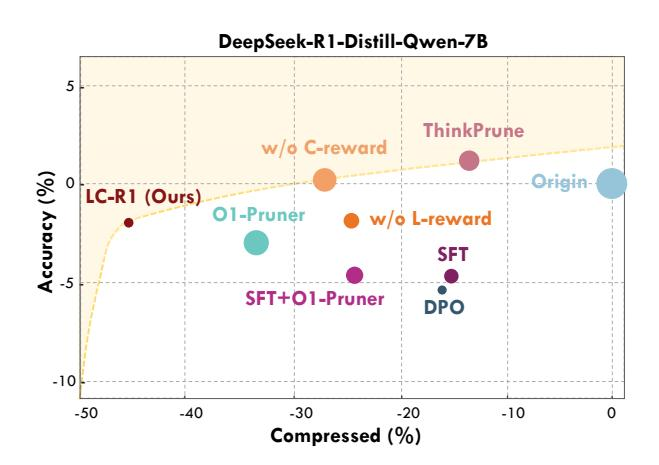
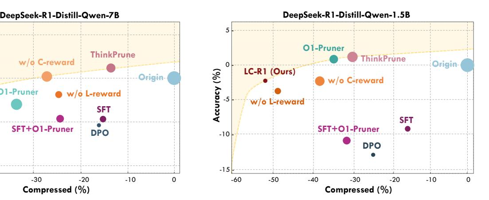

# 1. Introduction

Recent *"long-thought"* Large Reasoning Models (LRMs), such as OpenAI's O1 [\(Jaech et al.,](#page-8-0) [2024\)](#page-8-0) and Deepseek-R1 [\(DeepSeek-AI et al.,](#page-8-1) [2025\)](#page-8-1), represent a significant paradigm extension of foundational Chain-of-Thought (CoT) techniques [\(Wei et al.,](#page-8-2) [2023\)](#page-8-2). Fine-tuned with Reinforcement

*NewInML workshop@Proceedings of the* 42 nd *International Conference on Machine Learning*, Vancouver, Canada. PMLR 267, 2025. Copyright 2025 by the author(s).

> **[图片提取文字 (无描述)]:**
> Please help me solve this following question: Evaluate the simplest result of (1 + 2i) \* 6 - 3i. User (Ground Truth: 6 + 9i.) Too Long Reasoning Chains... Reasoning... Valid: 370 Tokens, Omissions here I can't Alright, so I have this expression to evaluate: (1 + 2i)6 - 3i. stand so Hmm, okay, let me try to figure this out step by step. I'm long texts! just starting to learn about complex numbers, so this might take a bit of thought, .... Alright, the next step is to combine like terms. The terms with 'i' are 12i and -3i, Subtracting 3i from 12i should give me 9i. So, I have 6 + 9i. Wait .... Distribute the 6: 16 + 2i6 = 6 + 12i, Then subtract 3i: 6 + 9i, Reasoning Yeah, that seems correct, Hmm, ..., so yeah, 6 + 9i. Model. I don't see any mistakes,... Converting back to a complex number, that's 6 + 9i. I feel confident the evaluation of (1 + 2i)\*6 - 3i is indeed 6 + 9i. Final Answer: The evaluated expression is 6 + 9i. Invalid: 792 Tokens, Omissions here Answer: To evaluate the expression (1+2i)\*6-3i: 1.Distribute the 6: (1+2i)\*6 = 6\*1+6\*2i = 6+12i. 2. Subtract 3i from the result: 6+12i-3i 3. Combine the imaginary parts:6+(12i-3i) = 6+9i. Thus, the evaluated expression is: 6 + 9i Suitable Reasoning Chains! Reasoning... Valid: 145 Tokens simple Okey, now I'm looking at the expression (1 + 2i)6 - 3i and trying to but work through it step by step. Since I'm still getting used to complex clear! numbers, I want to be careful with the operation. First, I know multiplication comes before subtraction, so I start by distributing the 6 across (1 + 2i). That gives me 6 \* 1 = 6 and 6 \* 2i = 12i, so the (Ours) result of that part is 6 + 12i.Next, I subtract 3i from 12i, which leaves 9i, Putting everything together, I end up with 6 + 9i. Answer: To evaluate the expression (1 + 2i) \* 6 - 3i, we begin by distributing the 6 across the terms inside the parentheses. Multiplying gives 6 \* 1 = 6 and 6 \* 2i = 12i, so the result is 6 + 12i, Next, subtracting 3i from this gives 6 + 12i - 3i, Combining the imaginary parts, we get 12i - 3i = 9i. So, the final result is 6 + 9i.

Figure 1: Comparison between inefficient reasoning model and efficient model. The former tends to make a verbose self-check process after having derived the correct answer corresponding to the given question. The model trained with LC-R1 get more efficient reasoning process to get correct answer, without any invalid thinking process.

Learning (RL), these models iteratively refine solutions to achieve unprecedented performance in complex reasoning tasks like mathematics and programming [\(Sun et al.,](#page-8-3) [2025;](#page-8-3) [Gu et al.,](#page-8-4) [2024\)](#page-8-4). However, with the improvement of *"deep thinking"* ability, a prominent problem is the excessive consumption of computing resources during the reasoning process [\(Chen et al.,](#page-8-5) [2025;](#page-8-5) [Aggarwal and Welleck,](#page-8-6) [2025\)](#page-8-6). Specifically, existing models tend to generate lengthy and even unnecessary chains of reasoning when solving problems with low complexity or clear solution paths. This phenomenon, termed "*overthinking*", manifests as models consuming far more computational resources than the problem itself requires to reach the correct conclusion [\(Chen](#page-8-7)

1University of Maryland. Correspondence to: Tianyi Zhou <tianyi.david.zhou@gmail.com>.

> **[图片提取文字 (无描述)]:**
> DeepSeek-R1-Distill-Qwen-7B 5 **ThinkPrune** w/o C-reward Accuracy (%) Origin-LC-R1 (Ours) O1-Pruner w/o L-reward SFT SFT+O1-Pruner DPO -10 -50 -40 -30 -20 -10 Compressed (%)

> **[图片提取文字 (无描述)]:**
> DeepSeek-R1-Distill-Qwen-7B DeepSeek-R1-Distill-Qwen-1.5B O1-Pruner **ThinkPrune** ThinkPrune w/o C-reward Origin-LC-R1 (Ours) % Originw/o C-reward Accuracy -Pruner w/o L-reward w/o L-reward SFT SFT SFT+O1-Pruner SFT+O1-Pruner DPO -10 DPO -15 -30 -20 -10 -60 -50 -40 -30 -20 -10 0 Compressed (%) Compressed (%)

Figure 2: Pareto analysis of the Efficacy-Efficiency trade-off of different methods on two reasoning models. The x-axis represents the reasoning length change, and the y-axis shows the accuracy change, relative to the original model (defined in Eq. [12\)](#page-5-0), with the top-left corner representing the ideal position. A smaller and darker marker indicates a higher Valid Thinking (VT) rate (defined in Eq. [1\)](#page-2-0), signifying a more efficient thinking process. Compared to other methods also on the pareto frontier, LC-R1 achieves a more favorable trade-off, attaining a substantially higher compression rate at the cost of a minimal drop in accuracy, and it also achieves a higher VT rate. The sub-optimal performance of our ablation variants (w/o C-reward, w/o L-reward) further proves the criticality of our dual-reward designs.

[et al.,](#page-8-7) [2024;](#page-8-7) [Sui et al.,](#page-8-8) [2025;](#page-8-8) [Cuadron et al.,](#page-8-9) [2025\)](#page-8-9). Therefore, one critical problem arises:

### *How can we maintain high reasoning efficacy while significantly improving efficiency?*

Prior works have approached this by fine-tuning on shorter demonstrations (SFT) [\(Chen et al.,](#page-8-7) [2024\)](#page-8-7), constructing preference datasets for conciseness [\(Luo et al.,](#page-8-10) [2025a;](#page-8-10) [Shen](#page-8-11) [et al.,](#page-8-11) [2025\)](#page-8-11), or integrating length-penalties into RL [\(Hou](#page-8-12) [et al.,](#page-8-12) [2025;](#page-8-12) [Luo et al.,](#page-8-13) [2025b;](#page-8-13) [Team et al.,](#page-8-14) [2025\)](#page-8-14). However, these methods often treat the reasoning process as a black box, penalizing length without analyzing the internal structure of the thoughts themselves.

To address this gap, we delve into the structure of "*overthinking*" and identify a specific pattern: models frequently engage in redundant *"double-checking"* after having already derived the correct answer. We term this phenomenon "*invalid thinking*", as shown in Figure [1.](#page-0-0) To quantify it, we introduce a new metric, Valid Thinking (VT) Rate, which measures the proportion of the reasoning process that is essential for reaching the initial correct conclusion.

Guided by this insight, we propose two fine-grained principles: Brevity (eliminating redundancy) and Sufficiency (preserving necessary steps). We then introduce LC-R1, a GRPO-based post-training method that operationalizes these principles. LC-R1 uniquely combines a Length Reward for overall conciseness with a novel Compress Reward designed to directly guide the model to terminate the thinking process upon deriving the correct answer.

We conduct comprehensive experiments on two reasoning models across seven benchmarks. Empirical results show that LC-R1 achieves a more favorable trade-off between efficacy and efficiency than prior methods as shown in Figure [2.](#page-1-0) Specifically, with only a 2% drop in accuracy, our method attains a 50% reduction in sequence length on average. Ablation study also demonstrates the indispensability of both Length Reward and Compress Reward for achieving efficient reasoning. Further study shows that our method achieves efficient compression without impairing the exploration ability of model, and the efficiency can generalize to various difficulty problems. In conclusion, our contribution can be summarized as follows:

- We analyze the thinking process of current competitive reasoning model and find the phenomenon of "*invalid thinking*" : It takes a large portion of thinking process to double check after having derived the correct answer, making the reasoning verbose and inefficient.
- We propose two novel principles: Brevity and Sufficiency, and design a GRPO-based method LC-R1 for LRM post-training to strike a balance between Brevity and Sufficiency, pruning invalid thinking while compressing overall sequences at the same time.
- Through comprehensive experiments, we validate the effectiveness of LC-R1 to get a better trade-off between Efficacy and Efficiency, and conduct further analyses on the deep impact of compression, proving the robustness of LC-R1 to various difficulties and providing insights for future works.

Table 1: Valid Thinking Rate of current *state-of-the-art* Large Reasoning Models. Nemotron indicates Llama-3.3-Nemotron-Super-49b-v1. Results manifest a low VT rate on all these models, highlighting the phenomenon of "*invalid thinking*".

| Model       | Avg. | AIME25 | AMC  | GSM8K | MATH500 | Olympiad |
|-------------|------|--------|------|-------|---------|----------|
| Qwen-3-32B  | 57.5 | 73.8   | 58.8 | 53.8  | 46.6    | 51.5     |
| QwQ-32B     | 59.2 | 70.8   | 58.2 | 54.1  | 53.1    | 59.6     |
| DeepSeek-R1 | 65.3 | 66.5   | 71.8 | 64.2  | 59.8    | 64.0     |
| Nemotron    | 60.8 | 62.1   | 64.1 | 63.1  | 56.6    | 58.1     |

