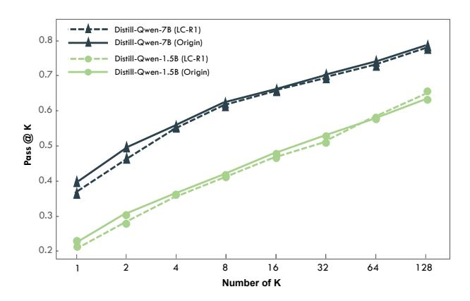
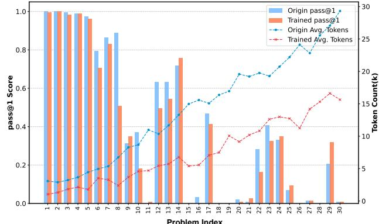

# 3. LC-R1: Length Compression with Efficient Reasoning Principles

In this section, we propose LC-R1, a GRPO-based posttraining algorithm designed to address the "*invalid thinking*" phenomenon and enhance reasoning efficiency. Guided by the principles of *Brevity* and *Sufficiency* introduced in Section [2.2,](#page-2-2) LC-R1 employs a novel dual-reward system. This system combines a global Length Reward for overall conciseness with a targeted Compress Reward that specifically removes redundant reasoning. The complete pipeline of LC-R1 is illustrated in Figure [3](#page-3-0) and Algorithm [1.](#page-4-1)

### 3.1. Problem Formulation

Let M be the model and q be the given query. The output is o ∼ M(q), where o = cat(R, A) consists of a reasoning part R and an answer part A, split by the token </think>, which is considered part of A. For the reasoning part R, we denote its effective prefix R′ as the content from the

> **[图片提取文字 (无描述)]:**
> Original Sequences Compressed Sequences Output-1 Compressed Output-1 LC-Extractor Valid Thinking Valid Thinking Invalid Thinking Answer Answei (Shortest) (Shortest) Generating Output-2 Compressed Output-2 **G** Outputs... **Valid Thinking** Invalid Thinking **Valid Thinking** Output-(G-1) Compressed Output-(G-1) Based on the Ground Wrong Wrong Question Policy Model **Valid Thinking Invalid Thinking** Valid Thinking Truth, please extract Answer Answer the part of the thought Compressed Output-G Output-G process from the Valid Thinking beginning to the first Valid Thinking Invalid Thinking Answer (Longest) appearance of it. Token Thinking Process Token GRPO Valid/Invalid **Get Length** Format Thinking Length Accuracy OK, I can learn this Valid Thinking Best! format. (Shortest) **Valid Thinking** Normal. **Update** Compress Base Length Reward Reward Reward Trained Model Reward Wrong **Valid Thinking** Bad. Answer OK. I can avoid Valid Thinking this format. ► Bad. Subtract Mean (Longest) Compressed Sequences

Figure 3: An overview of the LC-R1 training three-stage pipeline. (1) Valid Segment Extraction: First, an extractor model processes the original reasoning traces to identify the valid thinking portion and generate compressed sequences. (2) Reward Calculation: Next, these compressed sequences are used to compute our dual rewards—Length Reward and Compress Reward, with the latter applied exclusively as a bonus or penalty on the final 
/think> token. These are then combined to calculate the final advantages. (3) Policy Optimization: Finally, the GRPO loss is calculated using the compressed sequences and corresponding advantages, steering the model toward more concise and efficient reasoning.

beginning of R up to the first occurrence of the correct answer corresponding to the query q. If R does not contain the correct answer, then we define R' = R. We define two functions as follows:

$$t({R, A}) = R, \quad f({R, A}) = {R', A}$$
 (2)

The function t extracts the reasoning process R from the output o and function f extracts the concise reasoning part R' and concatenates it with the answer A. We denote  $o_i$  as the original model output and  $o_i' = f(o_i)$  as the refined compressed output.

LC-R1 is a GRPO-based method to efficiently compress the reasoning process. Within a group, let  $\mathcal C$  denote the set of indices i where sequences  $o_i$  leading to the correct answer corresponding to the query q, and  $\mathcal W$  be the set of indices j where  $o_j$  leading to a wrong answer, The total group size is  $G = |\mathcal C| + |\mathcal W|$ .

### 3.2. Reward and Objective Design

Our method's reward system consists of two core components: the Length Reward for reducing overall output length, and the Compress Reward for targeting redundant parts of the model's reasoning.

**Length Reward.** To compress the total length of the model output, we propose adding a length penalty during the GRPO training process. Leveraging the group-based sampling of GRPO, we can calculate the relative length reward to automatically adjust to the difficulty of the problem. And we define the Length Reward as follows:

$$r_{i,\text{length}} = \begin{cases} 1 - \frac{|o'_i|}{\max_{j \in \mathcal{C}} |o'_j|}, & \text{if } i \in \mathcal{C} \\ 0, & \text{if } i \in \mathcal{W} \end{cases}$$
(3)

This formulation uses the maximum length of a correct, compressed sequence within the group as a normalizer. The final reward combines this with a base reward for format and accuracy, and is normalized by subtracting the group mean, following Liu et al. (2025) to obtain an unbiased gradient:

$$\tilde{r}_i = r_{i,\text{base}} + \alpha \cdot r_{i,\text{length}}$$
 (4)

$$r_{i,\text{combine}} = \tilde{r}_i - \text{mean}(\{\tilde{r}_j\}_{j=1}^G)$$
 (5)

where

$$r_{i,\text{base}} = r_{i,\text{format}} + r_{i,\text{accuracy}}$$
 (6)

Following prior work,  $r_{i,\text{format}}$  and  $r_{i,\text{accuracy}}$  are binary rewards to judge whether the model places its thinking process between <think> and

### Algorithm 1 LC-R1: Length Compress for R1-style model

**Input:** Initial policy model  $\pi_{\theta}$ , compression function  $f(\cdot)$ , task prompts  $\mathcal{D}$ , hyperparameters  $\alpha, \beta, \mu$  **Output:** Trained policy model  $\pi_{\theta}$ 

1: **for** step = 1, ..., M **do** 

2: Sample a batch  $\mathcal{D}_b$  from  $\mathcal{D}$ 

3: Update the old policy model  $\pi_{\theta_{\text{old}}} \leftarrow \pi_{\theta}$ 

4: Sample G outputs  $\{o_i\}_{i=1}^G \sim \pi_{\theta_{\text{old}}}(\cdot|q)$  for each question  $q \in \mathcal{D}_b$ 

5: Apply compression to all outputs:  $o'_i \leftarrow f(o_i)$ 

6: Compute combined reward  $r_{i,\text{combine}}$  (Eq. 5) and compress reward  $r_{i,\text{compress}}$  (Eq. 11)

7: Compute token-level advantages  $\hat{A}_{i,t}$  for each compressed output  $o'_i$  (Eq. 10)

8: **for** iteration =  $1, \ldots, \mu$  **do** 

9: Update the policy model  $\pi_{\theta}$  by maximizing the objective  $\mathcal{J}_{GRPO}$  (Eq. 7)

10: end for

11: **end for** 

12: **return**  $\pi_{\theta}$ 

leads to the correct answer corresponding to the query verified by Math-Verify1 respectively.  $\alpha$  is a hyperparameter that controls the weight of the Length Reward.

**Compress Reward.** For the original GRPO method, the loss calculation is based on the model's own sampling results. In order to drive the model to terminate the thinking process when getting the correct answer for achieving Brevity, we modify the GRPO objective as follows:

$$\begin{split} &\mathcal{J}_{\text{GRPO}}(\theta) = \mathbb{E}_{q \sim P(Q), \{o_i\}_{i=1}^G \sim \pi_{\theta_{\text{old}}}(O|q)} \\ &\left[ \frac{1}{\sum_{i=1}^G |o_i'|} \sum_{i=1}^G \sum_{t=1}^{|o_i'|} \left\{ \min[R_t(\theta) \cdot \hat{A}_{i,t}, \text{ clip}(R_t(\theta), 1 - \epsilon, 1 + \epsilon) \cdot \hat{A}_{i,t}] - \beta D_{\text{KL}}(\pi_{\theta}(\cdot|q) \parallel \pi_{\text{ref}}(\cdot|q)) \right\} \right] \end{split}$$

where

$$\mathbb{D}_{KL}(\pi_{\theta} \| \pi_{ref}) = \frac{\pi_{ref}(o_i'|q)}{\pi_{\theta}(o_i'|q)} - \log \frac{\pi_{ref}(o_i'|q)}{\pi_{\theta}(o_i'|q)} - 1 \quad (8)$$

$$o_i' = f(o_i), \quad R_t(\theta) = \frac{\pi_{\theta}(o_{i,t}'|q, o_{i, < t}')}{\pi_{\theta_{\text{old}}}(o_{i,t}'|q, o_{i, < t}')}$$
(9)

Our key modification to the standard GRPO objective is that the loss is calculated over the compressed trajectories  $o'_i$ , rather than the original full trajectories  $o_i$ . We define the token-level advantages  $\hat{A}_{i,t}$  as follows:

$$\hat{A}_{i,t} = r_{i,\text{combine}} + \gamma \cdot \mathbb{I}(o'_{i,t} = < / \text{think} >) \cdot r_{i,\text{compress}}$$
(10)

where

$$r_{i,\text{compress}} = \begin{cases} 1 - \frac{|t(o_i')|}{|t(o_i)|}, & \text{if } i \in \mathcal{C} \text{ \& ans}(q) \in t(o_i') \\ -1, & \text{if } i \in \mathcal{C} \text{ \& ans}(q) \notin t(o_i') \\ 0, & \text{if } i \in \mathcal{W} \end{cases}$$

Let  $\operatorname{ans}(q)$  be the ground truth answer for a given query q. In this setting, we place focuses on steering model towards outputting </think> token when getting the correct answer (at the end of  $o_i'$ ) during the thinking process to achieve compressing the verbose token, conforming to the principle of **Brevity**. We only give an extra reward to this token, avoiding place unnecessary emphasis on other tokens to make the training process more efficient and stable. We define the reward to be the portion of Redundant Sequence, formulated by  $1 - \frac{|t(o_i')|}{|t(o_i)|}$ , representing the efficiency distinction between sequences before and after compression. The hyperparameter  $\gamma$  scales this bonus.

Based on the principle of **Sufficiency**, the model should engage in sufficient reasoning process, avoiding overhead compression at the cost of accuracy degradation. Therefore, we impose a large penalty (-1) to the token </think> if the model terminates its reasoning before finding the correct answer, which discourages harmful over-compression and provides robustness to the training process.

To further validate the effectiveness of our method, we follow DAPO (Yu et al., 2025) to calculate the objection across all tokens in a group, instead of averaging the token rewards within a single sequence, which eliminates the original GRPO method's preference for short-correct sequences and long-incorrect sequences, facilitating the validation of our method's effectiveness.

### 4. Experiments

### 4.1. Experiment Setups

**Backbone Models.** We choose two representative reasoning models: DeepSeek-R1-Distill-Qwen-7B/1.5B (DeepSeek-AI et al., 2025) as our backbone models, which have demonstrated strong performance on mathematical and coding reasoning tasks.

&lt;sup>1https://github.com/huggingface/Math-Verify

Table 2: Accuracy (above) and Sequence Length (below) for all methods across seven benchmarks. *AVG* shows the relative change in accuracy and length compared to the Base model (+ increase, - decrease). GPQA-D denotes GPQA-Diamond benchmark, and LCB denotes the pass@10 score on LiveCodeBench. *VT* represents the Valid Thinking ratio. For each column, the best performing score is marked in **bold**, and the <u>second-best</u> is underlined.

| Method                      | AIME25                  | MATH500                 | GSM8K                  | Olympiad                | AMC                     | GPQA-D                  | LCB                     | Avg                                 | VT     |
|-----------------------------|-------------------------|-------------------------|------------------------|-------------------------|-------------------------|-------------------------|-------------------------|-------------------------------------|--------|
| DeepSeek-R1-Distill-Qwen-7B |                         |                         |                        |                         |                         |                         |                         |                                     |        |
| Base                        | 37.7 (11007)         | 92.6 (3832)          | 91.6 (1842)         | 59.7 (7342)          | 81.2 (6715)          | 46.6 (6508)          | 68.8 (8878)          | -                                   | 58.72% |
| SFT                         | 36.6 (9457)          | 90.2 (2497)          | <b>91.9</b> (946)      | 56.0 (6329)          | 78.7 (5231)          | 39.8 (8217)          | 67.3 (8739)          | -4.46% (-15.54%)                 | 95.64% |
| DPO                         | 36.9 (9718)          | 91.4 (2277)          | 90.3 (980)          | 56.2 (6338)          | 78.6 (5122)          | 37.2 (8109)          | 66.9 (8755)          | -5.26% (-16.18%)                 | 96.34% |
| O1-Pruner                   | 35.0 (8263)          | 91.5 (2268)          | 91.1 (1012)         | 59.6 (4712)          | 77.1 (4510)          | 45.5 (5012)          | 66.7 ( <b>5901</b> ) | -2.79% ( <u>-33.71%</u> )        | 69.30% |
| ThinkPrune                  | <b>38.0</b> (9309)      | <b>93.1</b> (3253)      | 91.2 (1546)         | <b>60.8</b> (6225)      | <b>82.7</b> (5510)      | <b>50.3</b> (6508)      | 67.8 (7180)          | <b>+1.58%</b> (-14.13%)             | 77.16% |
| SFT+O1-Pruner               | 35.5 (9466)          | 91.0 (2245)          | 89.7 (920)          | 56.0 (5807)          | 76.6 (5133)          | 43.9 (6425)          | 66.8 (7267)          | -4.31% (-24.19%)                 | 85.22% |
| LC-R1 (Ours)                | 36.2 ( <b>7150</b> ) | 90.4 ( <b>1568</b> ) | 88.1 ( <b>450</b> ) | 58.7 ( <b>4041</b> ) | 79.1 ( <b>3453</b> ) | 47.2 ( <b>4604</b> ) | <b>69.0</b> (6059)      | <u>-1.84%</u> ( <b>-46.32%</b> ) | 97.14% |
|                             |                         |                         | DeepS                  | eek-R1-Disti            | ll-Qwen-                | 1.5B                    |                         |                                     |        |
| Base                        | 22.8 (12129)         | 83.7 (4869)          | 83.4 (2294)         | 44.2 (9258)          | 61.2 (8696)          | <b>34.5</b> (8516)      | <b>43.1</b> (10120)     | _                                   | 56.06% |
| SFT                         | 20.5 (10639)         | 81.4 (3045)          | 81.3 (1134)         | 42.7 (7637)          | 59.7 (6608)          | 22.4 (10217)         | 39.8 (10597)         | -9.13% (-16.74%)                 | 95.54% |
| DPO                         | 19.4 (10316)         | 79.0 (2749)          | 80.9 (855)          | 41.1 (6544)          | 56.7 (5912)          | 19.8 (9438)          | 39.2 (10287)         | -12.79% (-24.30%)                | 98.38% |
| O1-Pruner                   | 23.2 (8731)          | 84.3 (2913)          | 82.7 (1162)         | <b>47.1</b> (5960)      | <b>65.1</b> (5131)      | 32.1 (6173)          | 42.5 (7305)          | +0.89% (-35.64%)                 | 78.20% |
| ThinkPrune                  | <b>24.1</b> (7960)      | <b>84.5</b> (3518)      | <b>84.1</b> (1690)     | 44.9 (6250)          | 63.4 (5897)          | 33.6 (5576)          | 42.7 (7226)          | <b>+1.31%</b> (-30.89%)             | 65.62% |
| SFT+O1-Pruner               | 17.5 (9075)          | 80.2 (2769)          | 81.5 (919)          | 40.0 (6411)          | 58.7 (5553)          | 25.0 (7410)          | 39.4 (8488)          | -11.34% (-32.04%)                | 91.38% |
| LC-R1 (Ours)                | 21.2 ( <b>6434</b> ) | 82.5 ( <b>2233</b> ) | 82.7 ( <b>841</b> ) | 43.2 ( <b>4333</b> ) | 61.7 ( <b>3947</b> ) | 33.6 ( <b>4489</b> ) | 42.4 ( <b>5722</b> ) | -2.14% ( <b>-51.86</b> %)        | 98.64% |

**LC-Extractor.** To accurately identify and extract the valid reasoning part, we develop a specialized parser to implement the extraction function f mentioned in Eq. 2, termed LC-Extractor. We finetune Qwen2.5-3B-Instruct for its lightweight and easy enough to run. Detailed experiment settings are provided in Appendix B.

**Dataset.** We used a mixed-difficulty dataset, combining past AIME competition problems with the MATH dataset in an approximate 1:2 ratio to create 2500 training samples. This approach enables the model to learn length compression across problems of varying difficulty.

**Evaluation.** We test our model's performance on seven datasets, including AIME25, MATH500, GSM8K, AMC,

OlympiadBench, GPQA-Diamond and LiveCodeBench, across math, general and code tasks, to evaluate the efficiency of reasoning comprehensively. We use averaged Pass@1 as our primary metric. For each test, we sample N times, setting top-p = 0.95 and temperature = 0.7. For AIME25, we set N=64, while for the other test sets, we set N=8. We set the maximum length to 16384. Additionally, we calculate the average fluctuate ratio on accuracy and token lengths compared with base model on every benchmark, which can be formulated as follows:

$$Avg_{acc} = mean_{i=1}^{7} \left\{ \frac{Acc_{i}^{model} - Acc_{i}^{base}}{Acc_{i}^{base}} \right\}$$
 (12)

$$Avg_{len} = mean_{i=1}^{7} \left\{ \frac{Len_{i}^{model} - Len_{i}^{base}}{Len_{i}^{base}} \right\}$$
 (13)

Table 3: Ablation study on the contribution of Length Reward and Compress Reward to the compression process. The study manifest the sub-optimal performance of them, varifying each of them makes a big contribution to the efficient reasoning.

| Method       | AIME25                      | MATH500 GSM8K  |                | Olympiad                      | AMC            | GPQA-D         | LCB            | Avg                 | VT     |
|--------------|-----------------------------|----------------|----------------|-------------------------------|----------------|----------------|----------------|---------------------|--------|
|              | DeepSeek-R1-Distill-Qwen-7B |                |                |                               |                |                |                |                     |        |
| LC-R1 (Ours) | 36.2 (7150)              | 90.4 (1568) | 88.1 (450)  | 58.7 (4041)                | 79.1 (3453) | 47.2 (4604) | 69.0 (6059) | –1.84% (–46.32%) | 97.14% |
| w/o L-reward | 36.1 (9309)              | 91.3 (2316) | 90.6 (696)  | 59.4 (5779)                | 79.0 (5021) | 45.9 (6273) | 68.0 (8023) | –1.80% (–25.28%) | 93.16% |
| w/o C-reward | 37.6 (8738)              | 92.9 (2498) | 91.1 (1012) | 59.1 (5344)                | 80.5 (4741) | 48.9 (5727) | 68.5 (6893) | +0.31% (–27.35%) | 72.24% |
|              |                             |                |                | DeepSeek-R1-Distill-Qwen-1.5B |                |                |                |                     |        |
| LC-R1 (Ours) | 21.2 (6434)              | 82.5 (2233) | 82.7 (841)  | 43.2 (4333)                | 61.7 (3947) | 33.6 (4489) | 42.4 (5722) | –2.14% (–51.86%) | 98.64% |
| w/o L-reward | 21.3 (7061)              | 81.2 (2270) | 83.3 (754)  | 43.4 (5024)                | 62.2 (4478) | 30.6 (5021) | 41.9 (6378) | –3.42% (–47.79%) | 95.16% |
| w/o C-reward | 21.9 (7988)              | 83.2 (2965) | 84.1 (1160) | 44.0 (5363)                | 63.4 (5192) | 30.1 (5847) | 43.7 (6874) | –1.70% (–38.35%) | 71.10% |

We also test VT for each model to evaluate the Brevity of the thinking process to investigate the ability of these methods to mitigate the "invalid thinking" phenomenon. We test VT on five math benchmarks and calculate the mean value, for the convenience of extracting the standard and formatted correct answer from the thinking process on math problems.

### 4.2. Baselines

Supervised Fine-tuning (SFT). Inspired by OVERTHINK [\(Chen et al.,](#page-8-7) [2024\)](#page-8-7), which proposes using only the initial correct solution for fine-tuning, we construct an SFT dataset of 5000 samples by removing the Redundant Sequence from self-generated outputs.

Direct Preference Optimization (DPO) [\(Rafailov et al.,](#page-9-3) [2023\)](#page-9-3). We create a preference dataset of 5000 samples from the MATH dataset, where the shortest correct answer is treated as the *"chosen"* response and the longest as the *"rejected"* response. This DPO training is applied to the SFT-tuned model.

O1 Pruner [\(Luo et al.,](#page-8-13) [2025b\)](#page-8-13). A PPO-like offline finetuning method to significantly compress CoT length while maintaining performance. We follow its methodology using 10000 samples from the MATH dataset.

ThinkPrune-3K [\(Hou et al.,](#page-8-12) [2025\)](#page-8-12). A reinforcement learning approach that uses a length-truncation reward for multi-stage compression. We reproduce the ThinkPrune-3k variant, which is reported to be highly efficient, with slight accuracy degradation.

SFT + O1-Pruner. To better understand the effect of compressing the thinking process and pruning the overall sequences at the same time, we also compare with a two-stage training approach, combining SFT and O1 Pruner.

### 4.3. Experiment Results

LC-R1 outperforms other methods with competitive performance and fewer tokens. As presented in Table [2,](#page-5-1) On the 7B model, LC-R1 achieves an average length reduction of 46.32%, substantially higher than all other baselines, with a mere 1.84% drop in average accuracy. Similarly, on the 1.5B model, it attains a 51.86% length reduction for a 2.14% accuracy decrease. This efficiency does not appear to compromise its generalization, as it demonstrates more robust performance on out-of-distribution (OOD) benchmarks like GPQA-Diamond and LiveCodeBench compared to other high-compression methods. Figure [2](#page-1-0) shows our method achieves more favorable Efficacy-Efficiency trade-off by enabling maximal compression ratio with negligible accuracy degradation. LC-R1 also achieves a significantly higher VT rate (over 97%) compared to other methods like O1-Pruner (~70-78%) and ThinkPrune (~66-77%), demonstrating the superior efficiency of our approach.

Combining length and compress reward brings superior efficiency to reasoning. Our ablation study on the Length Reward (L-reward) and Compress Reward (C-reward), presented in Table [3,](#page-6-0) reveals their critical complementary relationship. The analysis reveals that while each component alone yields competitive results—positioning them near the Pareto frontier of performance versus compression efficiency—combining them can achieve a more optimal balance. Specifically, using L-reward alone achieves sig-

> **[图片提取文字 (无描述)]:**
> Distill-Qwen-7B (LC-R1) 0.8 Distill-Qwen-7B (Origin) Distill-Qwen-1.5B (LC-R1) 0.7 Distill-Qwen-1.5B (Origin) 0.6 Pass @ K 0.5 0.4 0.3 0.2 2 8 128 16 32 64 Number of K

> **[图片提取文字 (无描述)]:**
> 30 Origin pass@1 , 1.0 Trained pass@1 Origin Avg, Tokens Trained Avg. Tokens 25 0.8 20 (X) Count(k) 02 0.6 0.0 0.4 Token 10 0.2 0.0 9 6 9 6 19 20 21 22 22 23 23 24 25 26 28 29 29 30 Problem Index

Figure 4: The impact of LC-R1 compression method on the AIME25 benchmark. *Left:* The Pass@k scores show that LC-R1 models maintain competitive performance compared to the originals, preserving the model's potential. *Right:* Per-problem analysis on Deepseek-R1-Distill-Qwen-7B reveals that LC-R1 achieves similar Pass@1 accuracy while maintaining a consistent token compression ratio across problems of varying difficulty, demonstrating a universal compression effect.

nificant compression but with lower VT rate. Conversely, C-reward alone ensures a high VT by precisely removing redundancy, but with limited overall compression. Our full LC-R1 method successfully integrates these strengths, achieving both the highest compression efficiency and the highest VT rate while maintaining comparable accuracy, proving that the synergy between both rewards is indispensable for achieving maximum reasoning efficiency.

SFT shows limitation on generalization. While SFT achieves a remarkably high VT rate (over 95%), its effectiveness is superficial. The model's performance collapses on *OOD* benchmarks, indicating that it merely overfits to the structural brevity of the training data rather than learning a generalizable, efficient reasoning policy. The poor performance of the hybrid SFT+O1-Pruner method further suggests that a simple combination of off-the-shelf techniques is insufficient. These findings underscore the superiority of RL-based methods like LC-R1, which foster more robust and genuinely efficient reasoning skills.

### 5. Compression Impact Analysis

### Compression does not impact exploration capability.

To investigate the deeper impact of compression on the model's problem-solving potential, we sampled 256 times on AIME25 with maximal length = 32,768 and test pass@k score on both models before and after compression. The results in Figure 4 (left) reveal a key phenomenon: across the entire Pass@k evaluation range from k = 1 to 128 on the AIME25 dataset, the performance curve of the model compressed by our LC-R1 method almost perfectly overlaps with that of the original model. This result strongly demonstrates that the model's exploration ability to find a correct solution through multiple attempts will not be injured by

the compression. It suggests that the pruned "invalid thinking" segments are truly redundant and their removal does not diminish the model's underlying knowledge or creative problem-solving potential.

Compression remains consistent across varying problem difficulties. To analyze our method's behavior at a microscopic level, we plot the per-problem pass@1 accuracy against the original model's token consumption on the AIME25 benchmark (Figure 4 (right)). The plot reveals a clear difficulty spectrum, where problems requiring more tokens from the base model generally correspond to lower pass@1 scores. Crucially, LC-R1 applies a uniform and significant compression ratio across this entire spectrum, with per-problem outcomes (*i.e.*, success or failure) remaining remarkably consistent with those of the base model. This provides strong evidence that LC-R1 functions as a robust and difficulty-agnostic efficiency layer, successfully streamlining the reasoning process without altering the model's core problem-solving logic for any specific problem.

### 6. Conclusion

In this paper, we address the "invalid thinking" phenomenon existing in current LRMs, that they tend to double-check their work after correct answer has been derived. To tackle this, we introduced the principles of Brevity and Sufficiency and proposed LC-R1, a RL-based post-training method that employs a dual-reward system, compressing overall sequence length and pruning Redundant Sequence spontaneously. Extensive experiments demonstrate that LC-R1 achieves more favorable *Efficacy-Efficiency* trade-off. In further analysis, LC-R1 does not degrade the model's exploration ability and and the compression effect remains robust across problems of varying difficulty.

