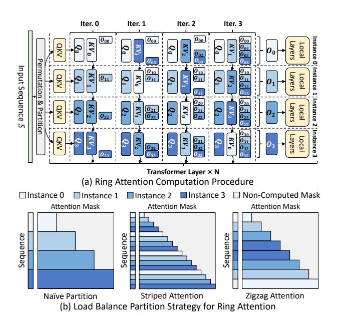
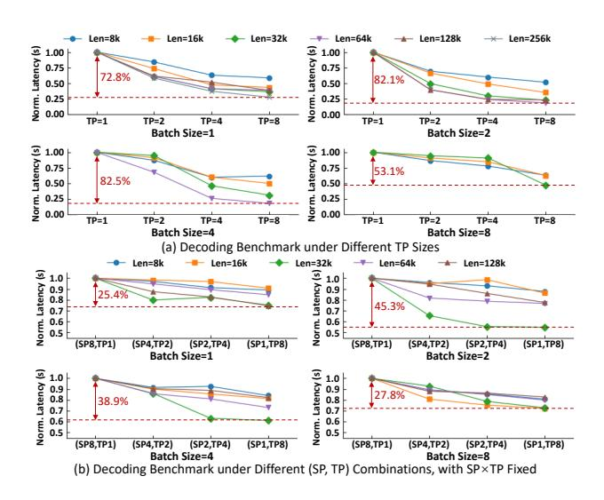

# 1 Introduction

Large Language Models (LLMs) have empowered many generative tasks such as chatbot [\[12,](#page-11-0) [28\]](#page-12-0), code completion [\[11,](#page-11-1) [24\]](#page-12-1), and reasoning [\[40,](#page-13-0) [41\]](#page-13-1). Such capability drives many cloud companies to deploy online LLM services [\[2,](#page-11-2) [4,](#page-11-3) [12,](#page-11-0) [28\]](#page-12-0). As LLMs continue to advance, their context lengths have notebly expanded. For example, OpenAI's GPT-4o [\[29\]](#page-12-2) supports 128K contexts, Anthropic's Claude-3 [\[3\]](#page-11-4) supports 200K, and Google's Gemini-2.5 pro [\[13\]](#page-11-5) supports up to 1M tokens.

With the growth of sequence length, LLM inference requires proportionally more resources. To augment resource provision for long-context requests, sequence parallelism (SP) has been widely applied [\[5,](#page-11-6) [10,](#page-11-7) [15](#page-12-3)[–17,](#page-12-4) [19,](#page-12-5) [20,](#page-12-6) [39,](#page-13-2) [42,](#page-13-3) [43\]](#page-13-4). Among these implementations, ring-attention-based SP [\[20\]](#page-12-6) (also known as context parallelism [\[10,](#page-11-7) [39,](#page-13-2) [43\]](#page-13-4)) has been introduced to LLM serving [\[42,](#page-13-3) [43\]](#page-13-4). Specifically, it scatters long sequences across multiple LLM instances and performs distributed attention computation through peer-to-peer (P2P)

KV cache transmission. By overlapping cache transmission with attention computation, ring attention demonstrates better scalability than tensor parallelism (TP), especially when populating resources beyond a single node [\[43\]](#page-13-4).

The expansion of context window also widens request length gaps, thereby amplifying variability in per-request resource demands. To cope with this, existing state-of-the-art long-context LLM serving system, LoongServe [\[42\]](#page-13-3), proposes elastic sequence parallelism (ESP). ESP dynamically adjusts SP allocation in the granularity of request batch to satisfy diverse resource demands. In contrast, non-SP systems have to statically configure resource allocation at startup due to the high overhead of model weight resharding, limiting their ability to respond to highly variable resource demands when serving long-context LLMs.

Although LoongServe has surpassed existing best-performing non-SP systems [\[1,](#page-11-8) [18,](#page-12-7) [22,](#page-12-8) [46\]](#page-13-5), itscoarse-grained SP allocation fails to fully optimize online long-context LLM serving's performance: First, ESP enforces a uniform TP size across all instances. However, prefill benefits from smaller TP for better resource allocation flexibility, while decoding prefers larger TP to minimize compute latency. Second, LoongServe assigns requests to fixed batches and exhaustively optimizes per-batch latency. However, since this local-optimal strategy lacks global load awareness, its excessive SP expansion fails to optimize system's overall latency distribution. Third, dynamic SP allocation leads to varying queuing delays across instances. However, since ring attention requires synchronous computation across instances, such an imbalance results in idle slots and degrades overall resource efficiency.

To tackle these problems, we first propose Chunkwise Dynamic Sequence Parallelism (CDSP), a fine-grained intrarequest SP allocation strategy. It splits each request's prompt into multiple chunks and assigns each chunk a distinct SP size, enabling efficient utilization of resource fragments while fully optimizing prefill latency. Based on CDSP, we build Tetris, a system for efficient online long-context LLM serving. Tetris efficiently integrates CDSP into prefill-decoding disaggregated cluster by extending attention load-balancing strategy and KV cache transfer management, thereby fully accommodating the parallelism heterogeneity across different stages. For online scheduling, Tetris regulates SP size allocation based on real-time request arrival pressure to prevent excessive SP expansion from degrading global latency. In addition, Tetris integrates a load-aware chunk partitioning

\* Work done during Cong Li's internship at Bytedance Seed.

scheme that dynamically determines the optimal execution plan for each request, maximizing the benefits of CDSP. To summarize, we have made the following contributions:

- We identify existing dynamic SP allocation strategy's rigidity in handling inter-request resource variability under online long-context LLM serving scenarios.
- We propose CDSP for intra-request fine-grained SP allocation and build Tetris's inference engine to fully satisfy the heterogeneous demands in long-context LLM serving.
- We propose *real-time load-aware* SP size allocation and chunk partitioning strategies in Tetris's scheduler to optimize the service's overall latency distribution.

Extensive experiments on workloads collected from a *real-world online long-context LLM service* demonstrate that Tetris achieves up to  $4.35\times$  lower time-to-first-token (TTFT) under state-of-the-art systems' max sustainable loads, reduces median time-between-tokens (TBT) by up to 40.1%, and increases the max request capacity by up to 45%.

## 2 Background and Motivation

#### 2.1 Transformer-based LLMs

Mainstream LLMs are built on transformer decoder layers [38], which contain an attention block and a feed-forward network (FFN) block. In the attention block, the inputs are projected to query, key, and value vectors, which interact with each other through self-attention. Then, the outputs of the attention block are processed by multi-layer perceptrons (MLPs) in the FFN block to produce the decoder layer outputs. After passing a stack of transformer layers, the final outputs can be used for downstream generative tasks.

LLM's generation procedure contains two stages: prefill and decoding. In the prefill stage, the LLM processes all tokens of the input prompt in parallel to produce the first token. Then, in the decoding stage, the LLM takes the previous token as input and predicts one new token per iteration, gradually building the full output sequence. Since self-attention requires each token to interact with all previous tokens' key/value vectors, these intermediate states are stored throughout LLM inference to avoid redundant computation, which is known as KV Cache [32].

## 2.2 LLM Serving

Online LLM service has been widely deployed by cloud companies [2, 4, 12, 28], which receives requests from multiple users, conducts inference on a GPU cluster, and returns decoding outputs in real-time. To evaluate the serving quality (or Service Level Objectives, SLOs), service providers proposed several metrics: The Prefill stage is measured by time to first token (TTFT), which is the duration between request arrival and the finish of prefill computation. For decoding stage, time between tokens (TBT) is employed to measure the smoothness of the output streaming procedure.

> **[图片提取文字 (无描述)]:**
> Iter. 0 Iter. 1 Iter. 2 Iter. 3 000 000 000 Instance 0'Instance 1'Instance 2'Instance 3 Layers Permutation Input Sequence S Layers Local 20 Layers Partition Layers Local Transformer Layer × N (a) Ring Attention Computation Procedure Instance 3 ☐Instance 0 ■ Non-Computed Mask Instance 1 Instance 2 Attention Mask Attention Mask Attention Mask Seguence Sequence Seguence Naïve Partition Striped Attention Zigzag Attention (b) Load Balance Partition Strategy for Ring Attention

**Figure 1.** Ring-Attention-Style Sequence Parallelism.

To optimize these SLOs and improve the serving system's efficiency, several system optimizations have been proposed: Iteration-level scheduling adds new requests once the current decoding iteration finishes, reducing the queuing latency of each request [44]. PagedAttention eliminates the memory fragmentation caused by the variance of prompt and decoding lengths via managing the KV cache in block granularity [18]. Prefill-decoding disaggregation routes requests under different stages to distinct model instances to avoid the interference between the two stages [46].

#### 2.3 Sequence Parallelism for Long-Context LLMs

Sequence parallelism (SP) has been a pivotal approach to handle long-context requests' compute and memory demands [5, 10, 15-17, 19, 20, 39, 42, 43]. In this paper, we mainly focus on ring-attention-style SP, which has been adopted in LLM inference [42, 43]. As shown in Fig. 1-(a), ring attention distributes the tokens of one sequence to multiple model instances. During the prefill stage, each instance first calculates its local tokens' query, key, and value tensors together with their attention results. Then, it sends key-value tensors to the next neighbor and receives new key-value tensors from the previous neighbor iteratively to interact local query tensors with full key-value tensors. After the distributed attention computation, each instance computes the remaining operators without communication. During the decoding stage, instead of passing key-value tensors, ring attention transfers query vectors because their smaller data volume can reduce the ring communication overhead.

Since the causal mask adopted by LLMs only requires each token to compute with all preceding tokens, splitting the

| Table 1. Prefill latency (s) comparison of LLaMA3-8B, tested |
|--------------------------------------------------------------|
| on A100 GPUs. The optimal latency is marked in bold.         |

| Prompt Length | 4k   8k   16k   32k   64k   128k                             | 256k  |
|---------------|--------------------------------------------------------------|-------|
| SP=1 Latency  | 0.28   0.57   1.29   3.22   9.05   29.20                     | OOM   |
| SP=2 Latency  | 0.16   0.31   0.69   1.67   4.61   14.30                     | 50.07 |
| SP=4 Latency  | <b>0.13</b>   <b>0.20</b>   0.39   0.92   2.43   7.32        | 24.77 |
| SP=8 Latency  | 0.21   0.24   <b>0.31</b>   0.58   1.37   3.96               | 12.81 |
| SP=16 Latency | 0.39   0.43   0.46   <b>0.53</b>   <b>0.96</b>   <b>2.31</b> | 7.02  |

sequence into multiple consecutive shards will lead to imbalanced workload distribution across instances, as shown in Fig. 1-(b). Several optimized partition strategies have been proposed to alleviate this issue: Striped Attention [5] partitions the sequence into evenly-spaced stripes and assigns them to each instance in a round-robin manner, so that each instance can conduct computation to every KV cache shard. Another strategy [10, 15, 43] interleaves the KV Cache across instances in a "zigzag" manner, which partitions the sequence into 2N shards  $S_0, ..., S_{2N-1}$  for N SP instances, and allocates ( $S_i, S_{2N-i-1}$ ) to instance i, In this way, each instance is assigned with identical computation workload.

## 2.4 Limitations of Existing SP-Serving Systems

Despite SP's strong performance, existing systems still exhibit several limitations, preventing them from fully utilizing SP in online long-context LLM serving scenarios:

Limitation #1 (Fixed-SP System): Partitioning the cluster with a fixed SP size fails to meet the inter-request resource demand variation, which manifests in two aspects: (1) Large SP Size is an overkill for short requests. First, excessive SP size allocation leaves each instance with only a marginal compute workload, leading to low GPU utilization. Second, the undersized compute workload cannot fully overlap ring communication, which can even cause the performance to be inferior to a reduced SP size. (2) Small SP Size severely prolongs long requests' prefill latency, which can even reach to tens of seconds, thereby severely hurting the system's overall TTFT distribution.

To elucidate such disparity, we benchmark the prefill latency of LLaMA3-8B [14] on A100 GPUs. Detailed setups are listed in Sec. 7.1. We set the batch size to 1 and vary the prompt length from 4k to 256k. The SP size is adjusted from 1 to 16, with the TP size of 1. As listed in Table 1, *for short lengths* (e.g., 4k, 8k), adopting a moderate SP size is enough to achieve the optimal performance. Further enlarging the SP size incurs 1.2×-3× higher latency. *For long requests* (e.g., 128k, 256k), enlarging the SP size delivers a quasi-linear improvement, with a latency gap of up to 43.05s. This phenomenon remains consistent across varying TP sizes and model scales. Considering online serving processes highly dynamic requests with substantial context length variation

> **[图片提取文字 (无描述)]:**
> Len=8k Len=16k Len=32k - Len=64k - Len=128k → Len=256k Norm: Patency (s) 0.75 0.50 0.25 0.00 Norm. Latency (s) 1.00 0.75 72.8% 82.1% 0.50 0.25 0.00 TP=1 TP=8 TP=1 TP=2 TP=4 TP=2 TP=4 TP=8 Batch Size=1 Batch Size=2 Norm. Latency (s) 1.00 Latency (s) 1.00 0.75 0.75 53.1% 82.5% 0.50 0.50 Norm. 0.25 0.25 0.00 0.00 TP=1 TP=2 TP=4 TP=8 TP=1 TP=8 TP=2 TP=4 Batch Size=4 Batch Size=8 (a) Decoding Benchmark under Different TP Sizes Len=16k Len=32k ▲- Len=128k Len=8k Len=64k Norm. Latency (s) 1.0 0.9 Norm. Latency (s) 1.0 0.9 0.8 0.8 45.3% 0.7 0.7 0.6 0.6 0.5 0.5 (SP8,TP1) (SP4.TP2) (SP2,TP4) (SP1,TP8) (SP8,TP1) (SP4,TP2) (SP2,TP4) (SP1,TP8) Batch Size=1 Batch Size=2 Norm. Latency (s) Norm. Latency (s) 1.0 1.0 0.9 0.9 27.89 0.8 0.8 38.9% 0.7 0.7 0.6 0.6 0.5 0.5 (SP8,TP1) (SP4.TP2) (SP2,TP4) (SP1,TP8) (SP8,TP1) (SP4.TP2) (SP2,TP4) (SP1,TP8) Batch Size=4 Batch Size=8 (b) Decoding Benchmark under Different (SP, TP) Combinations, with SP×TP Fixed

Figure 2. Decoding Latency Analysis.

as listed above, a fixed SP configuration cannot fully satisfy such diverse resource demands.

Limitation #2 (Existing Dynamic-SP System): A recent work, LoongServe [42], shares similar insights, which proposes Elastic Sequence Parallelism (ESP) to adjust resource allocation: ESP groups all instances into a unified SP pool sharing the same TP size. By assigning different SP sizes to request batches, it changes resource allocation without re-partitioning LLM parameters. Although it has achieved SOTA performance compared with best-performing non-SP systems [1, 18, 22, 46], its inflexible SP management fails to fully unlock SP's performance benefits, with limitations evident in three aspects:

(1) Cluster Architecture: Unified TP size fails to satisfy the disparate characteristics between prefill and decoding. Given the device budget, larger SP size (+ smaller TP size) is preferred by prefill in existing SP-based inference systems [42, 43] due to the following reasons: (1) SP provides more flexibility in adjusting resource provision, since we only need to split tokens across model instances. In contrast, adjusting TP requires resharding LLM's weight matrices, which suspends the underlying devices to serve new requests. (2) Compared with TP, SP demonstrates better cross-node scalability because TP's all-reduce latency increases significantly given the low inter-host network bandwidth [43]. However, constraining decoding to prefill's small TP, as in ESP, severely degrades its performance. To demonstrate this issue, we evaluate the decoding latency of LLaMA3-8B under different TP sizes using A100 GPUs. As shown in Fig. 2-(a), compared with TP=8, TP=1, TP=2, and TP=4 incurs up to 5.73×, 3.87×, and 1.93× higher latency, respectively. Such a slowdown severely hurts the SLO attainment of online LLM services with stringent TBT objectives [34, 46].

LoongServe mitigates this issue by augmenting decoding batches' SP size when it detects heightened resource demand.

However, given the same device budget, increasing SP is less effective than enlarging TP for decoding. We conduct experiments on LLaMA3-8B with 8 A100 GPUs to reveal the performance gap. As shwon in Fig. [2-](#page-2-1)(b), adopting (SP8, TP1), (SP4, TP2), and (SP2, TP4) inflates decoding latency by up to 1.83×, 1.41×, and 1.15×, respectively, relative to (SP1, TP8). Such behavior persists when larger models are partitioned across multiple GPU nodes. For example, Yang et al. [\[43\]](#page-13-4) report that (SP2, TP8) incurs higher decoding latency than (SP1, TP16) on LLaMA3-405B. The main reason is that the scant compute workload of decoding attention is insufficient to fully mask the ring communication overhead. Therefore, an ideal online serving system should be aware of the disparity in parallelism strategy requirements to sufficiently optimize both TTFT and TBT.

(2) Batching Strategy: Greedily expanding SP size for fixed batches fails to optimize global latency distribution. LoongServe adopts greedy static batching for request scheduling: It selects multiple pending requests and adopts dynamic programming to decide prefill SP instances, which assigns the largest SP size to exhaustively minimize per-batch prefill latency. Once all requests finish prefill computation, the entire batch proceeds to decoding collectively. During the entire decoding stage, the batch is fixed — no additional requests are added until the phase terminates.

Batching multiple long-context requests improves the prefill throughput, which is advantageous for offline inference tasks operating on a large, pre-specified input set (e.g., post-training model evaluation). However, combining longcontext requests into one prefill batch severely hurts the system's TTFT, as early-arriving requests have to wait for the entire batch to complete time-consuming prefill computation. Such inter-request TTFT interference should be avoided by the online service scheduler (e.g., constraining each prefill batch to a single request [\[34\]](#page-13-8)).

Besides, the local optimum provided by LoongServe scheduler lacks awareness of real-time load conditions, failing to optimize the overall TTFT distribution. For example, consider a system with 16 LLaMA3-8B SP instances (TP=1), each with 1-second queuing delay. If a 32k request is greedily assigned SP=16 by LoongServe scheduler (based on Table [1\)](#page-2-0), and a subsequent 16k request arrives, the TTFTs of (32k, 16k) requests are (1.53s, 1.84s). In contrast, if we assign SP=8 to the 32k request and reserve 8 instances for the 16k request, the TTFTs become (1.58s, 1.31s). With only a 0.05s increase in the 32k request's TTFT, the system's average/max TTFTs are reduced by 0.24/0.26s, respectively. However, an effective mechanism is still lacking to adaptively select the most suitable SP allocation based on the system's load conditions, under highly dynamic serving workloads.

Additionally, static batching brings inefficient resource usage for decoding. The resource utilization progressively declines as requests in a decoding batch complete execution. However, static batching precludes the addition of new

requests during decoding, preventing the adoption of continuous batching to boost utilization [\[44,](#page-13-7) [46\]](#page-13-5).

(3) SP Allocation Granularity: Request-level SP allocation cannot achieve both low TTFT and high resource utilization at the same time. Allocating SP sizes by treating all tokens of a request as a whole, as in LoongServe, provides an intuitive way to meet inter-request diverse resource demands. However, in online serving with unpredictable request arrivals, this strategy induces a trade-off between TTFT optimization and resource utilization: Directly assigning large SP to long requests can cause resource idleness, as SP's ring communication requires all instances to start computation simultaneously. When a long request arrives, a short request with a smaller SP size may already be running. To reduce TTFT, the scheduler may assign the long request a larger SP size by reusing instances occupied by the short request. In this case, the additional instances allocated to the long request remain idle during the short request's execution, hurting resource utilization. However, allocating small SP for better resource utilization significantly degrades long requests' TTFT, because larger SP sizes substantially reduce long requests' prefill latency.

For example, given 16 LLaMA3-8B SP instances (TP=1), if a 16k request is assigned SP=8 before the arrival of a 128k request, assigning SP=16 to the 128k request results in 8 instances idle for 0.31 seconds. However, directly assigning SP=8 using the 8 idle instances incurs a 1.34-second TTFT increase. This underscores the need for a fine-grained SP allocation strategy capable of jointly minimizing TTFT and maximizing resource utilization.

To address these limitations, we propose chunkwise dynamic sequence parallelism (CDSP) and build a distributed system, Tetris, to fully utilize CDSP for online long-context LLM serving. In the following sections, we will first present CDSP's basic concept and Tetris's system overview. Then, we will describe Tetris's inference engine and scheduler design. Finally, we will introduce Tetris's prototype implementation.

