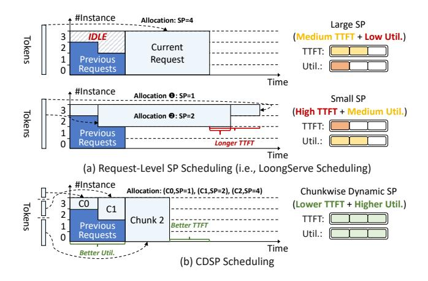
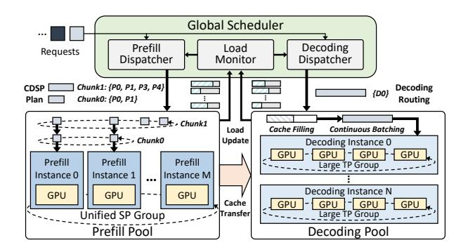

# 3 Tetris Overview

## 3.1 Chunkwise Dynamic Sequence Parallelism

As shown in Fig. [3-](#page-4-0)(a), request-level SP scheduling assigns SP uniformly to each request's all tokens. Although this approach tries to satisfy per-request resource demand, it creates imbalance across instances due to dynamic SP allocation. Such an imbalance results in instance idleness when allocating large SP sizes to reduce TTFT, as ring attention mandates simultaneous KV cache transfer across all instances. Conversely, decreasing SP size to mitigate resource idleness notably prolongs TTFT for long requests, whose prefill latency fluctuates by tens of seconds when shrinking SP sizes.

To fulfill requests' SP requirements without compromising resource utilization, we propose chunkwise dynamic sequence parallelism (CDSP), a more fine-grained

> **[图片提取文字 (无描述)]:**
> #Instance Allocation: SP=4 Large SP IDLE (Medium TTFT + Low Util.) Tokens Current TTFT: Previous Request Util.: Requests Time #Instance Allocation 0: SP=1 Small SP (High TTFT + Medium Util.) Tokens Allocation ⊕: SP=2 TTFT: Previous Util.: Requests Longer TTFT Time (a) Request-Level SP Scheduling (i.e., LoongServe Scheduling) #Instance Allocation: (C0,SP=1), (C1,SP=2), (C2,SP=4) Chunkwise Dynamic SP co(Lower TTFT + Higher Util.) Tokens C1 TTFT: Chunk 2 Previous Better TTFT Util.: Requests Time (b) CDSP Scheduling

**Figure 3.** Basic concept of Chunkwise Dynamic SP (CDSP).

parallelism strategy. As depicted in Fig. 3-(b), rather than allocating a fixed SP size to the entire request, CDSP subdivides each request into multiple chunks and selects appropriate SP sizes for them. Specifically, CDSP applies larger SP to latter chunks to accommodate the computation demands of long requests. In contrast, preceding segments are scheduled with smaller SP sizes, allowing partial execution to start earlier by leveraging idle resource fragments. By progressively expanding the SP size across chunks — akin to filling the gaps in the tetris game — CDSP maximizes resource utilization and further reduces TTFT beyond request-level scheduling.

## 3.2 Serving System Overview

Design Goal: Tetris aims to enable fine-grained dynamic SP mechanism, while remaining fully compatible with SOTA optimization techniques. The cluster must satisfy distinct characteristics between prefill and decoding (LoongServe Limitation (1)). The scheduler must regulate SP allocation based on real-time system loads (LoongServe Limitation (2)), and the inference engine must fully optimize CDSP prefill computation (LoongServe Limitation (3)).

**System Architecture**: To this end, Tetris is built on prefill-decoding disaggregation, as shown in Fig. 4. In contrast to existing designs where all prefill instances operate independently, Tetris connects them into an identical SP group and assigns each a smaller TP size (e.g., TP=1), maximizing resource allocation flexibility. Each decoding instance adopts a larger TP size (e.g., TP=4 in Fig. 4) to fully optimize TBT. For each request, the prefill dispatcher generates CDSP execution plan based on real-time load conditions. The designated prefill instances conduct CDSP prefill and stream KV cache to the target decoding instance, which adds the request to continuous batching for output generation.

Although prefill-decoding disaggregation can alleviate <u>LoongServe Limitation (1)</u>, existing designs are built solely on tensor/pipeline parallelism (TP/PP), lacking support for dynamic SP in disaggregation cluster [31, 34,

> **[图片提取文字 (无描述)]:**
> Global Scheduler Decoding Prefill Load Requests Dispatcher Monitor Dispatcher Chunk1: {P0, P1, P3, P4} CDSP Decoding {D0} Chunk0: {P0, P1} Plan Routing Chunk1 Cache Filling Continuous Batching Load ChunkO Update Decoding Instance 0 GPU GPU Prefill Prefill Prefill Large TP Group Instance 0 Instance 1 Instance M Decoding Instance N GPU GPU **GPU** Cache GPU GPU Unified SP Group Transfer Large TP Group Prefill Pool Decoding Pool

Figure 4. System Architecture of Tetris.

46]. To fully utilize CDSP to solve *LoongServe Limitation* (2),(3), Tetris must address the following challenges:

Challenge #1: Inference Engine Adaptation: (1) Attention Computation. As shown in Fig. 3-(b), SP size expansion results in uneven KV cache distribution, creating inter-instance load imbalance. Therefore, we need to tailor attention computation for CDSP to maximize its resource utilization. (2) Cache Transfer Management. Unlike existing non-SP disaggregated clusters, where each request's full KV cache is located on a single prefill instance, CDSP distributes each chunk's KV cache across multiple prefill instances. We need to coordinate cache transfer to ensure timely delivery of each request's all cache chunks to the decoding instance.

Challenge #2: Scheduler Customization: (1) For CDSP Execution Plan, we need to determine the chunk number, each chunk's token number, and the corresponding prefill instance allocation. They define a vast scheduling space given the large context window and numerous prefill instances. An efficient CDSP plan solver is vital to meet real-time requirements. (2) For SP Size Regulation, efficiently integrating real-time load impacts into the CDSP plan solver is also vital to achieve optimal global TTFT distribution.

The following sections will describe Tetris's solutions.

