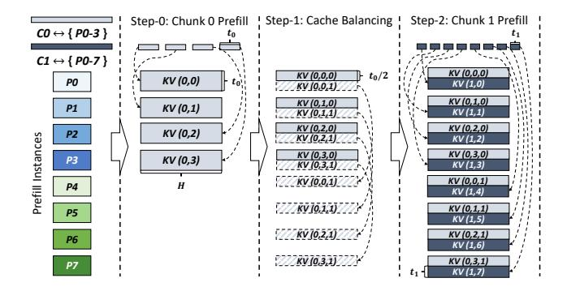
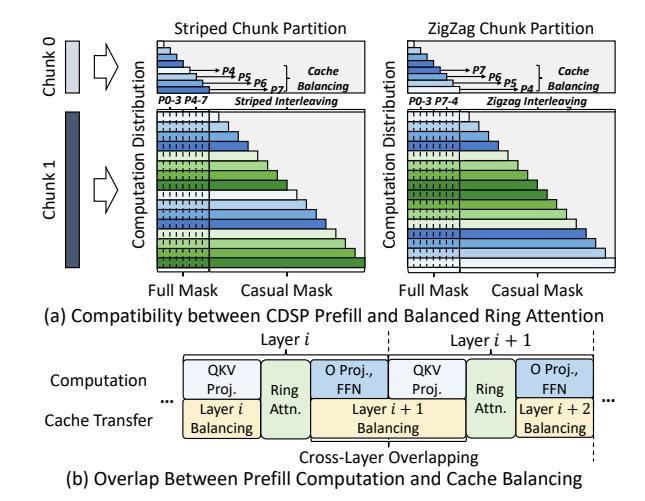
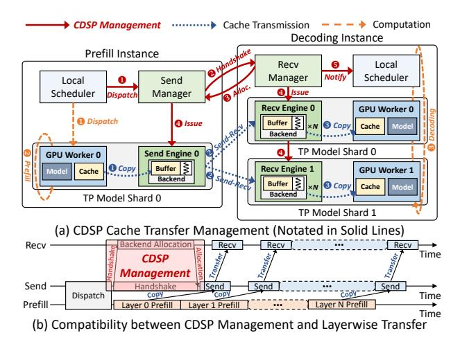

# 4 Tetris Inference Engine

#### <span id="page-4-2"></span>4.1 CDSP Prefill Computation

Overall Procedure: As shown in Fig. 5, during CDSP computation, each chunk's tokens are evenly interleaved across the assigned prefill instance group. All instance groups compute sequentially following the chunk order. Before computing each chunk, the KV cache of all preceding chunks is evenly re-distributed to current chunk's instance group to balance the attention workload distribution. To reduce cache balancing overhead, we constrain that each chunk's instance group must include all instances involved in preceding chunks, which is ensured by the CDSP scheduler discussed later. In Fig. 5's two-chunk example, chunk-0 is first executed on instances *P0-P3*. Before chunk-1's execution, *P0-P3* forward the second half of their local KV cache to *P4-P7*, equalizing the cache load across chunk-1's instances.

<span id="page-5-0"></span>> **[图片提取文字 (无描述)]:**
> Step-0: Chunk 0 Prefill ! Step-1: Cache Balancing ! Step-2: Chunk 1 Prefill CO ↔ { PO-3 } C1 ↔ { P0-7 } KV (0,0,0)  $t_0/2$ KV (0,0,0) KV (0,0) PO to. KV (1,0) KV (0,0,1) KV (0,1,0) KV (0,1,0) KV (0,1) P1 KV (0,1,1) KV (1,1) KV (0,2,0) KV (0,2,0) KV (0,2) P2 Prefill Instances KV (0,2,1) KV (1,2) KV (0,3,0) KV (0,3,0) KV (0,3) **P3** KV (1,3) KV (0,0,1) KV (0,0,1) P4 KV (1,4) KV (0,1,1) KV (0,1,1) P5 KV (1,5) KV (0,2,1) KV (0,2,1) P6 KV (1,6) KV (0,3,1) KV (0,3,1) P7 KV (1,7)


Figure 5. CDSP's Prefill Computation Procedure.

Cache-Balancing Simplification: Note that each chunk computes attention with all historical tokens. Therefore, as shown in Fig. 6-(a), balanced attention computation with preceding chunks only requires to split historical KV cache evenly on current instance group, regardless of each chunk's token interleaving strategy. Accordingly, we can still adopt striped/zigzag attention to achieve intra-chunk attention load balance, simplifying CDSP prefill's implementation. Cache-Balancing Latency Overlap: Cache balancing introduces additional KV cache transfer. To eliminate its impact on

Cache-Balancing Latency Overlap: Cache balancing introduces additional KV cache transfer. To eliminate its impact on TTFT, we propose a layer-wise overlap mechanism between prefill computation and cache balancing. The key insight is that fully connected layers perform computation independently of the KV cache. As shown in Fig. 6-(b), once the ring attention in current layer completes, its inter-instance communicator can be reused to perform cache balancing for the next layer. This cross-layer overlap efficiently hides cache balancing latency, ensuring to fully unveil CDSP's benefits.

## 4.2 CDSP Cache Transfer Management

Challenge: Backend Starvation. For each request, decoding instance begins computation only after receiving its full KV cache from all prefill instance groups. Since most transfer backends require GPU buffers [21, 26, 34], long-context serving, producing huge intermediate tensors, may leave insufficient memory to reserve a dedicated transfer backend for each prefill instance. Under this case, some instances may never obtain any backend without proper management, preventing the decoding instance from receiving the full KV cache. This starvation not only delays decoding execution, but also causes partially filled cache to occupy decoding instances for extended periods, reducing memory utilization. Backend Allocation Handshake: To address this issue, we introduce a handshake mechanism into prefill-decoding cache transfer procedure. As shown in Fig. 7-(a), prefill instance's send manager initiates a handshake before issuing KV cache transfer (❷). If the receive engine is either bufferfree [6] or has sufficient backends, the handshake merely signals the receive manager to launch transfer using current prefill instance's dedicated backend. Otherwise, requests are

<span id="page-5-1"></span>> **[图片提取文字 (无描述)]:**
> Striped Chunk Partition ZigZag Chunk Partition Chunk 0 Computation Distribution P4 P5 P6 Computation Distribution Cache Cache Balancina Balancing PO-3 P4-7 Striped Interleaving PO-3 P7-4 Zigzag Interleaving Chunk 1 Full Mask Casual Mask Full Mask Casual Mask (a) Compatibility between CDSP Prefill and Balanced Ring Attention Layer i Layer i+1O Proj., QKV O Proj., QKV Computation Proj. Ring FFN Proj. Ring FFN Layer i+1Attn. Layer i Attn. Layer i + 2Cache Transfer Balancing Balancing Balancing Cross-Layer Overlapping (b) Overlap Between Prefill Computation and Cache Balancing


**Figure 6.** Optimizations for CDSP Prefill Computation.

<span id="page-5-2"></span>> **[图片提取文字 (无描述)]:**
> **CDSP Management** Cache Transmission Computation Decoding Instance Prefill Instance @ Handsh Recv Local Scheduler Notify Manager Send Local A Issue Scheduler Manager Dispatch Recv Engine 0 **GPU Worker 0** Dispatch Buffer | ( Issue Copy Copy Cache Model Backend TP Model Shard 0 Send Engine 0 **GPU Worker 0 О** Сору Buffer **Recv Engine 1 GPU Worker 1** Cache Made Send-Rec Backend Buffer | **❸** Copy Cache Backend TP Model Shard 0 TP Model Shard 1 (a) CDSP Cache Transfer Management (Notated in Solid Lines) Recv Backend Allocation Recv Recv Recv Time CDSP Management Send Send Send Handshake Send COPY Dispatch Time CODY Prefill Laver N Prefill layer O Prefill Time (b) Compatibility between CDSP Management and Layerwise Transfer


Figure 7. Handshake-based CDSP Transfer Management.

sorted by the first handshake timestamp. The receive manager sequentially reserves backends for each request until all its chunks are transferred, preventing the starvation from interrupting latter chunks' transmission.

Overall Transfer Procedure: As shown in Fig. 7-(a), each request chunk is first dispatched to both the GPU workers (1) and the send manager (1). While GPU workers are computing (2), the send manager issues a handshake to the target receive manager for backend allocation (2). Once the allocation is confirmed (3), both the send and receive managers issue cache transfer (3). Then, send and receive engines use high-performance communication libraries [21, 26, 34] for transfer execution (1-3). After receiving all chunks' KV cache by repeating the above procedure, the receive manager will notify the local scheduler (6) to insert the request into the decoding batch using iteration-level scheduling (3).

**Handshake Latency Overlap:** As shown in Fig. 7-(b), since prefill computation is independent with handshake, the whole

## Algorithm 1: CDSP Scheduling Algorithm

```
1 Input: unallocated prompt length L, previous chunk allocation A,
    SP size candidates S, prefill instance pool P.
2 Step 0: Initial (single-chunk) plan generation
sinstance\_group \leftarrow SingleChunkSchedule(L, A, S, P)
4 opt allocation \leftarrow A.append((L, instance group))
5 Step 1: Chunk plan exploration
6 S_{CDSP} \leftarrow \{s_i | s_i \in S, s_i \leq | instance\_group | \}
7 SizePair \leftarrow \{(s_i, s_j) | s_i \in S_{CDSP}, s_j \in S_{CDSP}, s_i < s_j\}
8 for each (s_{current}, s_{next}) \in SizePair do
        // solve for current chunk's plan
        current\_chunk\_plan \leftarrow
10
         GetChunkPlan(L, A, s_{current}, s_{next}, instance\_group)
        if Illegal(current_chunk_plan) then
11
         continue
12
        // generate full chunk plan recursively
13
        L' \leftarrow L - current\_chunk\_plan.chunk\_length
        A' \leftarrow A.append(current\_chunk\_plan)
15
        S' \leftarrow \{s_i | s_i \in S_{CDSP}, s_i \ge s_{next}\}
16
        P' \leftarrow instance\_group.update(current\_chunk\_plan)
17
        chunk allocation \leftarrow CDSPSchedule(L', A', S', P')
18
        // compare and update the best allocation record
        if opt_allocation.TTFT > chunk_allocation.TTFT then
20
         | opt_allocation \leftarrow chunk_allocation
21
22 return opt_allocation
```

handshake procedure (2-8) in Fig. 7-(a)) can be seamlessly integrated into layer-wise cache transmission [31, 34]. In this way, we can overlap the handshake with prefill computation to efficiently hide its latency overhead.

## 5 Tetris Scheduling Algorithm

## 5.1 CDSP Prefill Scheduling

**Prefill Latency Model:** Given LLMs' huge context windows, exhaustive chunk size searching leads to prohibitive scheduling complexity. Therefore, we follow previous works' practice [42, 46] and adopt a latency model based on floating point operations (FLOPs) to guide scheduling. For a request chunk *R*, denote its historical token number as *C*, and the token number within it as *L*. The prefill latency under the SP size of *s* can be estimated as:

<span id="page-6-2"></span>
$$T_s(R) = a_s + b_s \cdot L + c_s \cdot (C \cdot L) + d_s \cdot L^2, \tag{1}$$

where  $a_s$ ,  $b_s$ ,  $c_s$ ,  $d_s$  are coefficients for the overhead of constant factors, fully-connected layers, attention with historical tokens, and attention within current tokens, respectively. The latency model of each target SP size can be obtained from least-squares fitting by collecting latency data across various (C, L) pairs. This fitting process can be performed offline, and the performance models can be reused during subsequent online serving until the GPU/model type changes.

**Overall Scheduling Workflow:** As summarized in Algorithm 1, CDSP's scheduling employs a recursive approach to search for the optimal chunking strategy. It takes four inputs: (1) Unallocated token number L. (2) Previous chunk allocation  $A = [a_0, ..., a_{l-1}]$ , where  $a_i$  records chunk i's token number and prefill instance group. For a new request (i.e.,

### **Algorithm 2:** Single-chunk Scheduling Algorithm

```
1 Input: unallocated prompt length L, previous chunk allocation A,
     SP size candidates S, prefill instance pool P.
   (opt\_TTFT, opt\_group) \leftarrow (INF, \emptyset)
_{\rm 3} // get previous chunks' token number and instance allocation
4 C \leftarrow A.get\_total\_chunk\_length()
sinitial\_group \leftarrow A.get\_all\_instances()
6 for each s \in S do
        // extend previous allocation to generate new instance group
        instance\_group \leftarrow GetGroup(P, initial\_group, s)
        T_{queue} \leftarrow \max_{T} \{T_i | p_i \in instance\_group\}
        T_{prefill} \leftarrow PerformanceModel(s, C, L)
        TTFT \leftarrow T_{queue} + T_{prefill}
11
        // ensure sufficient performance gains to avoid over-expansion
12
13
        if TTFT < opt\_TTFT \times (1 - improvement\_rate) then
         (opt\_TTFT, opt\_group) \leftarrow (TTFT, instance\_group)
15 return opt_group
```

the first invocation of Algorithm 1), A is initialized as an empty list. (3) The candidate set of SP sizes  $S = \{s_0, ..., s_{m-1}\}$ , where each  $s_j$  denotes an available SP size for allocation. (4) The prefill instance pool  $P = \{p_0, ..., p_{n-1}\}$ , where each  $p_k$  maintains the queuing time  $T_k$  when the remaining tokens are scheduled for execution.

Given these inputs, the algorithm first treats all remaining tokens as a single chunk to conduct initial instance group allocation (details will be discussed later), which determines the max SP size according to real-time request pressure (line **3-4**). Then, the algorithm further investigates the gains from CDSP chunking. It enumerates all valid SP size pairs for the current and subsequent chunks, according to the instance number of the initial allocation (line 6-7). For each pair, the algorithm first solves current chunk's execution plan based on scurrent's corresponding instance subgroup (details will be discussed later) (line 10). It then filters out illegal plans, such as those with negative chunk sizes or chunk lengths that are too short to yield benefits under *s<sub>current</sub>* (**line 11-12**). If *current\_chunk\_plan* is valid, the algorithm modifies input states and recursively solves for the complete chunk allocation (line 14-18). To avoid doublecounting historical queuing delays, instance\_group's queuing latency must be updated before each recursive call. Assume current\_chunk\_plan's prefill computation latency and max instance queuing latency are  $T_{prefill}$  and  $T_{queue}$ , respectively. For each instance  $p_i \in instance\_group$ , its queuing latency  $T_i$  is updated as follows:

$$T_i \leftarrow max\{0, T_i - (T_{queue} + T_{prefill})\} \tag{2}$$

When  $S_{CDSP}$  contains only one candidate, the recursive search terminates and directly returns the single-chunk plan. After recursive searching returns, the algorithm updates the best allocation record based on the TTFT estimation (**line 20-21**). Once all SP pairs in SizePair are explored, the algorithm returns the optimal allocation (**line 22**).

**Single-chunk Scheduling (line 3 in Algorithm 1):** As listed in Algorithm 2, for each SP size *s*, it constructs instance group by extending the instance set allocated to previous chunks (**line 8**), reducing cache balancing overhead as discussed in Sec. 4.1. It then estimates the TTFT by combining the prefill latency predicted by Eq. (1) with the max instance queueing latency (**line 9-11**), which is used to update the best allocation (**line 13-14**). Specifically, to avoid excessive SP expansion, the algorithm increases SP size only when the TTFT gain exceeds a certain threshold, which is dynamically adjusted based on real-time request arrival pressure.

The **instance group extension** (i.e., *GetGroup* in line 8) proceeds as follows: (1) When initial\_group is empty (i.e., first-chunk allocation), the algorithm first checks whether *s* can be satisfied within a single node. If so, it selects the node with the minimal *s*-th shortest queuing latency and takes its *s* shortest-queued instances to avoid cross-node fragmentation. Otherwise, if *s* spans *k* full nodes, the algorithm selects the top-*k* nodes with the shortest queuing latency. For remaining instances, the same intra-node selection strategy is applied across the unallocated nodes. (2) When initial\_group is non-empty, the algorithm first adds instances within the nodes containing initial\_group's instances. If additional instances are still needed, the algorithm applies the same strategy as (1) to the remaining free nodes.

To select **real-time load-aware improvement rate**, we implement a simulator-based search mechanism. The key insight is that the request length distribution of long-context services remains stable over days or weeks. Therefore, we can periodically collect the length distribution and sample requests under various request arrival rates to simulate different load conditions. For each arrival rate, we can use Eq. (1) to simulate TTFT under various improvement rates, yielding the one that minimizes TTFT. This profiling can be performed offline. During online serving, the scheduler monitors the request rate within a sliding time window and dynamically updates the improvement rate by querying the pre-profiled optimal rate records.

Chunk Plan Solving (line 10 in Algorithm 1): As listed in Algorithm 3, it first allocates instance groups to  $s_{current}$  and  $s_{next}$  using the extension strategy discussed above (line 6-7). Then, the algorithm sets the current chunk's prefill latency budget as the difference between the queuing delays of  $next\_group$  and  $current\_group$  (line 9-11). For example, in the case shown in Fig. 3-(b), when solving the plan for chunk 1 with  $s_{current}$ =2 and  $s_{next}$ =4, the budget is obtained by comparing the maximum queuing latencies of instances 0-3 and 2-3. Given the latency budget and the historical token number, the performance model in Eq. (1) becomes a polynomial in the chunk size, which can be solved numerically (e.g., using Newton's method) to determine the current chunk's token number (line 13-14).

### **Algorithm 3:** Chunk Plan Solving Algorithm

```
1 Input: unallocated prompt length L, previous chunk allocation A,
     current chunk's SP size s_{current}, subsequent chunks' minimal SP
     size s_{next}, prefill instance pool P.
 2 // get previous chunks' token number and instance allocation
 3 C \leftarrow A.get\_total\_chunk\_length()
 4 initial\_group \leftarrow A.get\_all\_instances()
 5 // get current and next instance groups
 6 current\_group \leftarrow GetGroup(P, initial\_group, s_{current})
   next\_group \leftarrow GetGroup(P, current\_group, s_{next})
   // estimate chunk computation latency budget
   T_{queue}^{current} \leftarrow \max_{T_i} \{T_i | p_i \in current\_group\}
10 T_{queue}^{next} \leftarrow \max_{T_j} \{T_j | p_j \in next\_group\}
   T_{budget} \leftarrow T_{queue}^{next} - T_{queue}^{current}
   // use performance model to solve chunk size
13 L_{chunk} \leftarrow min(L, SolvePerformanceModel(T_{budget}, s_c, C))
14 return (L_{chunk}, current\_group)
```

## 5.2 Decoding Scheduling

Since decoding instances operate independently, we can reuse existing scheduling strategies [34, 36, 46]. Currently, we extend the "virtual usage" proposed by Llumnix [36] in decoding scheduler: The KV cache slots of requests with ongoing cache transfer is treated as virtual sage. During scheduling, each new request is routed to the instance with the highest freeness rate, defined as the ratio between available slots (excluding virtual usage) and the active batch size. To improve load estimation accuracy, the scheduler updates slot statistics each time a request returns its decoding output.

