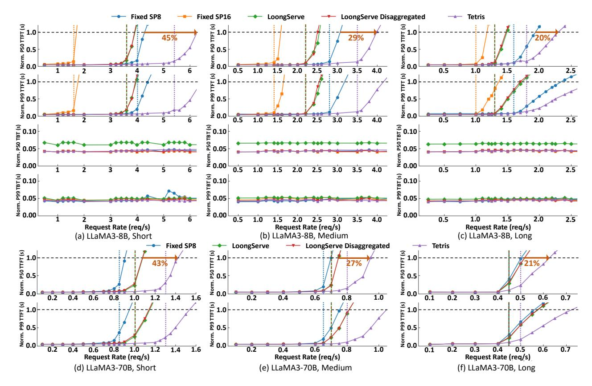
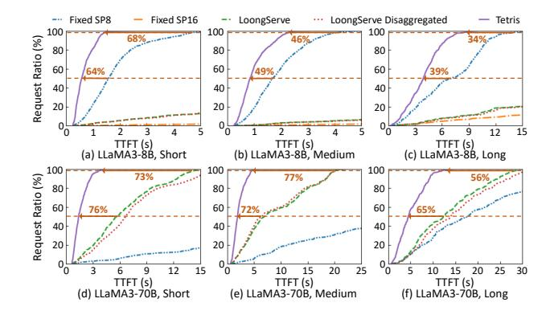
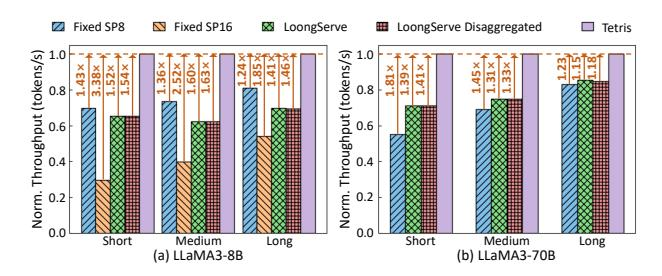
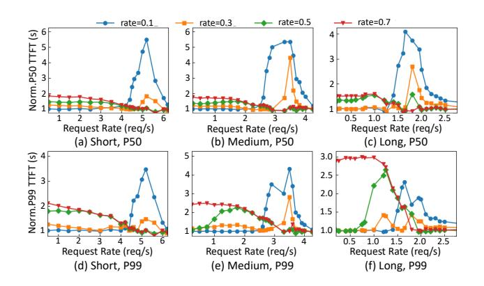
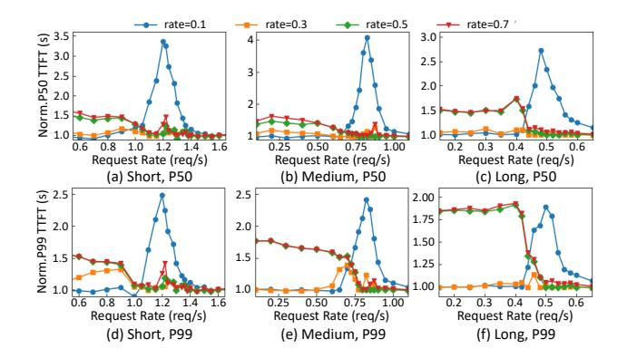
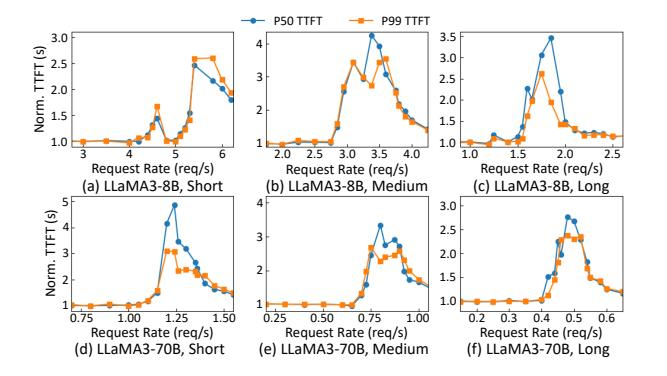
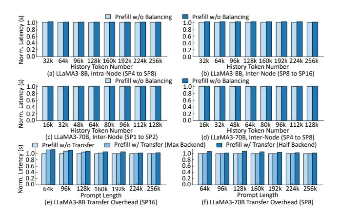

# 6 Implementation

Tetris's serving framework is implemented with ~17.5K lines of code based on C++ and Python, including an API frontend, a control plane, and an inference backend. The frontend adopts FastAPI [9] to receive requests, and provides an interface to update improvement rate when request distribution shifts. The control plane contains a global manager and each instance's local managers. The global manager is mainly implemented with Python, with the CDSP scheduler (Algorithm 1) written in C++ to eliminate scheduling latency. Ray [23] is used to communicate between the global manager and model instances. Each instance's local managers are assigned to distinct Python coroutines, which use Ray to manage computation or KV cache transmission.

The inference backend is build on Pytorch [30] and Tritondistributed [45], and reuses some components of vLLM [18]. For prefill computation, we extend Flash Attention [7] to support zigzag ring attention for historical tokens, and use NVSHMEM [25] to reduce ring communication overhead. For decoding computation, we adopt Flash Decoding [8] for attention and use CUDAGraph [33] to eliminate kernel launch overhead. CDSP cache balancing and prefill-decoding cache transfer are implemented with NCCL [26], which has supported concurrent communicator execution since

> **[图片提取文字 (无描述)]:**
> Fixed SP16 Fixed SP8 LoongServe LoongServe Disaggregated Tetris Norm. PS0 TTFT (s) 0.0 0.0 0.0 ଥି 0.5 ନ୍ଧି 0.5 N 0.0 2.0 2.5 3.5 1.5 1.5 3.0 0.5 1.0 2.0 2.5 Norm. P99 TTFT (s) 0.0 0.0 € 0.5 වී 0.5 2.5 2.0 2.5 3.0 3.5 0.5 1.0 1.5 2.0 Norm. P50 TBT (s) 0.00 0.00 **⑥** 0.10 ි 0.10 0.05 0.05 ž 0.00 1.5 2.0 2.5 3.0 3.5 0.5 1.0 1.5 2.0 2.5 Nom. P99 TBT (s) 0.00 0.05 DET (s) ਛੂੰ 0.10 0.05 ≥ 0.00 3.5 0.5 2.0 2.5 2.5 3.0 2.0 1.0 1.5 Request Rate (reg/s) Request Rate (req/s) Request Rate (reg/s) (c) LLaMA3-8B, Long (b) LLaMA3-8B, Medium (a) LLaMA3-8B, Short LoongServe Disaggregated Fixed SP8 LoongServe Tetris 0.0 Norm. P50 TTFT (s) . PSO TIT (s) . P50 ∏ F1 (s) 0.5 ğ 0.0 1.0 0.6 0.6 0.6 0.8 1.0 1.2 1.4 0.8 0.3 0.4 0.5 0.7 0.4 0.2 Norm. P99 TTFT (s) (s) 1.0 0.5 (s) 1.0 1.0 0.5 1.0 1.2 0.8 0.4 0.6 0.7 0.6 0.8 1.0 1.4 1.6 0.5 Request Rate (reg/s) Request Rate (req/s) Request Rate (req/s) (d) LLaMA3-70B, Short (e) LLaMA3-70B, Medium (f) LLaMA3-70B, Long

Figure 8. Comparison against Baselines on LLaMA3-8B/70B under Different Workloads.

v2.26 [27]. We reserve dedicated buffers and CUDA streams for cache transfer to improve bandwidth utilization.

Tetris also contains a simulator-based improvement rate profiler implemented with ~2.1K lines of Python. For each request rate, the simulator generates timestamps using a Poisson process and samples requests from the given length distribution. It then simulates prefill execution as discrete events [35] using latency models. After comparing TTFTs under different improvement rates, the simulator identifies the optimal improvement rates for the CDSP scheduler.

## 7 Evaluation

## 7.1 Experiment Setup

**Model:** To evaluate Tetris's performance at different scales, we use LLaMA3-8B and LLaMA3-70B [14] models. We employ their context-extended variants with RoPE scaling [37] to support the context window in our workloads.

**Testbed:** We conduct experiments on A100 GPU clusters. Each node contains eight NVIDIA-A100-SXM4-80GB GPUs connected with NVLINK, 128 CPU cores, 2TB host memory, and eight 200 Gbps InfiniBand NICs. We deploy LLaMA3-8B on four nodes and LLaMA3-70B on eight nodes.

**Workload:** We collect three real-world request traces with different length distributions from our production service. Specifically, the **Short** trace's sequence length ranges from

4k to 95k, with an average length of 23.6k. The **Medium** trace's sequence length ranges from 8k to 142k, with an average length of 32.8k. The **Long** trace's sequence length ranges from 16k to 190k, with an average length of 50.1k.

**Metric:** As discussed in Sec. 2.2, we adopt TTFT and TBT, the key metrics for online LLM serving, to measure each system's performance. We report both P50 and P99 values to characterize the overall latency distribution.

**Baseline:** We compare Tetris with the following baselines: **(1) LoongServe** [42]: It is the first and the only SP-enabled long-context LLM serving framework. Moreover, it reports state-of-the-art long-context LLM serving performance compared with existing best-performing non-SP serving systems [1, 18, 22, 46]. We set TP=1 for LLaMA3-8B and TP=4 for LLaMA3-70B to maximize its flexibility (i.e., ESP size) while ensuring sufficient cache slots on each instance. To avoid TTFT interference as discussed in Sec. 2.4 (*Limitation* (2)), we adopt single-request scheduling to minimize its TTFT.

(2) LoongServe Disaggregated: This is a prefill-decoding decoupled cluster similar to Tetris's architecture, while the prefill scheduler adopts LoongServe's single-request scheduling. We set the P/D ratio to 1:1 after carefully balancing TTFT and TBT. For LLaMA3-8B, the TP sizes of prefill and decoding instances are 1 (identical to LoongServe) and 8. For LLaMA3-70B, since decoding latency reports marginal

> **[图片提取文字 (无描述)]:**
> Fixed SP8 Fixed SP16 LoongServe LoongServe Disaggregated Tetris Request Ratio (%) 64% 49% 39% TTFT (s) (b) LLaMA3-8B, Medium TTFT (s) TTFT (s) (a) LLaMA3-8B, Short (c) LLaMA3-8B, Long 73% Request Ratio (%) 77% 76% 65% 'n TTFT (s) TTFT (s) TTFT (s) (d) LLaMA3-70B, Short (e) LLaMA3-70B, Medium (f) LLaMA3-70B, Long

Figure 9. TTFT Distribution Analysis.

> **[图片提取文字 (无描述)]:**
> Fixed SP8 Fixed SP16 LoongServe Disaggregated Tetris tokens/s) Throughput (tokens/s) 0.8 Throughput 0.6 0.6 0.4 0.4 Norm. 0.2 0.2 Short Short Medium Long Medium Long (a) LLaMA3-8B (b) LLaMA3-70B

Figure 10. Throughput Analysis under TTFT Constraints.

improvement beyond TP=4, we set TP size to 4 (identical to LoongServe) for all instances and focus on TTFT evaluation. (3) Fixed-SP Scheduling: It also adopts the prefill-decoding disaggregation architecture, where prefill instances are organized into multiple independent SP groups. We evaluate fixed SP sizes of 8 and 16, co-locating each group's instances on the same node where possible. Requests are scheduled to the group with the lowest queuing delay, which is estimated using Eq. (1). The P/D ratio and TP size allocation are identical to LoongServe Disaggregated.

For Tetris, we also adopt the same P/D ratio and TP size allocation as LoongServe Disaggregated for fair comparison. The SP size candidates are set to powers of two to reduce resource fragmentation. We adopt the simulator to collect optimal improvement rates (ranging from 0.05 to 0.75) for request rates incremented by 0.5 req/s. During serving, the improvement rate is updated every 30 seconds. The scheduler selects the recorded request rate closest to the observed value and applies the corresponding optimal improvement rate.

## 7.2 Comparison against Baselines

We first compare Tetris with the baselines through stress tests on the collected real workloads, where different load conditions are simulated by scaling the request arrival timestamps. Similar to LoongServe [42], we normalize all results to 25× of the light-load latency. As shown in Fig. 8, for LLaMA3-8B, fixing the SP size to 16 reports the worst TTFT due to the resource over-provision. It not only degrades short requests' TTFTs but also postpones subsequent requests' execution.

> **[图片提取文字 (无描述)]:**
> rate=0.3 rate=0.5 rate=0.7 rate=0.1 6 6 Norm.P50 TTFT (s) 0.5 1.5 2.0 Request Rate (req/s) Request Rate (req/s) Request Rate (req/s) (a) Short, P50 (b) Medium, P50 (c) Long, P50 Norm.P99 TTFT (s) 3.0 2.5 2.0 3 1.5 2 1.0 0.5 1.5 2.0 Request Rate (reg/s) Request Rate (reg/s) Request Rate (reg/s) (d) Short, P99 (e) Medium, P99 (f) Long, P99

Figure 11. Improvement Rate Analysis on LLaMA3-8B.

Shrinking the fixed SP size to 8 improves TTFT. However, it hurts long requests' TTFTs and remains inflexible for short requests, as SP-8 can still over-allocate resources for their demands. LoongServe and LoongServe Disaggregated perform between the two fixed-SP configs. Although they can mitigate TTFT degradation for short requests, excessive SP expansion still delays request execution and hurts overall TTFT. Besides, although LoongServe exposes all instances to the prefill scheduler via ESP, it must reserve dedicated instances for decoding batches, resulting in marginal performance gains over LoongServe Disaggregated. Compared with the best-performing baseline (i.e., Fixed SP 8), Tetris can increase the max load by 20%-45%, owing to its fine-grained SP adjustment and prudent control of SP expansion. As to TBT, although LoongServe reports comparable P99 latency, its P50 latency is 55%-67% higher than the large-TP configuration enabled by the disaggregated architecture.

For LLaMA3-70B, since prefill adopts TP-4 and decoding reports marginal TBT gains from TP-4 to TP-8, we mainly compare the TTFT results. LoongServe (Disaggregated) can outperform Fixed SP8, as SP-8 is already an over-provision for short requests under TP-4. Compared with these baselines, Tetris enhances the max load by 21%-43%. CDSP remains effective as model and system scales increase.

## 7.3 Performance Analysis and Ablation Study

TTFT Distribution Analysis: To analyze Tetris's TTFT benefits, we compare the cumulative TTFT distributions under the highest request rate where the best-performing baseline maintains low latency to preserve user experience. Each system's critical request rates are marked by vertical dashed lines in Fig. 8. As Fig. 9 shows, Tetris achieves 1.64-2.78×/2.86-4.17× lower P50 TTFT on LLaMA3-8B/70B. As to P99 TTFT, it yields 1.52-3.13×/2.27-4.35× lower values, respectively. Tetris can effectively enhance the serving quality compared with existing SOTA systems.

**Throughput Analysis:** To assess Tetris's resource efficiency, we then compare all systems' throughput under their critical request rates. As shown in Fig. 10, Tetris improves the

> **[图片提取文字 (无描述)]:**
> rate=0.5 rate=0.1 rate=0.3 rate=0.7 <u>چ</u> 3.5 3.0 Norm.P50 T1F1 2.5 2.0 1.5 1.0 2.5 2.0 2.0 1.5 0.75 0.6 0.50 1.6 0.25 1.00 Request Rate (req/s) Request Rate (reg/s) Request Rate (reg/s) (a) Short, P50 (b) Medium, P50 (c) Long, P50 2.5 2.00 Norm.P99 TTFT 1.75 2.0 2.0 1.50 1.5 1.5 1.25 1.00 1.0 1.0 0.25 0.50 0.75 1.00 0.2 0.3 0.4 0.5 Request Rate (req/s) Request Rate (req/s) Request Rate (req/s) (d) Short, P99 (e) Medium, P99 (f) Long, P99

Figure 12. Improvement Rate Analysis on LLaMA3-70B.

> **[图片提取文字 (无描述)]:**
> P99 TTFT P50 TTFT 3.0 3.5 Norm. TTFT (s) 3.0 2.5 2.5 2.0 2.0 1.5 1.5 1.0 1.0 6 2.0 2.5 3.0 3.5 4.0 1.0 1.5 2.0 2.5 Request Rate (reg/s) Request Rate (reg/s) Request Rate (reg/s) (a) LLaMA3-8B, Short (b) LLaMA3-8B, Medium (c) LLaMA3-8B, Long 5 3.0 Norm. TTFT (s) 2.5 2.0 1.5 1.0 0.75 1.25 1.50 0.25 0.50 0.75 1.00 0.3 0.5 0.6 1.00 0.2 0.4 Request Rate (req/s) Request Rate (reg/s) Request Rate (req/s) (d) LLaMA3-70B, Short (e) LLaMA3-70B, Medium (f) LLaMA3-70B, Long

**Figure 13.** TTFT Slowdown under Single-Chunk Scheduling.

throughput by 1.24-3.38×/1.15-1.81× for LLaMA3-8B/70B, while maintaining low latency for user experience. The fine-grained and moderate SP allocation in Tetris can better adapt to varying request lengths, enhancing resource utilization. **Improvement Rate Analysis:** To analyze how improvement rate preferences vary with loads, we compare Tetris's TTFT under different fixed rates, which span the range used in rate exploration. All results are normalized to the TTFT under dynamic rate adjustment.

As shown in Fig. 11-12, under low request rates, TTFT is dominated by prefill latency. Therefore, enforcing a smaller improvement rate (e.g., 0.1, 0.3) helps allocate larger SP sizes, reducing computation time and improving overall TTFT. As request load increases, queuing delay becomes a larger contributor to TTFT. Increasing the improvement rate (e.g., 0.5, 0.7) mitigates excessive SP expansion, enabling earlier execution of later requests and reducing queuing-driven TTFT. When the system is highly saturated, queuing delay constitutes the majority of TTFT, rendering it less sensitive to rate variation. Compared with fixed-rate settings, our dynamic rate adjustment can select near-optimal rates across varying load conditions, enabling CDSP to effectively optimize TTFT. **Chunking Analysis:** To quantify the benefits of CDSP chunking, we compare CDSP scheduling with single-chunk scheduling (i.e., skipping line 5-21 in Algorithm 1). As shown

> **[图片提取文字 (无描述)]:**
> Prefill w/o Balancing Prefill w/o Balancing Norm. Latency (s) 1.0 0.8 0.8 0.6 0.6 0.4 0.4 0.2 0.2 0.0 0.0 96k 128k 160k 192k 224k 256k 64k 96k 128k 160k 192k 224k 256k History Token Number History Token Number (a) LLaMA3-8B, Intra-Node (SP4 to SP8) (b) LLaMA3-8B, Inter-Node (SP8 to SP16) Prefill w/o Balancing Prefill w/o Balancing Norm. Latency (s) 1.01 1.0 0.8 0.6 0.6 0.4 0.4 0.2 0.2 0.0 32k 48k 64k 80k 96k 112k 128k 32k 48k 64k 80k 96k 112k 128k History Token Number History Token Number (c) LLaMA3-70B, Inter-Node (SP1 to SP2) (d) LLaMA3-70B, Inter-Node (SP4 to SP8) Prefill w/ Transfer (Max Backend) Prefill w/ Transfer (Half Backend) Prefill w/o Transfer Norm. Latency (s) 1.0 1.0 0.8 0.8 0.6 0.6 0.4 0.4 0.2 0.0 128k 160k 192k 224k 256k 128k 160k 192k 224k 256k 64k 64k Prompt Length Prompt Length (e) LLaMA3-8B Transfer Overhead (SP16) (f) LLaMA3-70B Transfer Overhead (SP8)

Figure 14. Cache Transfer Overhead Analysis.

**Table 2.** Scheduler Overhead under Different SP Sizes.

| Max SP Size                                                                       | 8 | 16 | 32 | 64 | 128 |  |
|-----------------------------------------------------------------------------------|---|----|----|----|-----|--|
| Avg./Max Latency (us)   22.8/52.5   25.8/86.8   22.9/53.4   24.9/45.1   30.6/73.7 |   |    |    |    |     |  |

in Fig. 13, single-chunk scheduling incurs up to 2.33-4.17×/2.71-4.77× higher P50 TTFT on LLaMA3-8B/70B. For P99 TTFT, it yields 2.64-3.58×/2.43-3.23× higher values, respectively. Under light loads, each request's minimal queuing delay limits CDSP's search space and makes single-chunk plan efficient enough. As the load increases, queuing latency becomes more pronounced, and the resource fragmentation intensifies. Therefore, CDSP's fine-grained SP allocation can significantly improve resource efficiency and reduce TTFT. When the system is highly saturated, similar to the improvement rate, accumulated queuing delays reduce the system's sensitivity to chunking, leading to diminishing TTFT gains.

#### 7.4 Overhead Analysis

CDSP Cache Balancing: To evaluate the overhead under different length ratios, we set current chunk's token number to 128k/64k for LLaMA3-8B/70B, and vary the historical token number from 25% to 2× of it. For each setting, we test both intra-node and inter-node overheads. As shown in Fig. 14-(a)~(d), CDSP balancing only incurs up to 1.8% extra overhead, proving the efficiency of the overlap strategy.

**CDSP Handshake:** To assess the multi-instance cache transfer overhead, we first test under the largest SP sizes with max backend allocation. Since the capacity is sufficient under our settings, each prefill instance can be assigned a dedicated backend. As shown in Fig. 14-(e)~(f), cache transfer incurs 0.6%-11.8% (average 2.1%) overhead. We then halve the backend number to conduct stress tests under limited capacity, which results in only 1.5%-5.4% (average 3.8%) additional RPC overhead. The handshake-based management mechanism can efficiently utilize buffer-backed transfer backends.

**CDSP Scheduling:** To evaluate the efficiency of CDSP prefill scheduling, we measure its execution latency under different

SP sizes by randomly sampling request length and instance queuing latency. Each SP size is tested 1000 times. As listed in Table [2,](#page-10-3) even when SP=128, the scheduling latency remains ≤86.8us, proving Algorithm [1'](#page-6-0)s efficiency in meeting the real-time requirements of online serving.

