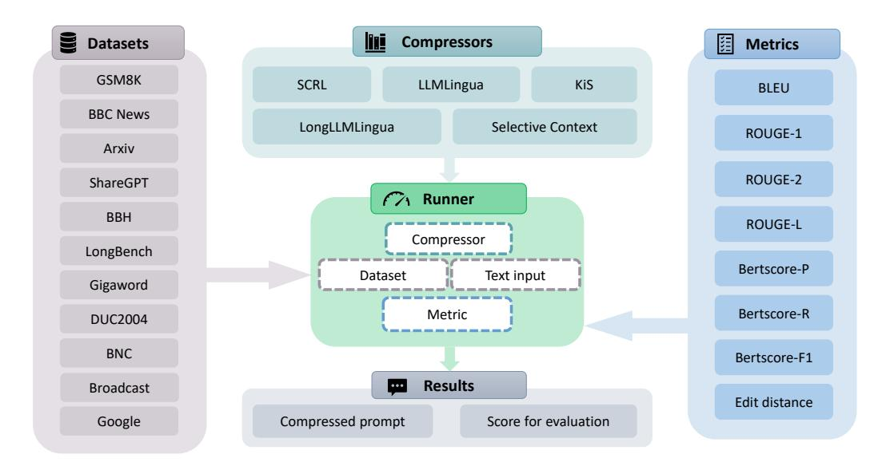

# PCToolkit: A Unified Plug-and-Play Prompt Compression Toolkit of Large Language Models

Jinyi Li1,3 , Yihuai Lan1 , Lei Wang2 , Hao Wang1∗

1The Hong Kong University of Science and Technology (Guangzhou) 2Singapore Management University 3South China University of Technology

{jinyili, haowang}@hkust-gz.edu.cn

Open-source repository: <https://github.com/3DAgentWorld/Toolkit-for-Prompt-Compression> Supplementary video: [https://youtu.be/\\_KarBVRmpT0](https://youtu.be/_KarBVRmpT0)

## Abstract

Prompt compression is an innovative method for efficiently condensing input prompts while preserving essential information. To facilitate quick-start services, user-friendly interfaces, and compatibility with common datasets and metrics, we present the Prompt Compression Toolkit (PCToolkit). This toolkit is a unified plug-and-play solution for compressing prompts in Large Language Models (LLMs), featuring cutting-edge prompt compressors, diverse datasets, and metrics for comprehensive performance evaluation. PCToolkit boasts a modular design, allowing for easy integration of new datasets and metrics through portable and user-friendly interfaces. In this paper, we outline the key components and functionalities of PCToolkit. We conducted evaluations of the compressors within PCToolkit across various natural language tasks, including reconstruction, summarization, mathematical problemsolving, question answering, few-shot learning, synthetic tasks, code completion, boolean expressions, multiple choice questions, and lies recognition.

## 1 Introduction

Given the performance limitations and computational overhead of Large Language Models (LLMs) [\(Wang et al.,](#page-8-0) [2024\)](#page-8-0), how to effectively apply LLMs to tasks involving lengthy textual inputs is a persistent challenge. Various viable solutions have emerged to address this issue, encompassing techniques such as length extrapolation [\(Chen et al.,](#page-6-0) [2021;](#page-6-0) [Shaw et al.,](#page-7-0) [2018\)](#page-7-0), attention approximation [\(Winata et al.,](#page-8-1) [2019;](#page-8-1) [Wang et al.,](#page-8-2) [2020\)](#page-8-2), attentionfree transformers [\(Gu et al.,](#page-7-1) [2021;](#page-7-1) [Orvieto et al.,](#page-7-2) [2023\)](#page-7-2), model compression [\(Lee et al.,](#page-7-3) [2023;](#page-7-3) [Ma](#page-7-4) [et al.,](#page-7-4) [2023\)](#page-7-4), and hardware-aware transformers [\(Dao et al.,](#page-6-1) [2022;](#page-6-1) [Liu and Abbeel,](#page-7-5) [2023\)](#page-7-5).

Prompt compression technology, a subset of length extrapolation methods, presents a strategic

solution to tackle this challenge by condensing intricate textual inputs into succinct prompts that encapsulate crucial information. This approach enables LLMs to function more efficiently within resource constraints, enhancing their performance [\(Wang](#page-8-0) [et al.,](#page-8-0) [2024\)](#page-8-0). Moreover, by reducing the reliance on extensive API calls, prompt compression not only improves the cost-effectiveness of leveraging LLMs but also streamlines the computational processes involved in language understanding tasks. When compared to alternative strategies, prompt compression offers intuitive and adaptable techniques for addressing diverse scenarios [\(Naveed](#page-7-6) [et al.,](#page-7-6) [2023;](#page-7-6) [Zhao et al.,](#page-8-3) [2023;](#page-8-3) [Wan et al.,](#page-8-4) [2023\)](#page-8-4).

However, the deployment of prompt compression methods varies between different approaches. There is not yet a general toolkit that can invoke compressors of multiple types. Moreover, datasets and metrics are also essential for evaluating the performance of each compression method. Thus, with the aim of providing plug-and-play services, easy-customized interfaces and supporting common datasets and metrics, we propose Prompt Compression Toolkit (PCToolkit), a unified plug-andplay toolkit for Prompt Compression of LLMs, making accessible and portable prompt compression methods to a wider audience. Our plug-andplay design enables users to deploy and use the toolkit without any further model trainings. Meanwhile, users are also able to plug in their customtrained models in PCToolkit.

Specifically, Figure [1](#page-1-0) illustrates the comprehensive architecture of PCToolkit. Key features of PCToolkit include:

(i) State-of-the-art and reproducible methods. Encompassing a wide array of mainstream compression techniques, PCToolkit offers a unified interface for various compression methods (compressors). Notably, PCToolkit incorporates a total of five distinct compressors, namely Selective Context [\(Li et al.,](#page-7-7) [2023\)](#page-7-7), LLMLingua [\(Jiang et al.,](#page-7-8) [2023a\)](#page-7-8),

∗Corresponding author.

> **[图片提取文字 (无描述)]:**
> 麵 Compressors **Datasets** Metrics GSM8K SCRL KiS LLMLingua BLEU **BBC News** LongLLMLingua Selective Context ROUGE-1 Arxiv **ROUGE-2** ShareGPT ( Runner BBH ROUGE-L Compressor LongBench Bertscore-P Text input Dataset Gigaword Bertscore-R Metric DUC2004 BNC Bertscore-F1 Results Broadcast Edit distance Compressed prompt Score for evaluation Google

Figure 1: Architecture of PCToolkit. The *compressors* module encompasses prompt compression methods that can be accessed through a unified interface with customizable parameters. The *datasets* module includes 10 diverse datasets detailed in Table [2.](#page-3-0) The *metrics* module comprises four primary metrics utilized for evaluating the performance of various compressors. The *runner* module offers a generalized interface for executing evaluations or simply retrieving the compressed prompt generated by the compressors.

LongLLMLingua [\(Jiang et al.,](#page-7-9) [2023b\)](#page-7-9), SCRL [\(Gha](#page-7-10)[landari et al.,](#page-7-10) [2022\)](#page-7-10), and KiS [\(Laban et al.,](#page-7-11) [2021\)](#page-7-11).

- (ii) User-friendly interfaces for new compressors, datasets, and metrics. Facilitating portability and ease of adaptation to different environments, the interfaces within PCToolkit are designed to be easily customizable. This flexibility makes PC-Toolkit suitable for a wide range of environments and tasks.
- (iii) Modular design. Featuring a modular structure that simplifies the transition between different methods, datasets, and metrics, PCToolkit is organized into four distinct modules: Compressor, Dataset, Metric and Runner module.

## 2 Related Works

Recent prompt-related toolkits have focused on prompt design intricacies and their influence on language model performance [\(Amatriain,](#page-6-2) [2024;](#page-6-2) [Liu](#page-7-12) [et al.,](#page-7-12) [2021\)](#page-7-12). These studies emphasize the significance of tailored prompts in guiding language models for accurate information retrieval, offering valuable insights for prompt compression methodologies. Various toolkits exist for prompt engineering and optimization, such as Promptify, ChainForge, Promptotype, and OpenPrompt.

Promptify. It is a toolkit tailored for prompt engineering, addressing NLP challenges with LLMs and facilitating the generation of diverse NLP task

prompts [\(Pal,](#page-7-13) [2022\)](#page-7-13).

ChainForge. This visual toolkit aids prompt engineering and enables on-demand hypothesis testing for text generation LLMs [\(Arawjo et al.,](#page-6-3) [2023\)](#page-6-3).

Promptotype. A platform for structured prompt engineering, facilitating the development, testing, and monitoring of customized LLM tasks[1](#page-1-1) .

OpenPrompt. This toolkit supports promptlearning with pre-trained language models (PLMs), offering efficiency, modularity, and extendibility. It allows the integration of different PLMs, task formats, and prompting modules in a unified framework [\(Ding et al.,](#page-6-4) [2022\)](#page-6-4).

Despite the availability of aforementioned toolkits, a toolkit specifically focusing on prompt compression remains absent. By amalgamating insights from existing works and incorporating state-of-theart prompt compression techniques, our toolkit aims to equip researchers, developers, and practitioners with a versatile toolset for prompt compression. This enhancement seeks to improve the performance and affordability of large language models across diverse applications.

