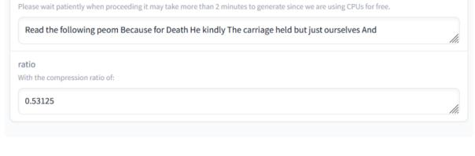

# References

- Xavier Amatriain. 2024. [Prompt design and engineer](https://api.semanticscholar.org/CorpusID:267301483)[ing: Introduction and advanced methods.](https://api.semanticscholar.org/CorpusID:267301483) *ArXiv*, abs/2401.14423.
- Ian Arawjo, Chelse Swoopes, Priyan Vaithilingam, Martin Wattenberg, and Elena L. Glassman. 2023. [Chain](https://api.semanticscholar.org/CorpusID:262044762)[forge: A visual toolkit for prompt engineering and](https://api.semanticscholar.org/CorpusID:262044762) [llm hypothesis testing.](https://api.semanticscholar.org/CorpusID:262044762) *ArXiv*, abs/2309.09128.
- Yushi Bai, Xin Lv, Jiajie Zhang, Hong Lyu, Jiankai Tang, Zhidian Huang, Zhengxiao Du, Xiao Liu, Aohan Zeng, Lei Hou, Yuxiao Dong, Jie Tang, and Juanzi Li. 2023. [Longbench: A bilingual, multitask](https://api.semanticscholar.org/CorpusID:261245264) [benchmark for long context understanding.](https://api.semanticscholar.org/CorpusID:261245264) *ArXiv*, abs/2308.14508.
- Pu-Chin Chen, Henry Tsai, Srinadh Bhojanapalli, Hyung Won Chung, Yin-Wen Chang, and Chun-Sung Ferng. 2021. [A simple and effective positional en](https://doi.org/10.18653/v1/2021.emnlp-main.236)[coding for transformers.](https://doi.org/10.18653/v1/2021.emnlp-main.236) In *Proceedings of the 2021 Conference on Empirical Methods in Natural Language Processing*, pages 2974–2988, Online and Punta Cana, Dominican Republic. Association for Computational Linguistics.
- James Clarke and Mirella Lapata. 2008. [Global infer](https://api.semanticscholar.org/CorpusID:3004447)[ence for sentence compression : an integer linear](https://api.semanticscholar.org/CorpusID:3004447) [programming approach.](https://api.semanticscholar.org/CorpusID:3004447) *J. Artif. Intell. Res.*, 31:399– 429.
- Karl Cobbe, Vineet Kosaraju, Mohammad Bavarian, Mark Chen, Heewoo Jun, Lukasz Kaiser, Matthias Plappert, Jerry Tworek, Jacob Hilton, Reiichiro Nakano, Christopher Hesse, and John Schulman. 2021. Training verifiers to solve math word problems. *arXiv preprint arXiv:2110.14168*.
- Tri Dao, Dan Fu, Stefano Ermon, Atri Rudra, and Christopher Ré. 2022. [Flashattention: Fast and](https://proceedings.neurips.cc/paper_files/paper/2022/file/67d57c32e20fd0a7a302cb81d36e40d5-Paper-Conference.pdf) [memory-efficient exact attention with io-awareness.](https://proceedings.neurips.cc/paper_files/paper/2022/file/67d57c32e20fd0a7a302cb81d36e40d5-Paper-Conference.pdf) In *Advances in Neural Information Processing Systems*, volume 35, pages 16344–16359. Curran Associates, Inc.
- Jacob Devlin, Ming-Wei Chang, Kenton Lee, and Kristina Toutanova. 2019. [Bert: Pre-training of deep](http://arxiv.org/abs/1810.04805) [bidirectional transformers for language understand](http://arxiv.org/abs/1810.04805)[ing.](http://arxiv.org/abs/1810.04805)
- Ning Ding, Shengding Hu, Weilin Zhao, Yulin Chen, Zhiyuan Liu, Haitao Zheng, and Maosong Sun. 2022. [OpenPrompt: An open-source framework for prompt](https://doi.org/10.18653/v1/2022.acl-demo.10)[learning.](https://doi.org/10.18653/v1/2022.acl-demo.10) In *Proceedings of the 60th Annual Meeting of the Association for Computational Linguistics: System Demonstrations*, pages 105–113, Dublin, Ireland. Association for Computational Linguistics.
- Katja Filippova and Yasemin Altun. 2013. [Overcom](https://aclanthology.org/D13-1155)[ing the lack of parallel data in sentence compression.](https://aclanthology.org/D13-1155) In *Proceedings of the 2013 Conference on Empirical Methods in Natural Language Processing*, pages 1481–1491, Seattle, Washington, USA. Association for Computational Linguistics.

- Demian Ghalandari, Chris Hokamp, and Georgiana Ifrim. 2022. [Efficient unsupervised sentence com](https://doi.org/10.18653/v1/2022.acl-long.90)[pression by fine-tuning transformers with reinforce](https://doi.org/10.18653/v1/2022.acl-long.90)[ment learning.](https://doi.org/10.18653/v1/2022.acl-long.90) In *Proceedings of the 60th Annual Meeting of the Association for Computational Linguistics (Volume 1: Long Papers)*, pages 1267–1280, Dublin, Ireland. Association for Computational Linguistics.
- Albert Gu, Karan Goel, and Christopher R'e. 2021. [Effi](https://api.semanticscholar.org/CorpusID:240354066)[ciently modeling long sequences with structured state](https://api.semanticscholar.org/CorpusID:240354066) [spaces.](https://api.semanticscholar.org/CorpusID:240354066) *ArXiv*, abs/2111.00396.
- Huiqiang Jiang, Qianhui Wu, Chin-Yew Lin, Yuqing Yang, and Lili Qiu. 2023a. [Llmlingua: Compressing](https://api.semanticscholar.org/CorpusID:263830701) [prompts for accelerated inference of large language](https://api.semanticscholar.org/CorpusID:263830701) [models.](https://api.semanticscholar.org/CorpusID:263830701) In *Conference on Empirical Methods in Natural Language Processing*.
- Huiqiang Jiang, Qianhui Wu, Xufang Luo, Dongsheng Li, Chin-Yew Lin, Yuqing Yang, and Lili Qiu. 2023b. [Longllmlingua: Accelerating and enhancing llms](https://api.semanticscholar.org/CorpusID:263830692) [in long context scenarios via prompt compression.](https://api.semanticscholar.org/CorpusID:263830692) *ArXiv*, abs/2310.06839.
- Philippe Laban, Tobias Schnabel, Paul Bennett, and Marti A. Hearst. 2021. [Keep it simple: Unsupervised](https://doi.org/10.18653/v1/2021.acl-long.498) [simplification of multi-paragraph text.](https://doi.org/10.18653/v1/2021.acl-long.498) In *Proceedings of the 59th Annual Meeting of the Association for Computational Linguistics and the 11th International Joint Conference on Natural Language Processing (Volume 1: Long Papers)*, pages 6365–6378, Online. Association for Computational Linguistics.
- Changhun Lee, Jungyu Jin, Taesu Kim, Hyungjun Kim, and Eunhyeok Park. 2023. Owq: Lessons learned from activation outliers for weight quantization in large language models. *arXiv preprint arXiv:2306.02272*.
- Yucheng Li, Bo Dong, Chenghua Lin, and Frank Guerin. 2023. [Compressing context to enhance inference ef](https://api.semanticscholar.org/CorpusID:263830231)[ficiency of large language models.](https://api.semanticscholar.org/CorpusID:263830231) In *Conference on Empirical Methods in Natural Language Processing*.
- Chin-Yew Lin. 2004. [Rouge: A package for automatic](https://api.semanticscholar.org/CorpusID:964287) [evaluation of summaries.](https://api.semanticscholar.org/CorpusID:964287) In *Annual Meeting of the Association for Computational Linguistics*.
- Hao Liu and Pieter Abbeel. 2023. [Blockwise paral](https://proceedings.neurips.cc/paper_files/paper/2023/file/1bfd87d2d92f0556819467dc08034f76-Paper-Conference.pdf)[lel transformers for large context models.](https://proceedings.neurips.cc/paper_files/paper/2023/file/1bfd87d2d92f0556819467dc08034f76-Paper-Conference.pdf) In *Advances in Neural Information Processing Systems*, volume 36, pages 8828–8844. Curran Associates, Inc.
- Nelson F. Liu, Kevin Lin, John Hewitt, Ashwin Paranjape, Michele Bevilacqua, Fabio Petroni, and Percy Liang. 2023. [Lost in the middle: How language mod](https://api.semanticscholar.org/CorpusID:259360665)[els use long contexts.](https://api.semanticscholar.org/CorpusID:259360665) *Transactions of the Association for Computational Linguistics*, 12:157–173.
- Pengfei Liu, Weizhe Yuan, Jinlan Fu, Zhengbao Jiang, Hiroaki Hayashi, and Graham Neubig. 2021. [Pre](https://api.semanticscholar.org/CorpusID:236493269)[train, prompt, and predict: A systematic survey of](https://api.semanticscholar.org/CorpusID:236493269) [prompting methods in natural language processing.](https://api.semanticscholar.org/CorpusID:236493269) *ACM Computing Surveys*, 55:1 – 35.

- Xinyin Ma, Gongfan Fang, and Xinchao Wang. 2023. [Llm-pruner: On the structural pruning of large lan](https://proceedings.neurips.cc/paper_files/paper/2023/file/44956951349095f74492a5471128a7e0-Paper-Conference.pdf)[guage models.](https://proceedings.neurips.cc/paper_files/paper/2023/file/44956951349095f74492a5471128a7e0-Paper-Conference.pdf) In *Advances in Neural Information Processing Systems*, volume 36, pages 21702–21720. Curran Associates, Inc.
- Humza Naveed, Asad Ullah Khan, Shi Qiu, Muhammad Saqib, Saeed Anwar, Muhammad Usman, Nick Barnes, and Ajmal S. Mian. 2023. [A comprehen](https://api.semanticscholar.org/CorpusID:259847443)[sive overview of large language models.](https://api.semanticscholar.org/CorpusID:259847443) *ArXiv*, abs/2307.06435.
- Antonio Orvieto, Samuel L. Smith, Albert Gu, Anushan Fernando, Caglar Gulcehre, Razvan Pascanu, and Soham De. 2023. [Resurrecting recurrent neural net](https://api.semanticscholar.org/CorpusID:257496654)[works for long sequences.](https://api.semanticscholar.org/CorpusID:257496654) *ArXiv*, abs/2303.06349.
- P Over and J Yen. 2004. Introduction to duc 2004: an intrinsic evaluation of generic news text summarization systems. In *Document Understanding Conference*.
- Ankit Pal. 2022. Promptify: Structured output from llms. [https://github.com/promptslab/](https://github.com/promptslab/Promptify) [Promptify](https://github.com/promptslab/Promptify). Prompt-Engineering components for NLP tasks in Python.
- Kishore Papineni, Salim Roukos, Todd Ward, and Wei-Jing Zhu. 2002. [Bleu: a method for automatic evalu](https://doi.org/10.3115/1073083.1073135)[ation of machine translation.](https://doi.org/10.3115/1073083.1073135) In *Proceedings of the 40th Annual Meeting of the Association for Computational Linguistics*, pages 311–318, Philadelphia, Pennsylvania, USA. Association for Computational Linguistics.
- Alexander M. Rush, Sumit Chopra, and Jason Weston. 2015. [A neural attention model for abstractive sen](https://doi.org/10.18653/v1/D15-1044)[tence summarization.](https://doi.org/10.18653/v1/D15-1044) In *Proceedings of the 2015 Conference on Empirical Methods in Natural Language Processing*, pages 379–389, Lisbon, Portugal. Association for Computational Linguistics.
- C. E. Shannon. 1948. [A mathematical theory of com](https://doi.org/10.1002/j.1538-7305.1948.tb01338.x)[munication.](https://doi.org/10.1002/j.1538-7305.1948.tb01338.x) *The Bell System Technical Journal*, 27(3):379–423.
- Peter Shaw, Jakob Uszkoreit, and Ashish Vaswani. 2018. [Self-attention with relative position representations.](https://api.semanticscholar.org/CorpusID:3725815) In *North American Chapter of the Association for Computational Linguistics*.
- Mirac Suzgun, Nathan Scales, Nathanael Scharli, Sebastian Gehrmann, Yi Tay, Hyung Won Chung, Aakanksha Chowdhery, Quoc V. Le, Ed Huai hsin Chi, Denny Zhou, and Jason Wei. 2022. [Challenging](https://api.semanticscholar.org/CorpusID:252917648) [big-bench tasks and whether chain-of-thought can](https://api.semanticscholar.org/CorpusID:252917648) [solve them.](https://api.semanticscholar.org/CorpusID:252917648) In *Annual Meeting of the Association for Computational Linguistics*.
- Alexey Svyatkovskiy, Shao Kun Deng, Shengyu Fu, and Neel Sundaresan. 2020. [Intellicode compose:](https://api.semanticscholar.org/CorpusID:218673683) [code generation using transformer.](https://api.semanticscholar.org/CorpusID:218673683) *Proceedings of the 28th ACM Joint Meeting on European Software Engineering Conference and Symposium on the Foundations of Software Engineering*.

- Zhongwei Wan, Xin Wang, Che Liu, Samiul Alam, Yu Zheng, Jiachen Liu, Zhongnan Qu, Shen Yan, Yi Zhu, Quanlu Zhang, Mosharaf Chowdhury, and Mi Zhang. 2023. [Efficient large language models: A](https://api.semanticscholar.org/CorpusID:266044196) [survey.](https://api.semanticscholar.org/CorpusID:266044196) *ArXiv*, abs/2312.03863.
- Sinong Wang, Belinda Z. Li, Madian Khabsa, Han Fang, and Hao Ma. 2020. [Linformer: Self-attention with](https://api.semanticscholar.org/CorpusID:219530577) [linear complexity.](https://api.semanticscholar.org/CorpusID:219530577) *ArXiv*, abs/2006.04768.
- Xindi Wang, Mahsa Salmani, Parsa Omidi, Xiangyu Ren, Mehdi Rezagholizadeh, and Armaghan Eshaghi. 2024. [Beyond the limits: A survey of techniques to](https://api.semanticscholar.org/CorpusID:267412232) [extend the context length in large language models.](https://api.semanticscholar.org/CorpusID:267412232) *ArXiv*, abs/2402.02244.
- Genta Indra Winata, Samuel Cahyawijaya, Zhaojiang Lin, Zihan Liu, and Pascale Fung. 2019. [Lightweight](https://api.semanticscholar.org/CorpusID:204960988) [and efficient end-to-end speech recognition using](https://api.semanticscholar.org/CorpusID:204960988) [low-rank transformer.](https://api.semanticscholar.org/CorpusID:204960988) *ICASSP 2020 - 2020 IEEE International Conference on Acoustics, Speech and Signal Processing (ICASSP)*, pages 6144–6148.
- Li Yujian and Liu Bo. 2007. [A normalized levenshtein](https://doi.org/10.1109/TPAMI.2007.1078) [distance metric.](https://doi.org/10.1109/TPAMI.2007.1078) *IEEE Transactions on Pattern Analysis and Machine Intelligence*, 29(6):1091–1095.
- Tianyi Zhang\*, Varsha Kishore\*, Felix Wu\*, Kilian Q. Weinberger, and Yoav Artzi. 2020. [Bertscore: Eval](https://openreview.net/forum?id=SkeHuCVFDr)[uating text generation with bert.](https://openreview.net/forum?id=SkeHuCVFDr) In *International Conference on Learning Representations*.
- Wayne Xin Zhao, Kun Zhou, Junyi Li, Tianyi Tang, Xiaolei Wang, Yupeng Hou, Yingqian Min, Beichen Zhang, Junjie Zhang, Zican Dong, Yifan Du, Chen Yang, Yushuo Chen, Z. Chen, Jinhao Jiang, Ruiyang Ren, Yifan Li, Xinyu Tang, Zikang Liu, Peiyu Liu, Jianyun Nie, and Ji rong Wen. 2023. [A survey of](https://api.semanticscholar.org/CorpusID:257900969) [large language models.](https://api.semanticscholar.org/CorpusID:257900969) *ArXiv*, abs/2303.18223.

## A Appendix

## A.1 Online Demonstration

PCToolkit online demonstration is available on [https://huggingface.co/spaces/](https://huggingface.co/spaces/JerryLiJinyi/Prompt-Compression-Toolbox) [JerryLiJinyi/Prompt-Compression-Toolbox](https://huggingface.co/spaces/JerryLiJinyi/Prompt-Compression-Toolbox). The guidance for online demonstration can be found in Appendix A.2.

### A.2 Guidance for Online Demonstration

As shown in Figure [2,](#page-9-1) follow the steps below to try our online demonstration.

Step 1. Enter the original prompt.

Step 2. Choose a compressor. Due to the Huggingface Token issue, we cannot provide online demonstrations for LLMLingua and LongLLMLingua compressors since they are based on LLaMA 2, for which a Huggingface Token is needed.

Step 3. Enter the compression ratio. As mentioned in section 4, the compression ratio is the proportion of context to be deleted. Compression ratio only works for Selective Context, LLMLingua and LongLLMLingua.

Step 4. If SCRL or KiS is chosen, max\_length parameter is needed to be specified manually. Precisely, for SCRL, max\_length represents the length of context window, so it should be less than the length of original context. As for KiS, max\_length represents the maximum length of input context. So, for KiS, max\_length should be longer than the original context.

## A.3 Datasets Tested on Different Compressors

As shown in Table [6,](#page-9-0) we evaluated all compressors on different datasets supported by PCToolkit.

|               | Selective Con text | LLM Lingua | Long LLM Lingua | SCRL | KiS |
|---------------|--------------------------|---------------|-----------------------|------|-----|
| GSM8K         | ✓                        | ✓             | ✓                     | ✓    | ✓   |
| BBH           | ✓                        | ✓             | ✓                     | ✓    | ✓   |
| BBC News   | ✓                        | ✓             | ✓                     | ✓    | ✓   |
| Arxiv         | ✓                        | ✓             | ✓                     | ✓    | ✓   |
| ShareGPT ✓    |                          | ✓             | ✓                     | ✓    | ✓   |
| Gigaword      | ✓                        | ✓             | ✓                     | ✓    | ✓   |
| DUC2004 ✓     |                          | ✓             | ✓                     | ✓    | ✓   |
| BNC           | ✓                        | ✓             | ✓                     | ✓    | ✓   |
| Broadcast     | ✓                        | ✓             | ✓                     | ✓    | ✓   |
| Google        | ✓                        | ✓             | ✓                     | ✓    | ✓   |
| Long Bench |                          | ✓             | ✓                     |      |     |

Table 6: Datasets tested on different compressors.

> **[图片提取文字 (无描述)]:**
> input Enter the original prompt here. Read the following peom: Because I could not stop for Death, He kindly stopped for me; The carriage held but just ourselves And Immortality. compressor Choose your compressor here. Currently, we cannot support the online demo for LLMLingua and LongLLMLingua due to the Ruggingface Token issue. Selective Context ratio Ratio only works for Selective Context, LLMLingua and LongLLMLingua. 0.5 max\_length If you are using SCRL or KiS, fill in the parameter, if not, just ignore this. Hint: For SCRL, max\_length should be shorter than the length of original prompt; For KIS, max\_length should be longer than it. Enter the max\_length parameter (integer) if you are using SCRL or KiS Clear Submit

> **[图片提取文字 (无描述)]:**
> Please wait patiently when proceeding it may take more than 2 minutes to generate since we are using CPUs for free. Read the following peom Because for Death He kindly The carriage held but just ourselves And ratio With the compression ratio of: 0.53125

Figure 2: Demonstration website.