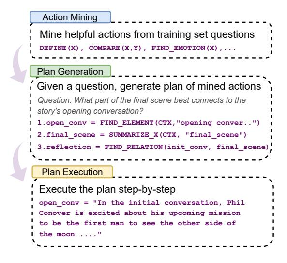

## PEARL: Prompting Large Language Models to Plan and Execute Actions Over Long Documents

Simeng Sun1[∗](#page-0-0) Yang Liu2 Shuohang Wang2 Dan Iter2 Chenguang Zhu2 Mohit Iyyer1

University of Massachusetts Amherst1 Microsoft Research2

{simengsun, miyyer}@umass.edu {yaliu10,shuohang.wang,iterdan,chezhu}@microsoft.com

## Abstract

Strategies such as chain-of-thought prompting improve the performance of large language models (LLMs) on complex reasoning tasks by decomposing input examples into intermediate steps. However, it remains unclear how to apply such methods to reason over *long input documents*, in which both the decomposition and the output of each intermediate step are non-trivial to obtain. In this work, we propose PEARL, a prompting framework to improve reasoning over long documents, which consists of three stages: action mining, plan formulation, and plan execution. More specifically, given a question about a long document, PEARL decomposes the question into a sequence of actions (e.g., SUMMARIZE, FIND\_EVENT, FIND\_RELATION) and then executes them over the document to obtain the answer. Each stage of PEARL is implemented via zero-shot or few-shot prompting of LLMs (in our work, GPT-4) with minimal human input. We evaluate PEARL on a challenging subset of the QuALITY dataset, which contains questions that require complex reasoning over long narrative texts. PEARL outperforms zero-shot and chain-of-thought prompting on this dataset, and ablation experiments show that each stage of PEARL is critical to its performance. Overall, PEARL is a first step towards leveraging LLMs to reason over long documents.[1](#page-0-1)

## 1 Introduction

Performing complex reasoning over long input documents often requires forming high-level abstractions of the text (e.g., plots and themes in a narrative) and then conducting a variety of inferences on top of those abstractions [\(Graesser et al.,](#page-9-0) [1994\)](#page-9-0). Consider the following question about the story "Breakaway" from the QuaLITY dataset [\(Pang](#page-10-0) [et al.,](#page-10-0) [2022\)](#page-10-0):

> **[图片提取文字 (无描述)]:**
> Action Mining Mine helpful actions from training set questions DEFINE(X), COMPARE(X,Y), FIND EMOTION(X),... Plan Generation Given a question, generate plan of mined actions Question: What part of the final scene best connects to the story's opening conversation? 1.open conv = FIND ELEMENT(CTX, "opening conver..") 2.final scene = SUMMARIZE X(CTX, "final scene") 3.reflection = FIND RELATION(init conv, final scene) Plan Execution Execute the plan step-by-step open conv = "In the initial conversation, Phil Conover is excited about his upcoming mission to be the first man to see the other side of the moon ...."

Figure 1: High-level overview of our framework PEARL. Each stage in PEARL is achieved via zero-shot or fewshot prompting of an LLM (in our work, GPT-4). We also provide example outputs from each stage.

What part of the final scene best connects to the story's opening conversation?

To answer this question, we need to gather and synthesize information from across the story, which motivates decomposing the question into a *plan of actions*, as in:

- 1. Identify all participants in initial conversation.
- 2. Summarize the initial conversation.
- 3. Summarize events and themes of final scene.
- 4. Summarize roles of conversation participants in final scene.
- 5. Identify and rank connections between conversation and final scene.

Each action in the above plan varies in complexity, from simple lookup-style actions (Step 1) to more challenging query-focused summarization (Steps 2-4) and conceptual linking (Step 5) actions that require deep narrative understanding.

Given the rapidly advancing capabilities of large language models (LLMs), how can we use them to answer questions like these? While we could directly prompt LLMs to generate the answer, prior

∗Work partially done during an internship at Microsoft. 1We release our code at [https://github.com/](https://github.com/SimengSun/pearl) [SimengSun/pearl](https://github.com/SimengSun/pearl)

work on simpler reasoning-based tasks shows that this method is inferior to chain-of-thought prompting [\(Wei et al.,](#page-11-0) [2022,](#page-11-0) CoT), which encourages the LLM to provide step-by-step explanations and intermediate outputs before producing the answer. Unfortunately, CoT is not well-suited for tasks involving complex reasoning over long input documents, as both the decomposition of the original question and the intermediate outputs of each step are non-trivial to obtain, as in the above example.

Given the difficulty of obtaining plans and intermediate explanations for long documents, one potential solution is to delegate this task to smaller *executable* modules instead of forcing the LLM to come up with all of them at once. In this work, we introduce PEARL, a framework that combines Planning with Executable Actions for Reasoning over Long documents. Each stage of PEARL action mining, plan decomposition, and plan execution — is implemented by applying zero-shot or few-shot prompting to an LLM. The stages (Figure [1\)](#page-0-2) can concisely be described as follows:

- 1. Action mining: An LLM is prompted to come up with simple actions that can help solve questions from an input training dataset. Unlike predefined "toolboxes" in methods such as Toolformer [\(Schick et al.,](#page-10-1) [2023\)](#page-10-1) or ReACT [\(Yao](#page-11-1) [et al.,](#page-11-1) [2023b\)](#page-11-1), the action set in PEARL is also generated by an LLM.
- 2. Plan generation: Given an input test question, an LLM generates an executable plan consisting of a series of actions selected from the action set produced in the previous stage. The plan is formatted as a simple program in which the execution result of one action can serve as an argument to future actions, which enables complex composition.
- 3. Plan execution: The LLM executes the plan action-by-action via a prompt template that includes an action and the long-form input document. Note that this is the only stage that includes the document, as the other stages operate over just questions.

We demonstrate PEARL's effectiveness on a challenging subset of QuALITY [\(Pang et al.,](#page-10-0) [2022\)](#page-10-0), a reading comprehension dataset that contains questions about long-form articles. While QuALITY is originally a multiple-choice dataset, we reformulate it into a generation task: given a question and

an article, an LLM is asked to generate a free-form answer. As a proxy for measuring answer correctness, we adopt a similar approach to [Wang et al.](#page-10-2) [\(2020\)](#page-10-2) by asking the LLM to map its generated answer to one of the multiple choice options, which allows us to compute its accuracy.

Prompting LLMs with PEARL yields more accurate and comprehensive answers than those generated by directly prompting the LLM to answer the question, particularly for questions that require reasoning over the full long document. This result is particularly impressive given the potential for error propagation in the PEARL framework: as each stage is implemented via an LLM, errors in plan formulation or execution can significantly affect the output answer. To further verify the integrity of the plans, we perform human evaluation by asking annotators to provide feedback and ratings; annotators generally find the plans to be reasonable, although a small percentage contain unnecessary actions or omit critical actions. Overall, we hope PEARL further opens the door towards using LLMs for complex reasoning over long documents.

## 2 Related work

Our work builds on recent LLM prompting research and also connects to work on reasoning over long documents. Before describing PEARL, we first survey related papers to contextualize our work within this fast-moving field.

Prompting methods: Recently, the capabilities of large language models [\(Brown et al.,](#page-9-1) [2020;](#page-9-1) [Zhang et al.,](#page-11-2) [2022;](#page-11-2) [Touvron et al.,](#page-10-3) [2023\)](#page-10-3) have significantly increased as a result of learning from instructions or feedback [\(Stiennon et al.,](#page-10-4) [2022;](#page-10-4) [Ouyang et al.,](#page-10-5) [2022;](#page-10-5) [Chung et al.,](#page-9-2) [2022\)](#page-9-2) to better align their outputs to human preferences. When provided with well-crafted prompts, such as chainof-thought [\(Wei et al.,](#page-11-0) [2022\)](#page-11-0) explanations, these state-of-the-art models exhibit impressive reasoning abilities. A plethora of new prompting techniques (Table [1\)](#page-2-0) has been recently introduced to unlock more capabilities of LLMs via leveraging exteral tools [\(Chen et al.,](#page-9-3) [2022;](#page-9-3) [Schick et al.,](#page-10-1) [2023;](#page-10-1) [Lu](#page-9-4) [et al.,](#page-9-4) [2023\)](#page-9-4), problem decomposition [\(Press et al.,](#page-10-6) [2022;](#page-10-6) [Dua et al.,](#page-9-5) [2022;](#page-9-5) [Khot et al.,](#page-9-6) [2023;](#page-9-6) [Yao et al.,](#page-11-1) [2023b\)](#page-11-1), self-reflection and self-refinement [\(Huang](#page-9-7) [et al.,](#page-9-7) [2022;](#page-9-7) [Shinn et al.,](#page-10-7) [2023;](#page-10-7) [Madaan et al.,](#page-9-8) [2023;](#page-9-8) [Kim et al.,](#page-9-9) [2023\)](#page-9-9), planning [\(Yao et al.,](#page-11-3) [2023a;](#page-11-3) [Wang et al.,](#page-10-8) [2023a;](#page-10-8) [Long,](#page-9-10) [2023\)](#page-9-10), and other techniques [\(Yoran et al.,](#page-11-4) [2023;](#page-11-4) [Wang et al.,](#page-10-9) [2023b;](#page-10-9)

| Prompting Methods                      | Explicit plan | Iterative prompting | Does not rely on external tools | Long documents |
|----------------------------------------|---------------|---------------------|---------------------------------|----------------|
| Chain-of-Thought (Wei et al., 2022)    | Х             | Х                   | /                               | Х              |
| Program-of-Thought (Chen et al., 2022) | X             | ×                   | ×                               | X              |
| Self-Ask (Press et al., 2022)          | X             | 1                   | ×                               | X              |
| Toolformer (Schick et al., 2023)       | X             | ×                   | ×                               | X              |
| ReAct (Yao et al., 2023b)              | X             | 1                   | ×                               | X              |
| Plan-and-Solve (Wang et al., 2023a)    | ✓             | ×                   | ✓                               | X              |
| PEARL (this work)                      | ✓             | ✓                   | ✓                               | ✓              |

Table 1: Comparison of PEARL to other recently-proposed prompting techniques. PEARL is the only one designed for and evaluated on tasks that require complex reasoning over long documents.

## Zhou et al., 2023).

Reasoning over long documents: Large language models have showcased remarkable reasoning capabilities (Huang and Chang, 2022), including mathematical reasoning (Cobbe et al., 2021), commonsense reasoning (Talmor et al., 2019), and symbolic reasoning (Nye et al., 2021). Most of these tasks do not involve long context inputs, and thus they are able to benefit from few-shot in-context CoT prompting. In this paper, we primarily focus on tasks that contain long input contexts (Kočiský et al., 2018; Dasigi et al., 2021; Shaham et al., 2022; Sun et al., 2022), specifically generative question answering based on long input articles. To address the absence of reliable evaluation for long-form QA (Krishna et al., 2021), Stelmakh et al. (2022) proposes automatic metrics for evaluating the correctness of the answer, whereas in this work, we use LLM-based evaluation by taking advantage of the multiple-choice setup of existing QA dataset. Prior to the shift to prompting-based methods, approaches including contrastive learning-based sequence-level objectives (Caciularu et al., 2022), iterative hierarchical attention (Sun et al., 2021), and joint modeling of machine reading and answer generation (Su et al., 2022) have been employed to enhance long-context question answering.

