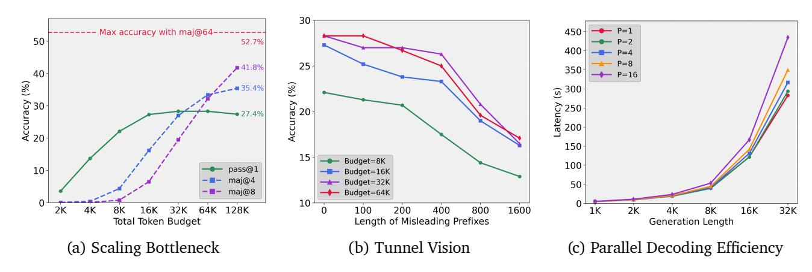

# 2. Understanding the Scaling Bottleneck

To empirically ground our investigation, we first characterize the limitations of conventional test-time scaling. We identify a test-time scaling bottleneck that suggests a fundamental inefficiency in sequential reasoning (Section 2.1). Then, we diagnose its underlying cause, a phenomenon we term Tunnel Vision (Section 2.2). Then, we propose parallel scaling as an effective and efficient solution to it (Section 2.3).

#### 2.1. Is the Bottleneck Due to Limited LLM Capability or Suboptimal Scaling Strategy?

We examine the performance bottleneck in reasoning LLMs by evaluating the DeepSeek-R1-distill-Qwen-1.5B model (DeepSeek-AI, 2025) on the AIME 2024 benchmark under various computational budgets. We control the budget by imposing a per-response token limit B on the reasoning path. If the model fails to terminate naturally, we truncate the output and force termination by appending a terminal token (
 (
 A (A (A (A (A )). We also evaluate majority voting (Chen et al., 2024a) over A (A (A )) are allel samples, with each sample allocated A (A ) tokens. For clarity, we plot only A (A ) and A = 8 results in the accuracy-budget curves, and report the maximum accuracy obtained with A = 64. The results, shown in Figure 2a, demonstrate that the performance of a single reasoning path (green line) quickly meets bottleneck, with additional tokens yielding negligible gains.

While some recent works attribute this phenomenon to "LLM overthinking" and attempt to solve it by compressing the model's output for more concise reasoning, these compressed models still encounter a bottleneck (Sun et al., 2025; Chen et al., 2025b; Fan et al., 2025; Cuadron et al., 2025). Different from

> **[图片提取文字 (无描述)]:**
> 30 Max accuracy with maj@64-----50 52.7% 400 P=8 25 **41.8%** 350 40 → P=16 Accuracy (%) % **35.4%** ⊙ 300 Accuracy ( 250 agency 200 • 27.4% 150 15 Budget=8K 100 10 pass@1 Budget=16K -=- maj@4 Budget=32K 50 -=- maj@8 Budget=64K 10 2K 16K 32K 64K 128K 100 200 400 800 1600 1K 2K 4K 8K 16K 32K Length of Misleading Prefixes Total Token Budget Generation Length (c) Parallel Decoding Efficiency (a) Scaling Bottleneck (b) Tunnel Vision

Figure 2 | Diagnosing the limitations of sequential reasoning and the potential of parallelism. All experiments use DeepSeek-R1-Distill-Qwen-1.5B on the AIME 2024 benchmark. (a) Scaling Bottleneck: Accuracy against the total number of token budget (for majority voting *e*.*g*., maj@4, the total token budget is the sum across all parallel paths). (b) Tunnel Vision: Ability to recover from its own potential mistakes with different lengths of misleading prefixes. The model generates solutions starting from flawed prefixes of length ∈ {0, 100, . . . , 1600}, denoting the first tokens of reasoning paths from the same model that previously resulted in a wrong answer. (c) Parallel Decoding Efficiency: Latency taken to decode ∈ {1, 2, 4, 8, 16} parallel paths, each of length ∈ {1, . . . , 32}.

these approaches, we investigate the fundamental cause of this bottleneck to determine how to further bootstrap LLM test-time scaling. And results in Figure [2a](#page-3-2) shows that majority voting can break through this bottleneck under the same total token budget, and the majority@64 with 2,048K total token budget (32K for each reasoning path), achieves a final accuracy far higher than the single-path approach. This significant gap suggests that *the bottleneck is not a hard limit of the model's reasoning capacity, but rather a symptom of the suboptimal test-time scaling strategy.* Simply allocating more test-time compute to a single-sequence LLM is not as effective as exploring multiple reasoning paths.

#### **2.2. The Tunnel Vision of Sequential Test-Time Scaling**

We hypothesize the bottleneck arises because an LLM's early token choices irreversibly commit it to a specific line of thought, making it difficult to escape initial errors. We call this Tunnel Vision: flawed initial reasoning locks the model into a suboptimal trajectory from which it cannot recover. To test this, we investigate the model's *recovery capacity* from erroneous starting points: For each AIME 2024 problem, we use DeepSeek-R1-Distill-Qwen-1.5B [\(DeepSeek-AI,](#page-16-0) [2025\)](#page-16-0) to generate multiple samples. From the samples that produce incorrect answers, we extract prefixes of its flawed reasoning at lengths of 0, 100, 200, 400, 800, and 1600 tokens. We then prompt the model to continue generating from these erroneous prefixes and measure its final accuracy by sampling 16 times and calculating the average accuracy. The results, plotted in Figure [2b,](#page-3-2) show a clear negative correlation: the longer the erroneous prefix, the lower the final accuracy. This indicates that *the scaling bottleneck is a direct symptom of Tunnel Vision, where flawed initial tokens lock the model into a suboptimal reasoning path.* The longer the flawed prefix, the harder it is for the model to pivot to a correct solution, even with ample remaining budget.

## 2.3. Native Thought Parallelism: An Effective and Efficient Solution

Given the limitations of sequential reasoning exposed by Tunnel Vision, exploring multiple lines of thought in parallel is a promising solution. While methods like majority voting (Chen et al., 2024a) validate the benefit of parallelism, they are primarily applicable to tasks with easily quantifiable or verifiable outputs (e.g., multiple-choice questions, numerical answers). Their utility is limited for more complex, open-ended domains (e.g., complex agentic workflows, coding, or mathematical proofs).

This necessitates a native parallel framework—one that enables an LLM to generate and integrate multiple reasoning paths within a single, end-to-end forward pass. Such a system should scale with the number of parallel paths while maintaining high computational efficiency. Previous approaches to parallel computation typically rely on external verifiers for search (Snell et al., 2024; Ghosal et al., 2025), which introduces a scalability bottleneck. Recent methods such as architectural parallelism (Chen et al., 2025a), still generate tokens sequentially, leaving them vulnerable to the same phenomenon, Tunnel Vision.

The efficiency of native thought parallelism stems from its hardware-friendly nature. The primary bottleneck in LLM decoding speed is typically memory access (parameter load, KV load/store), not raw computation (Sadhukhan et al., 2025). By generating P parallel reasoning paths simultaneously, we increase the computational workload for each memory access, improving the arithmetic intensity and better utilizing the GPU's processing power. We test the efficiency of parallel generation in Figure 2c, where we record the inference time of DeepSeek-R1-Distill-Qwen-1.5B based on vLLM framework (Kwon et al., 2023) on a single A800 GPU with different generation lengths, using a batch size of one. For a small number of parallel paths, generating L tokens for every path takes nearly the same amount of time as generating L tokens for a single path. Remarkably, even when decoding 16 parallel paths of length L, the total latency is less than  $2\times$  of decoding a single path of the same length. This hardware-level efficiency makes parallel exploration a practical and scalable strategy for overcoming Tunnel Vision and unlocking superior reasoning performance.

